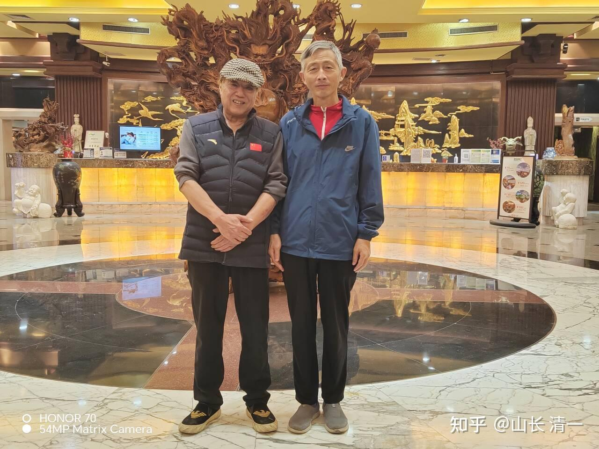
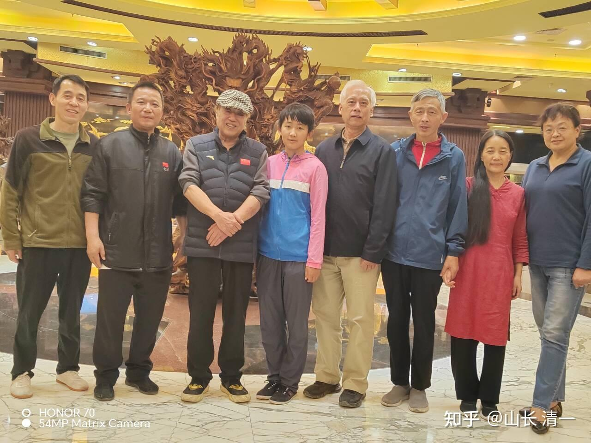
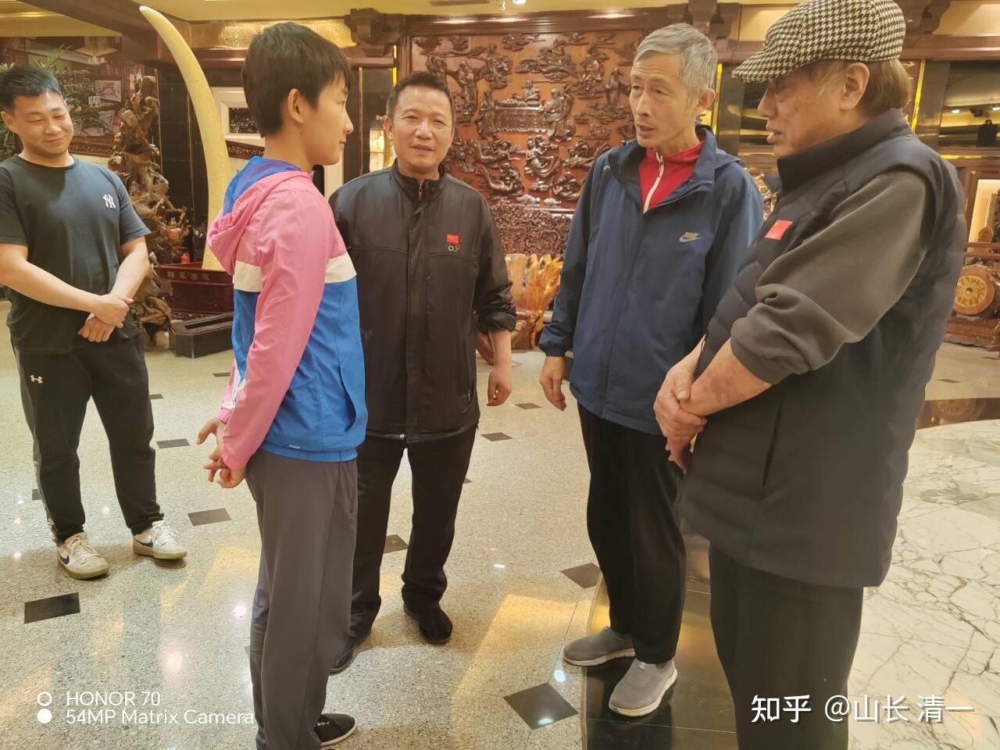
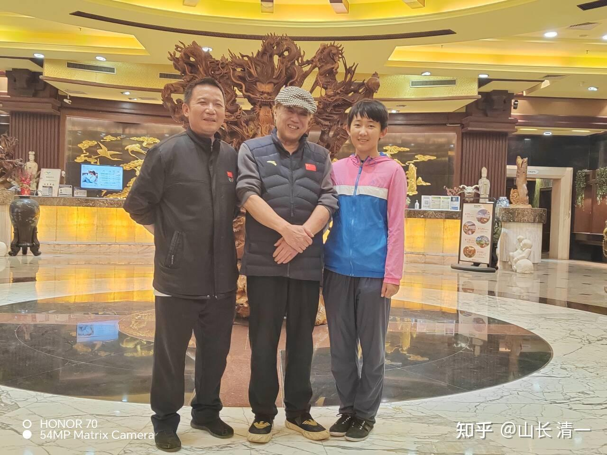
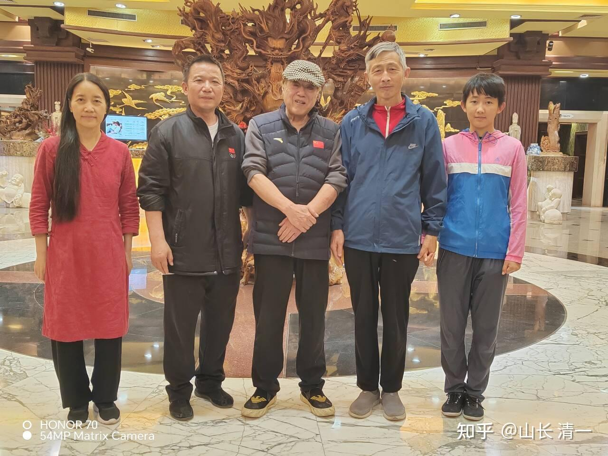
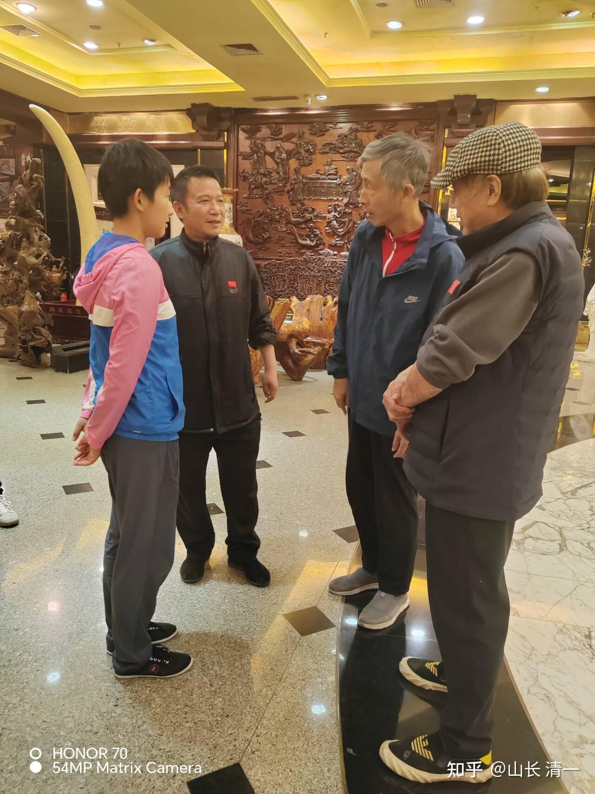

*中国散打教父李建平*

去香港办事之后，我们一家回了一趟武汉，因为要处理一些重要的事情。 这也是小明慧不到一岁离开武汉之后，第一次回武汉！她对武汉完全没有概念，以为自己的“老家”就是会泽。让她来看看她父母奋斗了半辈子的地方，也是一个有意思的事情！

我们一家逗留武汉期间，住在武体附近的红房子宾馆。没想到有机会见到了大名鼎鼎的李建平教授。他是中国格斗--散打的开创人，也是20年前引导泰拳进入中国，并开创中泰擂台赛的元老，号称散打教父和泰拳教父！

下面这个文章，就是介绍他的事迹的！

[散打教父称中泰对抗是编故事 转攻泰拳五年匹敌泰国](http://link.zhihu.com/?target=http%3A//sports.sina.com.cn/o/2010-01-08/09484779912.shtml%3Ffrom%3Dwap)

体院练传武的贾教练是我的老朋友，他是个武痴，为了武术事业居然终身不婚！一直在民间访问老拳师学习中华传武，他的传武是实战能力的，即使是与专业格斗手对抗也丝毫不虚。我们的冠军木兰，如果要打架根本就不是贾老师的对手！多年来我从这些他这里得益良多！这一天我们在武体的路上散步，正好遇到李建平老师。他去年是珠海泰拳国家队的指导。由于他特别关心中国泰拳事业的发展，对我们去受训的四个木兰比较关注，对木兰们的印象很好。知道她们的实力很强，击败了很多知名对手。由于我是几个木兰的教练，李老师就非常热情。两人一见如故，李老师马上就特别安排了第二天请我去湖滨的饭局大家一起聊聊。所以这次来武汉，意外的能够得到的李老师近距离交流学习的机会！

正好这几天，四个木兰正在广州参加国家泰拳队的选拔，我告诉李老师女子三个量级中的两个，都是我们木兰拿下来了第一名。这一次，应该我们的队员是最接近中国拳手能够夺取泰拳世界冠军的机会，如果能够参加世锦赛，并获得冠军，就将是中国人拿到的第一个女子世界泰拳锦标赛的冠军！

*李老师加持小明慧早日拿冠军*

李老师今年已经70多岁了，记得去年李老师70大寿，学生们纷纷从全国各地赶来给他祝寿！但李老师人老心不老，心心念念依然是在关心中国的格斗运动，特别是他最关注的泰拳项目的发展。在他退下来之后，中国泰拳的世界地位就越来越低，派拳手去参加世界锦标赛，与世界各国的冠军拳手们竞争，往往第一二轮就全部被淘汰。因此被世界格斗界看不起。李老师非常的痛心，认为中国一定要改革赛事和运动员的选拔结构，让优秀拳手能够培养出来，为国争光！

还有一个小事情很有趣，反应了李老师的低调和谦虚！我们互加微信的时候，我发现李老师的微信名是【武泰】。我说：这是不是就是【武林泰斗】的意思？（我原来认识一个非遗传武人，他的微信名是（一代宗师）。李老师却笑著说：他取这个名字的意思，就是他原来是练传武的，前半生都是做武术的。50岁的时候出来发展了中国的泰拳。所以他对中华武术和泰拳都很有感情。这个名字就是纪念自己这一生所作所为的！结果被江湖传成了“武林泰斗”，他自己不是这个意思的！他对于这些名头没啥兴趣，只想帮助孩子们发展。也让我们有啥事情不好办就找他。他说他在武术界的学生弟子众多，大家多少都还是会给他一些面子的。其实就是老人家德高望重，当年办泰拳训练比赛的时候，李老师就是没有去找国家（体院）要一分钱，完全靠朋友的信任和支持，把找中泰对抗赛等赛事办下来的，成为当年的一大盛世！

*两位武林大师加持小明慧*

*我们一家三口与武林高手合影*

