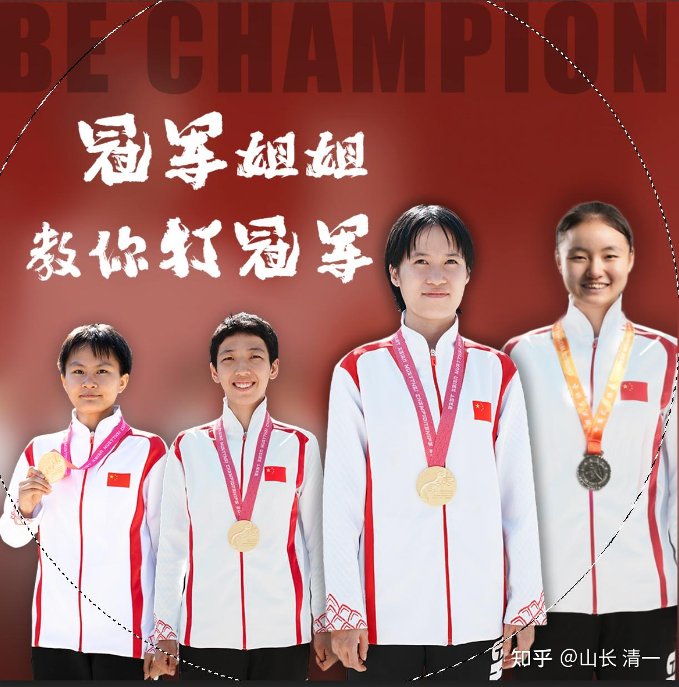

清一大学是一所个人大学，不同于目前全世界所有的国有大学和私立大学，民营大学。这是一所不以盈利为目标，不享受任何国家的拨款，也没有其他民营资本的支持，也不寻求任何国家官方和权威机构认证和许可，以及批准的个人独资大学。我们只关心如何培养出世界级的优等生，让学生拥有世界顶尖的水平，拥有良好的学术能力！但不关心文凭和就业的需要！该大学性质上，纯属拥有独特的教学能力的个人开办。办学模式是模仿古代书院教学方式来开办的私人独立大学。现代人由于受体制思维的影响，不能接受古代的书院由创办人自行办学的模式，一般称这种个人独创的，自己发文凭，不寻求官方和体制认同的大学是“野鸡大学”。我们认为这个称呼也挺好的，总比当家鸡要好！

该大学为清一山长个人所创，办学费用和场地支持，均由清一山长个人独立支持和维持！由于这个原因，清一大学的入学标准和要求，与大家熟悉的其他“家鸡大学”不一样。因此大家请不要把清一大学和家鸡大学做对照，这样对其他家鸡大学是一种羞辱！因为我们过于重视真实的教学内容和成绩，不太在乎官方的认同和批准与否！我们自己对自己的野鸡大学身份倒是无所谓。我们是自由独立的野鸡！

目前，清一大学本科生阶段只开设一个专业，就是太极武道专业。研究生阶段可以开设更多的专业。如文学，哲学，心理学，历史学，管理学，投资学等等！

现公布办学要求和标准！

**一：武道专业本科生阶段，培养征战全国格斗锦标赛的武者！学制三年。招生标准参考美国常春藤大学的学业成绩标准，具体要求如下：**

年龄大于15岁，不高于16岁，SAT1500分以上学生全奖入读。1450分以上的学生，海底捞打工半年，一次性交清生活费后，免学费入读。实行宽进严出制度，每年均淘汰不认真学习的学生，三年内，全国格斗锦标赛前三名学生发给**清一大学武道专业本科毕业文凭！**达不到该毕业标准的学生，为肄业生，发给清一大学武道专业肄业证书！

**二：武道专业研究生阶段，培养代表中国，征战世界格斗锦标赛的优秀武者。学制三年！**

**清一大学武道专业研究生的招生要求**：只有清一大学武道专业本科毕业的学生，且年龄不超过19岁，入学申请时，已经获得全国格斗锦标赛成年组冠军头衔的学生，想继续深入研究和发展中华武道，想要击败全世界各国冠军拳手的优等生，可以申请入读**清一大学武道专业研究生**！全奖入读，学制三年！三年期间需参加世界格斗锦标赛，但不要求一定夺取世界冠军，尽力而为即可。三年毕业后，可发给**清一大学武道专业硕士研究生毕业证书！**毕业后学生自主就业，自寻职业。

其他的清一大学文科专业研究生，入读条件并不限制武道水平一定是全国冠军身份要求！可以降低武道的专业水准要求，但这些学生入读，需要用世界前100大学的本科毕业资格，才能来申请申请清一大学各文科专业的入读资格！规划上，是七年后才开启清一大学的文科专业研究生招生！

**三：武术专业博士研究生：培养中华武术各门派争光的新一代宗师！学制五年至八年！**

入读申请资格：年满22岁以前，已经获得世界格斗锦标赛三大赛事（拳击，自由搏击，泰拳世界锦标赛）成年组的冠军，才有申请入读**清一大学武道学院博士研究生**的资格！录取后，博士生可以享受至少五年的全奖学习条件，同时还发给一份博士特别生活津贴养家（不低于正常工作人员的工资）。可以让博士生不用考虑职业谋生的问题，一门心思深入研究中华武术，最终目标，是成为中华武术各门派的代表人物，成为当今时代的一代宗师！博士毕业后，可作为清一大学武道专业的指导教师，可以留校任教，继续培养新一代的清一大学武道专业学生！把弘扬中华武术，中华文化，作为终生职业。

以上清一大学的入读申请标准，以及毕业标准，按照教育行业的眼光来看，都非常的变态，绝非普通大学能比的。我相信清一大学已经是全世界入读标准和培养目标最高的体育和武术专业大学。但这标准不稀奇，也就是中国古代优秀书院的标准---教育重质不重量。古代知名书院，都是当代最顶尖的学者任教，只招收全国最优等的学生来读！不像现在的某些体育大学，有一些武术专业毕业，甚至武术博士毕业的学生，连街头的小混混都打不过，他们只会写武术论文，居然就拿了武术博士。我们要求是：想当清一大学的武术博士，就必须先打赢世界锦标赛的冠军，再加上读懂读透中华古代文化典籍，用至少五年时间来研习中华武道，行知合一，最终写出真正有分量的武术研究论文，才有资格成为清一大学武术博士！

未来对外作战，批量击败洋人的中华武士，我认为主要将来自清一大学武道学院！为国争光，我们当仁不让！

2024年，清一大学首届武道专业本科阶段的学生，第一次出山参加全国格斗锦标赛，就拿到了20块全国冠军的金牌，创造了武术界的奇迹！

2025年：清一大学首届武道专业研究生入学，现在已经入选国家队，走上了开启征战世界格斗锦标赛的战场。她们在未来的三年内，肯定能够获取多块世界格斗锦标赛的冠军，肯定能够顺利拿到清一武术博士专业的入门资格证！

**2028年：清一大学将招收首届中华武术博士研究生。将来会有几个人能够入选呢？等三年后就知道了。我们宁缺勿滥！**

*上面照片是清一大学的首批武术专业研究生*