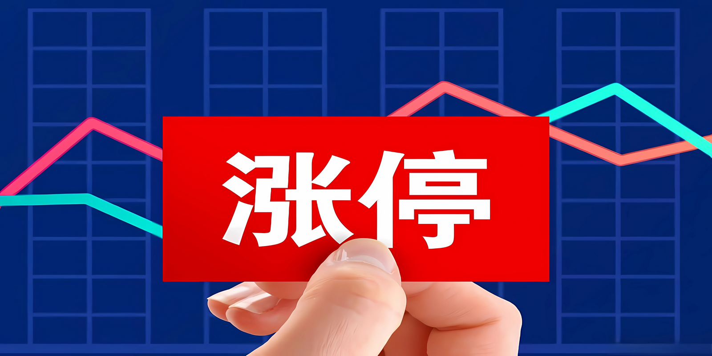
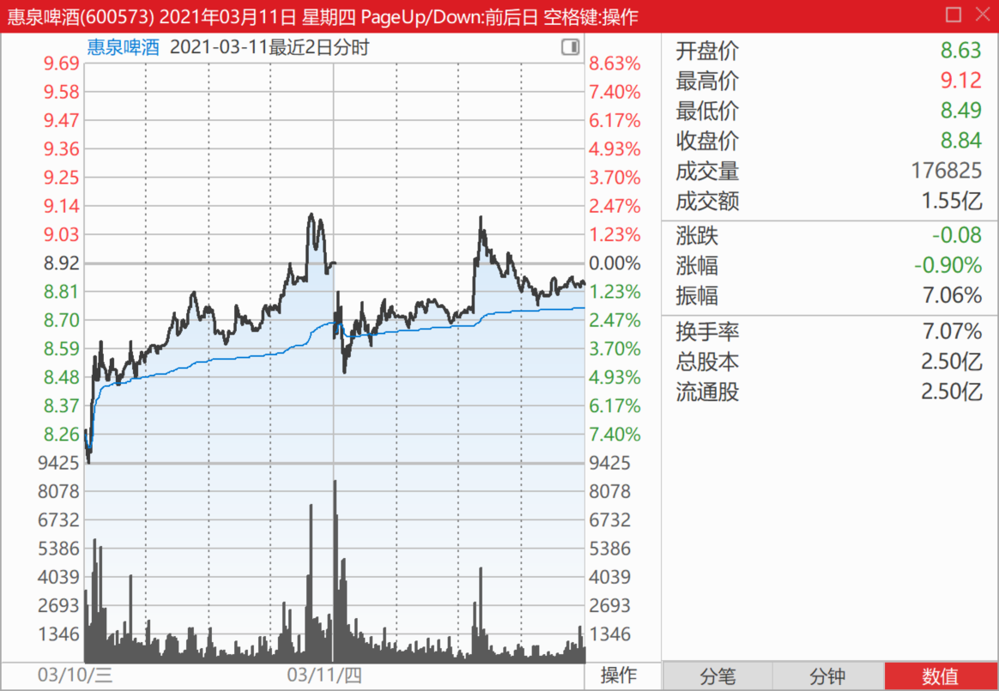
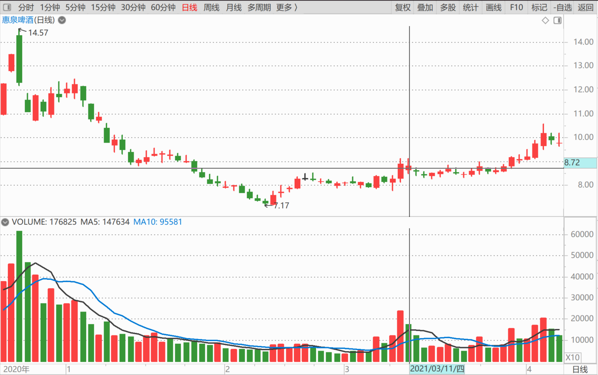
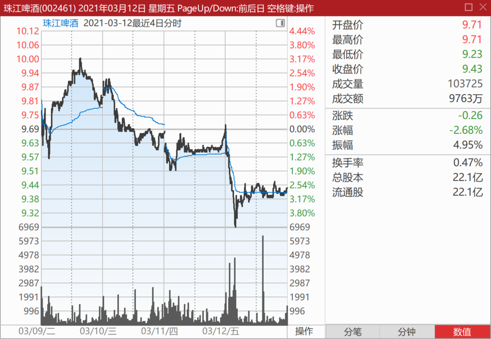
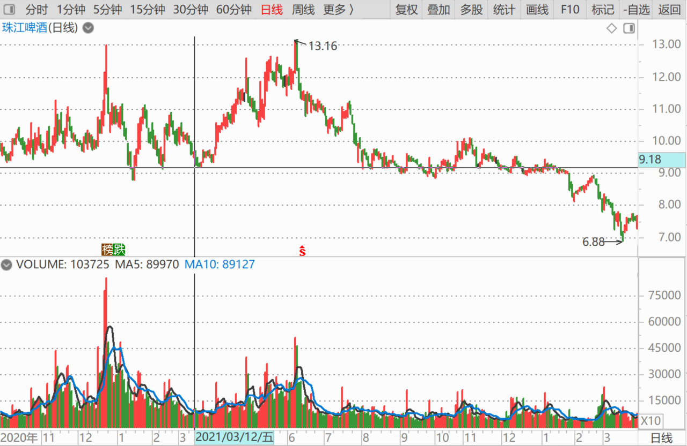

104篇.涨停第二天的走势

清一山长2021年3月11日～12日

清一山长2021-03-11 14:49:29

[$惠泉啤酒(SH600573)$](http://link.zhihu.com/?target=http%3A//xueqiu.com/S/SH600573) 上午的调整挺好的，很正常，**昨天冲涨停，今天调整一下很健康。**但是，午后这波再度上试昨天涨停价，有点让人摸不着头脑？这是要干啥？不过，如果收盘没有跌破今天的低点，就不用担心。跌破了——就需要担心了。最好收在8.7元以上。

由于还有20天才到月底。我估计三大的位置，今年一季度应该保不住了。如果不涨，你们会看到我的账户比去年三季度更多的持股，算是惠泉的峰值。过段时间，你们会看到我去年四季度的持股，不多，才一百多万股。但进入十大应该没问题。我操心的是：一直没动的二大，以及一样不动的四大，是否四季度还在？**我每个季度都在变化持仓，**守股很不老实，特别是去年四季度，都进出十大好几次了[大笑]。现在争取进一位，当二大。但是看来时间不允许。我判断惠泉主力20天内必有动作。（说明：不鼓励你买股，买卖自负。未来到底向上向下，我不知道，只知道不向下，就向上。如果向下，我就继续地增加股份，向二大进发。如果向上，我就减少股份，向十大以下进发）

下午的冲刺，还有一个理解，就是为明天“预热”。

[水韵悠然](http://link.zhihu.com/?target=http%3A//xueqiu.com/n/%25E6%25B0%25B4%25E9%259F%25B5%25E6%2582%25A0%25E7%2584%25B6)回复[清一山长](http://link.zhihu.com/?target=http%3A//xueqiu.com/n/%25E6%25B8%2585%25E4%25B8%2580%25E5%25B1%25B1%25E9%2595%25BF):

山长老师，您好！请问什么时候可以入惠泉或燕京？

清一山长2021-03-11 2:06:06回复[水韵悠然](http://link.zhihu.com/?target=http%3A//xueqiu.com/n/%25E6%25B0%25B4%25E9%259F%25B5%25E6%2582%25A0%25E7%2584%25B6)：

等跌到最低价就可以了[俏皮]。

[舒缓](http://link.zhihu.com/?target=http%3A//xueqiu.com/n/%25E8%2588%2592%25E7%25BC%2593)回复[清一山长](http://link.zhihu.com/?target=http%3A//xueqiu.com/n/%25E6%25B8%2585%25E4%25B8%2580%25E5%25B1%25B1%25E9%2595%25BF)：

回答经典[很赞]又是一个我就得买在最底部的提问，总想做神才能做到的事。

清一山长2021-03-12 11:51:13回复[舒缓](http://link.zhihu.com/?target=http%3A//xueqiu.com/n/%25E8%2588%2592%25E7%25BC%2593)：

他倒是没想买在最底部，而是自己很想买，但怕买了就跌。所以找个大V问。假如我说可以买，买了跌了，他就骂人，说大V忽悠他，说我是庄的小弟，被买通了，专门出假消息要害他；假如他买了涨了，他就说：“瞧我多有本事，一买就涨。”到处吹嘘给身边人看。
一句话：问这种问题的人，都是不肯自我负责，也不肯思考的人，想赚钱又怕风险的人。很可怜。他们根本就不该来股市，只能老老实实打工的。来了，就是注定被割的韭菜。

清一山长2021-03-12 14:27:13

[$珠江啤酒(SZ002461)$](http://link.zhihu.com/?target=http%3A//xueqiu.com/S/SZ002461) 说实话，走得很不好看。似乎有人就是不要货一样，大约出货图形。虽然我已经成功逃走了，**现在从价格来看，倒是比较合适的进入点**。但是盘面看还没有企稳。有点不解。因为**原来的珠江主力，在9元以上，是一直在买的**。现在怎么不要了？有机会就出的架势。[捂脸]。

再多观察两天再入手。实话说：现在账上有M级别的、当初珠江涨停卖出的资金呢！成功多T了一元多。

(标题、图片为编者所加)

文章音频：

[556篇. 涨停第二天的走势](http://link.zhihu.com/?target=https%3A//www.ximalaya.com/sound/844639481)

**参考链接：**

[96篇.啤酒的人均持股](https://zhuanlan.zhihu.com/p/21559367964)

[97篇.借燕京看粉转黑有多快](https://zhuanlan.zhihu.com/p/23176487676)

[98篇.我比唐建华还要保守](https://zhuanlan.zhihu.com/p/23175736428)

[99篇.避免涨停动作，消极以待](https://zhuanlan.zhihu.com/p/26670135074)

[100篇.那条绿线，我干的](https://zhuanlan.zhihu.com/p/27432186910)

[101篇.三家啤酒的走势](https://zhuanlan.zhihu.com/p/29771069394)

[102篇.看他家走势，想像啤酒的未来走势](https://zhuanlan.zhihu.com/p/1893047725039256164)

[103篇.三个走势，两个稳健，一个怪异](https://zhuanlan.zhihu.com/p/1895973245435479673)