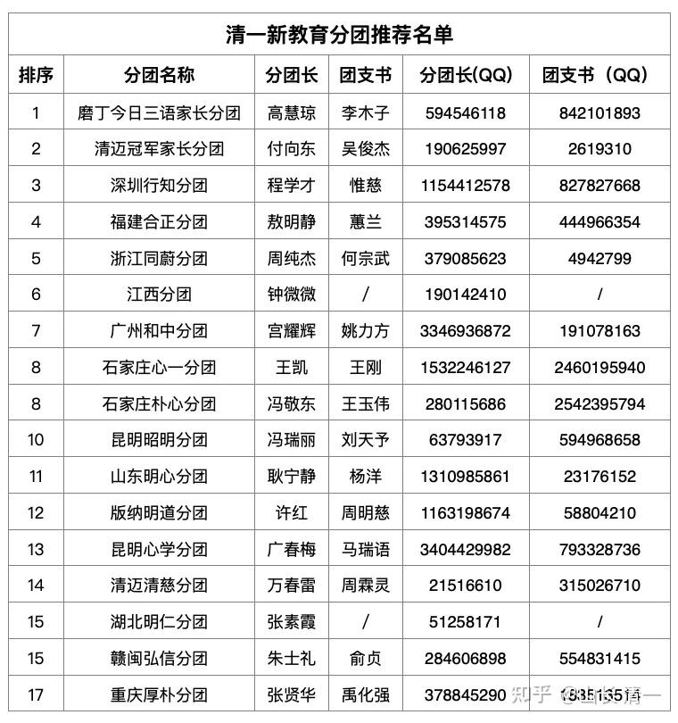

[清一山长电影课系列——体验课程公告](http://link.zhihu.com/?target=https%3A//mp.weixin.qq.com/s%3F__biz%3DMzAxNzk5NjIzOA%3D%3D%26mid%3D2247506491%26idx%3D1%26sn%3D9dc278b467c1642a0cc1d95cb0ac5cdd%26chksm%3D9a46f8c3ced31d3d99e245c048bc02e6d34e2f71bf09cba7932a9d37adb95ab2544c492db30f%26mpshare%3D1%26scene%3D23%26srcid%3D0503KsCqpUuRscPVg4bA56TR%26sharer_shareinfo%3D337634901a0c5c491e85e01cf727962d%26sharer_shareinfo_first%3D337634901a0c5c491e85e01cf727962d%23rd)

**01**

**课程内容简介 七天分享七部电影的系列课程！**

第*一*部：青春期和两性关系。（某奥斯卡获奖影片）

第二部：家族传承和职业规划电影课。（某奥斯卡获奖影片）

第三部：心理行为电影课（目标型和感觉型人格分析）。

第四部：心理学理论与实践深度解析电影课！（某奥斯卡获奖影片）

第五部：江湖课与社会潜规则。（某奥斯卡影片）

第六部：怎样才能赚大钱？财源滚滚的奥秘电影课。（某现象级打榜电影）

第七部：穷人的生存空间与阶层跨越的难度。（某印度电影解析）

**02**

**课程安排信息**

***1 ***课程时间：5月15号-5月21号（共7天），5月14号报到。

***2 ***课程地点：磨丁慧兰酒店。

03：课程费用： 零。我请客、含磨丁最高档次酒店七天的食宿招待，统统我请客！

名额寻找处：门票已经送给各地新教育分团长。如果你知道，就找他们去！

资格不限：由新教育分团长审定您的申请，推荐给我们即可！

附录：推荐人资格名单

