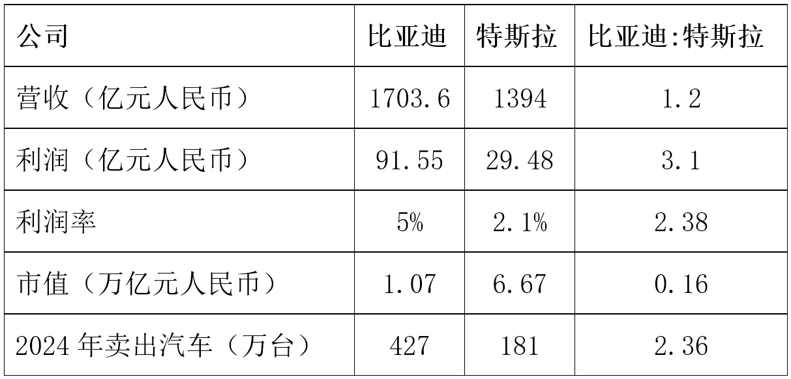
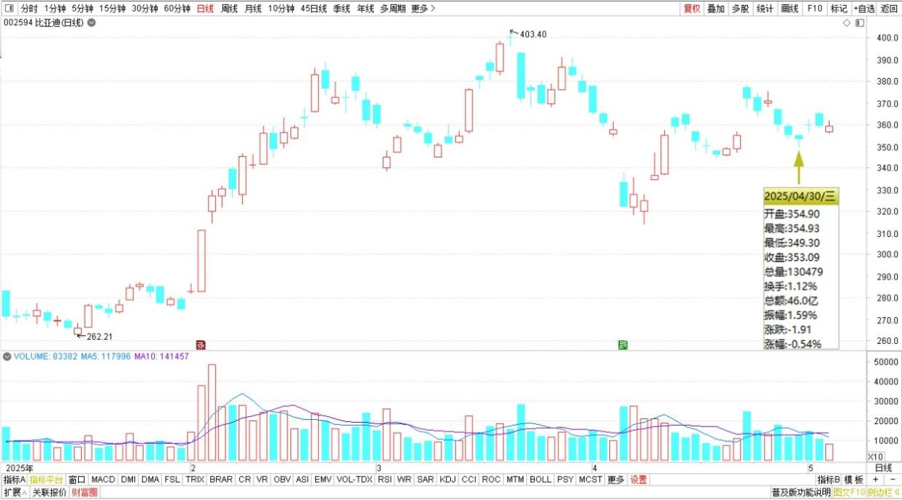
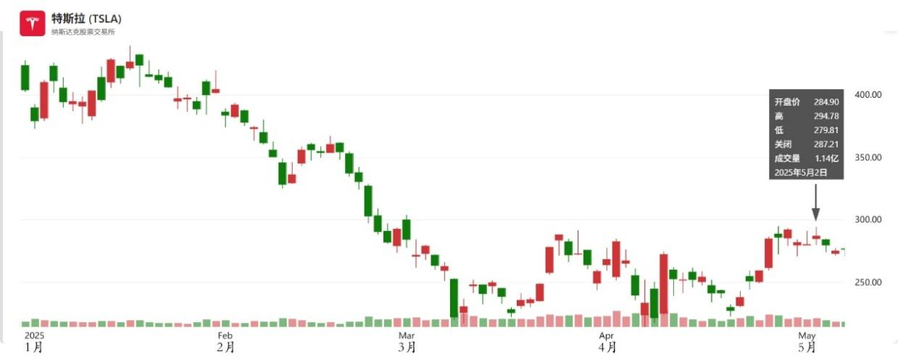

149篇.做多中国的逻辑

清一山长[2025年5月4日20:28](https://www.zhihu.com/pin/1902459661652821694)

现在比亚迪只有一个比不过特斯拉，就是市值。比亚迪一季度营收1703.6亿，利润91.55亿。特斯拉一季度193.35亿美元，利润4.09亿美元。现在离岸汇率7.21，特斯拉营收1394亿人民币，利润29.48亿人民币。比亚迪在营收和利润方面全面超越特斯拉，营收比是1.2，利润比是3.1。利润率分别是百分之五和百分之二点一，利润率也是全面超越。对比之下市值，特斯拉9250亿美元，差不多6.6692万亿人民币，比亚迪1.07万亿，相差6.23倍。另外比亚迪2024年卖了427万辆车，其中出口41.72万，占比大概十分之一，今年突破500万辆车是很有可能，而特斯拉去年卖了181万辆车。

比亚迪、特斯拉财务数据

比亚迪2025年日线图

特斯拉2025年日线图

从这个案例，你就可以看到：中国股市的未来，美股的未来。**为啥我现在一直在做多中国？各方面的表现，特斯拉明显不如比亚迪很多，但市值却高于比亚迪六倍多。因此未来只有两种可能性——特斯拉跌下来，跌掉80%的价格，要不比亚迪涨上去，涨六倍，这样才是合理的……也许这两个方向会同时启动……**不论如何，现在持有特斯拉，是相当危险的！在比亚迪和特斯拉做一个对冲，才是聪明人的做法，我猜——华尔街肯定有人做这个！

（标题、图片为编者所加）

**文章音频**：

[561篇. 做多中国的逻辑](http://link.zhihu.com/?target=https%3A//www.ximalaya.com/sound/854757143)

**参考链接：**

[143篇.融资大跌终爆仓，绩优股也套死人](https://zhuanlan.zhihu.com/p/1897413479624856474)

[144篇.啤酒突破性上涨，再涨就慢慢退出](https://zhuanlan.zhihu.com/p/1899847714302310085)

[145篇.重庆啤酒和燕京啤酒的比较很有意思](https://zhuanlan.zhihu.com/p/1903027854041674843)

[146篇.啤酒，金融大鳄，跟庄和做庄！](https://zhuanlan.zhihu.com/p/1903468754253381786)

[147篇.啤酒还不是曲终人散的时候](https://zhuanlan.zhihu.com/p/1904883834287265515)

[148篇.我30年股市不败的生存之道](https://zhuanlan.zhihu.com/p/1904884087837131510)

