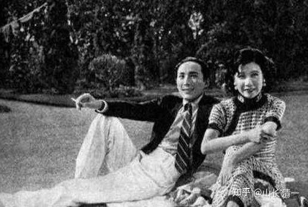

如果人生注定要吃苦，你希望是青少年时代来吃苦好呢？还是老年的时候再来吃苦？

如果人生注定要有起伏，人生必须面对逆境。那么，你希望自己是小时候遭遇逆境呢？还是中老年再去体验逆境考验？

如果人生总得奋斗一次，你希望是少年去发奋呢？还是“老骥伏枥，志在千里”？

如果人生总要挨抽的话，您希望自己青少年先挨抽呢？还是越晚越好，中老年再挨抽？

如果孩子一生注定要挨耳光，你希望是小时候父母打他的耳光。还是等他长大后，去社会上让别人来打耳光呢？

家长以为小时候当皇帝养着，长大就真的当皇帝了？会不是太天真了？你家就算有皇位，也未必实现这个理想呢！何况你们本来就一平民！

**如果让溥仪来重新组合选择他的人生道路，你认为他更希望选择的是“标准答案版”---【少年当皇帝，中年无业流浪，老年当花匠谋生】？**

**还是反过来：少年先去当花匠，中年求职无门，老年当皇帝？**

**我猜：傻瓜都知道该怎么选吧？溥仪的一生，少年得志，可以说是最惨淡，最失败的人生！**

**但你们一大堆的聪明人，聪明的家长，怎么全都反过来选呢？都在帮孩子选择最悲惨的人生剧本？**

**现在家长的选择，无一例外，都是从皇帝到废品的人生设置规划路径！**

**一：少年皇帝：**孩子从小娇生惯养，当小皇帝，小公主供着。然后孩子吃喝玩乐，不思进取，就算送进最好的学校，也不肯努力学习。因此必然导致第二个局面：

**二：中年无业----如果一个孩子，从小就好吃懒做，从小就不学本事，不好好读书，也不好好学做人做事。肯定会导致30多岁后，也找不到像样的职业，只能到处胡乱打混。家里蹲，啃老！**

**三：老年当花匠----**老了，豢养自己的父母也死了，孩子从小没教真本事，无德无能，只能去当最底层的劳工服务，出卖衰弱的体力，勉强度日糊口！惨淡贫困地度过晚年生活！更谈不上照顾子女后代了。

** 家长如果这样因果倒置的来规划孩子的人生，简直是悲惨极了！走的是断子绝孙的路线！孩子假如还能够正常长大，不出事，还有点小出息，绝对是家长的运气好！孩子从小娇惯的，不思进取，养废掉是很正常的！**

**家长干嘛不反过来规划你孩子的人生呢？**

**一：少年当花匠。**从小别把孩子太当人看，就当个牲口来训练（小孩本来就是动物性更突出）。如果家长让孩子小时候就没有家庭地位，只能做“下等人”，这样孩子自然就养成了敬老，尊长，谦虚，踏实，会看眼色，会认真学习进步的优点。为了摆脱社会地位低下的问题，这孩子一定从小就能学会做人做事！

**二：中年无业，就到处求职锻炼：**青年中年，就应该把孩子放出去，应该去社会上去打拼，去争取获取自己的社会地位。壮年期孩子浪迹天涯。去闯关东，打江山。最终建立自己的功勋业绩！

**三：老年当皇帝：现**在当然没有皇帝了。但可以当自己小家的“皇帝”呀？人家溥仪是万里江山的皇帝。你可以当你家里【千尺豪宅】小江山的皇帝。你老年之后，儿孙满堂，大家都对你恭恭敬敬的，因为他们今天的一切，都仰赖你过去一辈子的努力奋斗。你老了，当然就有资格神气十足的在家里当皇帝，当贾母老夫人好了。总比现在很多人老了，但就因为年轻时候不修功德，老了之后，无德无能，导致儿孙都嫌弃和排斥自己，只能当个“老不死”，为老不尊。如果老了能够当家里的皇帝，被大家恭恭敬敬的捧起来，这样多美，多幸福的一生呀？

中国古话说，人生有三大不幸：少年得志，中年失业，老年入花丛

还有一种说法，**人生有三大不幸：少年得志，飞来横财，出身豪门**

我们就来解说一下：

**一：少年得志**

少年时代，因为一点小聪明，小本事，就被捧得太高。小孩子从小就被家长认可，得到了自己想要过的生活，有着家里面高人一等的优越地位！得到身边三代人众星捧月一样“重要人物”的中心地位，这就是“少年得志”。此为人生之大不幸！因为孩子就不思进取，也害怕失败。会失去了努力的方向，也认为自己没有必要努力，只管享受生活就行了。这种孩子，注定一生没出息。家长能养孩子一辈子似乎也没问题，但只要中途家道败落，这种孩子一生会凄凉失败！根本就爬不起来！

**二：飞来横财**

简单理解，就是突然得到一笔“不劳而获”的财富，是人生之大不幸。因为这种机会，会养成人不劳而获的习惯，不切实际的幻想。就再也不能踏实的做事，勤奋的努力用功了！可惜---现在的小孩子，都在遭遇这种人生的大不幸！

现在家长赚的钱，无条件的给小孩子用，对家长来说，这笔财富自然是劳动所得。但是，对孩子来说，这就是一笔“飞来横财”。既然有这种不劳而获的机会，干嘛还要辛辛苦苦的去学习，读书，考试，工作？直接享受不就行了？所以---现在社会上，一大批的从小就混日子，给多好的学校都不好好读书的躺平族就出现了。家长还纳闷呢？为啥我赚钱，让孩子没有一点经济压力去读书，孩子为啥就是不好好读呢？读完大学为啥就是不肯去工作呢？其实---**不劳而获的财富，家长无条件的付出，从小已经侵蚀了孩子的思想，家长自己制造了孩子的人生不幸！**

**三：出身豪门**

出生豪门，生下来就含着金子，是很多人一生的梦想。不知道这却是人生之大不幸！一方面是娇生惯养，孩子浅薄无能。另外一个大不幸，就是日常身边围绕着的全是一群仆人走狗，让孩子容易自高自大，完全脱离正常的生活常识。更危险的是，身边的所谓“朋友”，要么是家庭出身差不多的“狐朋狗友”，一群消费者。基本上都是别有用心的心机婊们，都在图谋怎么捞取利益，设坑害他们的。他们也无法真正拥有德行品行良好的朋友！所以---出生豪门，真的是人生之大不幸**！**

可叹的是：现在的家长们都没啥文化，没啥思考能力。本来自己家也不是啥豪门，却傻乎乎的把自己孩子像是豪门后代一样养，成天捧得高高的，爹娘亲自当仆人走狗来侍候孩子。所以：以上的人生三大不幸，都会降临到现在的大批孩子们身上的。我身边，见多太多的这种家庭了！看得我哭笑不得！

**下面是一个案例，让你们看到：自己孩子真想过这种生活吗？比溥仪更惨的人生！**

*民国富豪盛宣怀的儿子：爹死之后几年内就败光家产*

[盛](http://link.zhihu.com/?target=https%3A//q2.itc.cn/q_70/images01/20250221/a2e1f268395e48598e9564dfc4599c10.jpeg)恩颐的名字，现在知道他的人可能比较少。但是在民国时期，他却可以说是非常有名的一位纨绔子弟。他的老爹是清末政治家盛宣怀，因他是其老爹的第四个儿子，所以很多人又管他叫盛老四。大家可以试想一下，在当时能够出生于官宦之家，盛恩颐平时的小日子得过得多惬意。

再加上出生于他之前的那三个哥哥都早逝，待盛宣怀百年后，一个人继承所有家产的盛恩颐，理应一辈子不愁吃喝才对。然而实际上，在父亲去世以后，盛恩颐通过疯狂买车、养姨太太和赌博等方式，在短短的几年内便将家产都败光了。其败家速度之快，简直让人瞠目结舌。

**对比案例：少年发奋？还是老年发疯？**

今日塾家长，目前正在安排孩子们去体验Ella式的成长模式---连续四年不回家！专心学习，直到成功！

今日塾的一部分家长，在磨丁教育课程培训完之后，深感自己的家庭教育，对孩子的影响是负面大于正面。因此希望要学习ELLA一样，连续五年不回家。当年Ella13岁，到清迈我家中，与小女作伴一起学习，再次回国已经是快18岁的成年少女了。她第一次回家就是2024年1月打完全国泰拳锦标赛，拿到亚军身份后才回家的。她家长一直很支持她留在清迈不回家！但磨丁的今日三语学校， 每个假期孩子回家都出现状态大幅倒退的问题。所以--家长们想要学校不放假学ELLA一样。但这是不可能的！我们的老师肯定要放假的！

所以家长们就只能另外想办法：自己组织起来，家长在磨丁开设【打工学堂】继续磨炼孩子。计划是让孩子放假后，就留在磨丁这里继续学习和训练。家长想看孩子，就自己来磨丁看看。而不是带孩子回家享受！由于家长假期也不知道如何教孩子知识，干脆就让孩子去体验【打工生活】，练好身体为重。反正就是不让孩子回家吃喝玩乐，回家被老人乱宠，导致学习状态下滑，学业失败。直到再次开学后，再送回学堂继续上学。这样家长坚持四年，直到15岁考上冠军班之后就可以回家了。考不上冠军班，家长说孩子就丢在老挝不要了，自生自灭去！【**估计不是当真的**】

不过，我们学校老师的意见是：我们不会干预家长的假期安排。同时，也认为今日的教学成绩，SAT考试已经能够让50%的学生达到1%的成绩，已经是世界顶尖水平了。因此没要假期继续给孩子施加压力！提高到60%甚至70%对今日来说意义不大，反正都是全球领先。不过---可能提高成功率，对于家长来说很重要。特别是排名在后面50%的家长，肯定对结果是不满意的，希望继续提升绩点。这个目标是家长自己想要，就由家长去努力了。**对于今日的教师团队来说，只要把50%的学生。15岁送上去读冠军班，就算完成任务了！**