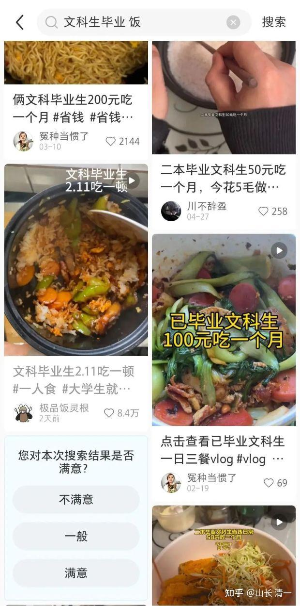
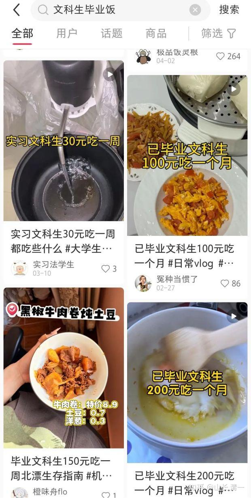
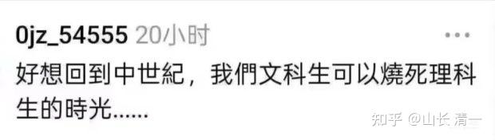
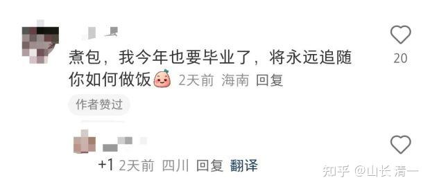
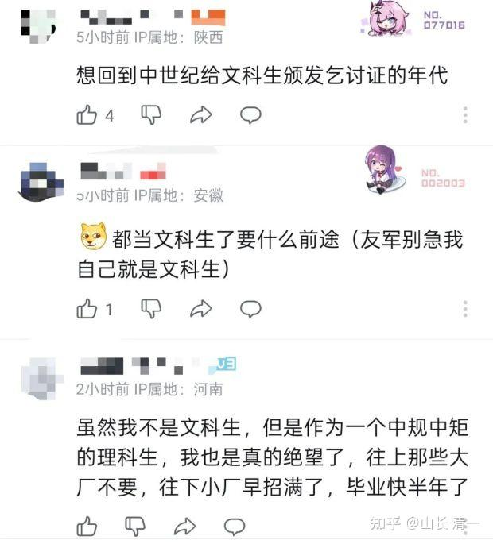

千万不要读文科！！！

40多年前，我面临高考。当年是高二最后一年才分班，班上成绩差的学生，平时班级排名靠后的一批差生，老师估计考不上大学，就要求转去文科 班上学。相反，班上语文成绩最好的一批学生，都是全科学霸，谁都没去读文科。就是文科理科都差的一批学生，很不情愿的去了文科班！我当年的文科理工都很好，当然也没去读文科，觉得去文科班就是丢人的。因此，高考完后去读了985大学的工科专业本科。

后面不想当工具人，自己想学文科了。本科大学的最后一年，我用了半年的时间想要考哲学研究生，就读完了哲学专业的所有主要课程，去考研究生专业课程全部优秀成绩通过。就是英文成绩差了几分，没有到录取线。所以没有考取研究生！后面我工作后再度备考，把大量时间用来学英文，终于第二次考研，以五个单项成绩第一的高分，考研成功，进入了武汉大学读哲学专业研究生！

这个经历说明：我一个理工科专业学生，可以用半年就自学完文科专业课程。但如果要我去学其他专业的理工科专业研究生？再给我四年恐怕都不成！如果相反----要让文科大学生来考我的本专业（电力系统自动化）研究生？我看给他们10年也不成！因为他们的思维力太差，根本就看不懂理工科的教科书！

这就是文科和理工科的差别：文科都是可以混的。只要脑子差一点，人懒一点，真的读不了理工科！

某网友发言说：我恰巧读过理科专业，也同时还有一个文科专业的文凭，我可以负责任的告诉大家，文科专业读起来的难度大概只相当于理科专业的1/10左右，特别是基本上没什么作业。而理科专业如果你考及格的话，每天至少要做一个半小时到两个小时的作业。

这是真话。所以---我一直跟新教育的家长们说：不要被孩子要去读文科大学的言论迷惑。这都是一批想偷懒的孩子！本质上，他们就是想要让家长花钱，让他们去一个青年俱乐部，以上大学为名，轻轻松松的吃喝玩乐快活四年。拿个文凭来骗你，骗企业的。真实情况，就是四年之后，他们比高中的时候更废了。因此大家千万不要读文科！

**不是说文科不好。而是一般人根本就不配去学文科！**真正的文科想要学好，相当的不容易。要比理工科难得多。可是，一旦真正的学好了文科，就会成为很厉害的人。比如古代的苏秦张仪诸葛亮，就是文科杰出人才！谁敢说他们不行？

可是一旦文科没学好，就是孔乙己，没有啥中间态的。这种人，除了一股酸臭之气外，基本上没有真实的社会生存本领，如果去体制内混混，也勉强人模人样，但丢到社会上自谋生路的话，就要献丑了！所以，如果你家里没一点路子安排体制的工作，就真的不能学文科。无论什么大学，甚至博士毕业都不好使！上文科大学，就是去混社交圈的、交朋友的。你们家没有啥资源，去读啥文科？

不能说文科不好，只能说：大多数人不能学文科。特别是一些懒人，思想和行动懒的人，混日子的人，是真的不能学文科的，这种人也不可能学会真文科。另外---现在的大学，也基本上没有啥真文科。也不应该去上大学学文科。

我认为---真正学文科的人，只能挑选特别勤奋，特别努力的人去学。甚至还必须挑选特别聪明的人去学。比如名牌理工科大学学完后的高材生，毕业后再去学文科的研究生。这种人才有可能真正的掌握文科。

因此清一大学本科阶段就不开设文科专业。只开设一个专业----武道专业。让学生必须打出全国前三名才能毕业，这样硬性要求，才能避免学生偷懒（偷懒是人的本性）。清一大学只有研究生阶段，才会开设真正的文科专业，如文学，哲学，心理学，金融学之类的。要等我们的这批学生，去读完世界名牌大学的理工科专业之后，再来读文科研究生。这些人学出来之后，才有可能成为文武双全，文理跨界的综合人才。而不是一群孔乙己一样的酸秀才，腐儒。

下面是一些体制内文科生毕业后卖惨的生活图景，让我想到了孔乙己吃茴香豆！你们呢？

