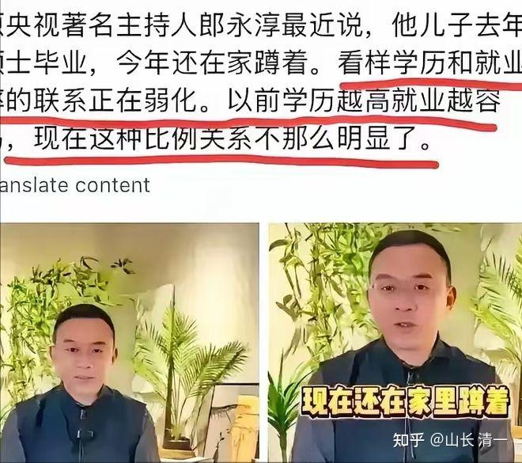

中国的家长热衷于【考常春藤】，以为考上常春藤就一切ok。人生的开挂之路就打开了。殊不知--花了大几百万丢水里去，直到大学毕业的时候才发现问题刚刚开始。所以---家长们就别自欺欺人了。各位先学会“开眼看世界”，学会睁眼走路吧。别只会闭眼，跟随过去几十年很不靠谱的老经验帮孩子掉坑里了！

**如果一个著名央视主持人，社会资源应该相当的丰富。他都不能帮自己常春藤毕业的儿子找到工作，你们这些普通老百姓。花大钱去鸡娃，以为考上常春藤就走上了人生坦途大道，会不会太天真了？**

时代已经改变了。靠一个文凭打天下的时代、已经一去不复返了！即使是常春藤名校毕业都不行了！如果家长没有帮助孩子准备好职场安排，毕业之日就是失业之日！无论中国还是美国，未来的就业市场都是过饱和的，不能继续卷了。只有小语种国家，目前还是就业蓝海！

1997年，在央视主持【新闻30分】 郎永淳。与他在北广大学里当班长时候认识的妻子，也是同班的学习委员吴萍结婚！

1999年，两人的儿子郎俣出生。

2013年，郎永淳决定送14岁的儿子郎俣，前往美国高中“深造”

2019年，儿子成功考上了美国著名院校哥伦比亚大学入读本科，这是常春藤盟校之一！后来又上了哥伦比亚大学的硕士研究生！

这是一条中国家长梦寐以求的道路---如果美高，考上常春藤。还读了双学位研究生！在美国求学期间的开支，大概是每年50-70万元以上。这十几年，再节省，怎么也得花600万元以上吧？现在毕业了，到了收获的季节。孩子却在家啃老了！

2025年：郎永淳公开宣布，自己26岁的儿子毕业后找不到工作。不过他安慰自己---孩子在“积累自己”，不需要想自己一样一辈子在一个单位工作！

不过，与这种名校毕业却找不到工作，形成强烈对照的案例就是：公主班的学生，还没毕业就供不应求。甚至有人还愿意开出百万年薪聘用，因为她们能够帮雇主创造更高的价值。她们年纪轻轻，才十几岁就能给成年人正式上课，让这些成年人心服口服。更别说她们去带领小孩子，让孩子对这些文武双全的大姐姐心服口服，让家长特别满意了！这就是选择决定命运！

下面就是17岁就独立带班的小公主尤文慧的带班记录（周报）。她去带班的原因，是她是班级武道比武的最后一名。因此就不许继续练武，只能提前去带班了。她的其他同学，还在清迈继续学习进步，要拿到冠军之后，再去走入职场。但小公主带班却让家长放心，孩子开心！家长们都对她的带班结果，都非常的尊重和满意。她写出来的给家长的带班周报，也有章有法，成为外围学堂的教师模仿和学习的榜样。很多家长和教师自愧不如，不能够像她一样带班带得如此得心应手。因此，未来中国，并不是不需要人，而是不需要养尊处优的书呆子。只要会做事，会读书，会做人，去社会上，到处都是机会，都是社会需要的重要人才！

[【公主突破班】25年春季 第13周周报](http://link.zhihu.com/?target=https%3A//mp.weixin.qq.com/s/uh0tzYR-9hT-AyGY32nH5Q)