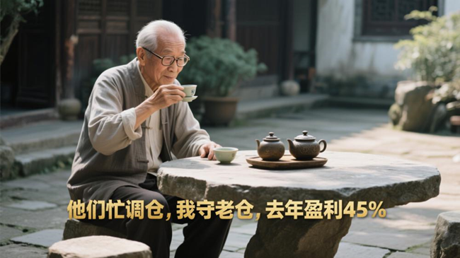
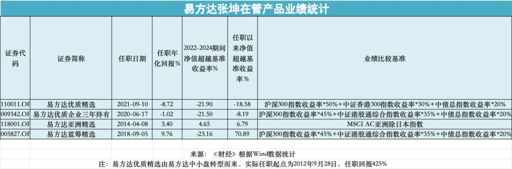
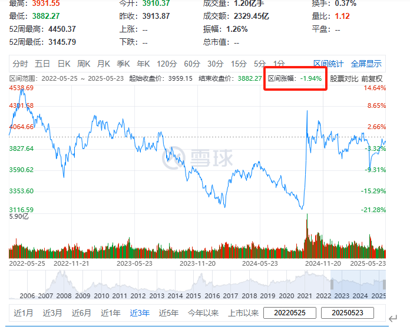
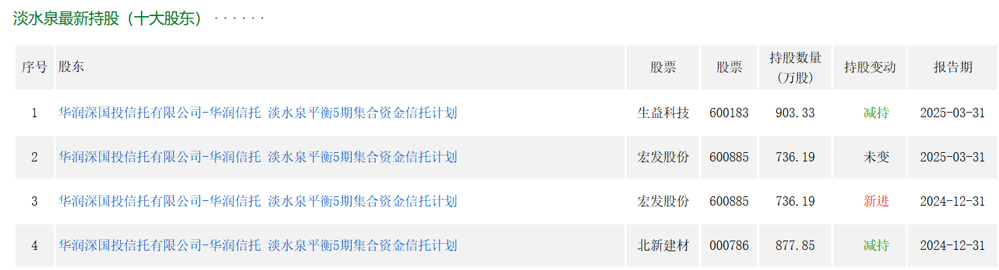

152篇.核心股票连续几年不动核心仓位

[清一](https://www.zhihu.com/people/shan-chang-qing-yi)山长[2025年05月17日17:38](https://www.zhihu.com/pin/1907127934759727722)

新闻：基金调仓。（张坤是公募顶流，易方达一哥，但也是业绩不达标处于待降薪名单的一员。过去3年，张坤累计-12%，跑输基准沪深300指数10%以上。

如果今年张坤还拿不出业绩，不能扭转基准-10%的生死线，不但张坤本人要被大幅降薪，易方达的基金也要被连带下调基金费率，实属是一个人害死一船人，整个易方达都要遭殃。

易方达也很务实，直接把张坤副总位子拿掉了，美其名曰专心管理基金，潜台词就是你再不能把收益做上来，下一步就彻底滚蛋吧！

所以，最近公募新规引发调仓的传闻不仅真实可信，影响甚至可能远超人们预估）

[https://finance.sina.com.cn/stock/observe/2025-05-08/doc-inevvssw8623355.shtml](http://link.zhihu.com/?target=https%3A//finance.sina.com.cn/stock/observe/2025-05-08/doc-inevvssw8623355.shtml)

[24位百亿权益基金经理降薪预警：张坤近三年跑输基准超12%触及降薪线](http://link.zhihu.com/?target=https%3A//finance.sina.com.cn/stock/observe/2025-05-08/doc-inevvssw8623355.shtml)

看样子，我去年总收益45%的业绩，算是很亮眼的成绩了！（链接：[130篇.无意中发现证券原来系统还有这个功能](https://zhuanlan.zhihu.com/p/23675222317)）今年前几个月的账户还是亏的，现在我的账户又在赚钱了，增长的程度还不错！到年底应该赚得更多的。没想到鼎鼎大名的张坤，业绩这么惨淡，三年的总收益还是负数！

说到基金调仓，我看了一些资料，知名基金如淡水泉等等大幅调仓，新建个股进入十大的仓位等等信息。我看后是一头雾水的——我买的股票，都没有进入这些基金调仓热门股榜单。相反——他们买入的个股，我看上去都很陌生。我跟踪了几只，都没有找到买的理由，看不懂他们为何扎堆买入，不明白这些基金大幅增仓的道理是什么。因此，我自嘲——我大概是老古董了，已经被时代淘汰了，都看不懂这些基金买的股到底有啥优势了！

直到看见上面的消息，才知道：原来这些牛人、牛基金，这几年都没赚钱。那么——每个月调仓换股的，调个啥呀？我的核心股票，都连续几年不动核心仓位的。他们进进出出这么多，原来忙了个寂寞！

算了，看不懂这些基金界牛人有啥高超的时代金融眼光，我就还是守着我的老古董股票玩算了。既然看不懂这些新的企业和行业，看不懂他们持仓的股票，我就坚决不投。他们赚钱，跟我没关系，但赔钱也轮不到我来赔。这就够了！

（标题、图片为编者所加）

**文章音频**：

[564篇.核心股票连续几年不动核心仓位](http://link.zhihu.com/?target=https%3A//www.ximalaya.com/sound/859895794)

**参考链接：**

[147篇.啤酒还不是曲终人散的时候](https://zhuanlan.zhihu.com/p/1904883834287265515)

[148篇.我30年股市不败的生存之道](https://zhuanlan.zhihu.com/p/1904884087837131510) [149篇.做多中国的逻辑](https://zhuanlan.zhihu.com/p/1904901755860418933)

[150篇.五年以来业绩最佳，惠泉啤酒稳步增仓](https://zhuanlan.zhihu.com/p/1907828272798110352)

[151篇.燕京啤酒换惠泉啤酒，第一持仓为某高息股](https://zhuanlan.zhihu.com/p/1908860872513812314)

[链接汇总（截止2025年8月1日）](https://zhuanlan.zhihu.com/p/621215591)