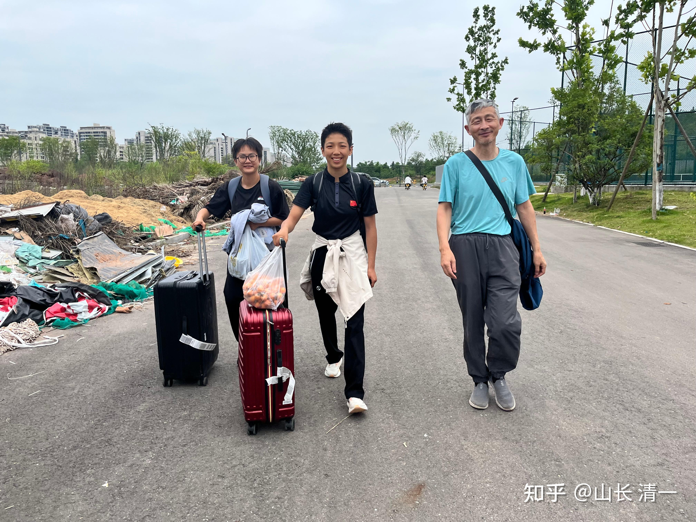
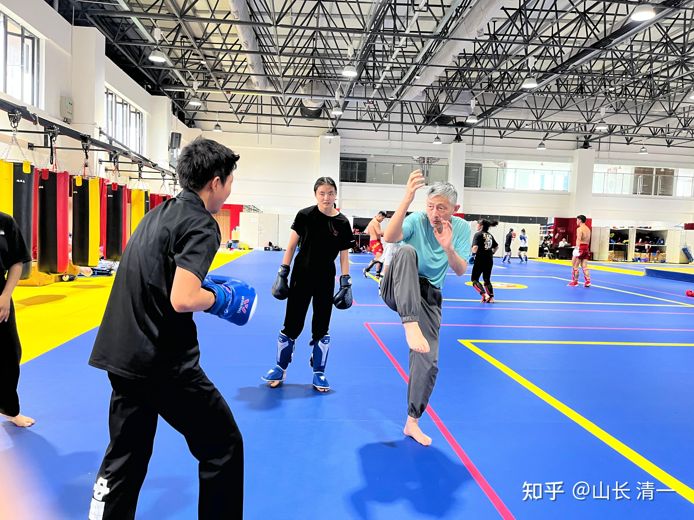
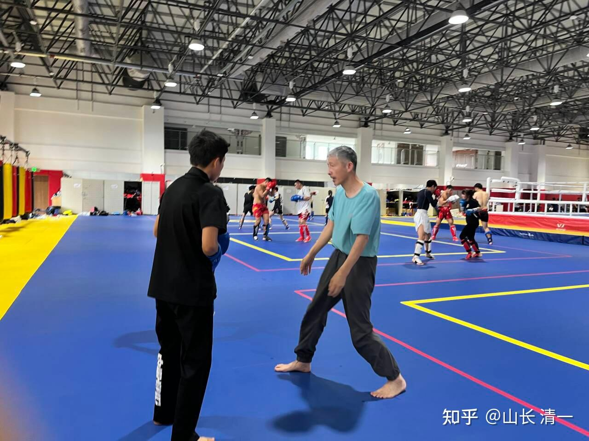

今天， 两个木兰刚从土耳其回国到了成都，与ELLA公主汇合。我在体育馆国家队训练基地指导她们训练。我让明晓来给ELLA做陪练。刚开始ELLA攻击明晓，总是不得法，完全打不进去。我指点了ELLA改进技术之后，ELLA就多次击中明晓的头部脸部，逼得明晓都去找护具了，不再敢轻敌了！我觉得孩子们吸收我的技术还是很快的，由我指导和没我指导，结果差距很大！这次泰拳世界赛的国家队集训，我没有去指导木兰，导致她们的战绩不够好。当然，领导也不让我去！她们首次参加世界锦标赛，就和世界冠军交手，虽然败了，也是她们的光荣！也很不错了。

明晓的对手，是过去两届的的世界冠军，这一次也拿下了本届的世界冠军！明晓虽然打满三局被判决输了，但打完比赛后对手就瘫坐在地下，而且在场上，她满场被明晓追着打。她的胜利也来之不易。这个冠军非常的强悍，在明晓之前和明晓之后的比赛，她全都KO了对手。但明晓跟她打下来却毫发无伤，因此，让国家体育总局的领导也印象深刻！赛前他们都不敢告诉我们的队员，这个对手的级别有多高。怕木兰们有心理负担！但木兰们自己查资料已经知道了对手超级强悍！我也鼓励她们：运气不好，首战就遇到世界冠军，不然她至少可以拿银牌的！但老天肯定希望她们更好地提升自己！

*两个木兰土耳其世锦赛败战归来，今天到成都参加世界运动会选拔赛！*

*我在训练基地给ELLA示范如何才能有效攻击明晓*

*明晓已经稳获世界运动会资格，她来帮ELLA陪练拿到新的入场券*

明天谭木兰才能来参加选拔赛，她的主要对手是耿春蕾。耿春蕾已经表示要放弃泰拳的选拔，因为她两次都输给了明晓。她现在瞄准自由搏击资格赛。=，看谭木兰能否从她手里取得世界运动会的入场券了！失去了泰拳入选资格的谭木兰，应该也不会服输的。这里有四人要参加谭木兰争取的赛事资格，但只有一个能成功！

陆鸽将与成都，匡菲再度比赛，争夺世界运动会入场券！据说要比三场，九回合！最终裁定谁才能入选世界运动会！

ELLA昨天第一次参与国家队训练，她就很郁闷，因为完全不适应教练的要求。她的技术动作笨笨的，很可笑。就像个从来不会练拳的人一样。教练员还总觉得她在偷懒！其实她已经很努力了。我说这些外家拳的东西，你从来没有练过，当然不适应了！让他们去练你的动作，他们也会很笨的！只要你打得赢他们就够了。今天她看到木兰来了之后非常的开心，就跑去抱着木兰们跳跳跳的，我猜她是因为总算来了援兵。否则她在这里太孤独了！

为了帮木兰“逃避”国家队的训练项目，我让木兰们以自己的教练从清迈来帮她们训练为理由，申请单独练。避免受罪。所以，我明天八点半就要去体育馆当陪练了！这把老骨头，被跟世界冠军们打过的木兰们揍一顿，不知道明天晚上会不会被她们打散架！

晚餐木兰们就去餐厅吃运动员的特供自助餐。我和刘老师就去学校外面吃饭，每人吃了一碗稀饭两元，加上一个饼子6元！感觉消费太低了，对不住成都的热情，就再买了9元的车厘子带回宾馆！然后小女晚上居然打电话来请教妈妈，自己的同学家里的父亲病危，快离世了。她的同学很难过，想要帮助父亲却不知道该如何办。她就跑来问妈妈，怎样帮助同学减轻无法帮助父亲的心理负担，让她也能够为父亲出一点力，不留遗憾。妈妈也认真的教她了。

然后小女孩就告诉我：她看到了爸爸的文章，看见清黑最想黑的人应该是她的事情，她就一直在想：她做了什么事情，可能会让清黑去抓她的黑料？很担心自己因为无知而犯错！我说：你已经意识到这一点，她们就抓不到你的黑料了。你只要每天想，你现在做的任何事情，一旦公开出来，也不会觉得惭愧，这样的事情才能做。否则就不能做，这样你就没有可能被抓黑料！比如你偷偷的吃个冰淇淋，公开出来可能有点不好意思，但也是人之常情，就没关系的。但你如果悄悄的去偷别人的冰淇淋吃，这种事情被公开出来，就太丢人了。因此你就不能做！小女很懂事，说她知道了！

ε=(´ο｀*)))唉，生在我们家也挺倒霉的。从小就需要接受严格训练，没法去享受吃吃喝喝玩玩的好事，这么小就忙着出来做事了，前两天讲家族传承课程还获得良好赞誉，但也不敢骄傲，还要成天担心自己做的不好，怕有人来黑。因为她这一次，看到姐姐承担这么大的压力，都感觉自己也有压力了。虽然还没有人黑她。但天知道黑们什么时候就盯上她呢？所以，我真的有点对不起我家的孩子！也许她生在普通人家会更快乐轻松吧？当然，小女认为普通人是傻乐。她更喜欢与爸爸在一起迎接风雨，她认为这样才锻炼人！但她哥哥，可能就更喜远离我们这个是非圈吧？孩子们我都就会给他们完全的自由，让他们18岁之后就可以自由选择，想做普通人也可以！可以离开我们的平台，去跟别的人一样，过一种普通人的生活，也是一种不错的选择！

**突然想到：今天似乎是王CY的大婚日子。也许，我还有一份最后的礼物可以送给她，让她安心去过自己的日子。所谓的升米养恩，石（dàn）米养仇。灵魂是公平的，灵魂是不喜欢负债的。**我从她11岁开始就开始养她，一直到成年。她开始工作带班之后，还给我们的学校带来了很多的损失。2016年的清黑事件，还是她引起来的！这些都是我在上一次公开与她分割师徒关系的文章中，已经提过这事！认为她对不起今日的培养！认为她在今日，从小到大这么多年，一直没有带给我们正向的收益，相反看起来，还带给我和我的平台巨大的损害。虽然她嘴上不承认。我相信在她的灵魂深处，也一定有深深的愧疚感！也担心宇宙的清算！也因此，她才会公开的发言，表示她得到这一切是应该的，因为她很优秀！这些是我看到的她试图来“平衡账户”的努力。但她发表后就遭到了网友们大量的嘲笑和谩骂，认为她忘恩负义。但我能理解她的心情！她肯定希望她不欠谁的，不希望一直背负着债务生活，肯定非常讨厌她一直欠我的这种说法！

** 那么，今天，我就在王聪颖的大婚之日，在数万网友面前，公开的送她这份新婚礼物吧：从今天起，你不再欠我了。我原来为你付出的一切，无论是金钱，还是感情，以及名誉地位，你今天就已经全部还给我了，我已经收到了你还给我的全部欠债。从今之后，你就可以轻装上阵，不需要带着欠了我啥的心情去沉重负担去生活。这就是我送给你的新婚礼物！**

我要感谢你这一周来，送给我的大大的礼物：今天我无意中，看到我的知乎流量记录：一周内我居然获得了47万次阅读，上一周只是20万次而已！这一周还获得了7000多个点赞！我还收获了很多的新好友。不少从来不发言的朋友开始送给我美好的赞扬之语。我相信这一切，都是你带来给我的礼物，因此我要感谢你的努力。**别人存钱，我存交清。你让我一下就快速得到这么多的交情，我认为我真的赚大了。**因此，我认为你已经用你独特的方式，把你这十几年欠我的一切，全都还给我了。因此你真的不需要愧疚，不需要去自证和宣告你不欠谁的，起码今天起，你就不欠我的了！以后如果有人再来批判你，指责你说你对不起我的时候，你可以坦然的告诉他们：**你在自己结婚的这一天，就已经把你欠张清一的全部债务都还完了。**你已经得到了张清一债务完结的收条，让这些吃瓜群众，就不要再来叽歪你欠我的债了！今后，我和我的子女，也不会来找你来讨还任何债务，也不会找你来替我讨还公道（与我有关的部分的公道）。我们从此就可以相忘于江湖，彼此都自由的放对方一马！不再互相的挂念和关注彼此了！

**这就是我送给你的新婚礼物！希望你喜欢！**

另外，我也不认为我依然欠你什么东西，原来该给的，我已经全给了！我不欠你一个老公，也不欠你钱，我也不欠你什么PUA的感情债，这些东西我都不认。如果你不平气的话，非要认为我就是欠你啥的。我建议你可以找一个国家的公正机构，来裁决你认为我欠你的债务清偿的事情。如果法院判决我欠你啥东西，我都会还给你的！但建议你不要自己胡乱在网上述苦悲情讨债了，这只会让你更加失能。我建议你找国家善于处理债务的公正机构来处理！我肯定会认账的！

现在，我要谢谢你从11岁开始，来云南与今日的相处和陪伴。

也谢谢你现在的转身和离开，从此大家再也不见！

过去，我们都付出了十几年来的时光去相处，过去的互相陪伴，有痛苦也有快乐。这些都是我们人生中的资粮，希望你珍惜并尊重过去的一切经验，不管是苦还是乐！不要去贬低和懊悔自己过去的人生。这其实是不尊重自己，也不尊重别人！

如果你对自己的现状有什么不满意的地方，请你往前看，往前走，你可以自己去塑造自己全新的人生！而不要期待别人来为你创造和赠送你想要的世界，因为你才是你自己生活和世界的创造者！

我对自己的现状很满意，我对今天的现状也很满意！我会继续创造我的未来世界！

祝你新婚大喜，吉祥如意，心想事成！