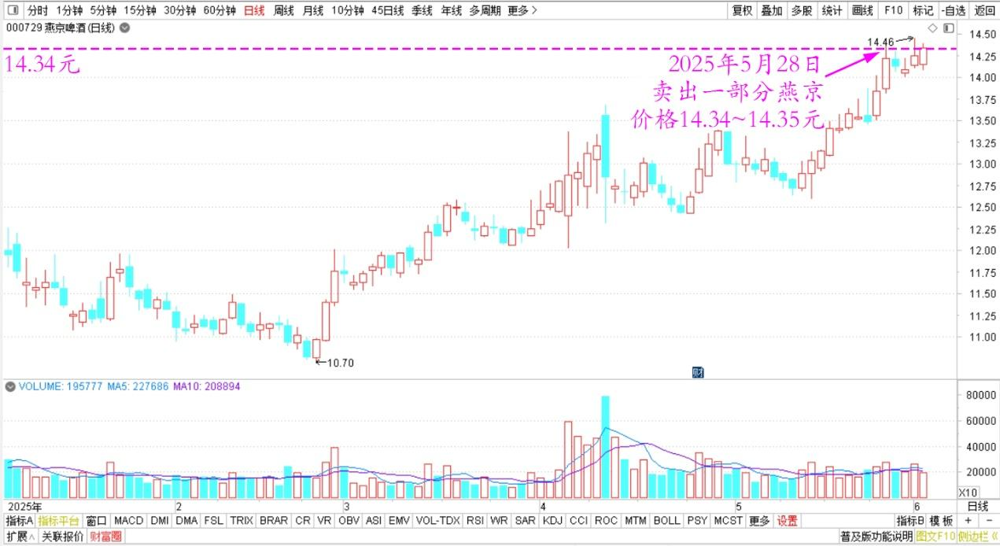
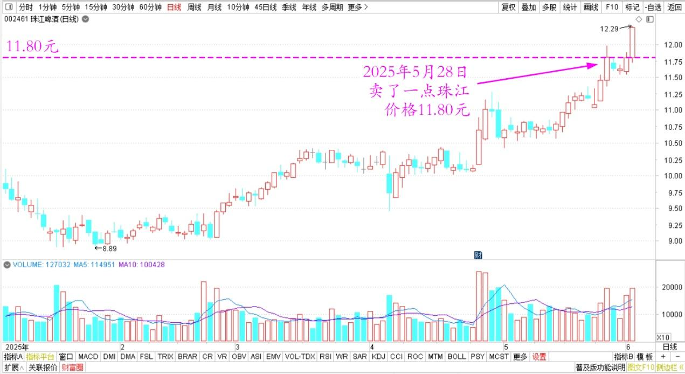
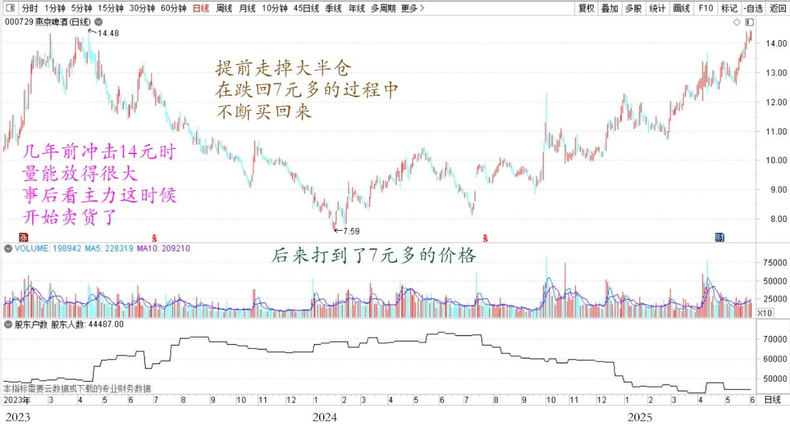
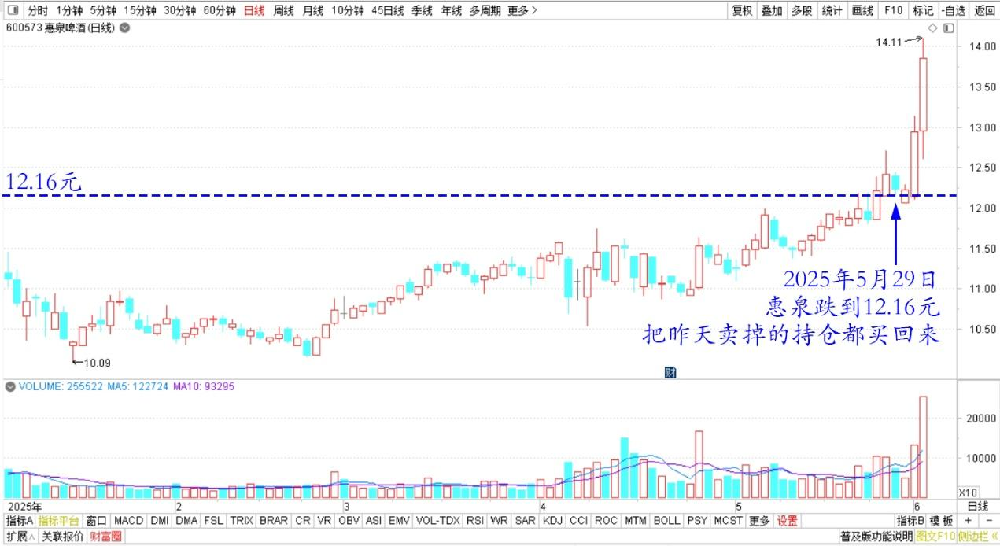

155篇.啤酒现在是【持仓】的时候，不是【买入】的时候

清一山长[2025年5月29日22:01](https://www.zhihu.com/pin/1911542771782755500)

燕京啤酒昨天创历史新高。我昨天就卖了一部分燕京出去，价格是14.34～14.35元左右，珠江也卖了一点出去，卖出价格是11.80元以上，我对此价格非常的满意。

燕京啤酒2025年日线图

珠江啤酒2025年日线图

虽然从盘面上看，燕京、珠江都没有主力出货的痕迹，说明后市可期，新高之后，还会新高的，应该继续持仓待涨。几年前冲击14元的时候，量能放得很大，事后看主力的确这时候就开始卖货了。后来居然打到了7元多的价格，回到七年前的价位。这个主力实在太狠了，我是万万想不到的。我很幸运地提前走掉了大半仓，又在跌回7元多的过程中不断买回来，最终买成了持仓的新高。

燕京啤酒2023～2025年日线图

因此现在虽然价格重回昨日，但我的啤酒持仓却多了很多。主力下杀给我一次额外加仓的机会，比一直做上去对我更有利。当然——利润大头肯定是主力的。可以想象主力现在账面上的利润是非常丰厚的，燕京基本上消灭了亏损，所有现在持仓燕京的人应该都是赚钱的，包括上次冲高买入的人也解套了。大家都喜气洋洋的——我相信主力将来会有一个绝妙的兑现方式，怎样兑现我就不知道了！我也不管这些，就边涨边卖好了。正好也看中了其他的一些股票，我现在愿意换仓。不想继续死守燕京了！守了很多年了，有点累了！只要我最终至少留下一百万股，陪它到永远，也算是燕京不离不弃的忠臣了！

啤酒虽然我知道会涨，但昨天卖出后，我还是没有买回来。因为昨天我在火车上，也不太方便。而且因为普涨，惠泉也涨了不少。就没管买入的事情了！今天看到惠泉跌落到了12.16元以下，就赶快把昨天卖掉的持仓全都买回来了。多的头寸我也不敢买。算起来——今天的惠泉与昨天的燕京每股差价2元多，我觉得绝对值得拥有。珠江与惠泉昨天补回的差价居然才3毛多？今天差价也才5毛多，更值得了！所以——我的惠泉今天持仓增加了不少。

惠泉啤酒2025日线图

**如果六月份惠泉不超过燕京的话，你半年报就不会看到我减持惠泉，只会看到增仓的。但我都是换的票，没有更多增加啤酒仓位。现在是【持仓】的时候，不是【买入】的时候。我这两天执行【卖出】等于【买入】量。因此总体算起来，还是【持仓】状态。大家别学我高位买入！我是做的【对冲】，不是买入！别弄错了赔本来怪我！**

（标题、图片为编者所加）

**文章音频**：

[567篇. 啤酒现在是【持仓】的时候，不是【买入】的时候](http://link.zhihu.com/?target=https%3A//www.ximalaya.com/sound/865454835)

**参考链接：**

[148篇.我30年股市不败的生存之道](https://zhuanlan.zhihu.com/p/1904884087837131510) [149篇.做多中国的逻辑](https://zhuanlan.zhihu.com/p/1904901755860418933)

[150篇.五年以来业绩最佳，惠泉啤酒稳步增仓](https://zhuanlan.zhihu.com/p/1907828272798110352)

[151篇.燕京啤酒换惠泉啤酒，第一持仓为某高息股](https://zhuanlan.zhihu.com/p/1908860872513812314)

[152篇.核心股票连续几年不动核心仓位](https://zhuanlan.zhihu.com/p/1910794327875117332)

[153篇.《白虎》电影——真实世界的版本](https://zhuanlan.zhihu.com/p/1912809201383764112)

[154篇.上杠杆是亏损的主要原因](https://zhuanlan.zhihu.com/p/1912539537479041762)

