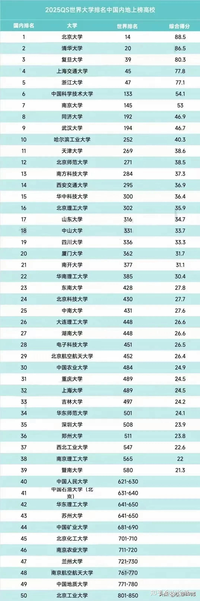

这黄某人群内发言，被大家批评后，就跑去WC的阵地站岗去了，正式宣布做正牌清黑。真有趣，真有料！

**一个人，连自己的出路都没有安排好的人，出来说新教育的学生没有出路。是不是笑话？**

**下面我就用一个一个的事实，来让大家知道：新教育已经从顶级最优秀的学生，到最差的，就不会读书的学生，都安排了最好的出路！**

先看笑话，再读正文！（原文是6月4日的群内发言）

【成都HCK: 刚刚看了聪颖发的文章，升学途径和英语教学确实是有很多可以参考的地方，山长可以看一下

我 @1125 HCK 成都 如果一个人，对自己的大婚，事业，对自己生活道路的安排，都是如此的混乱不堪。她的确想要成功，结果却是毁天灭地毁自己，救都没法救！这种人，你居然相信她可以为您的孩子安排一条更好的人生道路吗？您居然还想让我去跟她去“学习”，怎样才能为学生安排更好的生涯职业路径吗？你的逻辑推理能力，就这水平吗？

不是我骄傲，认为学生就应该不如我，不愿意向过去的学生学习。而是她表现出来的结果，实在没法让我相信她嘴巴里说出来一切成果能兑现！

难道你还不知道吗？现在的今日三校，早就不是华山一条路了！

第一流的学生，想上常春藤，想做文武双全的全才，可以去上冠军班。

第二流的学生，只是想拿高级打工证，可以去上一流的理工科大学。

还有第三种人，强调真真本事，真学问。怎么也不想上现在的大学，认为大学里面学不到真本事，只想学实在的，有实际价值的东西，还可以上去我们开设的【企业二代传承班】。

就算是最末流的学渣，他就是不会读书，但只要肯努力，勤奋一点，还可以去日本做研学生，将来去找个工作很轻松，很容易。不至于在国内卷死自己！

至于最后一种人，他就不读书，也不愿意做事，贪馋使懒，只会吃喝玩乐的垃圾学生，我们就没有任何办法了。只能让家长自己养着就行了。我相信没人能够帮助这种孩子了，就让她们自生自灭好了。如果茶有这能力，您让她去做，她如果真的能够帮助这些学生转运，我会真心的佩服她，承认她比我强！

您如果对我们现在这样的新教育梯次层次的安排，还是感到不满意，当然没有问题。您完全有选择的自由，您就自己送孩子去王聪颖的学堂就好了。我们没这本事！因此，我这里肯定是不适合您的。我愿意放你自由，也请你放我自由，就别让逼我去她那里跟她学吃屎！拜托了！（6月4日）】

**正文：新教育学生的出路和安排！**

**一：第一流学生的比例和出路！**

**顶尖学生，是指全世界top1%的学生。这些学生就是常春藤大学，世界顶尖大学的招生对象。**

今日示范班，总共18个学生，有10名学生达到了1490分以上的水准（下面表单只有9名，因为其中一名1400级的学生，10月份后考了1550以上）。

实现顶尖学生成绩的范围，居然达到了全班学生的50%！ 这就是新教育的牛气！

赵刚校长说：今年的学生成绩，不会比去年的示范班差的。虽然到8月份才出最后的成绩，但6月份的预备考试，赵校长说：肯定比去年6月份的首期预科成绩要好。从去年的情况来看，一些排名靠后的学生，冲刺两个月后，提分100分一点不奇怪！很正常的比例，甚至最高有提分200分的案例！

这些成绩的学生，是全世界一流大学都抢着要的，你们需要操心啥呢？没有AP？没有ALEVE? 肯定有一些大学要求会更多一些，要AP，这些学生三个月就可以给你一堆AP。A level？你不去英联邦，要这成绩干嘛？而且，不少英联邦大学，也照样接受SAT和GED。英联邦的澳洲大学就是普遍接受GED和SAT的！

所以，攻击已经拿到这种档次成绩的学生，说以后没出路，我看就是睁眼说瞎话！就像是说拿了高考650-分上不了好大学一样，脑子肯定有病！

也许上哈佛耶鲁等顶尖名校，还需要补充一些材料才够资格，但上其他的全球top50学校，进入这种大学是没有啥技术难度的！

**以上学生中，还有极少数是“超一流”的学生，他们的各项能力都超群，想去哪里工作，学习都可以。**我们就不去规划他们了。让他们自己规划自己吧，

比如：原三语高中学生，无名塾现任教师，澳洲人孔庆杰，去年的SAT考分是1570分。他说没发挥好。。。。额。。。。其实我发现是真的。因为他数学居然错了两题。但阅读拿了满分！中国人SAT数学怎么能不拿满分呢？所以肯定是没有发挥好！我相信他是真心认为的。

但他冒傻气，就是不肯去读大学，要在无名这个鬼地方，傻傻的呆着当个小教师。他妈妈居然也支持他不去读海外名牌大学！只能说：超级学霸的天空，我们看不懂！随他们去吧！

不过现在的冠军班，已经没有这个机会了！除非18-19岁就拿到全国冠军，文武双全，否则留不下来。一旦留下来了，继续读研究生，可能就是【国礼计划】的成员了！

**二：新教育第二流学生的比例和出路！**

第二流学生，用国际高考SAT来说的话，就是1400分以上档次的学生。国际标准公布的，能够达到这个分数的学生，只是总考生人数的7%。这个等级的学生，都可以轻松入读全球top100大学。实际上，我校1400分以上的学生，已经多名入读了排名在top30-50的澳洲顶尖大学！但我们谦虚一点，放宽一点，就算入读top100大学就行了！

那么：**今日三校，能够实现这个分数的学生有多少呢？是惊人的比例：超过90%的学生能够达到这一成绩。**18名学生中，只有2名（准确是1名）没有达到这个标准！还别忘了他们都只有15岁，刚刚初中毕业的水平。而SAT成绩是针对18岁高中毕业学生的。这两名学生，如果再给她们一年去学习提高，想要考上1400甚至1500，几乎就是必然的！

这个档次的学生，肯定都能够上QS top100的大学，这些大学是什么级别呢？各位看下面的中国大学QS排名表，你就知道档次级别了！中国只有9所大学，能够进入QS榜单前200名！

实际上，就相当于我们90%的学生，甚至是100%的学生，都可以上相当于中国C9的大学！泰国的清华北大朱拉隆功大学，排名世界200名左右。它要求的SAT成绩不到1200分，就可以上朱拉了！所以---相当于今日三校所有的学生，全部都可以考上相当于中国C9名校。

全世界，还有谁。有这种牛气？ 【学校整体的教学成绩】，

跑出来黑我们不会教英语？这些顶尖美高也没有的成绩是怎么回事？你眼睛长哪里去了？

*中国排名前50名大学*

第一等，第二等的学生，我们都给了不同的奖学金，可以允许入读冠军班，进行全面的素质教育。三年之后，学生们再去读大学！想读什么大学，自己申请去！不过首届冠军班，我们学校两留学回来的教师，会帮助他们申请，让他们都能考上心仪的大学！不然，有些家庭就是蠢到家了。完全相信中介的话，居然还要去拿一个高中文凭再去申请大学，然后说新教育没用！。。。连找早已经入读了top50大学的学长，同学去咨询一下都不会。我只能说，这种人要么就是蠢猪一个。要么就是黑猪，故意来黑教育的！

**第三等学生：1200---1390的学生！**

**这种学生，今日三校大约只有10%的落后生，才会落在这个水平上！多给一点时间去考的话，应该全员过关！不过，外围学堂可能大多数学生，都落在这个水准上！所以，我也解说一下这些学生的出路！**

如果在新教育的学校，只能拿到这个分数的话，有两种可能性。一种就是学生脑子太差了，就不是读书的料！

另外一种人，就是比较混日子，懒了。脑子倒是没问题！

**不管是哪种原因，这种人都不会是一等人才，所以，根本就不给去冠军班，学素质教育的机会。因为态度能力都不配，只能早点赶出去打工，接触社会，18岁去读理工科大学，早点去做打工仔去，就不配学啥高级的精英才需要学的东西！**

**（我最懊悔的，就是当年三语高中首届学生，我让这种级别的学生进来学精英素质教育了，花了很多功夫，结果完全白费劲。没能力还没素质，还去黑我们）**

因此，我的建议，这种人，就是去读一个好一点的理工科大学！比如我说的泰国前五，或者日本。东南亚的大学等等，最好再学一个小语种。将来就直接留在海外就业。因为国内真心太卷了。这些人又不聪明，又不勤奋，在国外混混日子也还好混。回国呀？无论回国考高考，还是回国卷工作，我看都是找死，找抽的！不小心就成废材了！

美国TOP100大学，1200分就可以读了。但我真心不推荐。因为我觉得是智商税。这个级别的学生，大概率都会跟家长要求去读文科，因为她们都想偷懒。家长千万别答应。。。但是如果孩子坚持就要去读文科专业，家长也不需要跟她闹。只要让孩子去打工，挣学费，想读啥大学。读啥专业，自己去就行了！家长千万别拿钱给孩子去一个打着大学名义的二流大学的末流文科专业，这就是个【青年度假村】！顶尖大学的理工科成绩要求1400分以上，但如果要去读ART专业（文科），1300甚至1200多一些都可以录取。基本上就是智商税！

理工科专业，家长可以给钱读。因为投资有回报！

其他专业，一律让孩子自己挣钱自费去！如果这孩子真心想读，自己去挣学费，也没毛病。真爱无敌呀，打工有啥不可以！东南亚的国家，一年也就几万元的学费，海底捞打工一两年就可以赚到了！还培养了珍惜学习机会的好习惯！你直接给钱去读，肯定去混日子了！因为文科太好混了！

16岁学完SAT，就去打工，认识社会。

18-19岁去读大学，这样人也懂事了。读大学也更认真了！

等读完大学去工作，也正好！肯定是个合格的社会人才！

**第四种：新教育的另类学生：只想要素质教育，坚决不读体制大学怎么办？**

**还是有家长跟我出题，说：我们知道体制大学就是培养打工仔。但我们家族企业需要管理人才，需要沟通交流的三语人才，现在大学培养出来的学生我们都没法用，能不能委托新教育来培养？**

行呀，这简单：服务中小企业，我们做！

因此，从2025年开始，我们就新招一个定向招生，定向就业的【新教育企业二代专修班】！这个班，就不学英语了，也不学体制内的课程，不去考体制大学了。中国外国的大学都不去了！

我们就从11岁开始，从小定向培养企业管理人才，以日系管理方式为标准，学习西语，日语等。15岁开始学管理学，人学等等课程。将来一直培养到18岁，然后就离开学校，毕业去企业，直接包工作！这对家长和企业来说，也许就是最好的方案！可能这就是清一大学第一个真正的管理学班级！目前中小企业主都很有兴趣，都在联系钱校长！

**第五种：来读新教育学堂几年，就是读书啥都不成的人，咋办？**

这种人如果去体制，绝对早就废掉了。新教育不是有规矩吗？

不读书，就去做事！

不做事，就去锻炼身体。

这样，就算不读书，最起码也落一个好身体！

因此，如果长到16岁以后，发现孩子不是读书的料，就早一点去打工去！干啥都行，起码能够养活自己！不至于成为体制学校培养的出来的学生，如果学习不行，身体也不好，德行也差，成为啥都不成的废物！

所以，新教育没有失败！

当然，也有新教育没办法对付的学生，这就是第五种之外的“等外人”。

他们不读书，不干活，也不锻炼身体！每天躺平，玩游戏！啥责任都不担，啥活都不想干。甚至连恋爱都不想谈！因为家长用爱和自由，用包办一切，培养出了这种极品废物！

这种废物，是家长培养出来的，不是新教育培养的。而是送到新教育，家长不改变观念，不配合我们的教育系统，不肯执行：不读书就去做事，运动的次序。因此，既然家长不尊重我们，我们自然也无法培养出来！

所以，遇到这种不配合的家长，早早退学是上策！当然，这种家长，更喜欢让新教育背锅，来上过学，就非要说是新教育害了她孩子，就去做清黑了！

所以：一旦发现家长不配合新教育的培养方式，马上开除，远离，越早越好，才是我们的正确处置方式！

我一直不明白。这种等外人，家长还要继续养着干什么！一辈子当爹供着吗？

据说：太乙真人专门收这种学生！好吧，我们认输。比不过人家！

你们就把孩子送给太乙真人去吧！

我已经把新教育为学生规划的教育路线，说得这么清楚了。你们有人还是不懂，还要装昏的话，我就只能是说：道不同不相与谋！大家就相忘于江湖好了！

别在一起纠缠了！ 比如上面的成都黄某

【黄某人心理解析：这是一个超级自负的人，总觉得自己很高明。说自己是中科院的高才。他关注新教育多年，是想要用新教育的方法，去嫁接到体制教育中。他认为：如果做成了这种“牛马杂交”的事情，他就超越了新教育，弥补了新教育的短板。他就成为了新新教育的教主！因此一直在致力走这条路。让我去关注WC的意见。也是让我去关注培养出像牛一样有力气，像马一样跑得快的新品种。我不理他，就去当黑人了。清黑这里的任务，有一些偏执狂，就是这种思维模式的，很有意思，原来也见过几个，都是原来体制内的学霸】