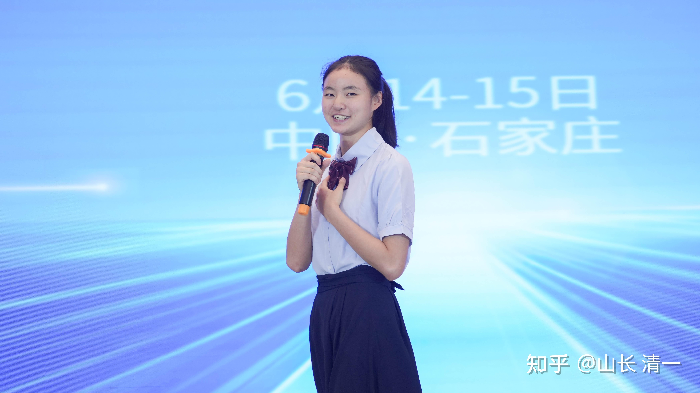
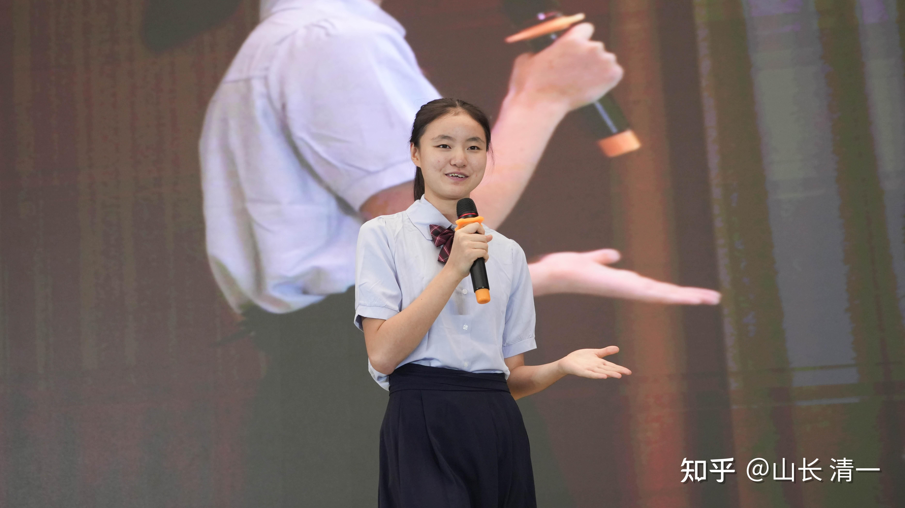
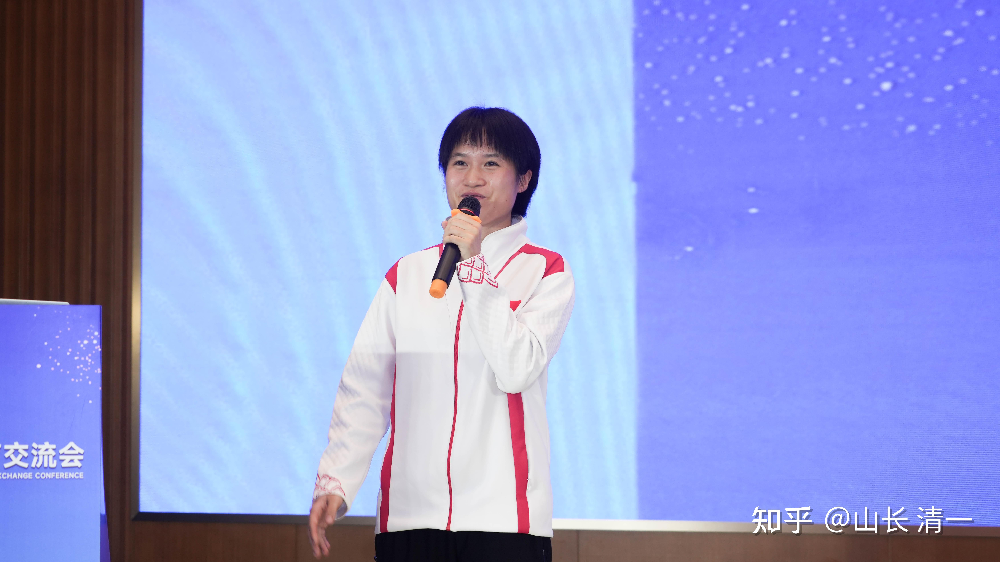
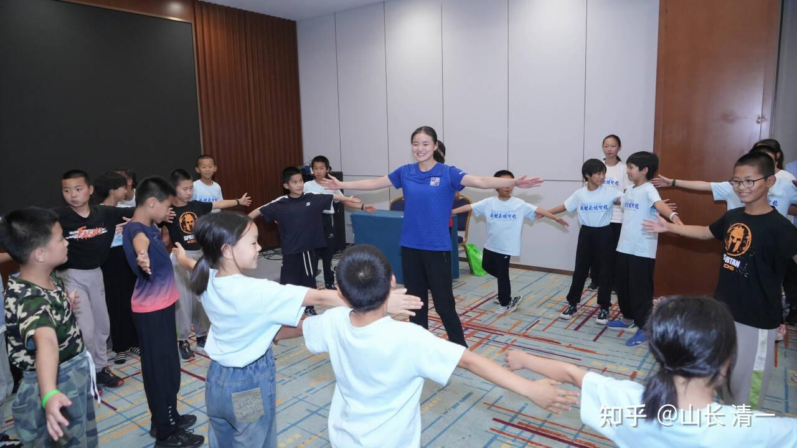
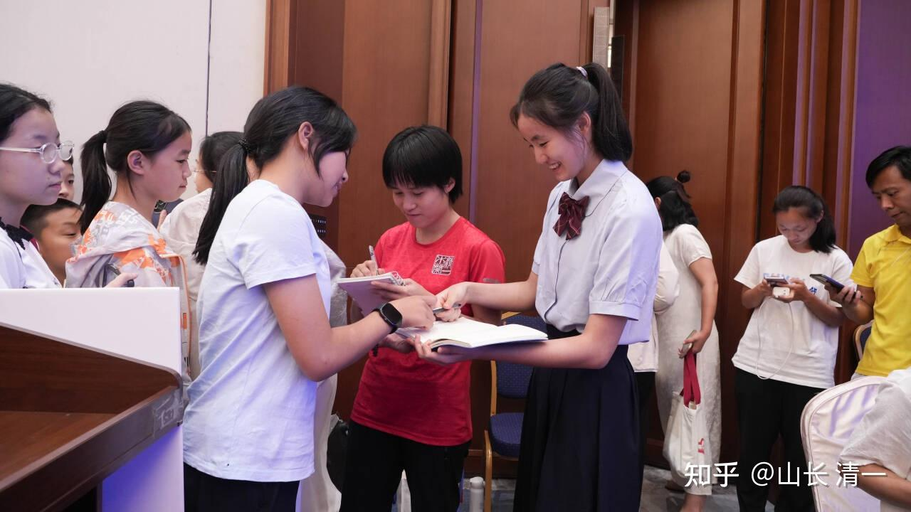
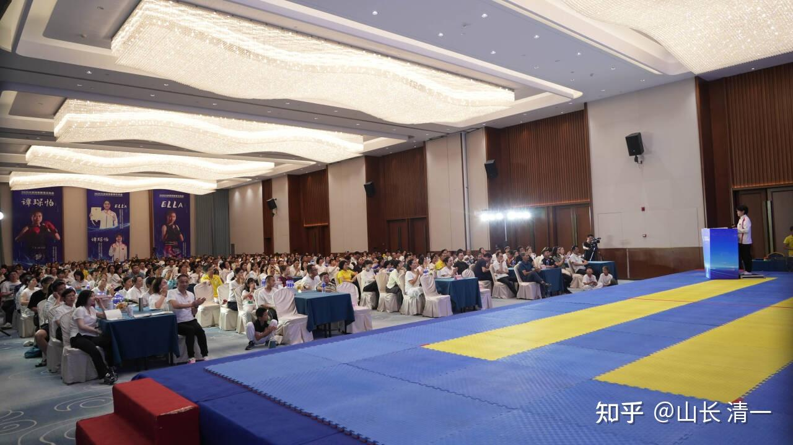
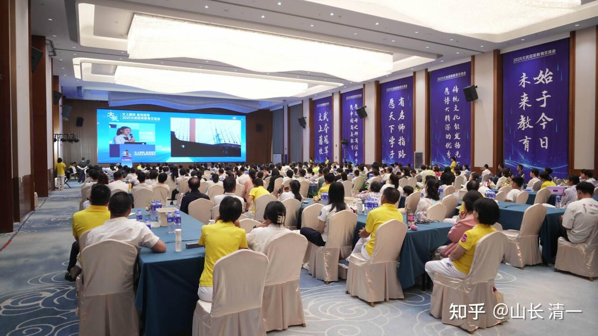

清一新教育 今日学堂 张清一原创文章

现场报道：【文上藤校，武夺冠军】石家庄分享会圆满闭幕！

本次分享会共吸引了京津冀及周边省份共计400余人参加，这其中既有清粉们的积极参与，也有相当一部分新接触新教育的“精英家庭”参加，尤其是EIIa公主和谭木兰的现场分享，系统的展现了新教育的教育成果—文武双全。我们希望通过本次分享会，将山长创办的清一新教育作为一份大礼，送给更多有精英教育需求的家庭！

感恩山长和新教育基金会的大力支持，感恩清粉们的积极参与，感恩所有参与本次分享会的所有义工老师们的付出！感恩朴心学堂和心一孰对本次分享会的支持和参与！

下面是现场的照片：**文武双全的学生，出来的气质就是不一样！**

*文武双全的气质，就是不一样！*

*谭木兰很文气 看上去也不像格斗女冠军的样子*

*亲切的公主姐姐*

*分享会现场*

[!\[image\](images/img_008.jpg)

还有现场的视频剪辑喔！ https://www.zhihu.com/video/1918322225620170097](http://link.zhihu.com/?target=https%3A//www.zhihu.com/video/1918322225620170097)

特别消息：继2024年的3500人新教育分享会之后，2025年，我就不在回国参与新教育分享会了！不过我答应了国内的新教育家长们，团长们，如果他们举办活动，我会派公主们友情参与！已经举办的两次活动，就是派出了ELLA公主和谭木兰两人，在刚刚结束成都世运会选拔赛之后，就去参与的现场分享活动！

如果各地的家长们错过了广西和石家庄分享会，你现在，还可以拥抱广州和其他地区的分享会！只有 有新教育家长推荐，您就可以现场来参加！

**6月21-22日，广州分享会将如期举行！**

**广州，深圳，一向是我们的基本盘。改革开放的风气最浓厚，因此也最容易接受新事物。**

因此，钱校长也首次接受了广州分享会的邀请，主要是磨丁付总的影响力太大，希望给予广州分享会更特别的礼物！因此，钱校长很难拒绝付总的邀请！钱校长这是她首次出山参与这样的活动，就来到了广州！

钱校长来广州的时候，还要带一个她原来在今日的学生，现在的公主班成员一起去！这个小公主说：钱校长是她在今日上学期间，她最喜欢，最尊重的老师！相信这个神秘小公主，会给参与会带来一些有益的思考！

很抱歉，ELLA公主在石家庄分享完之后，就不再去其他地方分享了。因为她还要专心练功，准备参加2025年的东亚锦标赛！以及全国锦标赛！公主班的学生，计划是轮流出外。参与各地的分享会！只要分享会的主办方，能够组织安排200人以上的会议，公主班就愿意零出场费都不拿，飞来参与分享会，付出自己的爱心！

目前分享会的规模，基本上都在400以上，远远超过邀请公主们出场的底线。现在公主们有点忙不过来。但说过的话，肯定要兑现的。我在想：明年是不是派出公主参与义工的条件，要调高到400人了！

毕竟：这是助力外围学堂的公益教育推广活动，公主们积极参与是应该的！