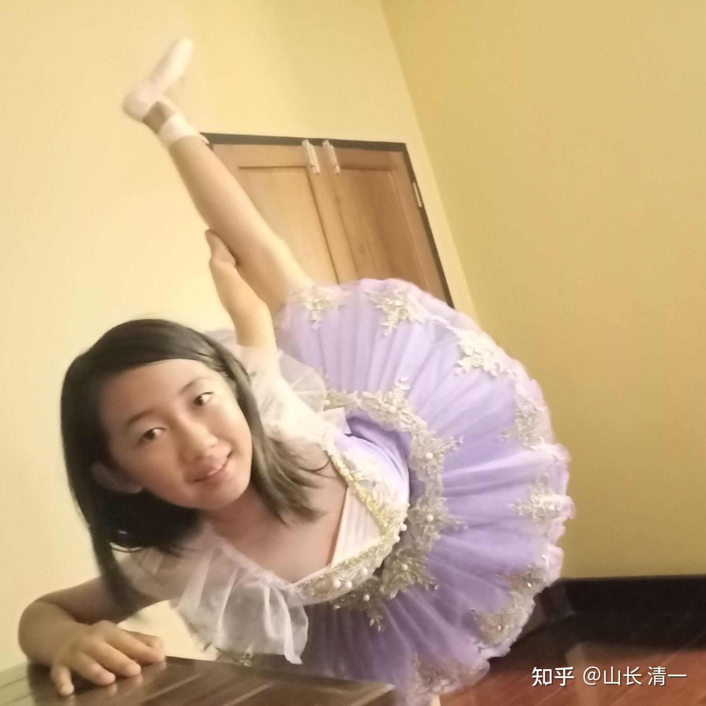
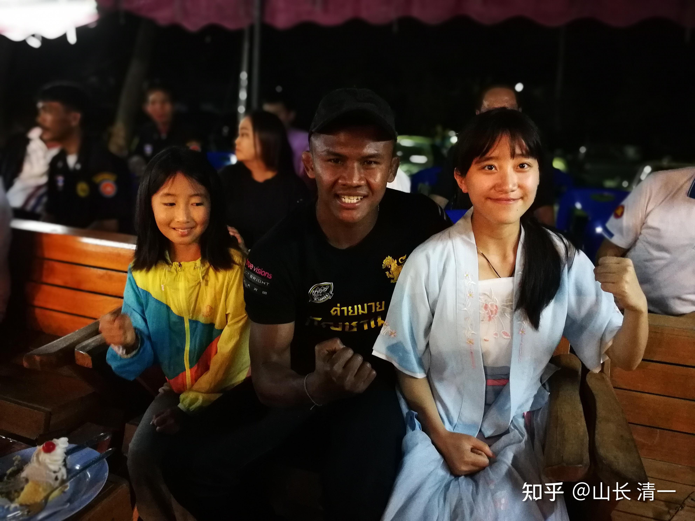
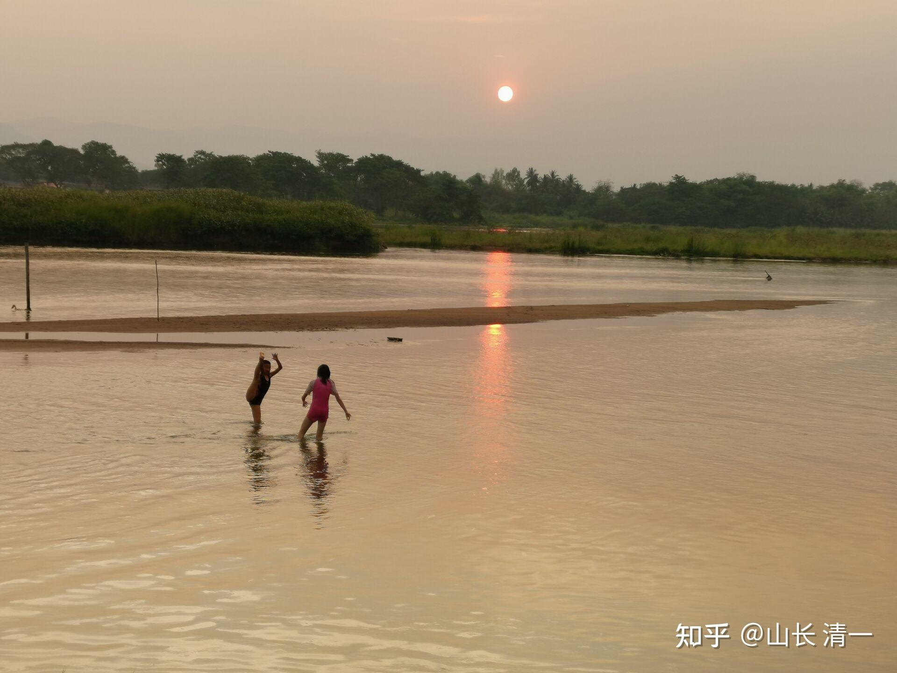
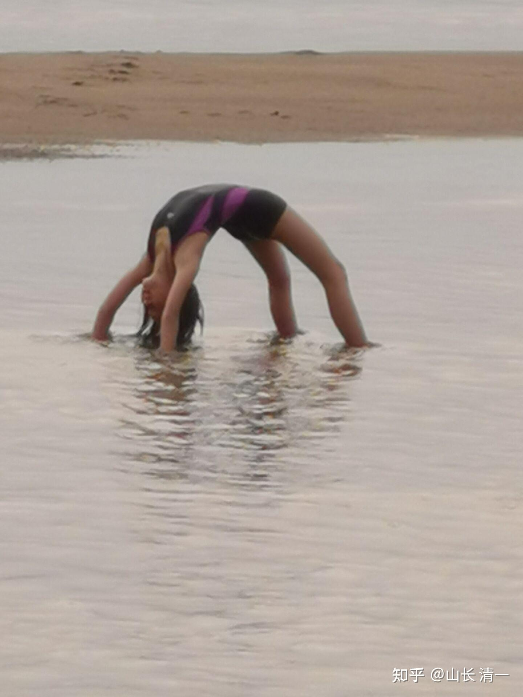
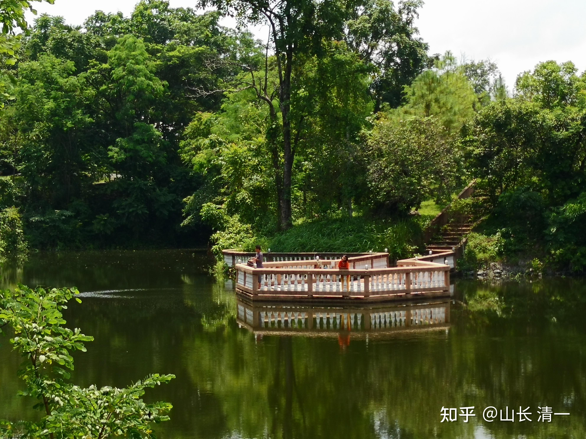
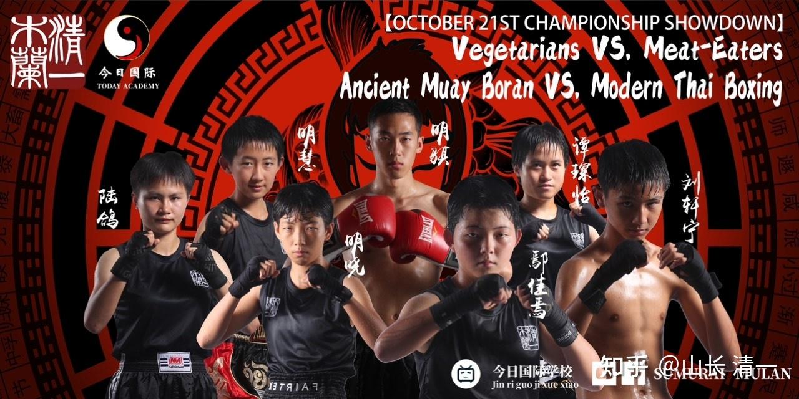
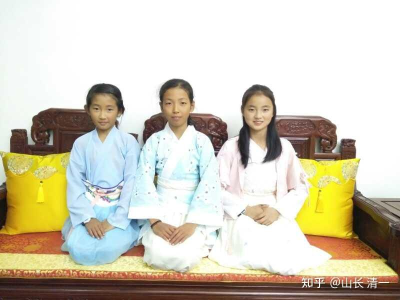

清一新教育 今日学堂 张清一原创文章

我在8-9年前，带9岁的明慧来到泰国生活！我在当年的文章中说了理由：

【**因为我从小就教她善良，正直，无私，付出，还有诚实。留在中国，她拥有的这些品质，可能会让她被人嘲笑和羞辱，会生活得很压抑，很劳累。】**

[这个民族会怎样对待自己的功臣？](https://zhuanlan.zhihu.com/p/1919099567015716390)

** 小明慧在3岁半的时候上明珠班，现在唯一跟下来的同学是明晓。目前是几个木兰中战绩最好的拳手！已经在争夺世界冠军的道路上了！**

** 明慧9岁的时候来泰国，上我的“家庭学校”，才开始学中文。被我用打板子的中式教学法，短短半年就突破了中文字词认识，和拥有良好的中文阅读能力。不输给同龄人，还有更准确的词汇和句子的理解力和掌控力！在她当过小助教的学员中，对她的这个特点印象深刻！**

** 14-15岁的时候，为她开办的公主班才来到清迈！之前被疫情隔绝在国内！她才开始融入班级生活！之前就是家庭学校模式，自由度很高！**

*明慧少见的公主裙照：清迈练瑜伽*

*当年明慧在清迈Papai，庆典拳赛中，跟播求合影！*

*明慧和ELLA的快乐私塾生活：清迈ping河*

*明慧在清迈的私人花园里面喂鱼*

教育其实没有家长想象的这样沉重。像上面这样，自自然然的，孩子就长大了！

刘老师经常说：都不知道我到底教了孩子啥东西。孩子不上学，都怕她好无知！

不过现在来看，似乎并没有跟公主班的学霸同学拉开距离！她基本上是中等偏上的水准。谈不上优秀，但也绝对不差！

*明慧首战海报*

明慧的泰拳首战，选了一个泰国的男拳手来挑战！虽然也是新手，但明慧显然还打不赢，不过也打满了三局，最终输掉比赛！我猜：这次比赛，对她的刺激应该很大。回来后，她更加强化了练习！

与其他公主相比，往往首战就KO对手，明慧的战绩实在不够好！不过---她创造了她自己的记录！

后来公主班第二个与男拳手打实战的公主是ELLA，场上鼻子受伤流血，TKO提前结束比赛！

不管输赢，她们都在努力的挑战自己！超越自己。

*2018年的文弱小公主[10岁明慧，13岁明晓和12岁ELLA】今天都是全国格斗冠亚军了*

今天一早，钱校长带小明慧一起去广州参加新教育分享会！这是她在今日上学的时代，最喜欢的老师。

我当司机，开车送她们去机场！

走之前，我突然发现：她的公主班小伙伴们，居然都一起来送她！显然姐妹情深！

**我有意逗她们说：你们来送谁呀?是送钱校长，还是送明慧？**

**小公主们才不上当呢，说：都送！**

路上钱校长感叹说：这群小公主，彼此之间非常的友爱，与原来的明一班非常不一样！

我说：班级就是这样，往往一颗老鼠屎，就坏了一锅汤！

一个班级里面，只要有一个喜欢背后玩心机，搅是非的人，整个班级都会不安宁。就培养不出来这种友爱，淳朴的班风来了！

ELLA作为班长，善良正直是她的特点！虽然有点傻！ 班级每个人都在积极向上的成长自己，没有人去说八卦，攀比，去争夺名誉和权力！因此班级就是“其民淳淳”的样子，大家都傻傻的，但是彼此很有爱！可能也有一些“老鼠屎”出现。但由于班级一直严格选拔，严格训练和淘汰制度，使得投机取巧的人，就无法留下来！

这是我花了20年才培养出来的，唯一一个这样水平的班级！所以小女很喜欢她们的班级，经常会把我们两个老的都“忘掉”！就算都住在庄园里，几天见不到她也正常！

我们去机场的路上，路过一个小市场！明慧就下车，去买她和钱老师的“中饭”。因为时间点来不及吃中餐。钱老师跟她一起去市场里面逛逛！钱老师上车后跟我说：这个市场的老板，看到明慧都很高兴！对明慧都特别友好，都问她这两年都没见到她，去哪里去了？（公主班来泰国后，明慧就离开此地去公主基地训练了）。还要送食物给她！泰国人真是好热情。小明慧似乎跟她们都很熟悉一样！

我告诉钱校长：知道明慧咋这么熟悉这些泰国市场老板吗？因为三年多前，Ella和明慧早上没有按时去锻炼身体，被我赶出去流浪去了，一天之内都不许回家。两人身上分文也无。

她们两个就自己走来这里，给市场的老板打工，换饭吃！下午还去一个庙里玩去了！晚上到了限定的时间，才回家！她们说：如果不是被惩罚，这一天其实她们过得非常的充实和快乐！就是有点丢人！

从此之后，两人都知道：早上运动锻炼是铁打的规矩，绝对不能偷懒！

这里小市场的老板，都特别喜欢她们！后来生意忙的时候，还请她们去帮过忙，直到公主班来后设撤离梅州！

这一天之后，我就知道：14岁的小女，已经可以独立在社会上生活了！我可以无忧了！

所以，我后来就改变了专断和训练师的模式！开始讨好女儿了！

原来我一直用“没本事我就要18岁赶你出去，自生自灭”来威胁小明慧。特别冷酷无情。

现在我会说：“明慧你真棒，18岁以后，能不能留下来陪爸爸？”。

弄得小明慧有点不太适应！哈哈！

我的私教成果到底是怎样的？我的培养目标是怎样的？

我今天就把小女送回国，给大家看看我的教育结果！

小女回国分享的主题，就是【富二代的家族传承】问题！她的身份，与她分享的主题是基本符合的！也许会对一些面临同样问题的家庭有帮助！

如果你喜欢，就跟随！就模仿！

如果你不喜欢，就离开！都没问题的。我们自己诚实地分享自己的做法。

由于国内一些少数人，对我和我的家人都有深深的恶意！不知道她们会做一些啥事出来了！

所以此时小女首度回国，参与广州教育分享会的事情，对外一直保密！不公开。

现在她已经到达广州会场附近了！明天，她就会出现在大家面前！

也许她是一个教育失败的榜样！被我PUA的重点人物！你们多观察。

因为小女一直坚持认为：我是一个坏爸爸！

我从小就会把她关在门外不许回来，如果她哭的话！

我会打她的屁股，会罚她，严格要求她，如果她偷懒的话！

我还会故意设很多坑让她跳！让她进退失据，气得大叫“坏死了的爸爸”！

每次跟人比武，获得一点成就感，回来找我磕手，碰头，撞腿，都只能抱恨而去！

学了成功的擒拿技术，赢了别人。拿来对付我，每次都被反擒拿！

她一直生活在我的阴影和压力中，会不会很可怜?很压抑？

如果你们觉得她的生活太苦了，她太不容易了。你们就去解放她吧！

告诉她有权力去追求自己的幸福和快乐！没必要绑在我这老朽的战车上，“为新教育奋战”！

告诉她去选择一条更美好的道路。

祝福大家，你们都有选择自己道路的权利！

大家都可以多看看精彩的世界。也许会发现自己生活的地方才是鸡笼！

我也一样：我家的小道姑，我放她下山了。

让她去看看精彩的世界！去对比一下自己的生活！去发现自己生活的奥秘和目标！