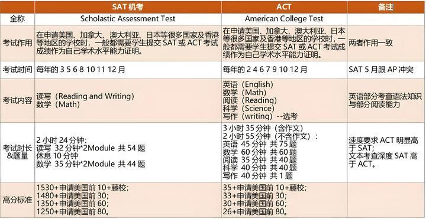

清一新教育今日学堂 清一武道 张清一原创文章

昨晚，今日塾赵刚校长内部家长群公布的本届SAT首考成绩消息！已经创造了新的历史记录。8月份没有通过1500分的学生们，还将再考一次。最终确认9月份实际用于申请冠军班入学的成绩！肯定还会刷新更新的记录！

为击败今日塾而生的对手无名塾，他们的校长刘静慧，对今日塾取得的成绩表示祝贺！她们的首届学生今年也毕业了，也创造了自己的无名塾记录！我这里转发一下两位校长的群内发言！

**赵刚校长：@全体成员 大家好！给大家汇报一个好消息：今日塾今年的SAT成绩再创新高！[表情]**

今年6月份的SAT官考成绩，今晚全部新鲜出炉了。目前今日塾已经有12个学生拿到了1500+的超高分，19个学生拿到了1450+的高分。加上本届去年仅用三年就已经提前考出了2个1500+（已在冠军班就读）。所以，我们2022级挑战班这一届，到6月份就已经有14个1500+的超高分成绩了（达到美国哈佛耶鲁等常春藤名校的录取成绩区间）。

对比去年创造惊人记录的示范班，今年今日塾的成绩再创新高。因为到去年6月份，示范班同期还只有4个1500+，到8月份是8个，所以本届截止今年6月份考到1500+的人数，已经是去年同期的3.5倍了。

非常感谢所有清粉们的支持，维护清粉家园的义举！

也感谢清黑们的反向激励，让我们全校师生都铆足了劲，誓要用最亮丽的成绩，来反击清黑们对我们教育水准的抹黑！

由于今晚才刚出分，所以具体表格和相关视频，还在紧张的制作之中，过两天就会放出来，敬请期待，谢谢大家 [表情][表情][表情]

**英雄无名塾校长静慧：向今日塾致敬**

无名塾作为今日的对手，衷心祝贺今日塾再次取得优异的成绩，再次刷新了今日的历史纪录！不愧是今日第一，风采依旧！

无名塾的首届学生，今年取得的成绩也出来了！相比今日就很惭愧了！目前我们只有一个学生超过了1500分，总共只有50%的学生，实现了超过1400分的成绩！相比今日，无名还有很大的提升空间！我们会继续努力的！

但考虑到我们这届的学生，都是来自于当初两校突破班考挑战班的失败者，是两校淘汰分流不要的学生。他们今天能够取得这个成绩，我依然为我的学生们骄傲！

另外，不是还有两个月，才是最后的总决战吗？

今日的学生，去年可以用这两个月就提升一百多分，从6月份的4人超越1500分，到8月份的8人超过1500分。我相信我们无名的学生，也能一样的在未来的两个月之后，取得比现在更加优异的成绩！

**中国人很多不知道SAT分数的含金量和成色如何？下面就有新东方的一个表格。说明了取得这些分数意味着什么！**

考到1500分，意味着该生已经击败了99%的考生！只有1%的考生能够取得这个成绩！

考到1400分，意味着该生已经击败了93%的考生，只有7%的考生能够取得这个成绩！

因此，今日塾和无名塾取得的这份成绩单，对于全世界任何一所国际学校来说，都是不可思议的结果！美国本土需要议员推荐才能入学的最顶尖的10所私立高中，虽然是全世界最好成绩的高中，但也无法让如此大批量的学生实现这个成绩！特别是让学生仅仅15岁，就通过了18岁才需要提供的SAT美国高考成绩！

** 因此，今日新教育，已经重新塑造了国际教育的标准。是中国人的骄傲！中国教育的骄傲！**

不过，有一说一：

**我们的学生，其实没有他们的成绩这么优秀。**

**也就是说：虽然学生们取得了1500分的成绩，这只是人生道路的万里长征走出了第一步！**

**但必须承认：我们的学生，本质上并不是1%的顶尖学生。**

**真正1%的顶尖学生，都拥有学习的自觉性，善于管理自己的学习和生活的目标！**

**真正1%的顶尖学生，是有没有老师都一样，甚至他会很讨厌绝大多数的老师。因为这些老师还比如他更会学习！因此，老师反而是他的学习障碍！只要给他一个学习的条件，她自己就能取得战胜99%学生的结果！**

**这才是真正的1%人才的样子！比如我，和我当年的大学同学，就是这样级别的人！**

**我们根本就瞧不起绝大多数的普通老师，不会老老实实的听课，甚至会逃学不去上课！但去考试照样能够获得很优秀的成绩！**

**他们的一生，几乎注定卓越！注定超越凡人！因为他们天生就最有目标，最善于学习，最善于思考。也最会管理自己的人！才能达到这个级别！**

但我们的学生，明显还不是这个等级的学生，实际上还差得远！

**如果看示范班的视频，跟随学习，自己自学能够考出来这个成绩的学生，肯定就是1%的优等生了！**

但是，今日三校的学生，只是在我们的三校教师团队的全力协助下，在我们教学方法的加持包装下，经过了四年的短期教育，勉强帮他们装得像是顶尖优等生一样！

无论是培养的时间周期，还是需要的磨炼程度，都远远不足以真正的证明，这批孩子真的就是1%的优胜者！

但他们的心理和行为，大多数本质上还是普通的学生！只需要一点点的考验，他们就会露出原形！

特别是15岁，还面临危险的青春期的考验。这是对没有人生目标的学生，进行的最大考验！

全世界只有3%的人，才自动拥有人生目标，其他人都是普通人！因此，没有目标的普通学生，特别容易在青春期就暴露问题，暴露自己只是一个平庸的妇人，一个平庸的男人。只配在社会上过一种普通的生活！不配当啥精英！

因此，15岁的他们，此时还非常的脆弱，很容易就会堕落下去。很容易再度成为普通人。以为这是他们的本色！

他们的发展路径，与自己和家长心理上觉得拿了一个成绩，就已经是“优等人”判断，将会落差巨大！

因此，这种本质上平庸的学生，一旦离开我们特意塑造，积极进取的新教育环境之后，很多人会重归平庸！成为普通人！

这才是家长们面临的最大考验！

为了解决重归平庸这个问题，清一教育提供了一条全世界全面创新的方式，用中国古代以武入道的“武道实修”的方法，用让学生锁定全国格斗冠军目标的方法，来为学生们15岁-18岁的成长期，树立一个明确的短期目标，构造一种有效的非常规的教育和训练的方式！对学生的基本素质，进行进一步的深度塑造！

毕竟过去四年的今日三校的新教育学习，学生们只是学习知识和应试，并没有对提高学生的心智模式的素质提高而学习！

因此，虽然15岁拿到这个成绩之后，学生已经可以直接去申请入读海外大学了，但我们认为：让没有经过进一步心性的稳定，磨炼的学生，直接进入自由和宽松的大学，这些自控力不足的学生，本质上平庸的学生，会很快回归自己普通人的本色，甚至成为失败学生！

** 因此：我为这些还远远不够真正内在优秀的学生，特别提供了全奖待遇，来清迈学习冠军班课程，让他们做好去世界上经历风雨的准备！**

也请今日三校的家长们和学生们，孩子在今日取得如此优异的成绩之时，不要骄傲自满！你们的考验还在后面呢！

也许离开今日，离开新教育的环境，去社会上打拼！没几年，你们就露了原型，发现你们只是普通人罢了！这会让你们深深的失落和沮丧！

此时，你们最好接受自己就是普通人，不要幻想自己的优越身份。更不要抱怨别人不给你们托举，这会让你们更深的堕入深渊！你们只是有几年的时候，装的像个上等人的样子罢了！骨子里面，并没有改变你们的本质！

希望未来，学生们在夺取冠军的路上，用三年的汗水和拼搏，真正的让你们成为1%的高手。而不是我们通过特别的教育手段，包装出来的高手！

**所以：未来三年的考验，才能更多的证明你们自己的成色！现在只是骗过了国际大学的招生官！**

**如果过去四年，你们只是用了一份优秀的成绩单，在老师的全力帮助下，假装你们是全世界同龄人的“顶尖高手”！**

**希望未来的三年，你们可以真正的用自己的拼搏，来证明自己是“顶尖高手”！能够真正的去战胜全世界的其他同龄的对手！**

**祝福大家！心想事成！**