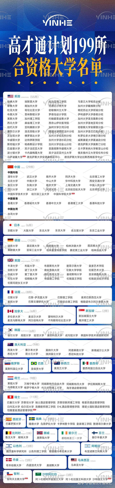

家长们热衷送孩子上大学，以为上了大学就充满了人生开挂成功的希望。

但就像是散户们进入股票市场的期待一样---以为只要买了股票就能发财！

金融市场上，每天拿出来报价的几千只股票里，真正值得购入，并长期持有的股票，可能还不到10%。

但散户不懂行，不去研究的话，以为买了股票就会发财，结果就随便乱买，看谁顺眼就买入。或者听信中介的吹嘘，各种小道消息，结果就导致最终90%的投资者都是亏损的结果。

大学也一样：全世界数万所大学，真正值得上的大学，可能只有10%，甚至只有1%。

怎样才能找到被社会认可的优质大学去上？这很考验家长的智商和能力。大多数家长实在没有能力去判断大学的好坏。

** 因此，传统的家长们规划的考大学，甚至海外留学之路，现在已经走不通了！不改不行。**

** 传统留学的路径是啥？就是一些孩子，成绩不好。国内的高考应付不了，大学肯定考不上，然后有钱的家长们就花钱，送孩子海外留学，混个文凭，再回国找工作。现在---这条路基本上走不通了！**

** 因为经济下行，国内的就业竞争白热化。大量的国内大学的学生，都找不到工作，起薪都很低！**

** 您的孩子，如果上海外大学，没有过硬的实力的话，回来想找工作，也一样难上加难。**

** 比如：现在的家长还在盯著常春藤，以为常春藤就是顶尖世界名校。**

** 其实---常春藤也在快速的衰落，不再是“顶尖大学”了。我敢承诺冠军班正式生100%考入常春藤，就是因为常春藤顶尖的几所大学依然亮眼。但从8所“核心常春藤”名校，到38所“大常春藤”名校，随著美国的衰落，大学含金量都大不如前了。招生要求也大大降低。**

** 即使是美国8所核心常春藤名校里面，居然有两所大学的排名，已经排到QS榜单的200名以外了，甚至还有一所大学的排名，低于泰国排名第一的朱拉隆功大学。38所大常春藤名校里面，就更有很多面临招生困难的大学，要进入这些大学有啥难度呢？**

** 居然有清黑说：SAT1500分的冠军班学生，考入常春藤大学的概率是零。只能说这种人对大学太无知，太无畏了！什么屁话都敢说。**

** 所以，现在的时代已经变了。家长们不要拿着老黄历来选大学，应该找到一份新的榜单来选大学了！如果绕过明显有智商税嫌疑的英美大学，选择最佳大学榜单上的小语种大学，性价比才是最高的！这些大学含金量一定高于英美的一般大学。**

** 如何测试大学的含金量呢？**

** 下来我就提供一份价值3000万港币的世界知名大学的文凭榜单给大家参考。**

** 大家知道，获得香港永居条件，是资产投资必须超过3000万元。但同时，香港也给了优秀人才免资产要求，拿文凭来抵3000万的条件，就是入读下面的199所大学，您的毕业文凭就相当于3000万元。可以直接申请香港永居。项目名称就是“高才通”**

** 有了这份榜单，家长就可以绕过大学中介的花言巧语，傻乎乎的把你的孩子，高价送入一些根本就不值得去读的大学了！**
** 因为海外的大学现在已经非常的市场化：为了赚钱到处的拉人头。甚至一些大学会给中介高额的回扣，中介们就把这些其实根本就没啥含金量的大学，包装成“名校”推荐给家长。特别是一些大学，本国生会有些要求，但国际生的标准特别低。因此更容易入读，读入后还特别放水，文科生更是突出。因此我一直呼吁“千万不要读文科”。**

** 希望新教育的家长们，认真从下面的榜单中，选出你心仪的名校。你的教育投资，成功之后起码相当于3000万元的价值，你就不亏了！凭借这个优质的文凭，在全世界找工作都很容易。去香港就业马上就值3000万。**

** 如果家长不懂行，去读个烂大学回来。不仅仅家长的大笔投资无归，可能连孩子都毁掉了。**

** 将来有人想上清一大学的研究生，就像英子同学的梦想一样。我们的入学要求，就是新教育的学生，拿了全国冠军，以及世界冠军的“文凭”来申请才有机会！你实在拿不到冠军，就只能去读世界名校了，然后拿一个199大学的毕业证来，我们给你免费入读的机会。其他大学的文凭就无效了！除非---**

** 因为清一大学，肯定是中华势力崛起之后的“世界名校”！入读要求当然不能低于上面的199大学了？就让这些大学作为我们清一大学的预科学院好了！**

