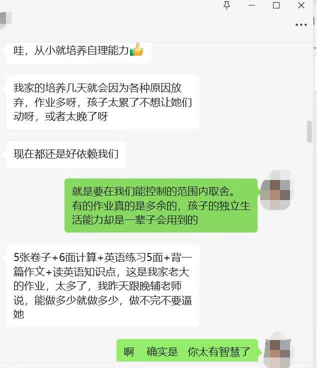

清一新教育 今日学堂 清一武道 张清一原创文章

**家长贴了一张小学三年级学生的家长对话，**以及吐槽对现在教育的不满！

聪明的家长，也摸索出了一套帮助孩子应付老师变态压力的方法！

你们觉得家长的办法怎样？

你们教的，对付老师胡乱布置的作业的方法，现在看很好！

但将来有一天，就会回到你们身上，让你们痛苦和无力以对：

**一：将来孩子长大后，就会学会这一套"阳奉阴违混日子"的态度。**就算将来你给他找到最好的教育，他也油盐不进了！他就会失去吸收力，成为一个老油子。啥东西都学不进去！而且，这还是妈妈教的----进入孩子的核心信念系统！

现在很多体制毕业的学生，就这种状态，新教育的一些非常好的东西。甚至教你赚钱的东西，他们就是学不会，

家长居然夸她：“太有智慧了”，这个结果，是你们期待的吗？

**第二：家长反对我的观点，说不干预孩子，配合老师，结果也不会好！我承认。**

如果家长老老实实的配合老师，逼孩子必须坚持按照老师的方法去做作业，去“学习各科知识”，这样做下去，就是培养出了一个没脑子的，只知道服从上级命令的好奴才，将来可以去做一个合格的打工仔！

但有可能，完全没有正常人的生活和自理的能力！

下面这个，就是配合成功的顶级结果的案例了

【 我身边就有这样一位闺蜜，清华毕业，年薪50万，但直到30岁才学会煮面。
“我以前觉得，只要学习好就够了，”她说，“直到去相亲，对方家长问我会不会做饭……”
我反怼：“点外卖不就行了？您儿子会做饭吗？”
对方妈妈说：“我儿子会做饭，我只是希望你俩互帮互助，都能吃健康食品而已……”
“不出意外，相亲黄了，现在也没人给我介绍对象了！”

作者：生涯规划师曌露

链接：

[“愿倒贴20万嫁妆，谁看上谁娶走！”重庆985美女大学生，被亲爹拍摄闺房吐槽，网友大跌眼镜：堪比猪圈啊？](https://zhuanlan.zhihu.com/p/1914947900242371071)

第三条路：其实，大多数孩子，不太会成为上面的顶级成功者！因为他们会反抗。小学三年级不会的，会服从老师，服从家长！

但初中以后，孩子基本上都会出问题！如果家长此时逼不成功，当不上上面案例中的“好奴才”，小孩子有点个性，他就是坚决的反抗老师和家长！

这样，你们就收获了【问题孩子】，也许是啥都不会干的废物！谁都不能用！家长自己养一辈子算了！也许是害虫，到处捣乱。给家长添麻烦的，你不得不跟著他收拾残局，累死自己！

我认为， 这个很有智慧的妈妈，将来她的孩子，未来就这只有这三条路！这三种可能！

你们去选吧，这三种可能，你要哪一种？

我哪一种都不要！最好的结果（上清华，拿高薪）给我都不要，

而且，我不相信我会得到第一种结果。我认为我的孩子，没有这么老实的！

所以，我让她在家玩，我们搞”在家教育“。

都这个时代了，上个大学已经太容易了！名牌大学也很容易去读的。国际上的名校太多了，能力正常的人都能去！

为了考大学，付出一点钱也就算了。

居然让孩子付出生命和健康，付出丧失正常思维的能力，就为了去追求一个大学文凭？

我还没疯到这么没有理智的！

你们呢？

大家别误会，我没有推荐你的孩子来上新教育！我没有商业目的！

如果是我的孩子，我会愿意送到下面这所ELLA弟弟的“学校”去！零学费的学校！

[探访内蒙古：一所隐藏在大山中的学堂——从小接近自然的孩子是怎样的？](https://zhuanlan.zhihu.com/p/1918963881801409082)

就是每天让孩子这样玩闹，学会做事，学会做人。读点中国的做人做事的道理，读读武侠小说，提高一点中文水平。金庸还是浙江的文学院院长呢！

然后小孩子10岁左右，我会教她开始学三语，几年后就成为三语达人了！（方法已经公开。不要钱）

然后15岁教她打冠军，成为文武双全的人！【你来读冠军班，也不要钱】

然后18岁，去找一所她喜欢的大学去上。我猜她不会喜欢清华的。也许她更愿意去清迈大学！【大概这会必须要钱了，因为你不够优秀，茶说的】

18岁以前，你可以一分钱都不花！只要你真心的做到位就够了！

你说，你不会做这些，不愿意这样去帮助你孩子？

既然--你不愿意自己学，自己做，你肯定有更重要的事情要做！当然你就只能花钱，请人来帮你了。

因此。“钱多人美”的家长，才需要送孩子去新教育学堂上学！

聪明人，根本不需要花钱送孩子去上学的！自己做就行！

比如我就自己干！你们干嘛不自己干？

你说你不够聪明，你创造不出来。跟著学还不会吗？没有道理了吧！

至于其他有钱人， 不想费这个脑子，不想这么辛苦带娃的，也不想学习的，想省心省力，花钱找仆人帮忙的，当然你们就自己就出钱搞定了！

但没多少钱的人，就别学这些富人买名包，名校啥的，不是大款，去买啥精英教育！

自己去做新教育去！

上面内蒙的学校， 多简单，不花钱，还省钱

**不过说回来小女-----她的确不肯去上清华大学。**

**我也不舍得送她去上清华！太累了。心累。不如去打冠军！**

**【别嘲笑我们酸葡萄，考不上。**她有香港永久居民身份，有海外长居的华侨身份。她要去上清华大学，真没有你们想象的这么难）。

小女连清迈大学都不想去！

她说只想上清一大学！读本科，读研究生，还想上博士。

好吧，反正是【清字系列大学】。马马虎虎，都差不多吧！想去哪都行！