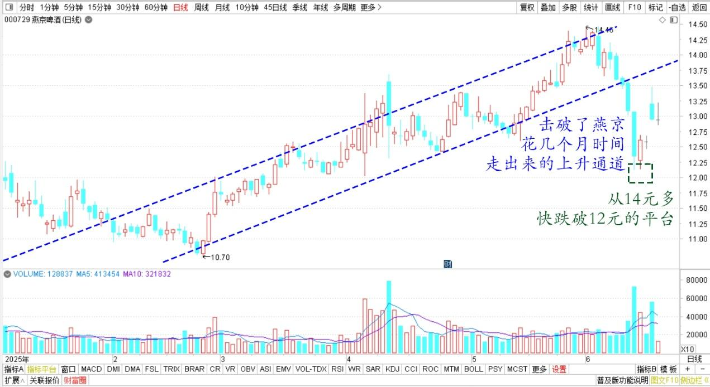
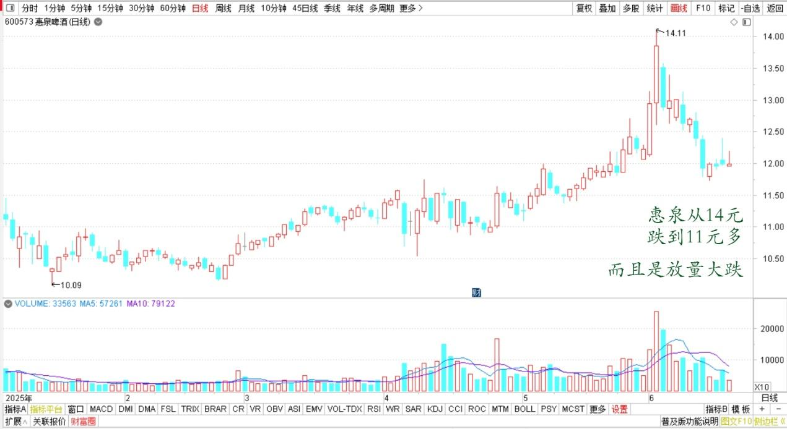
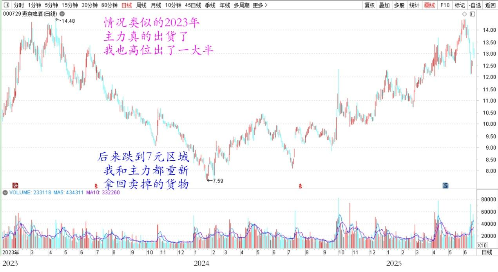
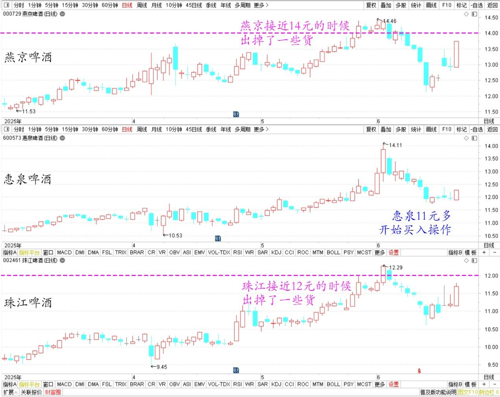
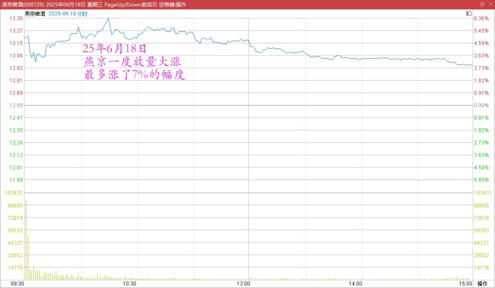

158篇.涨了卖，不指望更高。跌了买，不指望更低！

清一山长[2025年6月18日15:41](https://www.zhihu.com/pin/1918694818793621470)

好久没有看啤酒了！四五天前，燕京等啤酒股大跌，击破了燕京花费几个月时间走出来的上升通道。从14元多，都快跌破12元的平台！很像是破位下跌的出货走势！

燕京啤酒2025年日线图

这段时间，啤酒主要的股票都在跌，我的账户市值损失也很大（假损失，不卖就没有亏）。惠泉也跌疯了，从14元多，跌到了11元多，而且是放量大跌！主力的筹码砸出来了！图形全走坏了！

惠泉啤酒2025年日线图

如果只是看图形的话，最近的图形就是主力出货走势！量价都配合说明了这一点！主力也的确大量卖出了部分持仓！不全是小散户折腾的！

假如现在的价位再高一些，我都会判断主力开启出货模式了！

不过现在我认为：现价范围内，主力出货的可能性不大，调整洗盘的可能更大。看唐大佬都根本不动，14元有啥好动的！18元可能还差不多！

因为现在这样子出货，主力没赚啥钱（当然，也不能这样说，情况跟现在类似的两年前，主力就是真的出货了，我也高位真的出了一大半。后来跌到了7元区域，我和主力都重新拿回卖掉的货物）。

燕京啤酒2023～2025年日线图

现在历史会重演吗？

我觉得不会！因为现在主力控盘更好，犯不着像两年前一样大洗盘！

所以，我昨日，已经在惠泉11元多不到12元的时候，开始买入操作！但我并未增仓，只是珠江卖出后的股份置换惠泉罢了！差价最低的时候只有4～5毛多，多的时候也只有8毛多。我认为是划算的！（燕京接近14元的时候，珠江接近12元的时候，我都出掉了一些货色，没有补回来的。现在执行补回操作，只是品种换了跌得更惨的惠泉）。

燕京啤酒、惠泉啤酒、珠江啤酒2025年3月～5月日线图

今天燕京一度放量大涨，最多涨了7%的幅度。一举收回了下降通道！可以说：燕京的主力已经控盘。想涨就涨，想跌就跌！我们已经无法判断燕京的主力趋势了！但未来我认为是上涨的趋势，不是下跌的趋势！

燕京啤酒2025年6月18日分时图

看不懂，只能认命！涨了就卖，跌了就买！**如果涨了你就卖，卖了就涨，你也只能服气，认输，出场。相反，跌了就买，买了还跌，你也只能认输。因此，我现在就老老实实地做事！涨了卖，不指望更高；跌了买，不指望更低！**

月底各位会看到我持仓变化趋势的。珠江会少量降低仓位，燕京已经退出十大！惠泉有继续加仓！

总体来说，啤酒股总量依然没有减少！品种错配。**未来我的账户主要靠吃股息过日子，没指望大涨！**

我变保守了！不再有进取心！

这样下去，我最终就会离开市场的，因为我操作也越来越少！

总不能出来就是公布一下：今年收到多少股息吧？

（标题、图片为编者所加）

**文章音频**：

[571篇. 涨了卖，不指望更高。跌了买，不指望更低！](http://link.zhihu.com/?target=https%3A//www.ximalaya.com/sound/874494497)

**参考链接：**

[152篇.核心股票连续几年不动核心仓位](https://zhuanlan.zhihu.com/p/1910794327875117332)

[153篇.《白虎》电影——真实世界的版本](https://zhuanlan.zhihu.com/p/1912809201383764112)

[154篇.上杠杆是亏损的主要原因](https://zhuanlan.zhihu.com/p/1912539537479041762)

[155篇.啤酒现在是【持仓】的时候，不是【买入】的时候](https://zhuanlan.zhihu.com/p/1915259005334446766)

[156篇.惠泉连续大涨，后续如何应对？](https://zhuanlan.zhihu.com/p/1916068397814358602)

[157篇.“不要股，只要价”看住自己的人品](https://zhuanlan.zhihu.com/p/1917575063177258074)

