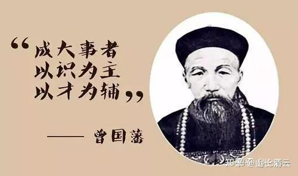

清一新教育 今日学堂 清一武道 张清一原创文章

最近，**两个过去家长的事情，两三年前的不同选择。现在结出了结果！一个喜悦，一个是悲伤！**

都是十几岁的孩子

一个的生命正在绽放，前程一片光明！家长喜悦幸福！

一个的生命正在枯萎，几乎无法挽救！家长愁云惨淡！

**完全相反的结果，三年不到，就果报现前，让我非常的感叹！**

这两个家庭的经济条件都非常好，算是中上层家庭了！但两者的走向完全相反！就因为双方的家长“见识”不一样！

虽然这两个家庭，都得到了来到今日的机会，也受到了相反力量的干扰。但最终的结果，却完全的相反。核心原因，就是家长的“见识”不一样！对我们的尊重和信任不一样。最终，懂得尊重和感恩的家庭，得到了美好的回报！

这个家庭的孩子，今年15岁首次参加SAT考试，就考出了1510分的高分！正在冲刺8月份的再一次考试！有望刷新自己的记录，去读常春藤！

另外一个孩子，现在已经躺平在家里面，要死要活的。家长到处找心理医生看。 家长的事业也陷入了危机！

获得了喜悦结果的家长，三年前却闯了大祸，给我们惹了很大的麻烦！

原因是孩子的外公，是体制内的一个退休的官员。他特别的保守，认为孩子怎么能去云南上一个不正规的烂学校，深圳这么好的公立学校居然不肯去！一定是被传销洗了脑。孩子的父母一定脑子出了问题，被骗了！因此他一直是竭力反对的！

但孩子和父母都喜欢今日，就瞒住老人，跑来云南上学了。

但这老人也不是省油的灯，居然借给孩子邮寄东西的机会，摸清了地址。就偷偷的跑到云南来，直接去当地教育局举报我们“非法办学”，欺骗学生啥的。对我们实施了“精准打击”！

因为我们的确没有义务教育阶段的办学资格，只能办职业高中。这次举报，也给我们学校留下了严重的“后遗症”，加上后来小妖的闹腾举报，一年后我们就被迫离开云南，出国到磨丁了！

当时家长非常的抱歉， 亲自跑来云南，跟当地的教育局和官方解释，是家庭矛盾。孩子送来是学习武术培训的，因为不太适应应试教育。不过：官方的立场也很鲜明：家庭有矛盾，肯定不能留下来上学。就让家长把孩子带回去了！

但孩子的父母和孩子本人，都很喜欢新教育，被迫回去之后，孩子也不理外公，也不去体制上学。每天就在家里跟随示范班的内容，继续学习新教育！外公看这情况也管不了。后来我们出国去了磨丁，家长又把孩子送回来了。因为在家里跟随学习，孩子的功课并没有落下。

终于，现在是事情发生的第三年，孩子取得了1510分的好成绩。而且其他方面的收获也很多，与家长反馈的周围孩子80%的失败相比，家长觉得他们家太幸运了！**【唯一不幸运的是外公，他跑来举报我们之后，两年内就突然死去了，我也没有想到】**

第二个家长，结果就悲惨了！我都不敢想象的悲惨。孩子和家庭事业，都在崩溃中！

三年前，因为家长的关系，我给了他们家一个跟随公主班一起学习的机会！按道理。我这是把我送给女儿的机会送给他们家了。绝对是大礼，我打造了20年，花了数千万，才打造出来的礼物。

因为家长是老板，我认为他们家的本质需要，跟我们家也差不多！我给我女儿的最好的礼物，也可以送给她分享！而且---他只需要出正常的学费（几乎是送礼物了）

这个条件，其实比我给上面的深圳家庭的条件（只能上突破班）还好得多！因为公主班其实不开放入学，现在这批公主，都是我特别选拔出来的两校学霸！如果要考的话，这个家长的孩子，是根本不可能考取的！

但这个家长的孩子，应该是被家里宠坏了！来了之后，就说公主们也没啥了不起的，这不好，哪不好的！非常的傲慢，也不合群！

家长也跑来，希望我们的公主们“主动跟她女儿搞好关系”。我也让公主们优雅一点，主动帮助他们家孩子融入。另外这孩子还很懒，不爱运动。我也让公主们不去要求她！让她放水！

可这家长还是不满意，他两年前，跑来清迈，找我要“解决核心需求问题”。我当他是朋友，跟他聊了一下午，慢慢的跟他耐心的沟通！（现在回过头来，我想应该收他的咨询费。没给钱，浪费我时间不说，他也不珍惜，当我说话放屁）

家长直接质问我（虽然语言温和。说是请教，但基本上就是质问了）

山长你要让你女儿去读四个大学。我也想让我女儿去读四个大学。这不过分吧？

我大惊：这也要比？比这，有啥意思呀？

我说：我女儿三岁多就开始了全英文教育。现在她的中英泰三语都很好！四个大学的安排，就是

第一：让她去清迈大学读个泰语专业，一年读完毕业没啥难度吧？

第二：她是香港身份，去读个内地985大学的英语专业，或者小语种专业，不会费脑子吧？一年学完也没啥难度吧？

第三：西方大学常春藤啥的不敢说。以她的成绩，加上运动员身份，她去一个QS前100的大学，随便读个水专业文科，不会太费劲吧？

第四个大学，去日本，或者老挝，或者其他她将来想要去工作和发展的国家，去上个大学，这个也不费力吧？

我还说：**小女去上这些大学，根本就没指望去学啥东西！这些东西她早就学会了！她去上学，就是去交朋友的，结交人脉！我一直训练小女的社交能力，让她成为受欢迎的人！至于读一年就走，大学给不给毕业证我也不在乎的。只要让她能为家族交朋友就够了！**

**【说明：明年年底，小女就18岁了，但她表示不愿意去上四个大学。她想打世界冠军。好吧，也许这比上10个大学都更能发展国际人脉】**

你们家的女儿，学业上，除了中文，其他语言都不会！基础上完全的不匹配！另外她个性上，也不会主动去交朋友，只会等待别人来“服务她”。她去上四个大学干什么？想学啥本事？

这个老板家长听了，也觉得自己孩子，去上四个大学非常的不靠谱！

但他依然不放弃：就说---我们家孩子，就上一个大学，总成了吧？

我说：要上大学很容易，特别是海外大学。关键是家长想让孩子上什么级别的大学！

我心想：泰国前三的大学，雅思6.0就可以上了！一点也没难度，想上就上呀？

结果家长说：**他们家孩子，要上【新加坡国立大学】！**

我吓死了。他这一个大学，比我女儿的四个大学难度级别都高得多！这家长，不知道哪来的自信，认为他的学渣女儿，要比我的学霸女儿更牛！更值得期待！

我很绝望的对这老板家长说：这个大学，排名世界前10，比清华北大都高！我们公主班的孩子，想去上都完全没有把握的！而且这也不是公主班孩子的目标大学！难度太高，卷的很厉害的！

如果你们家长的教育目标，就是要上这个大学的话，就不能在公主班跟随学习了！

**目前的示范班，目标是冲击常春藤。这个班最优秀的学生，应该是可以去冲刺新加坡国立的！**

我问家长：如果这样，他们家就应该离开公主班！他如果要让孩子转学去示范班，我可以帮助她插班！但我不能确定她一定能够跟上示范班的班级进度。而且：这个班，也不能保障每个人都能考取常春藤！更别提新加坡国立了。比常春藤难度都高多了！

家长开始清醒一点了。就说：**我们孩子虽然和示范班年龄差不多，但肯定跟不上示范班的！【原来你也知道呀，光给我出难题？送来我身边教，我就要保证你们女儿读【新加坡国立】？】**

我说：你们家孩子，功课跟不上，就可以选择去下一个年级跟学！甚至去下个刚刚入学的新班，总行了吧？

家长说考虑一下！
没过多久，家长来把孩子接走了！也没去示范班，挑战班。据说家长认为今日的学生，要应试的几个班级，压力山大。他不舍得女儿吃苦！家长就送孩子去了一个外围学堂，但似乎也跟不上进度，没多久，就又去了什么别的学堂，我也不知道！

我估计，家长不去今日的原因，是怕孩子跟比自己孩子小的同学一起学，还跟不上，丢人。所以才去外围学堂到处找“合适”的学校！

两三年过去了，最近我听说，这孩子在家里“躺平”了！也不去上学了！各种的幺蛾子！家长要请心理医生来给孩子辅导心理了！

最最近的消息，这家长去给清黑帮共振去了！他还去WC的文章下点赞！有人告诉我这个消息。

也许，家长想送孩子去WC的学堂，感受爱和自由？太乙真人的爱，可以疗愈这孩子的心理创伤？

这个孩子的问题，当初要让我来处理的话，其实有很简单的方式：但家长不尊重我，我也没办法教他！

**第一就是：严肃地告诉孩子，别整天挑挑剔剔的。这是我目前能够为你找到的最好的学堂，你要么在这里老老实实的跟随学习，要不就滚蛋，离开这里，自生自灭去！老子家里不养废物！你如果表现不好，被学校开除了，也别回家了！**

**就自己流浪去。死了算了。我宁肯你死，也不愿意你堕落！**

您觉得：这孩子会不会就此改变，开始学好？

她今天摆烂，就是你允许和支持她摆烂的呀？

你认为我这招，太无情了！不像父母。我们应该温情一点！

好吧，我给你一个温情的版本！

第二方案：【皇子伴读模式】怎么样？

我们特别安排一个教师住的双人间给你的孩子住。

我们特别选一个人际关系特别好的公主，给你女儿做“闺蜜”！这个公主必须最善于沟通交流，心理辅导的公主，来专门的24小时陪同你的女儿，陪吃陪住陪玩！陪聊。带她一起看电影，一起运动，一起散步！慢慢引导她一起学习。

她不是青春期来了吗？我们就选一个英俊潇洒的冠军哥哥，一对一的来给她专门的上课，当她的私教老师。想学啥都教她。跟她一起学习。讨论，交流！

我们还选一群优秀的学生，在一起共同学习，制造良好的伙伴氛围！

这样花上三五年时候陪伴，她应该也可以出来的。也许还是考不上新加坡国立，但上个一流的大学，应该还是没问题的。拥有健康的心理和人格，也还是可以的！

这个，算是高配的“太乙真人”的教学条件了吗？

只是，您家长想要享受这个【皇子伴读】优越教育服务，您该支付多少学费？

**方案二：就是复杂精致，大家都费力费心！**

**这方案，太有为了。就算成功了，也很不容易。不过能够保住底线，不会太低！**

**方案一，就是简单有效，但讨人嫌！无无为而无不为！**

** 上限是顶尖精英，上国立。下限也较低，摆烂的话，只能去死了！**

让你们家长来选，你选啥呢？

我选一！简单，有效，不累！

附录：我跟家长的私人对话！

家长: 06-21 10:00:40

山长好，小女在今日塾挑战班，刚刚的SAT考试，考了1510分。

小女由体制内一个有点自卑的小孩，现在变得自律，阳光，积极，还立志要考上常青藤大学。

小女的快速成长，全靠今日塾老师的用心、耐心培养，还有山长不计前嫌，给了她重回今日的机会。

今年挑战班在赵导的带领下，成绩远超上年，家长和孩子们都非常鼓舞！新教育不但在授业，更多的是育人。孩子这几年在学校培养了积极正面的精神品质，改掉了很多坏毛病，这是她一辈子都能受用的。不但培养了孩子，还成就了家庭，我们一家三口现在都热爱学习，愿意思考，孩子跟我们的关系非常好，每周通话从读书，做人到时政，总有聊不完的话题。

无尽感恩山长、刘老师、赵导和今日的所有老师！

愿山长、刘老师、今日塾、无名塾的老师们身体健康，工作顺利！愿新教育惠及更多的家庭，愿真教育如星星之火在中国大地上燎原！

山长 清一: 06-21 10:39:16

恭喜你们家庭：孩子的外公现在怎么样了？ 孩子取得这个成绩，非常的不容易。核心是她的坚持和努力，不受外公的干扰。也是你们家长的支持和信任。缺了这些要素，今天也不可能取得如此优秀的成绩和结果！恭喜你们。孩子出来了，我们都很高兴！不知道她还想再去冲刺一下8月份的考试？我认为有必要再去增加一点成绩。她的梦校常春藤，需要1530以上，最好是1550，才有更大的把握！[抱拳]

家长: 06-21 11:34:53

感谢山长的指导，小女也有意再考，我们也全力支持她。

但我个人觉得常青藤大学只是名气大而已，无非传授一些知识，山长的价值观塑造和思维逻辑的培养，才是人生命成长最需要根本性的东西。所以她能在您身边学习才是我们家最大的幸运！

至于我父亲，已经在上年过世了。之前虽然他强烈反对，但孩子还是坚持在家学习，不愿回体制，他没办法，干脆就不管了（他在老家住，所以也没法干扰孩子）。

山长 清一: 06-21 11:38:56

你们家族的身份地位，还是应该去读常春藤的。反正你们家也不缺这个学费，出去混个漂亮的人生资历，出外多长长见识，也不差的！[抱拳]，真喜欢新教育，大学毕业以后来上清一大学研究生！[玫瑰]

家长: 06-21 11:40:49

收到，那我们跟孩子全力以赴！

山长 清一: 06-21 11:41:35

【至于我父亲，已经在上年过世了】-----这老头可真倔[发呆]。。。。也许他就是不愿意看到今天孩子的美好结果，不能承认自己输了。所以宁愿提前死掉，也不肯接受他女儿的眼光真好，他外孙女的判断真没错！[呲牙][呲牙]

家长: 06-21 11:52:02

是的，我认为他之前去告状是折损自己的福报。

但是当时我们也没办法劝服他，这就是无明业力牵引。

还望山长原谅。

山长 清一: 06-21 12:39:26

我不会计较他的。只是觉得这老头很有意思[玫瑰]。 也庆幸你们没有受他的影响！他的“顽强奋斗”，最终也没有损害孩子的未来发展！反而让你们更珍惜了！如果当初你女儿真的回到体制，可能你们现在就很麻烦了！体制的青春期很难过，特别她经历过新教育，回去后对比强烈，心中有怨恨的话，这个时候就该爆发出来了！

家长: 06-21 12:59:02

我身边的同事朋友孩子在初中出问题的太多了，抑郁的，自闭的，跳楼的都有，跟家长闹矛盾的几乎百分八十。

像我们跟孩子关系这么好，几乎没有。

清黑常把目标对准学习成绩，这都是枝末而已。

一个好学，奋进，愿意贡献团队的孩子才是本质的东西，多少钱、时间买不来，任何名校教不出来。

**本文的【家长教育理念考评题目】:**

**1：请用事实来证明，你们家庭会更接近第一个懂得尊重和自尊的家庭？**

**2：请用你们家的事实和日常表现来证明，你们家，肯定不可能是第二个自毁的家庭？**

**空话，没有事实和证据，内容的话，会被判为零分！**