106篇.这个图形，是在明显走强

清一山长2021-03-30 10:53:17

[$惠泉啤酒(SH600573)$](http://link.zhihu.com/?target=http%3A//xueqiu.com/S/SH600573) 这种急拉上来的，感觉走势都不太靠谱[大笑]。

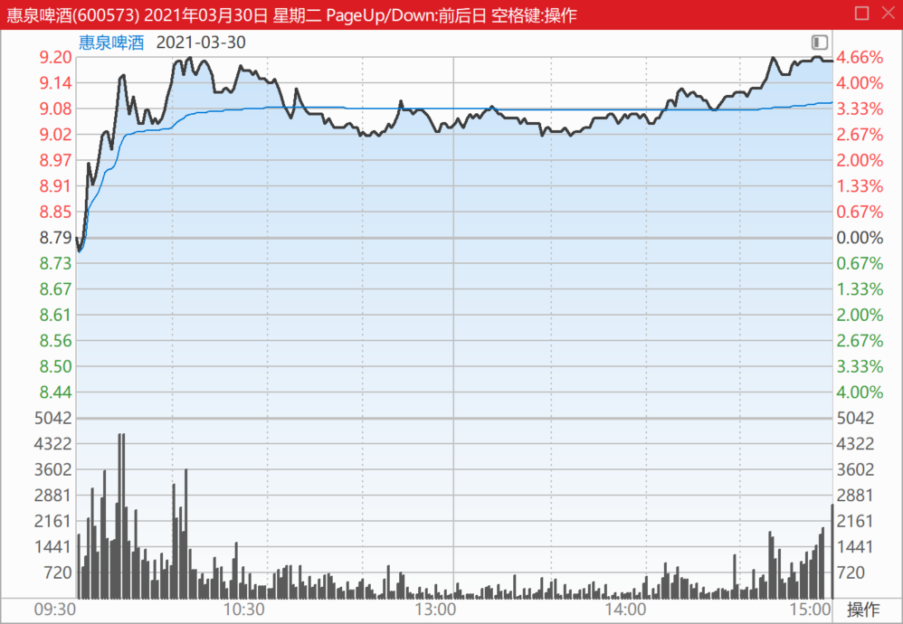

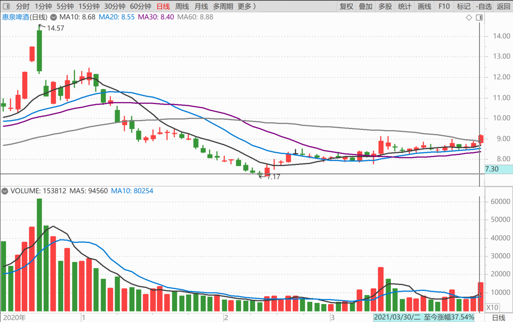

我喜欢像燕京啤酒一样的走法，老牛拉破车一样慢慢地磨叽。反正也是走高了，让我下不了车，只能躺赚。**如果拉太急了，容易吓得我胡乱跳车，**划不来。[俏皮]

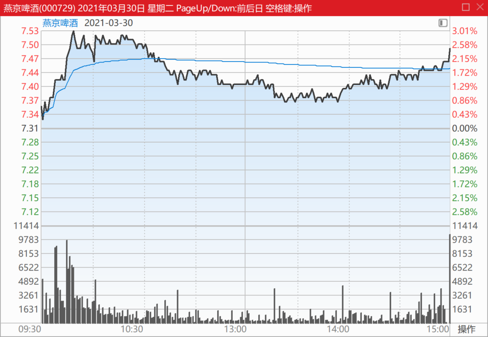

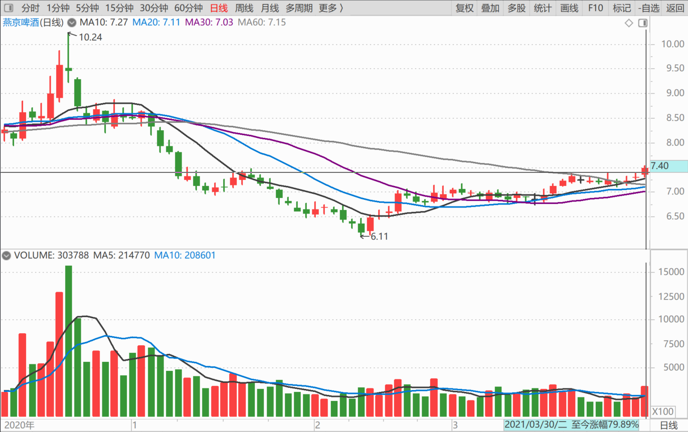

清一山长2021-04-01 12:11:36

[$惠泉啤酒(SH600573)$](http://link.zhihu.com/?target=http%3A//xueqiu.com/S/SH600573) **这个图形，是在明显走强。而且步调很稳健，上攻10元区是最起码的目标。**

感觉上，主力14元的强势拉升，后续大幅走低，基本上做完了一轮。我走14元的时候，其实手上也只有10万股还没动，其余的都已经跑光了。我猜主力也跑光了，下冲7元，其实主力应该是8元前后才开始收集筹码的，现在，已经拿回来了足够的筹码。主力新一轮建仓的成本，应该在8元以下。近期9元前后，是属于震荡消化筹码阶段。主力不想要筹码，也不想失去筹码，用平衡拉升的手法来做市。

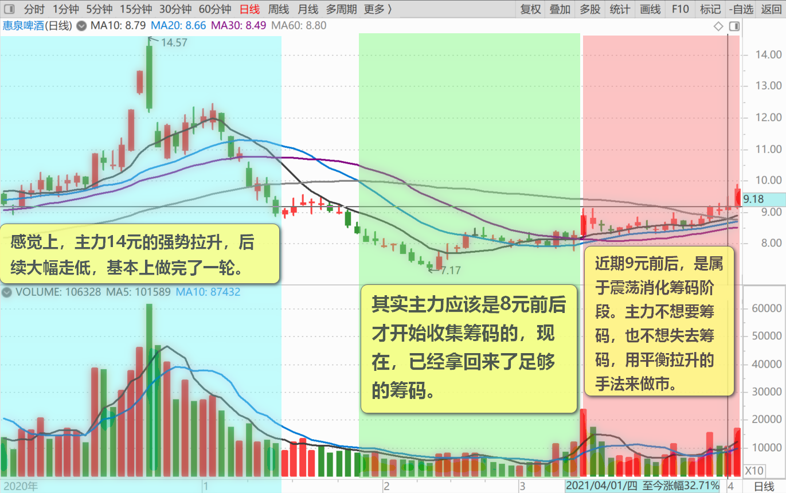

我在上次破9元时候，走了一些换燕京去了。也没给我机会拿回来。现在手上就只有2M的仓位了。一季报你们应该会看到我的持仓数字的。但我去年年底的年报持有量，只有1M多。也就是说，一季度的下跌中，我在不断加仓惠泉的。现在已经减掉了几十万股。**主仓还在，准备以后遇到急涨的时候再抛出。**如果一直像现在这样的慢慢的走强，我就不会抛出手上的持仓，小火慢炖的味道更好，就留下不走了。（燕京啤酒就这样对付我的，让我没啥抛出的机会，结果燕京的成本是最高的，6元多的成本[捂脸]）。珠江的成本是最低，负数,利润是最高的。因为珠江最先大涨的。惠泉现在的成本一元多一点，也很低了。利润总额啤酒股第二。如果开始急涨，就会变成负成本持仓了。肯定减仓,争取用负成本持仓一百万股以上等它疯。此时惠泉的利润，就有可能超过珠江了。

最终最赚钱的酒股，应该是燕京啤酒吧？越晚发动，我赚的钱就越多[笑]。因为如果不涨，我有钱就会买更多。

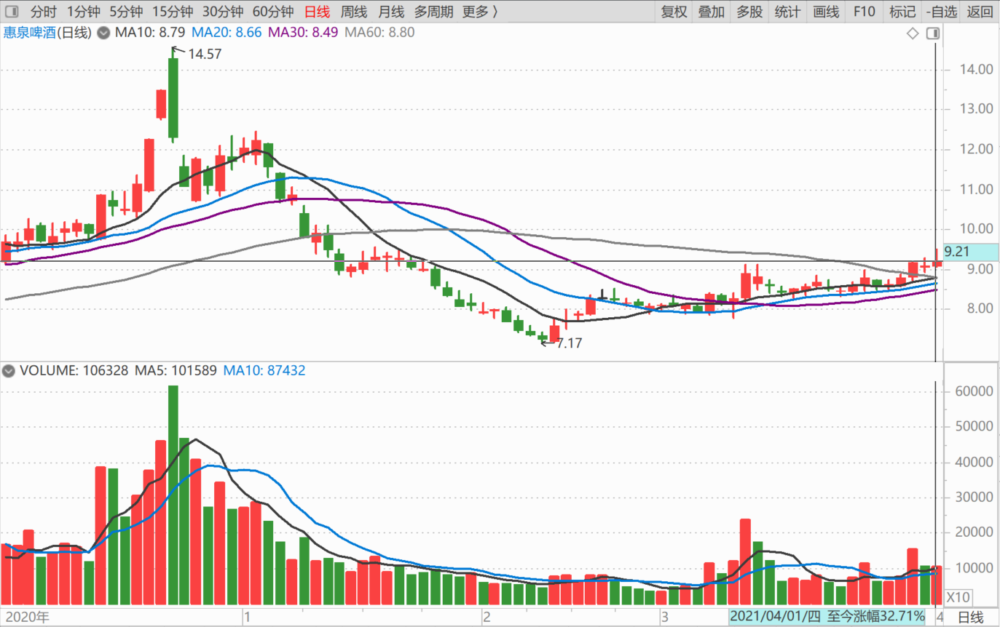

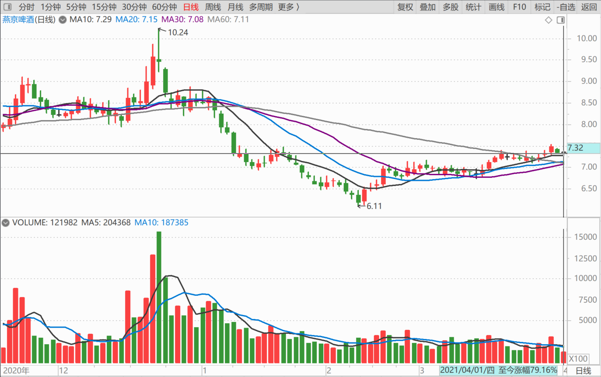

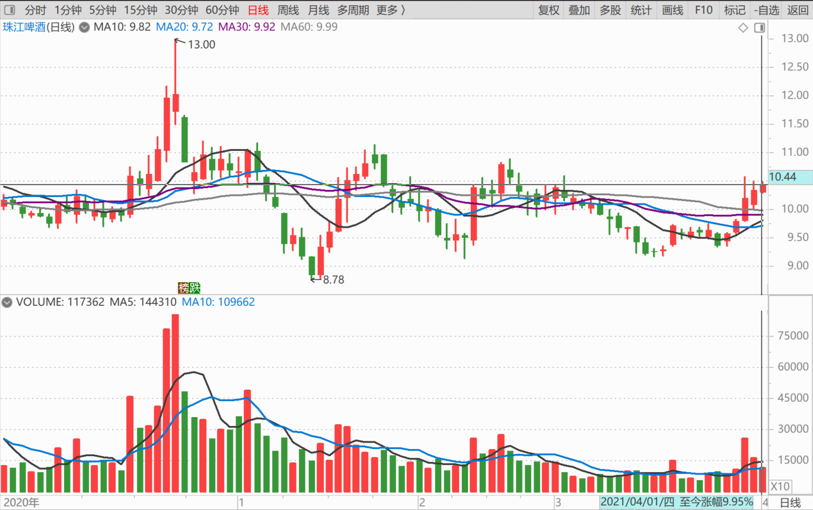

清一山长2021-04-02 15:24:56

[$惠泉啤酒(SH600573)$](http://link.zhihu.com/?target=http%3A//xueqiu.com/S/SH600573) 昨天刚说了它走强，今天就来积极表现了，最高冲了超过7%。

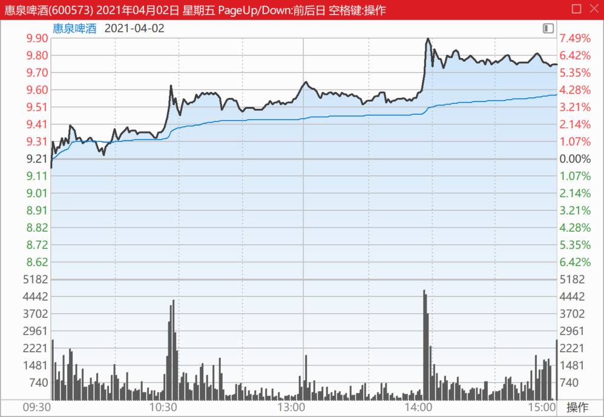

**图形上看，是稳健拉升性的，未见出货的迹象。**当然，边拉边吐是难免的。当今天图形上，主力是进货方，花的资金拉升。但也尽力让人跟随，只是让做T的失败。我相信今天做T的都做飞了。

**现在涨势还不算急的，当然，有点快了。作为一家小公司，成交明显放大，1.62亿，再次超过燕京的1.28亿。**

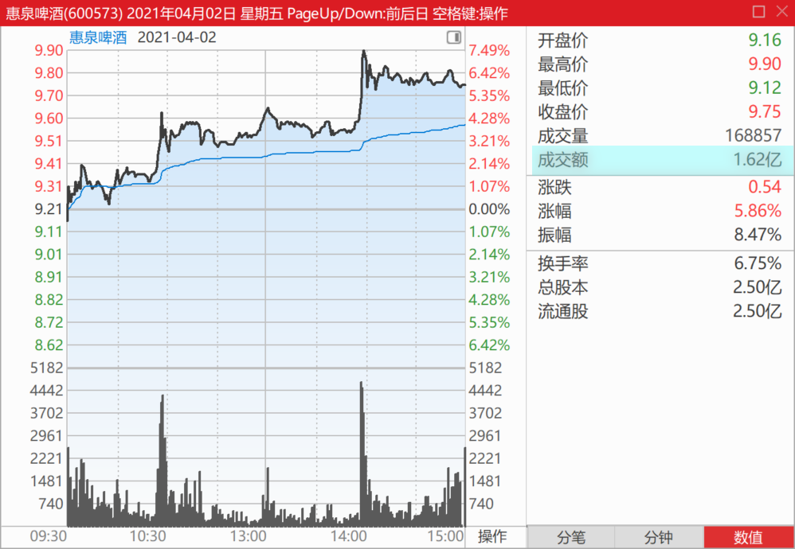

**燕京啤酒的走势，依然超级稳，不可思议。**

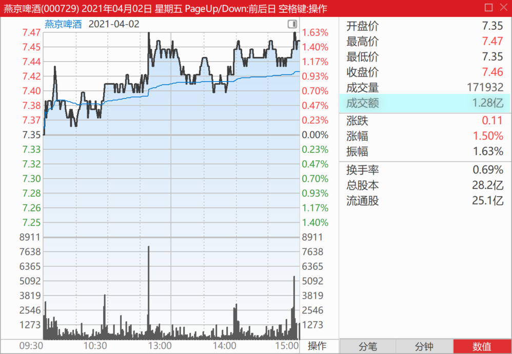

**珠江啤酒的走势，不像真想上攻的样子。**早上挖了个坑，爬起来也就恢复原地，当然原地震荡。

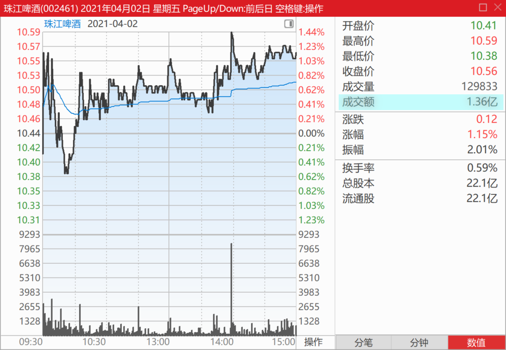

几个啤酒，我看多不做多，今天也不做空。实际上，我睡觉去了，刚起来看盘。因为觉得没有想卖的，也没有想买的，所以，继续看算了。午盘收市后，看惠泉有明显的上涨冲动，想过今天会玩冲涨停游戏吗？但下午也没盯盘。就算涨过了10元（我昨天说的惠泉此轮一定过10元），我认为也不奇怪。当然，过10元，我就不再分析惠泉的走势了。目前依然超过200万＋的股份，坐等主力发威。然后选择合适的退出时机（就是看其他有没有可买的标的，比如换燕京的价格是否合适？）

(标题、图片为编者所加)

文章音频：

[572篇.这个图形，是在明显走强](http://link.zhihu.com/?target=https%3A//www.ximalaya.com/sound/876369225)

**参考链接：**

[100篇.那条绿线，我干的](https://zhuanlan.zhihu.com/p/27432186910)

[101篇.三家啤酒的走势](https://zhuanlan.zhihu.com/p/29771069394)

[102篇.看他家走势，想像啤酒的未来走势](https://www.zhihu.com/column/c_1473746162334826496)

[103篇.三个走势，两个稳健，一个怪异](https://zhuanlan.zhihu.com/p/1895973245435479673)

[105篇.老老实实等大波段](https://zhuanlan.zhihu.com/p/1900951828339876144)