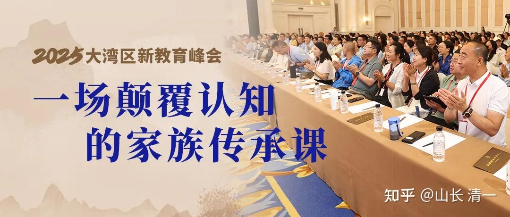
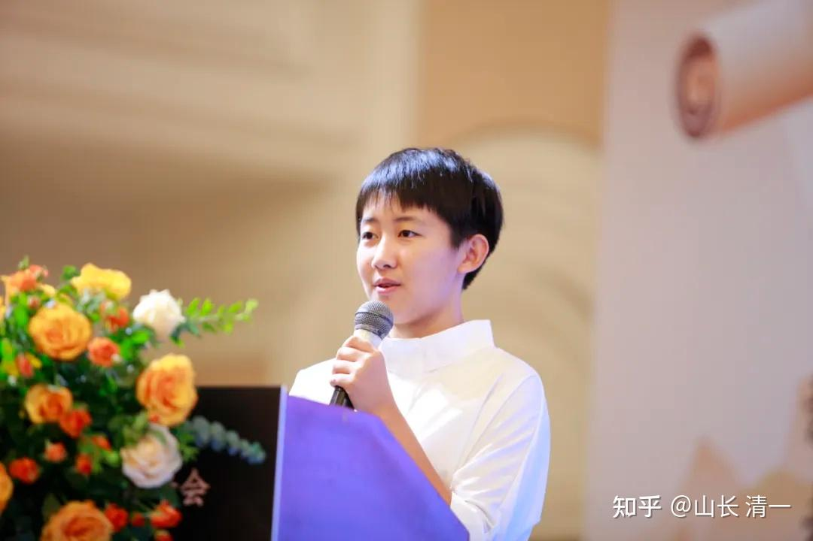
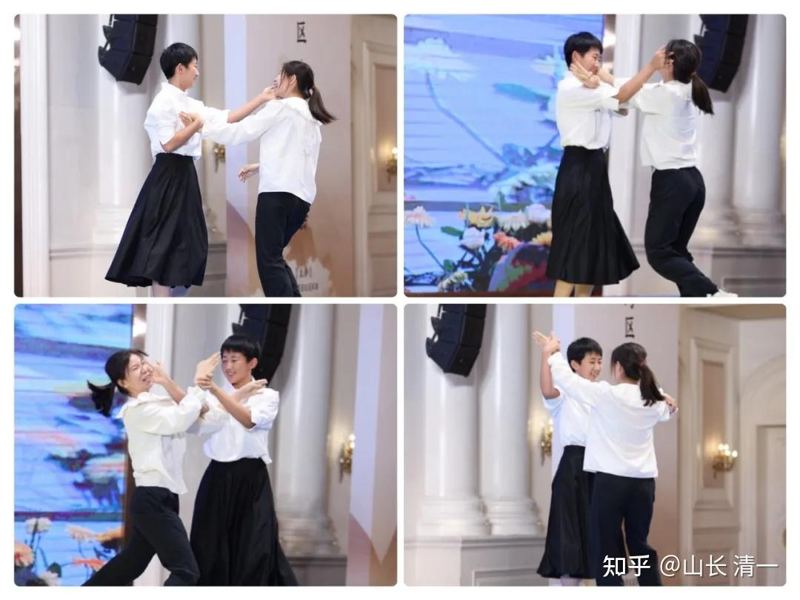
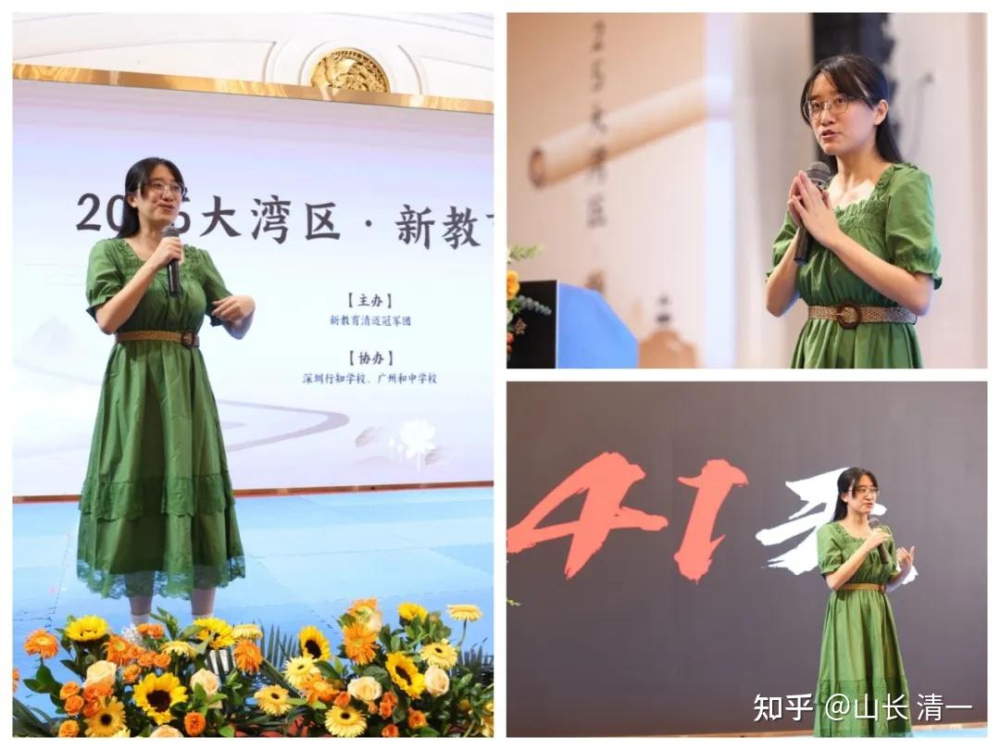
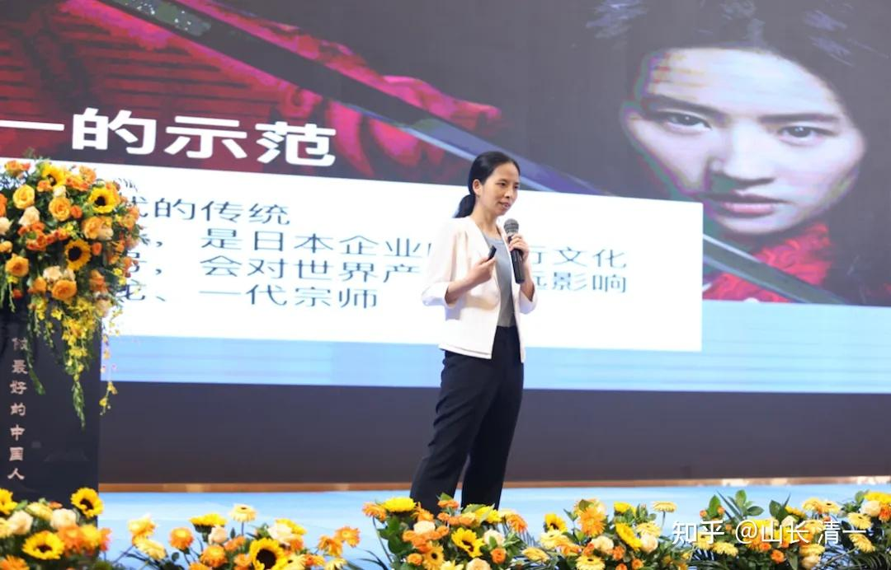
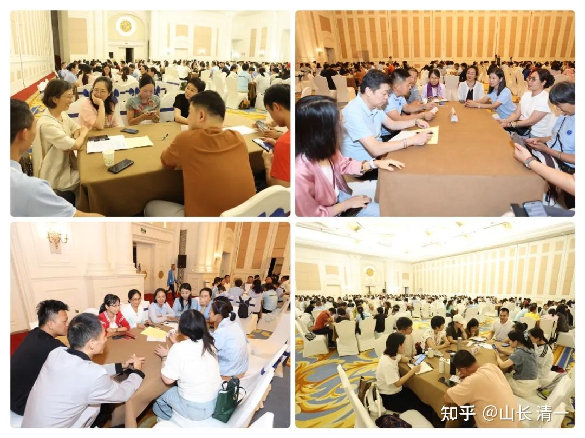

清一新教育 今日学堂 清一武道 张清一原创文章

6月22日在广州召开的新教育分享会，现场500人参与！

[一场颠覆认知的家族传承课——2025大湾区·新教育峰会 第一天播报](http://link.zhihu.com/?target=https%3A//mp.weixin.qq.com/s%3F__biz%3DMzU5ODE2NzIwMQ%3D%3D%26mid%3D2247509794%26idx%3D1%26sn%3D1ade90aa42f3c4100a419e3b75979d0d%26chksm%3Dffd7043736a9f0477fd53befd86fe2b455bf41d67c4cd87cf10d8ab983e237d8846ba15fc73c%26mpshare%3D1%26scene%3D23%26srcid%3D06222LvXHBs1WykB0cJXhhTR%26sharer_shareinfo%3Da2b46bd472a186192adfcb9e6cdebf22%26sharer_shareinfo_first%3Dd10198e1911c7fdf3c1589f00122c4c5%23rd)

**在中国，基本上，已经没人知道“家族传承”是啥意思了！但：先富起来的家庭和家族，不可避免地要面对这个问题！**

下面是一个家长的现场记录和感想，发在这里供大家参考。虽然是小女的首次出山，但我并没有去压阵。而是交给钱校和付总带她去了广州。

我这个父亲有点不够意思，没有去“陪伴孩子的每个重要时刻”。我认为以后就是孩子们的世界了，将来这些东西都交给她们去，我这把老骨头慢慢退休算了。

这个家长首次称呼明慧为代表3.0版本的教师，也许吧。其实，我说的3.0，是指将来要带外国学生的新教育教师。国内带班的今日三校培养出来的年轻人，都叫2.0！明慧还没有准备带班。她还在打拳呢。没有想这么早就出来工作。也许她将来，的确会去带外国学生的吧？**多语种优势，文武双全的3.0们，肯定是新教育，中华文化走向世界的开端。**不过我认为：应该是三年后，2028年左右才会开启世界范围内的中华新教育的文化传播。现在还没有时候，3.0们正在成长！

家长 陈苗芬：**家族传承，清风徐来**

周末在广州增城的新教育分享会已经过去两天，但心头的惊叹仍清晰可辨。原本想把朋友送给我的这个免费名额，让另一位朋友家去听，因涉及到考名校，目前她们需要。无奈她们没有时间，想名额浪费了可惜，就陪朋友同去吧。哪知意外收获了大礼包。

**一、《教父2》讲解中看传承**

明慧白衣黑裙，轻盈、清柔、淡定又沉稳地讲解电影《教父2》的台风总在眼前闪现。似乎已经无法再在她的名字前面加个小字，因为她强大得让你无法忽视，5个小时的电影讲解思路清晰、娓娓道来，已经远远超越同龄人，甚至现场的很多成人；与此同时她语气轻柔，清醒又谦卑地对称呼她为老师的人说：请不要叫我老师，这个称呼对我而言不合适，我只是一个和大家分享电影的小姑娘。

分享会之前没有看过书，也没有来得及看电影，只是寻找了二个电影讲解听了个大概，知道电影有两条叙事线，粗略了解了其中几个人物及大概的个性。

明慧紧扣家族传承主题，把第二代教父麦克爱家、有荣誉与责任感，冷静、理性、有勇有谋的个性特点一点点地解析给现场的观众，同时也穿插解说了家长如何把自己的孩子培养出教父这样的素质，给出防范类似康妮、弗兰克这样的孩子的教育提醒。

一部硬冷风格、思想深邃的电影，在一个看似纤柔但又静定的16岁女孩的解读下，让人不禁产生立马要去阅读原著的冲动，也会回望之前的子女教育之路，思考进入新教育后如何做得更好。

现场让我印象非常深刻的一个点是，当她提问，大家回答并不踊跃的时候，她轻巧自然地把她们上电影课时，山长调侃她们“炒白菜”“全新大脑”的故事分享给了现场的观众，又笑着说她并不是以此意指在场的叔叔阿姨，她的话让人觉得并未有什么冒犯之意。而且这种临场的反应并不是事先调教预备好的，完全是随机应变自然涌现的。

包括电影播放出现小故障时，她微微转头回望控制台，工作人员上台帮她处理，第三次再出现问题，她已经自己轻松解决了。在解说时，如果表达用词有误或者发音不准，她立马纠正过来。思维非常清晰，念头了了分明。

*小女明慧 首次出山分享【富二代的家族传承】*

印象非常深的还有一个点是，下午她上场的时候，为了让大家不那么犯困，展示了太极的基本功。当时心里想，候场的时候她没有注意到大家刚才做了冥想吗？如果她知道，还是不慌不忙按照自己的节奏来展示，心理素质真的挺过硬的。随后她与上台的小姑娘互动，几次把对方撂倒。小姑娘事后聊起说，明慧身高看似和自己差不多，其实力量非常大，而且感觉整个人很结实。看来明慧已经学到了内家拳的一些精髓。

电影讲解过程中，坐我旁边的朋友接触新教育时间不久，却一直感叹明慧非常像山长，颇得几分老师神韵。确实，她已经不是七八年前，在泰国上财富课时看到的那个腼腆、可爱的小公主了，而是一位用自己的行动、实力在阐述接过新教育传承之棒的3.0老师的养成之路。

明慧台上几个小时的展现，其实是她人生16年按照新教育理念培养、训练的惊鸿一瞥，用四语开场的自我介绍，是她从小英语学习、泰语学习、中文学习、日文学习的一路项目式的突破过程；那种淡定优雅的台风是多年跟随清一山长耳濡目染式的浸泡成长结果；电影讲解固然得益于之前上过山长的电影课，但现场的灵动反应，显现的是多年掉坑爬坑训练出来的思维力的敏捷；与台下观众的过招互动，更是她近年学习内家拳的真实的结果。

面对这样令人心动、羡慕的新教育成果，升起信心同时，更是会坚定比起分数、文凭，家长更应该看重的是什么。至于说她爸爸非常人，是山长，那么家长可以做的就是把山长的榜样树立好，让孩子心神向往，让他向那些在山长近旁生活的孩子们学习，努力突破提升自己，只要这样一路坚持，哪怕没有到山长身边学习，最终结果也肯定远远超越按照惯常培养的模式。

*过招*

**二、教学成果中看信念**

当静慧出场给大家讲《家族传承》主题课时，发现她朴素得像个邻家女孩，她从中国社会的断层，讲到中国历史上传家失败的案例，及对于违规者的清理处罚，再到西方家族传承观念及案例，也让现场家长明白从小送西方国家出国留学，孩子接触到的只能是西方个人自由主义的教育，而非中国历史上名门望族、精英阶层的优秀家训家规。

她最亮眼的分享是41天雅思双九的内容，一群被今日挑选剩下的“学渣”，经过她和教师团队的一系列心理行为调整，居然用一个月多点的时间实现了5个人雅思双九的成绩，真令人惊叹，也让我们看到今日新教育最有价值的心的教育的重要。

现场听分享，真的是笑声不断、收获满满，对青春期孩子情思绵绵如何调整有了初步概念。

她镇定自若地站在那里、开心地分享她的团队创造的成绩，是对外面流言蜚语的最好回应，也是强大内心的锻炼。每种分享都有相应的能量，作为教师分享学生成绩，是无言的、高段位的对不怀好意的冷静应对，人品高下也立现。

**三、再次解读中看心意**

刘怡兰分享的爬藤之路在惠州分享会听过一次，今年佛山分享会Ella公主也解读过一次，此次明莉校长的再解读，还是新的角度，内容更有深度与高度，不禁赞叹新教育的思维确实厉害。而且明莉校长从她的学生时代开始回忆叙述，丝滑地切入“文上藤校武夺冠”的主题，带来的最新信息——有两位老师帮助孩子们申请名校，避开中介钱坑，赞叹这批孩子有福气，也感受到今日及老师们爱护学生如自家孩子的心。

本来是家庭自主申请的事情，学校都帮助操心了，目的也是希望家长们不要被忽悠交了智商税，比起名校文凭，练武夺冠的奖牌的核心价值更高，哪怕不夺冠，孩子其实还是有机会上名校的，而练武过程中克服的弱点、养成的素养是价值更高、陪伴孩子一生的珍宝。

明莉校长准备的PPT内容非常丰富详实，可惜因为时间关系没能全部细致听完。

明莉校长现场答疑，也让我非常赞叹，一方面她看问题的精准，透露出思维缜密、紧扣核心价值，第二方面她的从容不迫，及与静慧校长的密切配合，也非常智慧自然。

其实此次明莉校长、静慧校长、明慧的现场展示，就是新教育1.2、2.0、3.0版本老师的一个传承与示现，相信爱与自由的教育肯定无法得到这样的结果，而将爱藏起来，用心地陪伴、严格的训练，才是真正助力孩子成长的最好良药。

晚上分享讨论环节最后付总分享的两点记忆尤新，新教育培养孩子爱与付出的能力，德才不能兼备时德在前，新教育的信念系统的教育就是德的教育。

确实，如果没有清一山长创立的新教育，没有他和刘老师大爱无私地分享与付出，哪有诸多新教育学堂、中医学堂如雨后春笋的生根发芽。如果没有清一山长随顺家长需求，突破英语、数学等需求，哪来如今耀眼的SAT成绩；而且这样的突破，也让各学堂跟随模仿。至于武术，老师当时说，这个你们就算了别跟了，因为江湖水深，不知道会招来怎么样的老师，老师担心大家，一如炒股他自己不确定的不分享，也是为了保护各学堂。

二十年如一日，老师如头狼带领大家蹚出一条清晰的康庄大道，无论学堂、家长、孩子都从中受益，却还有无良之辈各种的攻击、使心眼，真的是“人间正道是沧桑”。人心可欺瞒，但天心昭昭，宇宙记录着一切，该来的荣誉、该担的因果，自然一个不会落下。

感恩朋友的邀约，感恩山长送给增城分享会的礼包，感恩清迈团义工家长团队，感恩所有的善因缘。祝福新教育、祝福有缘有福之人。

[教育破局——如何培养面向未来的三“合一”1%人才——2025大湾区·新教育峰会 第二天播报](http://link.zhihu.com/?target=https%3A//mp.weixin.qq.com/s%3F__biz%3DMzU5ODE2NzIwMQ%3D%3D%26mid%3D2247509856%26idx%3D1%26sn%3D1e9409559cc9610268ef6b671340ba72%26chksm%3Dfe4abcaec93d35b8e8f1f0a31401be604efb427ca85eccafdcec1630b3cfb50823c8b84a5277%26cur_album_id%3D3538452405812019204%26scene%3D189%23wechat_redirect)