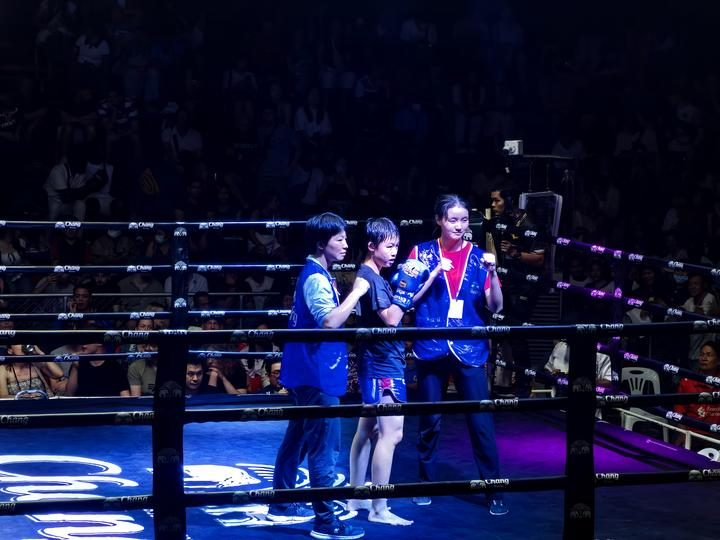

清一新教育 今日学堂 清一武道 张清一原创文章

**中国的武术格斗项目，特别是传武部分，已经后继无人。**

中国的现代格斗，我看也没啥希望，国际上的地位很低。连韩国这样的小国都不如。

老传武人，现在最年轻的一批，也是50多，60多了。后面的新人，70后的，就基本没有接上来的人了。后面的人，都去读书考大学了。以经济建设为中心去了！

等这批60年代的老人死了，中国的老传武，应该就彻底灭绝了。

所以，上一篇文章，我说现在是传武人的“残响余光”。20年之后，中华旧式的传武人，就彻底退出历史舞台了。

[武林旧事：中华末代武人的残响余光](https://zhuanlan.zhihu.com/p/1922042659834425849)

这些老传武人，20年后，就算还勉强活著，也跟死了差不多，老头们都是等死苟活的状态了。

**【可能现在这批老传武人，虽然跟我一样。也就是60岁，70岁，也已经提前进入“等死状态”了。因为根本没有弟子来学他们的本事。他们的传武事业，正在一点一点的走进棺材，无可挽回】**

现在60多的我，还能做出一些有难度的动作要领来。我动作比冠军们快，比他们更强。我可以轻松制住他们。因此，如果我要求孩子们练什么招数的话，如果他们练不出来，不相信这些技术能够使用，不相信自己能够练出来效果的话，我还可以示范给他们看，以及跟他们对打，击败他们，让他们有信心。并要求他们练出来这些技术，去打现代格斗。

他们知道练习的方向，知道目标，知道榜样。才会认真去练，将来真的积累日久，就真的练出来了！

但如果我已经80多岁了，就算还没死，我就算知道学生们该怎样练。但我示范不出来的话，弟子们不会有信心去练的，只觉得老头子就是瞎说的故事。

于是---我此时来教弟子，肯定不可能教出来的了。

孩子们连看都没看过，我光教他动作，有啥用？他都不知道练出来会是啥结果，当然没信心了！

除非：我现在带的弟子们，已经练出来了。20年后的她们，比我现在还强（肯定的）。我就可以把担子，完全的交给下一代去了，我自己可以指指点点的“当总教练”，弟子们给我一个名头，我随便玩玩就行。如果我已经做不出有效动作了，可以叫弟子过来示范一下，按照我的要求，做给年轻人们看。

**只有这样教的话，中国的传武，才有机会一代一代的传下去！**

所以，我现在培养的弟子，就是未来的“火种”。我这把老骨头，得陪着她们，帮她们练出来！

别的事情。都不重要。谁想骂我，就骂去。我陪我的弟子去！不会理睬这批闲人的！

**孩子们要“大成”的话，我看需要20年。我就养着这批人，养个20年。就成了！**

**他们40岁左右，会成为未来的高山，全世界都会仰望的高山！**

**我相信：全世界找不到能够和这批人匹敌的对手**

**现在的拳王，在他们面前就是笑话！**

**中华武术的崛起，就是靠她们了！她们40岁左右，都会成为未来的武林一代宗师！代表各门各派的武术，在世界上争光加彩。**

**这批人培养出来后，她们会改变世界武林的格局！**

**现在全世界的武术格斗，都是一批“粗人”在玩。大多数穷人，至少是读书读不进去的粗人，才会选择去练武。他们自己和自己的家庭，都不是社会的中上层。**

**所以，当代社会上，武术格斗，其实没有机会走入上层社会的！**

**但未来我们会改变这种世界局面！**

**我培养出来的学生，他们自己，他们的同学伙伴，都是常春藤盟校毕业生，20年后都是世界范围内的高管。**

**他们的孩子，都会送来这里学武。也会影响，带动类似背景的人来练太极，中华传武。作为一个训练高级素质的必要训练课题。**

**就像现在的冠军班一样！**

**关键是：这批素质优秀的文人，还特别的能战斗，每年的世界冠军，会被他们夺取一半金牌走掉。**

**另外的一半，我们留给传统训练方式的现代格斗手。可能大多数还是重量级的。**

**因为太极传武，学道家的文化，饮食方式。因此没人去打重量级！**

**所以，未来的世界格斗界，武术界，就的成为了“文人拳”和“武人拳”的竞争项目。**

**外家拳和内家拳的争议，可能退出历史。文人拳，走上世界！**

**而文人拳的核心，以及文人拳最高的层次，我们自己的达摩院，就是【清一武道馆】。**

**这里会有各门各派中华传武的宗师，掌门人。年龄都在40岁左右，可以用中华传武各门派的技术，去击败各种世界冠军。**

**这些世界格斗冠军们，在她们面前，就是小儿科。想怎么收拾，就怎么收拾！**

**这就是我对未来20年后的世界武术格局的判断。**

**挺像做梦的吧？**

**下面介绍的小女孩，很可能就是其中之一。她今年才17岁，比ELLA17岁的时候更强。**

**20年后，她肯定能胜过现在的我！什么世界冠军，她都不会放在眼里。**

**当然，我相信她会输给20年后的我。**

**彼时彼刻，她大概不忍心去打一个80多岁的老头，只会跟我玩玩，然后假装输给我，逗我开心。**

昨晚，小公主李想打仑披尼预选赛。她还不满18岁，但水平，已经比较接近我们的四个老木兰了。昨晚的比赛，相当于清迈冠军级别的比赛，她的对手是一个降重4公斤来打的泰国高手。很凶猛的拳手，但李想奋战五回合，TKO结束了这个强悍的对手。

半个月前，她对战了一个比她重6公斤的对手，这说明:泰国人把她当做几个木兰一样的待遇了！用超重拳手了来对付她。而不是用同级别对手。

仑披尼预选赛事，公主崛起时代 | 看了今晚的直播----李想公主今天打的很好，泰国的拳手是个悍将，勇猛过人，完全不同于普通泰拳手的慢节奏。估计是因为仑披尼要来选拳手的关系，比赛非常的激烈，远远超过正常的清迈地区赛事。我看赛场人数也很多，而且今天早上7:00就要去称重（正常的比赛不称重），所以，今天比赛显得正式的多，拳手一直在积极的拼抢进攻。泰拳手被李想正蹬击倒后，站起来就往前冲，属于勇猛进攻型的拳手。拼的气势很强，速度很快，内围也非常的积极强悍。

前三局，双方都拼得很厉害，体能消耗巨大。但李想公主的素食优势和技术优势领先，加上多次击中对方胸腹部，多次击倒对手，对方体能消耗巨大。最终第四局，对手就脱力了。再也无法发动有力的进攻。

第五局对手我看已经累的都快抬不起手了，反应速度明显变慢了。但李想依然保持了有力的进攻姿态，依然能够快速地输出打击。最终，第五局TKO结束了对手。

这场比赛，是极限的体能战，双方攻势战。李想公主的素食优势，明显优于泰国拳手的体能。在心理上她也更稳定。

其实我观察，李想在第三局，已经出现体能的下降情况了，因为前三局拼抢特别厉害，双方都很累了，但李想只需局间短期的恢复，开局后依然能继续进行有力的进攻。

可是泰拳手第三局之前，还可以拼死决战的，看起来场面非常的激烈。但她第四局，就明显体能下降严重，没有恢复过来的样子，就开始处于被动了。到了第五局，泰拳手就完全没有战力了，一副精疲力竭的样子。最终TKO结束比赛。

李想的攻击力，在第五局也依然维持了下来，很凶猛的攻击不亚于前三局。因此，今天TKO泰拳手，我认为核心是李想在体能上优势明显地压制了对手。

不足之处：李想的正蹬，应该往前跳更多，好几次站原地了。拳的攻击不够明显有力。

优点：正蹬的时机抓的很好，几次都直接击倒对方，说明做到了跟对方的扫腿进攻同步，陪型练习的好处。另外，本次面对拼抢积极的对手，李想的心态很不错，能够稳住阵地，不被对方的气势压倒，有优秀拳手的素质！

ELLA发言: 给大家补充一下我们了解的场外信息～

1.对手的教练说对手是减了4公斤来打的，所以体能很差，但减了还是打不过，说Liza（李想）很厉害。也说对手体能就差在累了没法快速恢复。但说，不过体育嘛，就是输输赢赢的。

2.我们觉得这一场就是主办方，赌拳的人用来赚钱的，估计观众都会赌泰拳手赢，主办方和了解的人就是赌我们赢，中途也看到一堆认识的专业赌拳者。还有很多人在Liza打的时候过来指挥帮忙，很开心说Liza赢定了。中途一个人很兴奋的说Liza一定要加油，我可是在她身上赌了很多钱。还有一个人两眼放钱光的说现在赌注已经有十万，二十万了。

**3.Liza打完后有超多拳手，教练过来说打得很棒，**打得过程中我们看比赛的同学一直喊中国加油，后面一堆外国人也都很兴奋的一起喊中国加油，还有人向我确认yayou，是这么喊的吗？总之，在场的人应该都记住打得很精彩中国人了。