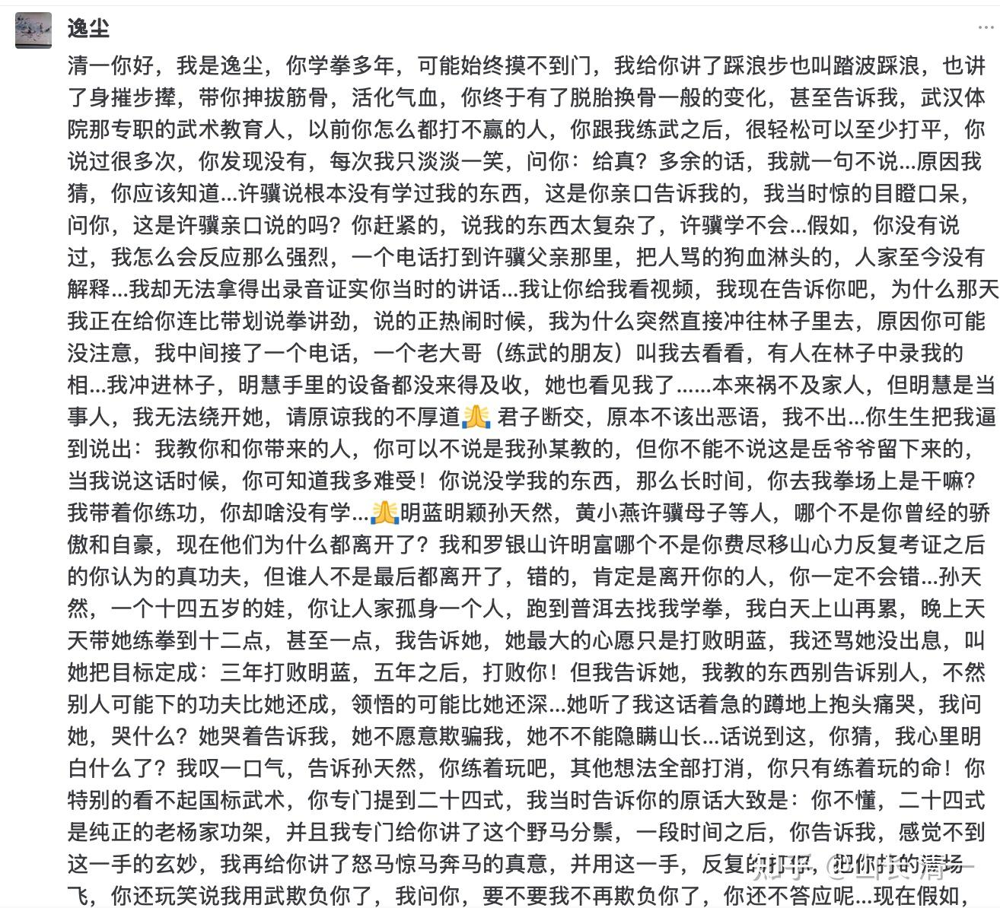

清一新教育 今日学堂 张清一原创文章

乾道教育（我文章背后的评论回复）
请问你所谓的明慧手里的“设备”是不是手机？

[武林旧事：中华末代武人的残响余光](https://zhuanlan.zhihu.com/p/1922042659834425849)

我的回复：她只有手机，不过，某些人的眼里，手机也可以用来当间谍的“设备”。
**只是“间谍小明慧”的脑子有点不太好用：**她明明可以近距离，光明正大的当面拍视频，但她非要像间谍一样，躲在远远的小树林里面，用她的小手机远远偷拍。
这种距离，拍人像的话，恐怕都看不清人脸，看不出谁是谁。
但小明慧却以为自己拿的是“高清单反--加--变焦长镜头”。不知道自己手中，只是用了几年的，1千多元的VIVO小手机。她真是傻气到家了！
就在发生此事的前几天，孙老师跟我和明慧私人见面（就是我说的送一万元给他这次），孙师傅当时，还是高高兴兴的过招，跟我们演示他的绝活，也指导了明慧几招功夫。
还耐心告诉小明慧，他爸爸教给她的正蹬没用，会挨打的。演示了他怎样对付正蹬。
当时，小明慧也大大方方的近距离拍了孙师傅的几段视频，还给孙师傅看了她拍的视频。孙师傅当时，以及直到现在，也没有说：不能拍他的武功，不能录他展示的视频。
他到现在也没有要求我，必须删除掉我们拍的视频。 所以，小明慧不知道，居然她需要去躲起来“偷拍”他。
她不像我，她根本不想学孙的功夫。
因为她性情中人，她要不喜欢谁的话，你多大功夫，她都不稀罕，就是不理人的。
她还去偷学？神经了吗？
但在孙的版本里面，正常的小明慧，居然在几天后变得不正常了。
她想拍视频也不出来公开拍。非要躲在树林中，用她的“间谍设备”：一个一千多元的VIVO手机，远远的“偷拍”孙师傅的绝世武功。
她似乎不知道，拍出来会是啥效果！
孙师傅肯定是个粗人，他恐怕自己都没有想过，他自己胡乱想出来的偷拍故事，是这么的不靠谱。他自己去试试看小明慧躲藏的地方（小树林），从这个角度去拍小广场，看能够拍到啥东西？
但：孙师傅死要面子，明知有错，就是死也不认账。
他就是咬死了小明慧在偷拍。不管多不符合常识，说出来多可笑， 他都要坚持到底！
但他身边，肯定有人不是傻子。她知道这个故事很拙劣。公开的拿出来攻击人的话，很不靠谱。
因此就帮他，重新改写了这个故事，写成了更高级的，更能忽悠人的版本。如果我们没有出来澄清的话，就特别像是真的，而且是居心叵测的！
孙师傅回复我的这个文章评论中，就显然是被人润色过的。各位有心人，可以自己去比较一下，孙师傅本人在几只鸟上他自己真实回复的300多条评论，其表达风格，文风，文字用法，思维逻辑，心理状态，文字的通顺程度，各位看看有啥不同？
**可以说：非要说这就是一个人写的，恐怕是侮辱读者的智商！**
**两种语言，就是两种不同的文字上的孙师傅！**
**----就是天上地下的差别！学渣和学霸的区别。**
在我的文章后留言的“孙师傅”，是个条条有理，娓娓道来，细节很周到，文字很清晰。篇幅就算很长，也井然有序。

可是，他在几只鸟后面留300个评论的孙师傅，常常是词不达意，不知所云。
常常你看了他写了一堆，你也不知道他要表达什么。想说啥意思。
我看有网友说，认真的去看了孙的三百个评论：【这名所谓的S武师，嘴碎得像个娘们，哭哭啼啼地，在网上倒苦水，锱铢必较，把那七百年的谷子八百年的糠的琐碎事，全都记在心里，质问和山长的过往交集，质问许是否接受过他教过的事情……平时没事干吗？】
这话的确不好听，但不能否认，他平时说话，真的就这德行---【嘴碎得像个娘们】。
但我认真的帮他说一下：
**他嘴巴的确像娘们，功夫像爷们！**
**不像我，被他笑话----功夫像娘们，人像林妹妹。**
但你们看今天他在我文章后面的回复，是不是全变掉了？
说话，语言，表达，真的“挺像爷们”的。再不是【哭哭啼啼地，在网上倒苦水】的样子了。
不过，你们别被表面的文字骗了。这个帮他写回复的人，真不是爷们，她是个娘们！
**孙大师在网下威风八面。纯爷们！**
**但在网上，他就太娘们了。**
**居然还要靠一女娘们，背后来指挥他，来教他如何说话写字，才勉强装的像一个爷们，**
**你觉得这个武林大师，丢不丢人，被一个女人操纵的团团转，当打手？**
**英雄难过美人关呀！**

他在今天的评论说：他要写一篇文章，专门的来跟我讨论（对战）。
我知道，这不是他自己的意思，是他背后的女娘们高参，要借他的名义来攻击我。但她自己却不冒头。
坐收渔利，看热闹不嫌事大。孙大师被人卖了，还不知道！
你们做过上面的真人文字表达比较之后，就知道孙师傅这次出来挑事的背后，是不是有别有用心的小人（或者女人？）在指挥，操纵，利用他？
所以---我也懒得跟他背后的这个影子写手，去对招呢。
我也不能说，孙师傅你武不错，文不行。难道就不能请写手，帮忙他润色呀？
你爱咋咋的，我管不着，只能管我自己，不理就行了！
**所以，我今天就只是回答他：你说的都对，就是你对吧！我不跟你辩啥正误。**

我们看到孙的娘们润色的回复中，提到的小明慧**手上的“设备”还没来得及收起来。**
你们有正常思维一点的人，自然就会以为，小明慧当时，手上拿的肯定不是一个小手机，而是是一台精密的长焦镜头的专业摄像“设备”。不然怎么可能躲在小树林里面，就能远距离的拍摄出来孙师傅在小广场上展示的绝世武功呢？
一个小手机，能远距离偷拍他的武功演示？是不是脑残了？
所以，不能写手机拍的，一眼假！
**只能用模糊语言，写成“设备”。**
这种对于文字和细节的掌控功力，以及小心思，有意用文字，细节，来误导读者，我认为孙师傅，真还不具备这种能力。
他就是个认死理的粗人，脑子不好用。是万万想不到这些细节，会暴露真相的！
虽然说是**用手机远处偷拍“一眼假”，他真就没这眼光，就看不出自己说话的荒唐！**
我此时想到的这个背后操纵者，就只有一个人，才有能够来挑拨孙师傅的本事和机缘。就是他这个回复中提到的，还为其打抱不平的某人。
可见，孙师傅不是一个人在战斗【**但我只是推理，没有证据，所以就不提名了**】。
回复中这句话，颇见文字表达的功力，看看与孙师傅在几只鸟上300多个自己的真实回复，常常让人都搞不懂他写的文字是啥意思！
下面这段回复原文，思维可清晰了。具象感十足！一读就浮想联翩。
**【我中间接了一个电话，**
**一个老大哥（练武的朋友）叫我去看看，**
**有人在林子中录我的相…**
**我冲进林子，**
**明慧手里的设备都没来得及收，**
**她也看见我了…】**
这段文字，写的挺精彩的，颇有好莱坞谍战的意味。把双方斗智斗勇，偷取绝世武功的过程，写得非常的生动形象！S大师现场抓获小间谍明慧，破获了清一偷他武功的案件。
可惜我是当事人，就在现场，知道当时发生的情况是啥。
我可没看到“老朋友电话告密，点醒梦中人”这个场景。
弄得似乎孙师傅周围，有一群很有警惕性的老朋友，老伙计，都在帮助他“防窃密”。小明慧偏偏偷拍技巧拙劣，手中拿的“摄影器材”还特别招眼，一眼就被保护孙师傅非遗资产的伙伴看到偷拍动作，马上就电话警告孙师傅小心（这故事，精彩不？真不真呢）
我更没看到孙师傅“接完电话，马上就冲向小树林”，去“抓间谍”的精彩动作。
我当时只看到，孙师傅练累了，要去上厕所。他是正常的步态，慢悠悠的走过去，目标就是直接走向广场上的公共厕所，而不是快速“奔向小树林中，抓偷拍的小间谍”。
而当时，小明慧就在离公共厕所不远处的一个花坛上，自己玩的。因此他们两人互相看到，也很正常。（如果小明慧正在偷拍的话，看到偷拍对象往自己方向来了，会连重要的摄影“设备"---手机都来不及放下吗？还是赶快躲起来才正常）？
我当时并不知道，他去上厕所见到小明慧了。他回来也没有说。
我一直没去跟他去解释，为何小明慧明明来了广场，为啥就是不肯过来见孙师傅。说她是因为她生气孙师傅对她父亲很无礼，才不想来见他，不想学呀功夫的。（这似乎也很失礼）
但我就算说了，孙师傅肯定也不会反省自己问题的。只会说是小明慧矫情吧？
他愿意把小明慧不肯去见他，想到别的理由上面去，倒也可能。即使是毫无逻辑和可能的“偷拍”可能。
只是他这一次回复我的评论，居然把当时的场景，过程，描绘的如此的精彩？逼真？
倒是完全的出乎我的意料。这可不是他的文采呀？
拿这故事来特意做文章，到处说事情，真有必要吗？咬死了说就小明慧偷拍？
我认真说一句：我原来就拍过孙师傅的视频， 但我们也从来没有拿孙师傅的视频来“教学”，其实后来自己也基本没看。
这事情发生前几天，我去见孙师傅的时小明慧拍的几段视频，后来我们谁也没去再看过。因为几天后，我们两人就闹翻了，我们都根本不想去看他的样子。没意思。我们不识货，看不懂。
现在不知道视频还在不在明慧的手机上，有的话，让她删掉吧。
当时去见孙师傅，小明慧开始还是很崇拜他的。她拍了几段视频，本意是留下一点父亲和老朋友交流的影像资料，是一个历史记录和佳话。
现在看，实在是没必要了。这段历史，直接翻过去就算了！

如果真想通过影像，就能学高深的武功，网上大把的是老一辈武师的影片。各种资源多的是，不缺这一块吧？
记得有一个中国武术抢救计划，国家级别的专业机构，把很多知名武师的视频记录片都拍出来了，放到了网上。这些拍摄的设备，可比小明慧的手机高级多了。才能把大师们的宝贝功夫影像留下来呀？
**孙师傅不会以为，全中国有视频记录以来的历史上，就他的武功才是最好的？最宝贵的？**
他的视频，难道就比这些已经过世的知名传武老拳师的视频更神秘？让人一看就偷走了？
原来拍过孙师傅的视频的人很多，孙师傅从来没说啥。我以为他很大方！
现在我们明明没拍她。他偏偏要揪住不放，非说就是拍了，还说偷拍的。
不知道是他变小气了，还是有人就是要借题发挥，故意的诬陷我要偷他的宝贝，还把小女扯进来一起诬陷！
说我偷了他的拳，偷了他的功夫，我也就算了。
我肯定受过孙师傅武功上的指点，认识他，肯定对我的功夫有受益之处，他肯定有让我开眼界的地方。
这一点，我从来就不否认。我多次公开的，当面向他表示过感谢！
如果他非要说，我就是偷了他的宝贝拳，我才有今天的成就。我也真的没法去辩解！
只是我奇怪，我偷了一点你的东西，就教出了一堆冠军！
你这个原版正宗的源头智慧，你100%浓度的原版武功高人，比我厉害100倍的高手，你还每周都雷打不动去小广场免费教拳，却至今，几十年了，连一个像样的徒弟都没有教出来。
这道理，该怎么样去理解呢？
另外：**如果我就是真偷了他拳，就像杨露禅一样，有此才华本事，也是我的荣幸。**

【实话说：我不相信杨露禅偷拳的说法，我认为，内家功夫，不是看看别人的动作，就能学会的。我天天练给弟子们看功夫，他们一样学不出来。我只能教他们最笨的招数去打泰拳，比如孙师傅最看不起的正蹬去打泰拳。但我自己打的话，不用正蹬，一个太极云手，就可以轻易击倒冠军们，但他们就是学不会云手咋办？】

**孙师傅相信偷拳的神话不奇怪，因为孙师傅也是陈氏太极的弟子。**
但他如果真的相信这个故事的话，**孙师傅应该感谢杨露禅去偷拳！**
因为：如果没有杨露禅，他后来到北京王府，去传扬太极无敌的威名，那么，现在的陈家沟，也不会为天下人所知的！你孙师傅也没机会去当陈氏太极的弟子！
至于我，第一，我不相信偷拳，理由上面说了。
第二，我也不相信陈氏太极拳，我认为他们欺师灭祖。因为他们说太极拳是陈王廷创立的。
我是武当弟子，我认为太极拳的创始人，是张三丰。甚至张三丰都是太极的传承人，集大成者之一。之前宋代以前，就有太极。老子庄子，我认为应该懂内家拳，至于不是名字叫太极不重要，但他们的武功，和太极的原则很像！
孙师傅是认陈王廷的，他不认武当，不认张三丰。他原来就跟我说过的！
实际上，他言辞中，是很看不起武当派的。还坚持强调说：他的武功，跟武当派就没关系！是岳飞的长拳。
这个，他爱咋说是他的事情！我不管他（也管不了）
但我不认陈家的太极，我只认张三丰的太极。
如果是真正的传武，国术传统，一直是“言祖不言师”的，意思就是当老师的没啥可以自吹的，认清老祖宗是谁，才是更重要的！
陈家沟，我认为只有炮锤，没有太极！实际上，徐某东出来大家，核心目标就是陈家沟。几个大金刚都不敢出来应战，我觉得丢人。就算是炮锤，打败徐晓东也没问题呀？难道是陈家沟连炮锤都没有了？
这个不多提了。我们来说孙师傅是陈家沟的弟子。那么依据他们这一派的逻辑和荣耀准则的话：
**如果我真的偷了他孙家的绝世武功，然后我传给了天下人，让他现在有机会来扬名全国。让这么多人知道他孙师傅的大名。**
**他应该非常的感谢我，让他有机会复制他们陈氏太极祖宗的佳话。难道不是吗？**
孙师傅周围一大堆人，在他身边学拳练拳的学生弟子，几十年了，都学不会他的本事。
我一看就懂，一练就会。我肯定是悟性超高的武林奇人，一代天骄。我这个他认识就没几年，长期不在云南，偶尔有空去随便去看看他的拳，被他指点了一些功夫，我就偷走了他的本事，真的是我太了不起了。
他非要坚持这样认为，我也没啥不能接受的！
我偷走了，而且公开承认我跟你学过，不否认你的功夫比我高，承认你几秒钟就能击败我。
这么抬举你？您还嫌不够？还不感谢我？
您这么气呼呼的？
这样做，您是不是恩怨颠倒之人?
这样谁还敢跟你玩呀?

如果能一眼就偷走绝世武功，是我的荣耀，是我的本事。
我也没拿武功去换钱。反而我贴钱来教武功！养弟子。
你难道不应该好好的感谢我，替你赔钱传扬了你祖宗的大名和武功才对吗？
您不谢我，我谢谢好了！
谢谢孙师傅抬举，感谢你过去的支持和示范，指点。

但要说我的女儿去偷你的东西？
对不起，我不接受！ 我女儿就不是这种偷偷摸摸的小人！

背后诬陷人，你才是小人呢。
编故事的人，背后搞鬼，挑拨离间的人，算是啥人呢？
大家小心这种人。这种人，就两个字？阴险！