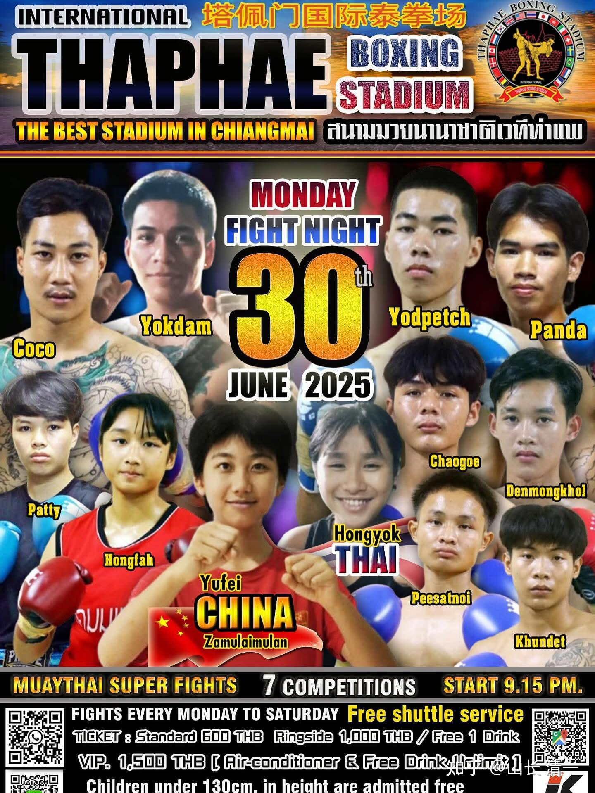
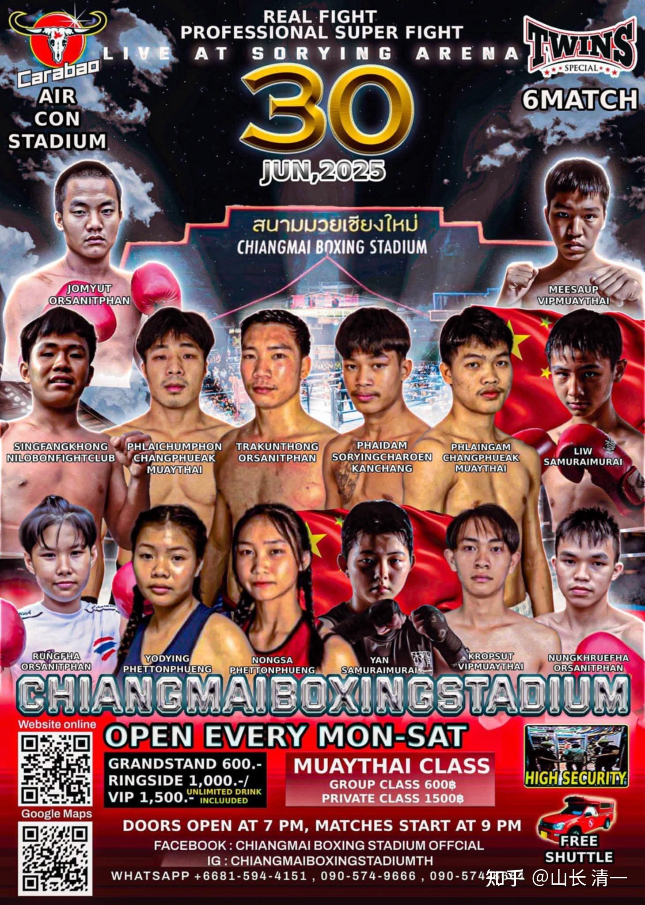
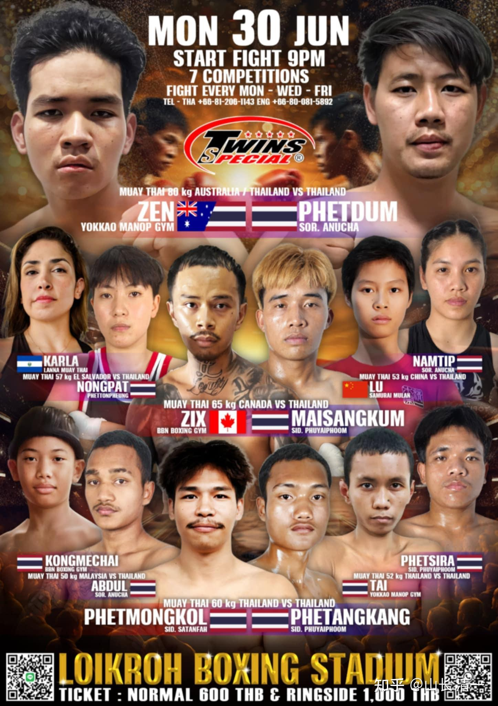

清一新教育 今日学堂 张清一原创文章

你想在被人故意搅混的泥水中“查清真相”，只会让自己一头泥污。老子教的处置方式很简单：不去理她，泥水就慢慢沉淀下来，变清水了！你就能看清真相了！

今年是离火之年，分裂的能量非常的严重！

清净的能量，和欲望的能量，会产生严重的撕裂。

“吃瓜群众”也一样会被裹挟，别以为会跟自己无关。只有能够守住自己内心清净的人，才会安然度过。

现在要小心做事，可能做得越多，错的越多！

拿个例子来说，S师傅，其实与清黑本无关系，与我更是没有啥利害冲突。如果他懂得【静之徐清】的道理，万事不管，啥事都不去关心，更不跟清黑们去应和。在十年后，中华武术在世界上崛起之时，他就可以安然地出来，做自己的一代宗师，留下自己的名望和武功传承，光荣地走完自己的人生路。

但他却因为脑子不好，被清黑们煽动，一念恶心起，他就被“羡慕嫉妒恨”的嫉妒心，小心眼，这些负能量，就把他自己本来的好运气全给丢水里去了。他现在居然不甘寂寞，跑来网上跟清黑一起，对我们攻击谩骂和诋毁种种。这样闹一番之后，其实我并没有真的受损，木兰们功夫也没有降低，中华传武的进程并不会被拖累。但他自己的个人形象就彻底毁了，虽然有武功，但完全失去了别人对他的信任和尊重。这样，他就完全失去了未来在中华武术世界范围内崛起的时候，他本来可以获得的美好机会。

就算你们不相信10年后中国武术能够在世界上崛起，但他也失去了一个正在上升的能量圈子，对他的尊重和信任。这个损失是很大的。他今后，虽然武功超群，但也只能当一个普通退休老人了。与凡人无异，他这一生功夫，一辈子的骄傲，不就是白练了吗？天天去广场上与老头老天们健身玩？跟广场大妈有啥两样呢？

一代宗师，最终沦落为广场大妈一级的人物，你觉得这落差大不大？

因此，你们去与负能量共振，会让你们的一生，失去可能本来送给你的，人生最宝贵的礼物！

比如，可能就有一个女学生，本来很有希望成为未来的国礼（一代文武双全的宗师），但家长就是喜欢到处吃瓜，脑子也不好。去看了清黑的东西，就一念糊涂，心生疑惧。就赶快把孩子接回家去“安全保护”起来，去上体制接轨去了。

结果没过几年，她的同学当了冠军，上了常春藤，后来还成为了国礼。而您的孩子，成为了普通人。

甚至更糟糕的，就是祸不单行。由于你们家庭无法接受这样强烈的失落和对比，你们想要毁掉让你们感到失落的对比物，让自己显得不那么失败，就开始来攻击谩骂这些孕育出国礼的平台。最终结果，你们家可能连普通人都做不了。孩子可能在家抑郁，自闭，成为养老一族！

现在这些跳出来骂人散布黑暗的清黑学生，很可能走上这一条路！我看了都叹息。相救都就不了，就像对孙师傅一样，看他固执地走进泥水里面。

今年的这一波清黑，与原来的不一样。现在这一波清黑，主要是了解我们的人。懂一点点因果！他们知道出来反对我们，她们会得到相反的能量。他们其实也看到了上一波清黑的结局很不好。

正常来说，就别去黑了。但他们认为，可以把我们干掉，就得到与我们相反的能量了。如果把我们搞失败了，他们就成功了。因此这一波的清黑，特别的疯狂，就是要不遗余力的攻击新教育。制造各种造谣，编小故事，制造黄瑶。诬陷，诅咒，谩骂，甚至有人还去找了江湖术士，想用黑魔法来整我们（我们无忧，别担心，但我们发现了攻击动作）。反正种种匪夷所思的手段，他们都会使用出来。

还会一对一的去拉我们的家长离开，各种劝诫，警告，制造怀疑，去拉走可能有成就的学生等等。反正，一切手段，就是想要弄垮新教育。

这不达目的死不罢休的劲头，远远超过2016年清黑事件，因此弄得我和刘老师都哭笑不得的。（其实我们自己不担心，道运，国运所在，我们是有保护的，他们灭不掉我们的）。

但是，我们也担心大家会被这些疯狂的负能量带偏掉。因此，你们学习刘老师教的法门很重要，帮你守住心神的。现在为了防止自己出问题，最好的办法就是不要胡乱做重要的决定。有可能现在你做的决定，就是负能量作用的结果，会给你未来带来不好的结果，最好等几个月，负能量波过去之后再说（大概需要三个月）。

现在，你们先用刘老师教的法门来护住心神，不接受负能量的干扰，**凡是看到，听到你弄不清的，有点迷糊的信息，你就说【爱出者爱返，恶来者恶回】。**

你对我今天发的这些信息，如果让你有点感到不安，你也一样的念这两句话。我发出来的提醒，如果我起的是恶心，我会遭到反噬的。我存善心，就会是善报。但你们自己，不用去判断我的善恶是非，你们只管念经就好！

**所以，一旦遇到让你不安心的信息，无论善恶，你都这样念，这样就对了。。。祝福大家！**

案例示范：某家长【我在最初看王的文章的时候，很轻易能分辨她的不合理之处，在后来有一篇文章看了觉得有些晕，有种不对劲又说不出哪里不对劲，气憋在胸口的感觉。刚好那时候山长发文说我们的思维都不够好，最好不看这些文章，免得被影响。】

@1857康净明浙江 你这就是能量下降的标志，思维开始糊涂了，判断力下降。这就是你们去看负能量的信息， 会被带低的标志。就像你去冰块旁边站着，不碰冰块，都会身体发冷的。热火塘旁边，不碰火，你也身体热起来。所以除非你们学会了能量抗衡，否则不要去与负能量共振。自己脑子会越来越糊涂，会被他们带歪的。

本质上，负能量的发起人，也在牺牲自己发动负能量攻击的。他们以后的遭遇会很差的，甚至现在就很差，因此才会发起负能量攻击。以后只会更差。你们等著去看就知道了！

你去跟他们共振，就会接受他们的能量状态。。。。孙师父为啥我们的道理，明明讲得这么清楚，所有人都知道我没有恶意，对他是天大的好事？但他还是一副不能理解的样子？就是因为他的精神能量低了，理解力差了。无法理解正常人也能理解的常识。虽然他武功高，也没办法理解这些东西。

因此恶言恶语就是负能量的表现，喜欢恶言恶语，无论对谁，即使你是对清黑恶言恶语，都是你自身能量降低的标志。你看了清黑就想骂人，也是能量被拉低了。跟他们能量接近了（不是认同。清黑之间，互相也是不合的，争吵的）。

你们看霍普金斯能量表，愤怒生气的能量就是很低的，100多，是负能量。

因此，要远离他们，学刘老师的方式祝福他们。这才能够保住自己能量不下降，不然脑子糊涂，就会做出让自己后悔终身的决定。

比如，你女儿明明可以有机会成为国礼，你脑子一时糊涂，却决定带她回家去走体制。几年后，你看到她当年的同学成了国礼，你和你女儿会怎样想？好一点你就懊悔，自责。你坏一点，不能接受就想出来攻击贬低（孙师傅，前几年就是看不起，否定我们。现在后悔了，不是承认自己不对，判断错误。；而是拼命诋毁，去说我偷了他的拳，自己吃亏了。结果他去当了清黑，现在，连送弟子给他传承的机会，都被他彻底葬送了。

这就是不要跟负能量结缘的重要性，运势就越来越差。他遇到我，本可以获得当一代宗师的运势。然后他不尊重，心中怨恨嫉妒，导致一步一步的堕落，他的运势就越来越差。现在估计只能抱着自己宝贝武功，去找老祖宗报道了。

你们要好好吸取这些教训，心情不稳定的时候，不要做重大的决定。对于感觉不好的东西，你就不管善恶，都念【爱来者爱返，恶出者恶回】。护住自己心神真的很重要！

一念善心起，你的家庭事业，才有生机。清黑们生的是恶心，不是成就他人之心，因此未来命运，只会越来越差的。我们让善心升起来，就能得到善心的回报。

**下面附录刘老师的内部信件**

**致各位清粉：**

现阶段新教育圈恶人当道，清黑猖獗。他们到处胡言乱语，制造谣言，释放出有史以来最大的恶意，甚至是恶毒的诅咒和攻击。这是因为新教育正在崛起中，引起了各种负能量的强烈反噬！

这些负能量大量的出现，双方能量场的激烈冲突，会对每一位参与者的身心，造成极大的影响。

清粉面对这些恶意的攻击，必须要学会保护好自己，如果不小心被这种能量连上了，轻则折损福报，重则侵蚀身心。

这场战役，注定没有赢家，即使是发出恶意的人 —— 清黑自己，也难逃能量反噬的结果

由于大家的分辨力其实都不够，你想“看清正误”的时候，最容易受到负能量的干扰。如果你看到一些模模糊糊的，让你不愉快的信息，就是负能量的干扰。

如果你看到清黑们发出的恶毒诅咒，或恶言攻击 以及其他让人不适的言论，让你感到恶心，愤慨，不舒服了。这些负能量就会侵入你的身心，造成不良影响。

为了防止负能量的侵袭，你们不是去对骂，去攻击，也不能放任不管（这样负能量依然会侵袭你。）

为了保护好自己，请你们遇到这些冲突和不适的能量信息的时候，马上做下面的事（最好闭上眼睛）：

1、在心中呼唤发出信息方名字三次！（名字只是代号，无论真假皆无碍，因为背后的能量不会变）。

2、在心中默念三遍：【爱出者爱返，恶来者恶回！】

然后，

对方发出的能量，无论善恶，就会被加倍的返还给本人。

如果对方发出的是爱的能量，就会有爱的能量加倍返回去。

相反，如果是恶意的能量，分裂的，低下的能量，也会立即反弹回去，不会影响自己。

这就叫能量反噬。

宇宙是公平的，它的基本法则就是因果律。有人发出了善意，就有善的果；发出了恶意，就承受恶的果；发出了不善不恶的意，也会承受不善不恶的果。

不发言，不对应，你就是被动的接受别人的能量。

如果你接受恶意的能量，你就只能承担恶的，负面的结果。

你这样做，发出回应，是顺道而行，在帮TA把发出的能量还回去，符合宇宙因果法则。

你会因此感到身心安定，神清气爽！自己的能量会越来越纯洁，越来越扬升。家庭也会越来越幸福和谐。

反之，负能量影响自己，家庭的能量降低，你就会做出将来让自己非常后悔的决定，家庭也更容易冲突和分裂。甚至财富也会开始失去！

祝福大家

刘明慧

2026年6月30日

下面给点正能量的东西

好消息：昨晚清一武道馆四个公主拳手，去三个不同拳场，参加职业泰拳比赛。年龄最小的小公主田雨菲首战泰拳职业赛，第三局KO比自己大一圈的对手获胜。四场比赛三胜，一判负(你们知道泰国的规则的）。为昨天的战事取得圆满成功。我们正在一步一步走向中华武道的复兴之路！

下面附录昨日的比赛海报（不是有人说我们花钱买比赛吗？这些比赛，全是职业拳赛。都是要花钱买门票的，我们拳手都是拿出场费的，是比泰国拳手更高的出场费）

