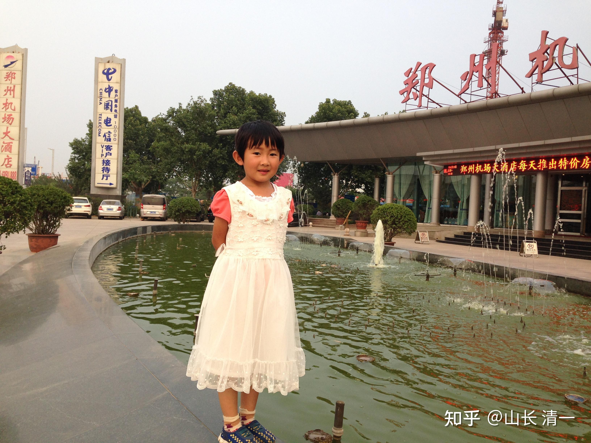
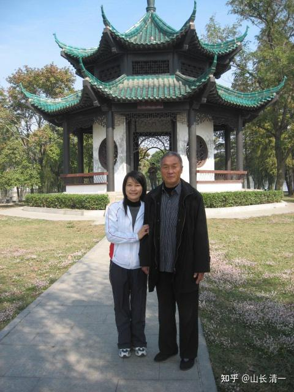

清一新教育 今日学堂 张清一原创文章

我今生，唯一拜过的一个武术师父，就是20年前认识的赵堡太极刘火森老师。他还收了我夫人做干女儿，很喜欢她，后来老师给我们两人都发了拳师证，认我们两都是他的弟子。

小明慧出生后，老拳师很关心，特别要了小家伙的生辰八字。给一个管算命的人算了一下，说是很不错。给了孩子一首诗，大意是会读诗书有文才之类的。后来我们去赵堡的时候，师父还带我们去看了这个算命的人（不是专业摆摊的人，似乎是他的朋友？），在县城里面，不在赵堡镇。然后这个算命人，就说了我们家小明慧的命。说这个孩子的命呀，不是太好---这孩子，将来她发不了财，也当不了官。最多也就是当个校长的命。我们一笑，反正也不求当官和发财的。孩子平安就好。当个老师也不错。

这孩子也的确很奇怪。。。三岁多不到四岁，她在家里就指挥姥姥，姥爷，她当老师，老人当学生，玩“上课”的游戏。说姥爷的学习态度不好，不认真上课，就让姥爷站一边去面壁。老人后来说给我们听，笑死了。说她将来长大后，是个“会管人”的厉害小丫头，当老师肯定没问题。不过她从来不支派我和她妈妈上课，平时在家都很乖的。

*五岁的小明慧，为拿护照回河南老家办证的机场照片*

原来我和夫人在武汉生活的时候，一两年就去河南看看老师。后来到云南后，就难得去几次了。现在我们出了国，回国都很少。18年之后，就没去看过老师了。只在线上过年过节的联系问候一下。 老师后来走了，但师母有时还会联系一下，前段时间刘老师还给师娘打了电话，问候了一下她，给她寄了一点钱去。还说有空我们回去可以去看看师娘。挺好的一个老太太，特别热情。我们去家里，总是师母做饭给我们吃，一生的勤劳，照顾家人和老师。

我接触的武师很多，各门各派都有。因此我的功夫，不太纯，挺杂的。当然，核心是太极。我正式拜过的老师，就这一个刘师父。

我的师父对我说过：一个武人，要获得大成就，一生要经过十几个老师。没有只跟一个老师，就成就高武功的。因此他鼓励我们多涨见识，各门各派的东西都要学学，起码多角度来理解自己的武功！

师父说，他的老师，我的师爷，也姓刘。从小就痴迷武道，一生未婚，跟学过不同的师傅。他修出来的功夫，刘老师说不可思议，他都不敢说出来！就是人完全不理解的“神迹”。他说太吓人了，跟我说了几个师爷的故事，我也不敢说出来，听起来像是吹牛的。

师父说：他自己的武功，不及师傅太多了，他忙于养家糊口的，没多少时间去练。文革前后也不敢练拳， 所以功夫远远不及师爷，对不起师爷。

不过师父的武功，让我很惊讶。当年70多岁的他，我不是对手。我的劲没他快，招没他多，力量还没他大。跟他真打的话，我肯定打不赢。等后面再说他的武功，现在先说他的为人！

**一：老师的民国范儿和修养**

网友问我：山长，传武练的好的话可以训练思维方式，化了脑子的，为何孙大师有武功，却脑子没化？

我的回复：【逝去的武林】里面，尚师，唐师，没啥文化，都温文尔雅的。说话很有深度，很有文化味。武人有文人的样子。

我也不知道孙师咋会这样。

我猜测，是整个社会的文化背景不一样了！中国再无传统文化的土壤了。

陈丹青辞职离开清华后，他说：民国范儿，就是一个没读个啥书的老头老太，都有文化的涵养，说话都有老祖宗的文化味道，有一种独特的气质。

可是，现在的大学教授，就算当了博导，也没啥文化涵养，人很粗鲁，毫无文化底蕴，只有知识一堆！还比不上旧上海的普通市民有涵养（陈是上海人）

我猜：孙是文革时期出生的人，文革已经毁了我们传统文化，再无旧时代的传武人了！

我在武汉大学时候，的确见到很多同龄的教授，语言，做事，做人，都毫无涵养，真还不如普通市民的（当然比街溜子还是高一点点的）。

但是，大学里面比我们长一辈的人，解放前成年的这一批学者，就很有涵养！

比如我原来文章里面提到过的曾老师！90多岁了。就很有旧时代文人的风范，也不贪钱，不贪名利。很有尊严和气质！

就是网友的这一问，我就想起我的太极老师来了！

** 他是解放前出生长大的，农民。一生没上个啥学，可能也没有读过多少书。他真有民国范儿的。**

*20年前，我夫人和师父在一起的照片，*

从这个照片看得出：他没有普通农民的“土”样子。说他是我的大学导师，大概你们也认为没啥问题。他其实一生都在赵堡镇务农，不出来教拳混江湖。有一年我们去家里，是刚收了玉米棒子。正在堆到房子上面去！他一生都很自尊，也很尊人！当地的人缘很好。他也尽量不给下一代添事，在家里总忙，给儿女子孙后代帮忙做事。

他从来不出来教拳，他说，老祖宗的东西，有规矩的（门规），**不准看家护院（为有钱人当保镖），不准街头卖艺（教拳谋生）。**他一生恪守这个规矩，他的徒弟很少，他也不收学费。他在农村，一直务农为生。应该没啥钱。但他从来不觉得自己缺啥。过年过节，徒弟们看着给点礼物和钱，多少都不论，不给也不说啥！我们原来给他的一些钱，应该他都用来补贴儿女了，自己的需求极少！总给我们说，他不缺钱的，他啥都有，让我们不用给他钱。

下面这个当年的江苏的千万富翁老板，就是他的徒弟之一。其他徒弟我只见过一两个。平常都不打交道，不是一群徒弟像电影里面一样，成天在一起的。其实彼此可能都不认识！

他说话很有修养，也不说人的坏话。

差不多20年前，我陪他去江苏金坛，他的一个徒弟邀请他去。当地有几个其他门派的武师来见他，练了一套太极拳给他看。我看得差点笑出来，乱七八糟就是瞎练的， 特别的难看和怪异。但为了礼貌，我使劲憋着。

老师很认真的看完后，还说：你们练的真不错，练的很好！

来者也得意洋洋的，也没多说啥，就是高高兴兴的笑。觉得被认可了。

老师又补充了一句：你们真不容易，没老师，能练成这样，已经很好了。

他们还是没接老师的话，大家就高高兴兴的去吃饭去了。一个当地的大老板（师父的弟子），招待老师吃螃蟹大宴，喝茅台。我品了一小小杯，就不喝了。老师也不多喝，不多吃。

晚上，我跟老师说：今天这人，练的这个太极，不知道是啥东西，你咋不说他练错了呢？

老师说：我已经提了，但他不想听，多说无益。

我好好回忆一下老师的说话，发现老师很慈悲，的确真的点了他们一句话。这人不懂，他当然就再也不提了。这是老师的自尊，以及慈悲！

老师说：“没老师，能练成这样很不错了”，聪明人，就知道---老师在指点---他学错了东西，啥也不是。我的老师，假装不知道他跟谁学的，是他自己乱练的，说他没老师。这不就是点他了吗？不管谁教的，等于没老师教，乱练的。说白了，就这意思！

这个演练太极的人，明明知道师父是太极高人，特别来拜见的。但他见到高人，不是谦虚的请教， 而是显摆自己的功夫，还觉得自己无师自通，特别了不起一样，也不提自己跟谁学习的。

这样子，老师知道他不想真的请教， 就一句话提了一句，就没有再说。老师真有涵养！

我后来，私下也问他当时一些太极名家的拳练得咋样，老师也不肯批评。只是说：各有各的功夫，各学各的道，我们不管别人，只管练自己的！

如果师父私下里，都不肯去乱评论别人。当面咋样？你肯定也知道他不会说了！不像一些传武大师，到处招摇，老子天下第一的样子。

昨天带公主们出去玩，ELLA就问我一句：雷雷和徐某东打之前，他真的相信自己会赢吗？我说，应该是的吧？不然怎么公开去露丑？

ELLA说：他提前去正规一点的拳馆，找个跟徐某差不多的职业拳手打一下实战，应该就不至于跑去找徐某公开出洋相了。我说：现在这些人，不像我们的上一辈了。他们喜欢关起门来自吹自擂的。吹多了，可能连自己都骗过去了。真以为自己天下无敌了，谁都看不起，谁都敢打吧？

当年我去赵堡，2018年的时候，有一个年轻一点的拳师，跟我年龄差不多，还是中学教师，练忽雷架的。还出过拳书，我有他的一本书。他特别崇拜我师父，知道后，要跟我一起见他。我在赵堡的一家羊肉烩面馆招待了他，也叫上了师父，这人跟师父攀话，说自己的身份师承。师父表示认识他和他的老师。但师父一直不太说话，吃完面就就匆匆离开回家了。这人说：我师父这种老拳师，脾气有点怪，啥都不愿多说，他原来写书想采访我师父，他也是不愿意说啥。一直挺疏远的。我去赵堡一次，会住上一个星期或者10来天，跟师傅练拳。后面我有机会提到这个人，他说他知道这人和他练的拳。我说他练的拳咋样？师父不肯多说，就说是跟我们的不一样，让我好好练自己的拳！别管别人的拳咋样。好不好，不关我们的事情！

我也有点奇怪，认为师父怎么对学拳的后生们这么疏远。但两年前，这人我邀请他来清迈玩，我出费用，才知道当初师父为啥不跟他多来往了。差不多就S师父这样子的人吧，都是恩怨不分之人。

他来之前，我们让两个木兰练了一套太极赵堡的忽雷架欢迎他（他一生专门研究忽雷架，写的书，也是忽雷架的）。她们大概花了一个星期练了出来这套拳。各位在我的视频中，可以看到谭木兰当时演练的这套拳，我指导他们关键点，核心要领之后，她们练出来的（我自己其实也不会练这套路）。这水平，去参加国家体育总局的全国太极拳比赛，也可以拿奖了。

[https://www.zhihu.com/zvideo/1624501869669232641](https://www.zhihu.com/zvideo/1624501869669232641)

他来后看了他很惊讶：问我们咋会这套拳？练了多久？我问他应该练了几年？他说至少要两三年吧。我如实告诉了他，网上看视频，我们自己练的。结果这拳师就变了脸，说我让学生练这套拳给他看，就是为了羞辱他的。他还特别的生气，对带他来的家长抱怨我多么不够意思。

我寻思：美国乐团来中国演奏【中国国歌】的话，我们肯定会认为是美国人尊重我们的文化，是拍我们马屁的。但这人显然认为：美国人居然敢偷我们的国歌，不等他来授权，其心可诛。

我当时也说了几句很不客气的话：我说，这套太极忽雷架，如果你认为是你的，我不会管你。但我认为这套拳，是老祖宗的，现在谁想练就练。不会是你私人的吧？他无语了。还是气哼哼的。

后来带他一起来的家长，陪他玩了两天，就回去了。

我请他来，是一番好意。让他知道太极后继有人，不是只能练套路忽悠人了。因为上次见他（2018年），他承认赵堡太极也不能打，没人会打了。他是赵堡人，肯定说话是不会贬低赵堡的。他对此有很大的遗憾，我跟他说：他研究的忽雷架，应该是最接近实战的太极套路了。应该可以重新发掘出太极的实战技能来！但当时，你们也知道，我还没有做武道馆，是隔一年之后才建立的！

两年前，木兰们实战已经彻底击败了泰拳，我告诉他，是想让他高兴一下。请他来看看我们太极传人在泰国的发展和建树的，击败泰拳，是一个划时代的记录！这次，为了欢迎他，两个木兰还练了一个他的太极传统套路来给他看！这个套路，公认难度很大，一般人很难学会，但木兰们有太极基础，只用了一周就拿下来了！当然还谈不上练好，练好需要一辈子！

但他估计不是这个交流学习互动的心理，他来我们这里，是想要教学生套路来赚钱。看我们居然无师自通，他就很失态。其实，如果传武的拳师，除了套路，你就啥都不会了，你只是想来教套路的，我看都算了。就别来找我们了。网上的各种武术套路演练的教程真的太多了。各种套路，细节，真比绝大部分拳师亲自教导还好，因为视频的制作选择的主人，往往业内级别更高，练的比一般人更好。拳理上，我讲讲就掌握了，真没啥难度的。（传统拳都比较好理解，套拳理容易套上。现在编出来的创新的武术套路，国家武术套路，我就不行了。我就看不出有啥攻防意义了，不知道可以用来干啥了。而且技巧难度很高，练更容易伤身体。我觉得就是跟体操一样，玩难度系数的，跟武术其实没啥关系了。老传统套路，还是有一些可取之处的，看得出拳的格斗思路）

自此之后，我就再不跟这些传武人玩了！去年去北京，河南和北京，有一些传武人来见我，我都不跟他们过招的。就让ELLA应付一下，我旁边看着。也不多结缘，最多吃个饭就分手。我的老同学问我：都是练拳的，为啥不多交流？他们都特别想跟我深入交流一下，再联系我同学，想来见我。但我留在北京的几天，都不肯再去见这些传武太极大师。我说我怕了这批人，躲远一点算了！（功夫我一看是双重，就别提啥真不真了） 。我发现我像师父当年的样子了，对这些传武人就躲着，啥都不多说！自己玩自己的！

其实，我当年已经发现，很多太极大师，练的都不是真太极。现在回过头来看，这个判断是不错的。徐晓东出来打假，这些太极大师全都翻船了。无一幸免。

我后来知道的这些内幕，师父应该都知道。但师父从来不去评说他们好不好的，只是要求我：练好自己的，别管别人，少交往。跟我现在的想法完全一样！关起门来练自己的，等拿到世界冠军再说。想走出去，先要毫无争议的自己站起来。别指望任何人来扶你。也许他们接近你，只是想要打倒你。

等我们站起来了，体育总局他们应该会安排我们该见谁，该抢救啥拳种的。我们自己就不操这个心了。其实中国武管中心，一直想要振兴传武，想要找到武术套路和传武和现代格斗打通的道路，只是一直找不到路径。等我们做出来之后，一批人，都出来了。国家体育总局会来安排的。这样，起码我们不用自己去遭遇骗子了。这么多年，非遗项目，应该有一些他们认为最应该保护的拳种！

所以，武汉的某武林朋友找我，让孩子们现在提前去练，我都说：等两年，孩子们出成绩再说。

当年老师说：我懂的东西（关于太极的），全国总共只有三个人能懂，让我好好练，把功夫传下去。我还纳闷呢？不可能吧？我这三脚猫，算啥功夫呢？

我其实对自己的武功，一点也不自信。从小学文，上学读书当大学老师，师父说我懂的东西，武林中人大多数都不懂？我真不相信！能打赢我的人多了。

现在：慢慢懂了。看了S师父的样子，我明白了。当初老师说我还不错，不是说我的拳脚功夫有多高明，有多少人打不赢我。而是说我对太极拳的理论理解的程度，超过一般武术人！因此我可以教出有功夫的弟子来！

目前来看，似乎传武的格斗实战，就我一个人在玩！其他没人玩了。这件事情，除了我以外。真没有人做了。另外三人，不知道在干什么。

**二：我老师的功夫有多高？**

**多高，我不知道，没底。老师也从来不说他多能打，不跟人比武，一直都是说他啥也不会。很差的！对外都说他只会健身。**

当年，我带了几个武大的学生，开车去赵堡镇，住在镇上的学校旁边，问当地人有没有赵堡太极的老拳师。这样才有幸认识刘老师的。当时他来跟我们见了面，很谦虚。然后让他的一个弟子教了我的学生们练“游四门”的基本太极小套路，以及五大单招。内容很简单，但现在我也还在练这些东西。直到今天，我都没有练整个的赵堡太极的套路（老72式），我一直就是只练单招的！这样，大家就知道我的水平了？一个连五大单招都没有练完的，入门级别的太极学生罢了。

我到现在，都觉得五大单招奥妙无穷，只练这个一生也就够了。其他高级动作就不需要学了。

当然，我的弟子将来肯定是要学完全部套路的，我就算了。偷偷懒。

我一直不断在发现这五个动作背后的复杂和深远！一个动作，一天练上几百遍。不想换其他动作！一段时间之后再练另外一个动作！

我都不知道，其他人把整个太极的套路，一天练个几遍有啥意思！我总觉得是练体操一样。这种练拳，基本没啥用处的，等于啥都不会。千招万招，你一招都没练好，多练也白搭。

原来周末去昆明的广场，看他们一群人集体练太极套路。我就是旁边看，自己胡乱摸鱼的。乱动一下，练练自己的云手啥的。孙师父让我跟着练，我可跟不上。只能看热闹，瞎晃

你看我这练法，20年就练个五大单招，你说我收钱咋收呀?第一个月收了，你就已经练完了五招，剩下的230个月，我没钱收了，因为一个月都教了。以后你练出来，你是自己练，怎么可能给我钱？

所以，要赚钱的话。就要一招一招慢慢教，一套一套慢慢学，几十年学几十套，然后：你就废了！一辈子不会真武功，但会打拳公园玩。你们自己开心就好！

回头再来说我和刘师父的第一次见面：第一次，刘老师没有练拳给我们看，只是站在一边，让我们看他的一个年轻的徒弟来演练。后来知道刘老师一般不给人看他的练拳。更不会公开出来练拳！都在家里的院里面练！

每天他一定要去地头转一圈回来，大约10来公里的样子。我后来知道：这就是他练拳了。因为我现在也这样，用走路来练拳。偶尔高兴起来乱动一气，怪动作像是跳舞的样子，人说“扭扭捏捏”的。我夫人有时候看我这样乱扭，都会笑。

据说当年师父一大早就在田里面去走路，可能看看四下无人，就练了一些动作。后来有人回去告诉他的家人。说老爷子有点不正常，今天一大早看他在田里面跳舞，怪怪的样子。家人就笑，说他大概是练拳。别人说，不像练拳，就像是跳舞，可能他脑子坏了。

其实我也这样，练拳就像是脑子坏了的样子。原来我住在会泽的时候，夫人会拉我去逛街走路，我就带着拳意去陪她走，进了超市，我也不消停，就自己乱练自己的。夫人买了东西，我就帮她拎东西。夫人就笑嘻嘻的告诉我，今天我可把店员吓坏了。店员看我们两是一起进来的，看我神神叨叨的不正常的样子，就觉得我是神经病犯了，悄悄的去找我夫人，紧张地问她---指指我说---是不是认识这人，跟他在一起来？他是不是精神有病？夫人回头，看我正在店里面练拳玩，动作怪怪的，就笑嘻嘻的跟店员说：我们是一起的。不过让店员放心，我有点疯，但不伤人的，肯定不会胡闹。店员就不说啥了，只是不时看我会不会闯祸。但看我啥店里的东西也不碰，总在空档中胡乱转悠，最后好好的跟夫人离开了，她也就放心了！

**再说当年我师父武功水平的事情。**

过了一段时间，刘老师说给我看一下他练的拳，他就练了一小段给我看。我真的目瞪口呆。

与我见到的所有练太极的都不一样，与他的徒弟也完全的不一样！

他做云手等最简单的动作，也复杂极了！全身的部位，像是散开了一样，全都在动！不仅仅是手脚动。而且，转动的方向各是各的，我看晕了，都看不清到底哪里在动。

我从来没有看过这种太极，惊呆了。但我知道：这就是拳经上说的真太极【一体而散为万殊，合万殊而为一体】。从此我用了20年的时间，一直在琢磨---怎么才能练出来这种太极拳。这种拳， 真打出来，眼花缭乱，防不胜防，变化太多了！

**师傅的功力有多高？**

两年后，去师傅赵堡的家里面，我有幸体验了一下师傅的功力。当年，我40多岁，正是壮年。从17岁练武，练力量，我自信不差，扳手腕，我在大学班上就是前几名。

但师父让我跟他---一个70多岁的老头扳手腕？

我心想？开玩笑吗？但师父很认真，把手平摊在桌子上，让我压住。而不是立起来从中间位置扳手腕。我使劲压住，但师傅轻轻的，慢慢的就起来了，就像我完全没有力气一样！

我不服气，再试一次，还是一样。关键是师父不是趁我没注意，一下就爆发力扳上来的，而是慢悠悠的，完全不费力的，轻轻松松就起来了，我完全使不上力！

下一个动作，就更惊人了：

师父坐在一个矮矮的小凳子上，伸直手，让我拉住他的手，然后轻轻一拉，我整个人就过去了！

我不服气，还要再来一次：

这次我扎好马步，稳稳地站好。

结果，师父不用猛力拉我，就是慢慢的收回手臂，我的整个身体没有变形（说明我桩功不错的），但脚下的运动鞋呲过粗糙的水泥地面滑过去，这样整个的人就被他拉过去了。懂一点的就知道，粗糙的水泥地板摩擦力有多大。这种随意收手的力量（合劲），如果用来打人（开劲）？谁能敌？

跟师傅过招，推手，我怎么也变不赢他。轻易就摸到我要害了。我怎么都防不住（有点像现在我教木兰们的摸脸技术）。

师父第一次来武汉的时候，我带他去武汉体院，训练场看现代格斗手的实训。我去打了一回沙袋，很用力，看起来好像很威风的，师父看了，就指点了我一句：你出拳的时候慢一点，拳快要打中沙袋的时候再快一点。慢出快打。这一句话，我经常想。想通之后，武力值就提升了很多！现在打我们馆里面的冠军们，常常让她们莫名其妙就中招！

（上面这个案例，也说某些太极拳师，反对打沙袋。说内家拳不用打沙袋的，这种说法，应该是忽悠。不打怎么训练？只是打法不一样罢了，我们不天天打，但可能时不时体验一下打沙袋的。但我反对打重沙袋。轻沙袋，或者水沙袋比较好！）

师父还有一个功夫，就是吃饭。去了河南农村，就是吃烩面，一个人一大海碗。师父当年70多岁了，吃的量，是当年40多岁我的一倍还多，不太吃啥菜，主食面食。看了照片，你们看他不胖。所以，师父这功夫，我没有学到。

师父给我和小刘，示范过一次“吃饭功夫”。在餐馆里面，吃完一大海碗羊肉烩面之后，又吃了一大碗。他说诀窍就是：我们吃饭会把很多空气也吃进去，他可以不吃进去空气，专吃面。所以肚子的容纳空间，就比一般人大。比一般人能吃。

不过：我寻思---多吃一点，似乎没啥价值。一次吃不下，我多吃几顿也行。只是师父的消化功能很好，这个才是宝贝。我要吃这么多，勉强吃下去了，也消化不了的，所以：就没有学吃饭功！

师父也教过我们揉腹功，这个应该有用处，只是我们平时不常用！

**三：师父的传承**

2018年，两个弟子参加全国太极排位赛，地点在陈家沟举行。我带的两个弟子拿了该项目武当太极的第一第二两个名次、锦标赛，因此我也带她们去看看老师爷，他当时已经80多了。

老师还继续跟我说手，过招。但我不敢跟他比力气了，就比推手的灵活性，还是比不赢，一下就摸到我的空挡了！

因为我知道师父已经老了，不知道还有几年就离开了。就小心地问师父：

我说我的弟子还很年轻。她们以后，有没有同门的师叔，师伯孩子们将来可以去学习提升一下的？

师父应该知道我的意思，慢慢说：他这么多年来，有十几个跟他学过的弟子。

不过，他叹口气说：他们功夫现在都不咋的。连出手都要回一下，还不如你【指的是太极发力要诀，出手不回，手上没有收回的动作，就可以连击，看不出发力蓄力的迹象】。

师父还特别比了一个动作。金刚捣碓的招式，一个很明显的，蓄力发力摆身的动作，模仿这些弟子练拳的样子。（这个动作，你们看网上都是的，发力距离很长，出手之前，还要先收回来）。

正确的发力，就是手伸出去之后，就像雷雷这个样子。身体动作打开。前手指向对方！

当别人攻击的时候，前手可以立马就发力攻击并发力的。雷雷就是手伸出去，但他只有动作，他不会发力。要发力，他需要收回来，再打出去，这样肯定就慢了。所以雷雷在徐某冬试探几下，看他没啥反应，就直接攻击，十几秒之后，他就倒在地下了。整个过程，他居然一拳都没有还出去！光挨打了！

我听师父这样说，还很诧异：师父，我都没有在你面前出手，发过力。你咋知道我出手可以不回了？

的确我能做到这一点。我可以模仿雷雷的动作，前手几乎直直的伸长出去。对方要打我，必须过我的前手，但他们一旦到我的前手攻击范围，我不需要回手，就会直接打出去。碰也不能碰，因为多大力他们也压不住。因此，弟子们对我这只手很头疼。只能避战，或者挨打。可惜，我的弟子，现在还一个人都没有学会。他们都必须缩回来再打出去！

我当时问完之后，师父认真地瞪了我一眼，没说话！不回答我这个问题！

这意思，就是：你这点功夫，你到了啥程度，难道我还不知道吗？

的确，师父看弟子的功夫，往往比自己看的还准。我说ELLA三年后会被明慧赶上，但现在两人差距很大，完全不是一个级别的。ELLA实战水平目前是公主班第一名。但我知道ELLA的腰身很硬，小时候没练过这些。而明慧的腰身软，多给点时间。练出来就会超越师姐了！

然后师父又默默的想了一遍，估计是把这些弟子们的名单，在他心里过了一遍，然后说：我这些弟子，你也没必要去认识了。你以后就自己带你自己的弟子吧。所以，师父也没有给我介绍师门的其他任何人，我都不知道有啥人。平时也不来往，也许他们也不认识我！未必知道有我这么一号人。

据师母说：师父在我之后，就没有教过新徒弟了。有些人，偶尔回来看看师父，师父后来也不出去了。如果这样说起来，大概我是关门弟子了！我也不知道，师父基本不跟我谈啥师门，伙伴的事情。

我一直邀请师父一家来清迈玩一下，但师父一直不愿意走动。说要看着孙儿。照顾孙儿！

最有趣的是：师父的儿子，孙子，都不学拳。我看师父家，看到孙子拿了一个其他运动的奖杯。师父从来不说要他们学拳的事情！估计是认为资质不够吧？他也懒得教人！免得家人怄气。

他估计也不希望儿孙辈靠拳吃饭。教拳，收拜师费为生，老人家认为是违背师门规训的事情。属于江湖卖艺，愧对祖宗。但他的弟子有人靠教拳为生，他也不说啥。但师母对我们表示很不高兴，说这种弟子不好，师父不喜欢。

现在，大多数传武大师们出来到处招摇的目的，骨子里面就是想卖艺换钱的！只是被徐晓东这么一打，现在传武市场，太极市场。估计不太好卖钱了。基本上没啥值钱的东西留下来了！

几年前，疫情期间，传来师父的消息，师傅过世了！我和小刘没法回去，小刘就给师母汇了一点钱，帮助办办后世。小刘希望师母有机会就出国来玩一下，住一段时间。让师母去办个护照！办好了与孩子一起来，我们接待！

但老人的习惯，就是不想动吧？也可能是怕麻烦弟子，一直没有过来。这两年，如果忙过来了，我和小刘还想去看看师母！

传武的余光，正在一点一点的逝去。

现在，国内哪里还有啥“武林”？武林都在书上了，电影里面了。也许某个角落里面，还剩几只枯木老树，没有啥生机了。

希望武道馆的孩子们，现在只是一些小苗苗。将来，有机会能长成一片树林。

20年之后，能再现中华的"活武林"，而不是枯木林！