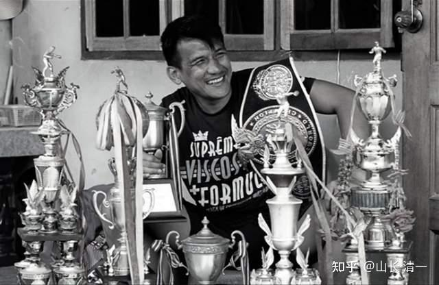
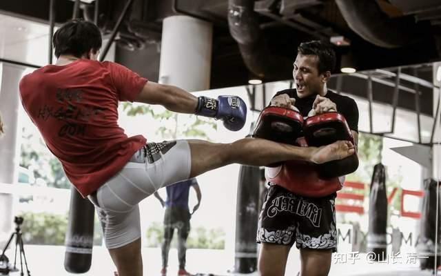
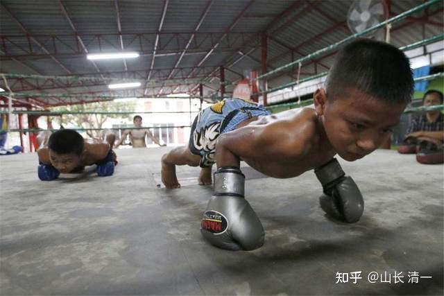
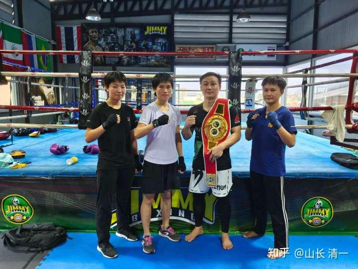
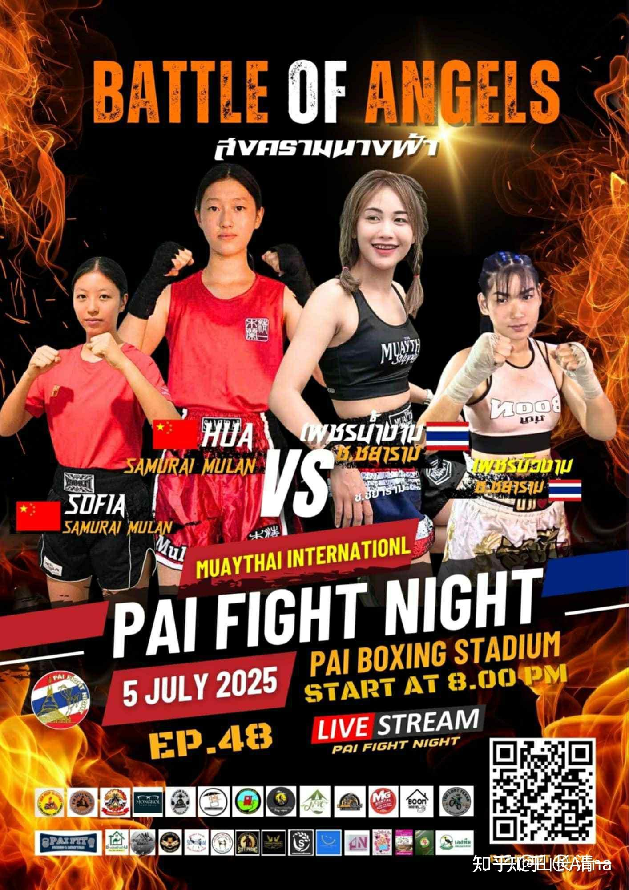

清一新教育 今日学堂 张清一原创文章

今天带清迈训练的学生们看电影【师父】。

剧情是：南派咏春传人陈识，想来天津开拳馆。他带出去有真功夫的徒弟，打了津门 8家武馆，留下自己的传承人，然后去过日子的故事。

天津武术的泰斗郑山傲，一心想要传武能为国为民服务，希望武林教真功夫的故事。

最终，是这两个武林的最高手，真懂武功的人，全都失败了。他们都被江湖人算计了。追求利益至上，赚钱第一的江湖人，联手把他们两人都逼走了。

天津武林，被一个武功不高，但精于算计，追求利益的女人控制，她成为了最后的赢家。真功夫从天津消失了。

陈识作为杀人犯的嫌疑，逃离了天津。他培养出来的弟子，也被杀了，他的传承失败了。

武林泰斗郑山傲，也被他最信任的徒弟军界人士林希文暗算，在演武的时候被击败，夺去了他武林泰斗的威名。但他这军界的徒弟，也被江湖人暗杀。因此，郑山傲这一系，也没人了。

**最终一个荒唐的局面就出现了：一群其实不懂真功夫的武人，掌控着天津武林的局面！继续教假传武，这个故事，挺讽刺的！**

徐浩东说：他写的不是武侠的故事，而是武行的故事，啥意思?

其实，英雄不是重点，武功也不是重点，而是这个行业的生态状态， 中国的江湖社会的实况，才是他关注的重点。虽然讲武功，他也懂武功，但武功，真不是重点！

所以，他的电影，不需要武功高手去拍的。比出动作来就行了！做到这一点，并不难！

比个云手不难，比个云手的实战格斗技巧也不难！

真的用云手去实战，这才难。他不玩这个难点，只玩前面两项！其实也好看！

我给学生的讨论课题是
1：武林泰斗的军界弟子林希文，他功名利禄心很重，他应该怎样上位？才最符合自己的利益？而不是利欲熏心，导致自己最后不明不白的丢掉了性命？

2：最后他丢命的时候，为何放的电影，是放他坑害师父的纪录片？这个电影，是用来干嘛的？取得的重要作用是什么?巩固了谁的地位？

3：武林泰斗郑山傲，他应该怎么做，才能改变武林的格局？让这些武馆都愿意教真功夫？自己和陈识也不至于流落江湖？

答案就不多写了。可以看冠军班孩子们的思考去！

武林泰斗郑山傲，身份地位年龄，都比年轻的陈识要高，武功其实也很高。跟陈识一个档次。

他也是一个武痴。他很爱才，希望陈识教真功夫。他因此尽量给陈识开了绿灯。如果最后陈识的弟子，击败 8家不教真功夫，只管赚钱的武馆之后，他这懂得真功夫的老拳师，要出来代表天津的武林，打掉这个懂真功夫的弟子。并把他驱逐出津门，然后陈识可以留下来开武馆教拳谋生。

但他知道陈识的刀法厉害，别具一格。因此：他为了保住自己的一世英名，他不惜放下身段，跪拜陈识，认他做师父，自己当弟子，学习陈识的咏春刀法（据说，现在教咏春刀法的师父，8 万元教一刀，不知道真假）。

我就给学生们介绍了中国传武的老规矩：

学生是学生，弟子是弟子，两者不一样。

学生不用跪下拜师，不算师门的人。跟随学习，交钱不交钱，都是学生。学多，学少、看个人因缘。

弟子就是师门的人，目标就是承担师门的责任，捍卫师门的荣誉！不再是为自己而活，而是为师门的责任和荣誉而活的人！

师门，不是老师的个人和家庭，而是老师的宗师，法门，一生要用自己的能力为师门服务，不是为老师的个人服务。因此，他不是老师的仆人，奴隶，而是宗门的仆人。

弟子一定是跪过师父的，不是师父要你跪，而是弟子自己诚心要跪传武的祖宗，真心尊重传武的人，一代一代的传承下去，这是一种承诺！

我唯一正式跪过的武林师父，就是刘老拳师！

2018 年，我带明仪和另一弟子去见过老师，另一人，已经早就离开师门了，我们就不提了。因此，明仪是真的跪拜过刘老师的第三代弟子，她认刘老师是她的师爷！

**学生们奇怪：逐出师门，真的是一种严厉的惩罚吗？**

我说：是的，很严厉！意味着这弟子。一生都不能在这个师门，宗门的圈子里面吃饭了！你在天津吃饭，你就要尊重天津，所以你击败了天津八家武馆，得罪了人，你就只能离开，去外地发展了。

中国的武林，现在完全就是乱七八糟的，真没有啥规矩。但泰国就是有的！

**可能大家都不知道，播求有一个同门师兄，在技术上他是超越了播求的泰拳天才。曾经的泰拳王者——林实奈。**

1995 年，16 岁的林实奈击败了 112 磅级别的西育东，拿到了这个级别的仑披尼泰拳金腰带。

1996 年，赛事的主办方给林实奈一个考验，**在没有提前通知他的情况下，在两周之后安排了他与 130 磅级别的拳王西拉猜，进行一场金腰带争夺赛。17 岁的他赢了。**

**大家都知道伦披尼金腰带的含金量有多高！他居然 16 岁就拿到了。**

*林实奈的顶峰时代*

之后**职业生涯中 300 场285 胜的传奇**，也将他的职业生涯带向了另一个高度。每场比赛，可以拿到最高百万 B级别的出场费，成为这个时代的明星！

但他很快陨落了，原因就是与自己的第二任曼谷拳馆的师父，推举他走上仑披尼的师父发生了矛盾，猜测是奖金的分配他不服气。此后就再也没有机会走上泰国的赛场了。

*训练中的林实奈*

他原来是一家小拳馆波帕姆拳馆训练，播求也在这里， 但这家小地方的小拳馆缺乏推拳手参加有价值比赛的实力。他练出来之后，就送给曼谷更高级的拳馆 ，据说是泰京拳馆，可以推举他参加高级的比赛！

估计就是因为他对于后面这家拳馆的师父不尊重，导致他被“逐出师门”，从此，他在泰国再也没有机会参加比赛了，因为泰国所有的师傅们，都会共同遵守这个规则。对被驱逐的拳手，无论你多大名气，都不给安排比赛。这就是封杀！

最惨的是，这个封杀，似乎也影响到了当年只是小师弟的播求等这些小伙伴，他当时在这家小拳馆的拳手也不被泰拳界接纳，后来就倒闭了。最终，播求是去海外打 K1 比赛成名之后，才成为泰拳形象代表的。

木兰们几年前去训练的清迈拳馆，也有一个类似林实奈遭遇的优秀明星泰国拳手，仑披尼冠军。他的水平很高，原来也很有名气，据说他拿过 60 万奖金一场的比赛。清迈拳场，只是给拳手 2000B 一场，你就知道他的级别有多高了。

但他也是被自己原来的师父封杀了，再也不能上泰国的拳场去比赛了。只能去国外偶尔参加一下比赛。拳酬也不高，一两万的样子。还很少有比赛。

他日常，就是当拳馆的教练。一个月一万五B的工资。在泰国，也是很一般的收入了。他对我们的木兰都很好，明慧她们都叫他冠军哥哥！我们了解下来，他和师父的故事，应该是师父不太对，抽成的比例太高了。他不愿意，提出希望提高分层比例之后，师父不肯。大概是发生了争吵，就驱逐他离开了。结果：他连少的钱都赚不到了！

你们就知道：泰国的武林中，被逐出师门后的惨状了！

也因此，泰国的拳手们，都非常的尊重师傅。上次小明慧带泰国拳手旅游的时候，就发现这些拳手们，都非常照顾一起去的老拳师！宁肯牺牲自己玩的机会，也要陪同老拳师。

相反，老拳师也特别照顾拳手，尽量给他们安排各种比赛的机会。我们的木兰，在泰国的一些档次高一点的比赛，就是他安排的。今天就有两场比赛在拜县打。佳慧她们几个人一大早就去了。

泰国的格斗市场发育良好，就和这些武林规矩的执行很有序有关系。这样馆长们才有信心去努力发掘拳手，包装拳手，推他们走向登顶的路上。泰国的拳手，从小去拳馆训练，是不需要付费的，拜了师父，就好好的练。 不用担心学费的压力！甚至打比赛， 安排食宿，师父也会包下来。如果培养的拳手，随随便便就离开了。师父的投资就完全泡汤了。

因此，我认为：这个制度，是泰拳事业兴旺的一个核心原因！加上赌拳，以及观光拳赛，泰拳的基础发展很好，中国格斗市场没法比的！

另外：我们也在泰国，看到了一些真心热爱泰拳的人，愿意不计报酬的来做泰拳事业！木兰们遇到的老拳师就是。他是泰国体育大学教泰拳的教授，培养了很多的拳手弟子。他退休后也不甘寂寞，因为他已经没有体力来当教练了，泰国的拳手不太去他的家庭拳馆找他训练了。我们木兰找上他之后，他就很高兴的当我们木兰的泰国代理人。安排比赛，刚开始，他还要求木兰们去他哪里训练，怕孩子们偷懒。后来看木兰们都很认真，而且我们练的项目与泰拳也不一样，现在就完全不管我们了，就是安排比赛的时候，他会去一下，你们可以看到一些比赛的场合，是他当场务指导，而不是我！木兰们的泰语都不错，因此沟通毫无问题，他也很喜欢这些女孩，对她们很好！

MANNOP 拳馆的老板，也是教练，师傅，也是典型的爱拳的人，不要钱也喜欢干！大概年龄跟我差不多的人了，还每天大喊大叫的陪拳手练拳，当靶师，这比我强多了。

我很少陪木兰方面训练的， 只是“指导”，纠正动作，示范要领。其实我很轻松，但泰拳教练们，真的很敬业！从头陪到底，每天的训练量都很大！

中国武术界有传言，泰拳手都很短命，因为过量训练。就跟人妖一样，是拿生命来换钱。所以，很多中国人，其实有点怕练泰拳！

这是鬼话的，我们见过很多老年的泰拳手，身体都很好。老拳师也 70 多了，还会开车送木兰们去外地比赛！哪里像是身体坏了的样子？

泰拳的训练方式，我真心认为比国内的好，毕竟是实战多年出来的模式。

国家队训练模式，令木兰们苦不堪言，还训练撸铁？往返跑？冲刺跑？可能是把其他运动体能训练模式拿来训练的！每天这样训练，体能消耗了很多，特别累，但技术没啥实质的提高。这算个啥鬼？

这跟格斗技术提高，我认为真心一点关系都没有。泰国没有这些怪怪的东西，正常多了，基本上是根据场上格斗的需要来做的训练！

参训的ELLA公主就说过，有个拳手，赛前训练的时候，撸铁特别棒，她看了很佩服，因为自己撸铁特别差，挺闹笑话的。看她力量很大的样子，以为场上出拳可能很重！结果实战的时候，这个拳手被打的很惨（不是跟她打，是跟木兰们都打了），她觉得场下怎么很牛的撸铁高手，场上就发不出有力量的拳了。

我说：出拳的发力方式，和撸铁的发力方式是完全不一样的。她练得越多，越熟练，就越挨打。除非是她去打没练过的人。但职业拳手，都是高手，是不会给她机会的！

所以，她看到的撸铁最好的一个拳手，居然是一路挨打的拳手，就没有赢过一场。不过，能够参与，也是算有水平了！

让官员来指导安排拳手的集训，而不是真正的世界冠军来安排训练程序，我看这种制度，很难培养真正的世界冠军。

*这是另外一个拳馆的馆长，金腰带拳手，全国双冠军（泰拳，拳击）*

*今天公主班两个孩子在拜县打职业拳赛*