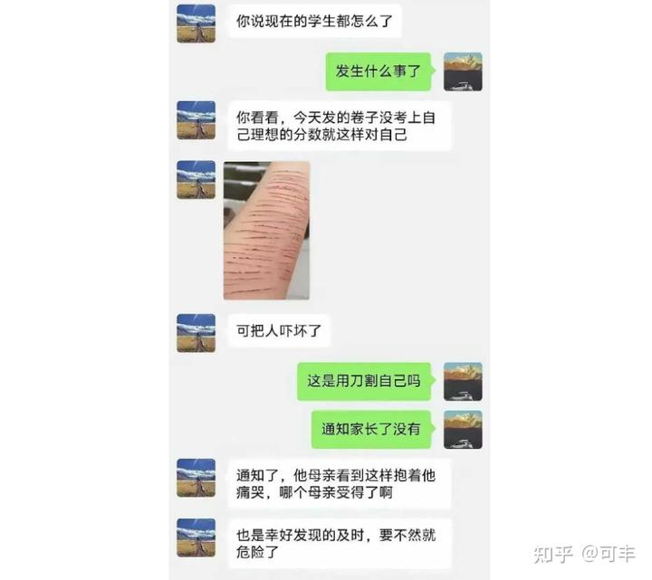

清一新教育 今日学堂 张清一原创文章：

**一：清黑说清一山长啃猪蹄，满柜子都是各种酒！他给学生的餐标是20元一个星期！**

你脑子不够用，弄不清楚这事情是真还是假！但你也不用去理睬到底是真的，还是假的。你只需关心你自己就够了。

你要关心的话，正常人就应该这样想：

1：你如果也想让你孩子啃猪蹄的话，你自己买猪蹄给你孩子去啃，你看会被清一抢走吗？

2：磨丁的今日三语，是供餐，而非订餐制。你的孩子想吃多少都可以。你可以一天给孩子200元的餐标，吃撑死都行，只要你愿意。

3：清迈武道馆，公主班，20元一周的餐标倒是真低。但公主班，武道馆的孩子，也没看出谁营养不良。打比赛打满五局也不见她们累垮，出来分享会的时候，你可以去问问她们饿不饿！

清黑说的这种情况，如果是真的，说明清一的20元比你的更值钱，可能是金元。否则，让你来做伙食的话，连买米都不够。每天吃一斤米都要3块多了。你有机会就去学学，没机会学这本事，就算了。

**二：清黑说，清一教育不是真教育，她才是！**

你也弄不清楚啥是真教育！标准太复杂，专家都弄不清爽。你只关心你想要什么就行了！

你想要三年学完12年，你想要SAT90%的学生都能过1400分，你就选择清一假教育！

你认为你要“真教育”。你就去选你体制学校好了。去读国际学校好了！你当然有权力去用国家大纲要求的12年，去学完清一假教育只需要四年就学完的功课！这样你减轻了孩子的压力和负担！让孩子轻装上阵！

你只希望你的孩子，将来不要遇到清一新教育的学生。这些拥有三语四语的学生，你的孩子恐怕竞争不过！

**三：清黑说：清一新教育的学生，没有国家许可的文凭，考不上好大学！**

1：就算这群黑子说的是真的（假的），今日学堂就是傻到只会教学生学本事，就会抓成绩，不会申请大学，这很简单呀？你认为是学出和考出好成绩更难呢？还是请人帮申请大学更难？

你先让孩子把学习成绩搞好，本事学到身上去，你再找个善于包装的国际学校，花个一年时间弄包装，不就可以了？据说，有些国际学校，只要SAT分数1350分，就让你免费读高中，他们帮你补齐申请材料，帮你申请名校。你这样来读今日，不亏吧？

**四：清黑小鸟们说，清一武道馆的武术，都是瞎练的，成绩都是假的，冠军都是送的！对手都是差的！**
就算清黑说的是真的。但孩子们拿到的证书，金牌等，都是国家体育总局举办的锦标赛，这些证书，肯定是真的，有权威的证书吧？

就算清一教的是假功夫，你跟着混个两三年，也没花学费，你拿这个证书去申请大学，大学也给与加分待遇，有啥不好的？你18岁去上大学，不去啥清一大学，你就不吃亏了吧？

**五：清黑们说：清一的学校，都不教理工科，不学数理化，学生也不考大学，将来没出路！**

1：就算清黑说的真的，你真的想让你孩子15岁之前学理工科吗？这不是大学的专业和课程吗？是不是先打好基础更合适？

2：清一大学是只教文科没错。可你家孩子，不去读清一大学不就行了？你们孩子，15岁拿到SAT的高考成绩就离开，去读国际学校去，去读世界大学去，去读理工科去！没谁拦你吧？

**六：清黑说，她在今日三校做教师，就像地狱一样恐怖！清一山长特别喜欢PUA下属，她都被逼的快自杀了！**

额？今日三校比希特勒的德国的集中营还坏呀？

好吧，就算清黑说的是真的：今日当老师很苦逼。职场卷到飞起！但这不关你的事情把？老师的日子难过你去管啥，你关心学生会不会难过才重要对吧？这么多的学生，都是哭着喊着要退学离开今日三校的，是吗？

如果不是，只要你的孩子学习好，身体好，成绩好，你管啥教师自己感觉好不好的，你可以自私一点。就像去海底捞一样，服务员累死了你不用关心，只管他们把你服务好不就行了。

你不用来当圣人拯救今日三校被压迫的教师吧？除非他们求你帮助，你就帮他们打个110？

**七：熊黄清黑们举报我们的学校是【有境外宗教人员出资和操纵控制的道学性质的宗教学校】**

就算是真的。你要问自己：

1：老师让孩子信教了吗？你的孩子会参与什么宗教仪式没有？

2：磨丁的今日三校，是否有宗教嫌疑？食堂提供肉食，供你孩子选择吗？

3：你要的是教学品质。又不是申请入党。中国人还有专门送孩子去西方教会学校读书的，你是不是只需要管自己的孩子学到了什么？学校的主办人有啥信仰，管你啥事？

**九：今日三校创办人不爱国，不回国。不给国家交税！**

就算是真的。在国外居住生活工作，就是不爱国。那么

1：他们的学校教学结果很好，你作为家长，要教学的结果，还是要多管闲事？

2：税没有收的话，是国家公务员失职。这些清黑是公务员吗？你是他们聘用的人吗？

**十问：清黑告诉你说，今日三校的学生，SAT考1500也没用！打泰拳拿了冠军也没有用！**

好吧，就算是真的！

考多少分？才有用呢？难道考了1100分，然后去让清黑们帮助你“刷简历”，你就能上常春藤了？

是的，你不打泰拳。如王聪颖所说，你要去打高尔夫，别人才会认同。那么--你的孩子能击败老虎伍兹吗？至少，你是不是让你的孩子，在今日先拿到1500分之后，再去打高尔夫？

**十一问：清黑们组团爆料，花费很多时间，用了很多小号，在网上叫嚣。你认为是为了帮助你得到比今日三语更美好的东西吗？他们给你的答案是什么？**

1：不选新教育，你就要去体制学校，国际学校。你真的了解，和满意他们的教学结果尺吗？

2：你真的以为，非亲非故的清黑，这么关心你孩子的未来吗？他们为啥不关心自己？

**十二问：清黑们说，今日地下恋情很严重，还有师生恋。教师们都忙着强迫学生跟老师谈恋爱，而不是搞好教学。**

就算是真的：

一：现在体制学校都已经是“不谈恋爱就不是好学生”了。官员们都是"不找情人就不是好男人了”。女生们都是“不傍大款就不是好女人”了！你到哪里去只一片净土呢？

二：今日三校的师生们一定有过人之处。边谈恋爱，边学习，学生们还考出了50%学生SAT超过1500分的成绩，三分之一的学生可以拿到全国格斗冠军的身份。如果能这样恋爱学习两不误，这似乎也不错呀？

三：如果你的孩子在这里不恋爱，而是认真学习，那么不是可以考1600分？拿更多的冠军，世界冠军了吗？

**最终质疑：**

**你不相信做出了教学结果的学校，你不相信你看到的学生的状态。你不相信学校的家长和教师和学生真实的情况！**

你只相信网上一群蒙面小偷偷偷告诉你的“真相”，你是什么人呢？

如果你未来的教学选择的结果不好，你是不是活该？

因为你就是不会思考，不具备常识！

还有：下面的体制学校的学生，更可怜。更值得去挽救，这样的学生。中国还有很多很多！清黑们如果真的是好人，她们干嘛不去拯救这些可怜人?

这群黑子们，为何要在这里天天浪费自己的时间和精力，去“拯救”这些正在高高兴兴的考常春藤？正在打冠军，想要为国争光的人呢？

如果他们想让我们的冠军们，公主们，跟他们一样去做黑子吗？那他们干嘛不拿出来他们值得学习的榜样和案例，自己取得的成就给我们看看？让我们去模仿学习呢？

**你看到了黑子的攻击诬陷诋毁，看到了黑子们可以说不。但你看到黑子给你指出的道路和方向了吗？**