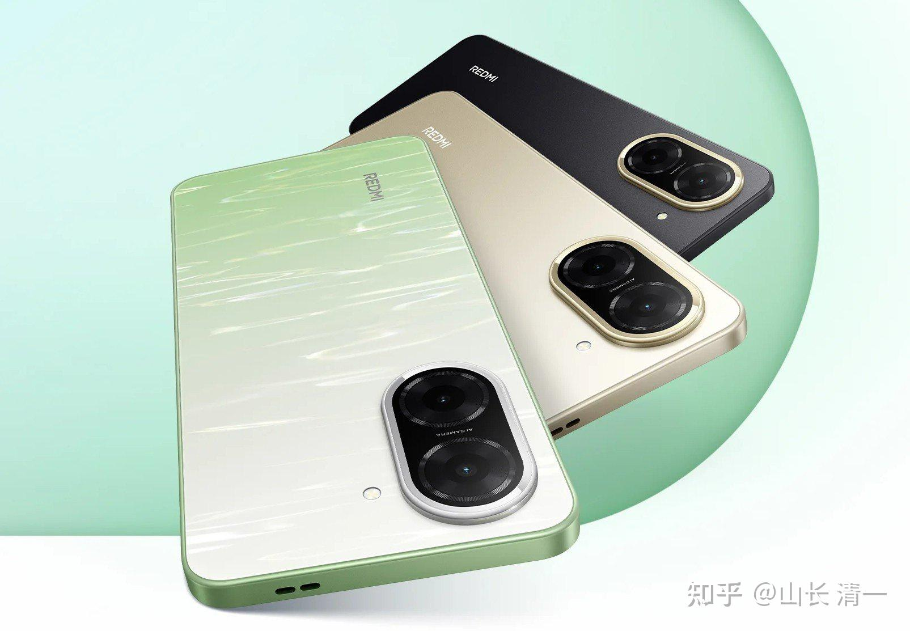
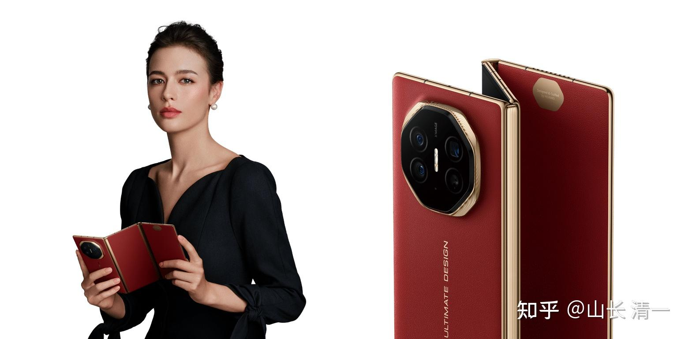
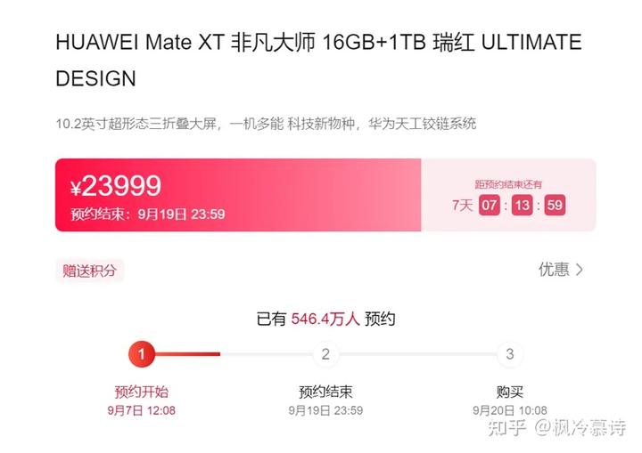

清一新教育 今日学堂 张清一原创文章

**我昨天换了一台新手机--8年来我的消费“降级”了10倍**

还是2018年，刘老师买了一个新手机送我。华为当时刚刚推出来的MATE20PRO顶配版。刘老师就喜欢买“最好”的给我，好像是6000多吧？我怪她提前不告诉我就乱买手机，买电器我肯定比她在行，就让刘老师以后不准给我买手机了！我真用不出啥好坏来，我太土了！

于是，我的M20，就一直用到现在！中间好几次，刘老师都说我该换手机了，结果我说还能用，换啥？

现在，这个手机的按键都坏了，无法正常的关机开机了！我只能勉强凑合使用！

因此我同意换一台新手机！昨天正好陪刘老师去银行办事。去BIG C的时候，就看了一下手机。我看小米新出的一款手机不错，A5，性能比M2还好。我选了64G的标准版，价格才2499泰铢。另外一款128G的要2999，我认为没必要，我用起来感觉就没差别！而且电池比M20PRO的4200还多了不少，有5200容量。更轻，更薄。用起来反应速度更快，挺方便的，没啥不方便的！足够我用了。

我计划以后回国，就只用这个手机了！原来的手机里面，还有银行账户，炒股账户啥的，现在我都不用了。干干净净的，就只有基本的社交网络，QQ微信，其他的功能都不要了。主要是防绑架。上次小鸟转款，看我会用手机查看银行账户，就让她起了这个心。现在我身上啥都没有，抓了我，也只能用微信的钱包，里面也没多少钱！买点饭吃，是够用的！敲诈多了，是没有的！反正账户啥的我也记不住，我就在家里面用电脑和U盾操作就行了。不用手机银行了！我本来，也就习惯用家里的电脑！不喜欢用手机的！

*红米A5 这就是我昨天买的手机！*

好了， 你们可以笑话我了。今天一天，我的账户就赚了N个W，我居然买了一款民工用的手机！是不是特别的抠门？

但我真的觉得，这个A5，真的比M20好用，手感也很好，软件也很方便（小明慧帮我弄成了中文版的，原来是泰语版）。我认为这肯定不是我乱吹的，7年前的旗舰，未必超过现在的入门机器（当然M20是四摄，小米两摄，也许照相会差一点吗？但会不会镜头质量更好一些呢？

但今天。我又干了一个“土豪”的事情。

今日我接到一个咨询的单子。一对夫妻，要咨询财富管理，说他们家，按照我原来教给他们的思路，关闭了原来的企业，把资产都投入到股市里面去了。家庭资产按照我的方法和股票来投资，已经赚到了1000万。现在心慌慌的，想找我付费咨询，下一步该怎么投资？每年她们家还有一百万的租金到手，该怎么办？

我居然放弃了这个白送的，让我赚20台手机的机会！直接免费给了这个老板回复：

【看了你给我的这些持仓，都没啥问题的，拿来持有10年也不担心的。你现在只需要长期持有这些好股票，死也不卖光、坚守下去吃利息，你一辈子花不完了。就是中间，看谁涨多多了。你实在涨到睡不好了，就去换没太涨的其他股票就行了。如果没啥其他的事情，你就不需要找我咨询了。省你这一万元去买股去吧。你可以买到一千多股中国建筑了[表情]。雅戈尔的股息我看蛮高的。也可以买一千多股了！你想买也可以买一点（我没有买，目前一股也没有，但我如果有多余的钱，买一点吃利息也可以的）。

瞧我多傻：送上门来的一万都不要，还把答案直接送给她了！【如果她的持仓，有明显不合理的股票，我就会接单，让她清理掉换股了，我手一万，但至少会帮他赚几十万，上百万、但她的持仓，全是我分享过的，我就只好放弃了】，这就是自尊尊人，有钱也不赚！

这和我“有钱也不乱花”的原则是一样的。这就是富足之心。需要去修！贪心一起来，就啥都没了！

ELLA还告诉我一件事情。说她笑死了，笑得肚子痛：

因为她看到孙某人在网上大肆讲故事，是讲他在在2017年，第一次跟我见面时候的故事。我跟我们班一个富豪同学斗车，我比输掉了，所以我非常难堪云云。因为我的车，是丰田的汉兰达，我以为很豪华了。但我一个老板同学的车是路虎（其实是一辆红色的保时捷）！一辆就等于我的一个车队。我比不过别人，没面子，我就气死了！都快要动手跟人打起来了。

他还出来劝架，还出手帮忙“教训了”一下富豪哥！让我欠下了他的一个大大的人情。

清黑们还纷纷附和：说清一就是没见过世面的人，土包子一个！还以为啥本田丰田就是豪车了，居然开个30万的车，就敢来同学会显摆，真是欺负天下人都是农民，啥都不懂。所以，我就是“土豪”的代表，一群人得意洋洋的。

ELLA想象他们编造的这个故事，觉的太可笑了！所以她偷偷的笑死了。这群清黑心中“想象的山长”形象，跟她在身边跟随了多年的真实形象相比，实在是差距太大了！

2006年，我跟刘老师初识的时候，我让她拿20万来开户，我帮她炒股。不到一年，她的账户就增值到了400万元！刘老师年底春节的时候，说要取钱去买一台最好的车送给我，是【陆地巡洋舰】，因为她听我说，这是“百万豪车”中非常实用的一款，比啥宝马啥的好用多了。（某个房地产的大老板，接我们用了这个车，刘老师听我介绍说这个车非常高级。她留留上心了。想要用她的钱来买了送给我）。

我说：为啥要买百万豪车送给我？

刘老师说：因为只有最顶尖的豪车才配我呀？

我说：我没豪车，是不是我就是高级了？

刘老师被我说傻了。但还是坚持说，要买百万级的车送给我。说我太会赚钱了，这么快就赚了400万，她要拿出100万来奖励我一下！

我看跟刘老师讲“复利原则”，根本就讲不通。她只管感情原则：她喜欢的人，就应该送他最好的车（这个观念，一直在刘老师的意识深处，总想把最好的东西给我。比如2018年买M20PRO顶配版）。

好吧，讲感情。我也会讲的！

我就跟刘老师说：你看现在我去大学里面上课，演讲等等。我就算只开辆20万的轿车，女生们看我的眼光都很温柔！

如果我开一辆百万豪车去上课，你认为女生们会不会看我的眼神，会燃烧起来呢？

（想一想，20年前的百万豪车，肯定比现在比亚迪的U8更拉风吧？）

很不幸，我一讲感情，刘老师就不在跟我讲感情了！因为她真见过女学生给我递过情书的，我演讲完，她去接我的时候，还遇到过“可以杀死人”的恨恨的眼光看她！她知道我还是有点小魅力的！

她听我说：百万豪车会给她带来更强劲的竞争对手后，马上就取消了要送我豪车的计划！

一直到现在，我都没豪车开（哈哈。我不会说话，所以丢了得到豪车的机会）！

好处就是:刘老师的这个账户，被我打理了20年之后，增加值已经是百倍，现在已经成为了三家上市公司的十大！

如果当年真的抽出一百万多万买了豪车。现在起码会少一家上市公司十大吧？

但我们车库里面，会多一辆开了20年的老爷车！您觉得哪一个版本的故事，会让您更开心？您愿意成为哪一种人呢？

现在我在泰国开的车，就更惨了。我现在开的车，连丰田本田都不如，是国产的MG，也就是一辆十几万的SUV。另外的车，就是皮卡车！一点档次都没有。

ELLA也有一个怕豪车的笑话！不像贵公主。

我们有一次出行，坐的是丰田百万级的豪华商务车**丰田埃尔法**。泰国这里山路弯弯的，ELLA和明慧坐这车，都要晕死了！从此怕了豪车！

我告诉Ella，富贵人家的女眷都是坐这个车的，方便带孩子！但是，明慧和ELLA一致认为：这个车，还不如皮卡车舒服！

因此：我们返程的时候，从老挝回泰国，过海关后，就真的租用了一辆丰田皮卡车回来了。两个小家伙说：还是皮卡舒服！起码不晕车！（面包车同价，我们要老板换了皮卡车）

我也一样，我说我们是穷人命，享受不了富贵人家的生活！

我坐这种豪车，也是会晕车的，我们都很土！我估计是悬架问题，我真的受不了高档车的这种奇怪的悬架，好像坐水床一样昏呼呼的！特别是山路更难受，真心不如皮卡更自然！

所以，我在泰国，有四辆皮卡车，三辆轿车！

没有豪车！前英国主人离开之前，希望我接受他的百万级的豪车，以及跑车（他有20多辆车）。我就只要了他的皮卡车！一直到现在还开着呢！

我对消费的看法，与一般人完全不一样！我会用一个跨越时空的眼光来看别人以为的“享受”！

你在我面前炫耀你的豪车，我会恭敬地说：这车不错，比我的强多了。可以买我的车十个了（其实保时捷价格也就90多万吧），我就丰田换本田，都是“田”里面转的土农民！

你嘲笑我土。但我内心里面，可能嘲笑你傻帽！

因为你拿20年后一个十大股东的地位，来换一辆可以轻易替换的车！

你拿了这个豪车，等上20年，当上十大后，可能每年发的股息，都可以买回一辆车了！

半年报，你们会看到我进入了中粮糖业的十大。那么，今年7月30日，中粮就要分红了！我持股可以拿到多少分红呢？会有好几百万！而且，今年年底，11月，还会拿一次中期分红，还有大概三百万可以拿！

股息的红利税应该是20%。但如果我持股满一年不卖的话，我的分红就免税了。我计划持有中粮十年！（除非他涨疯了）

您说：我20年前，干嘛要拿一个每年白送好几辆豪车的“十大股东地位”，去换一个我开不开都差不多的车？我是不是超级大傻瓜？我 难道真的要用来泡妞吗？我就更亏了！

当年，刘老师的陆地巡洋舰没有买。但她每年用这辆车作为老股本买的股票，一年分红就可以稳稳的供养清迈冠军班学生们一年的生活开支。她不比去开啥豪车都更有价值感吗？

她现在对这局面，会更加的心满意足吧？

十几年前，刘静慧的文章，就写了她的手机价值600万元（17岁她父亲给她的三星旗舰机）。现在我去买个19900的华为旗舰机，我会不会也这样想？

我觉得我用这种机器，就是大傻帽一个！手机，日常能用就行了，花钱拿来炫耀给人看？就实在是太傻了！

*华为非凡大师19999元。我该买这一台手机吗？*

你想要一台“非凡大师”的手机？还是想成为非凡？让上面的冷美人爱上你？为什么你一看就动心了呢？就乖乖掏出了钱包，去买这你不需要的机器？

**我认为：我买个A5，再加个平板，两个机器，绝对就能顶上非凡大师的使用场景了！肯定更好用。**

好的，大家知道我对豪车，豪手机的态度，自然知道我不可能去跟人比富，比车，比手表，比喝酒，比喝茶。

**我觉得这些人都是被商家忽悠的傻瓜！**

都在把钱丢水里面去！被商家忽悠消耗的笨蛋。

还有：**对于男人们最热衷的“女人”，“情人”的消费，各位知道我是啥态度吗？**

更可笑了。我就更是傻到“不开窍”了！

我在武汉大学的时候，教师们就传说我有很多“女大学生情人”。因为我是名嘴，我上课的教室里面，都拥挤得满满的！

当年，大学教书的时代，还有个老朋友来告诉我：知不道有两个外语系的女生，为了我还打起来了，闹得全校皆知（我上公共课，也上过外语系的课程）。我完全蒙了，说我不知道这啥事？

这老师告诉我说：有两个班上的女学生，班花级别？她们两人是对手，还都喜欢上了我。两人上课都坐在前排来“认真听讲”，积极表现。有一天，我下课的时候，对她们笑了一下就走了！结果这两个女生就开始争吵起来了。一个女生就得意的说：张老师下课的时候，是特别对我笑的！另外一个女生就说：别自恋了，张老师明明是对我笑的！

她两互相不服气，先是吵起来，接著就打起来了！此事闹得很多老师都知道了。但我一直不知道（因为我不住在大学里面。上完课我就走了）。

这个朋友跟我关系比较好，好像也认识这几个女生（他也是武大的几大名嘴之一），他找我的目的。就是问我弄清楚：到底我是对谁笑的？这两个女生，我到底喜欢谁？他说了两个名字，我完全记不得，更对不上号！

我弄得目瞪口呆的？说我不认识这些女生，我上课从来不点名，因此对谁我都叫不上名字，对她们都无感！我下课的时候，笑一笑，是一个人的礼貌修养吧？我没有传递暧昧信号给任何人的意思！这两人，谁我都不认识！

老朋友失望而去，觉得我“不老实”。我后来猜测，他可能是替两个女生来“查探最终结果”的！不然两人这架不白打了吗？（外语系的女生，还真够开放的）。

后来还有一朋友，问到这种事情。说我条件这么好，又是老板。武大首富，又是名嘴，学生很喜欢我上课。我怎么不多找几个情人！

我就说：我去找10个女大学生做情人，你们觉得怎么样？

他们坏笑，说你有实力，找10个也没问题呀？她们愿意跟你就行！

我说：我们想过没有，今天你找10个年轻貌美的情人。20-30年后是啥样子呢?

他们说：想这么多干啥？快乐一天算一天！

我说：你只要想想，现在你身边围着10个年轻女人，你觉得“很幸福”！“艳福不浅”。

如果你多想想，20年，30年之后，有10个老太婆，都围着你唠叨，你怕想死的心都有！

现在羡慕你艳福不浅的朋友，20年之后，看你被10个老太婆围着吵闹，恐怕就不是“羡慕嫉妒恨”你，而是可怜你！嘲笑你了。

当你学会跨越时空。用20年，30年的眼光去想未来的可能结果的问题时候，你就会发现：你现在的有些选择，看起来光鲜，但时光可以让这种美好的选择，变得极其的荒谬，可笑！

如果女人是花，你大可以远远的欣赏，干嘛总想带回家呢？

**带回家的花都会枯萎，但让这些花，在野外自然的绽放。看她们花开，花落，不是很美吗？**

你喜欢看花，就为她们浇浇水，施施肥！拔一拔草，让花们开的更艳丽！

这样不更好吗？

**爱美之心人皆有之！干嘛总想把花朵折回家，让她陪你一起枯萎呢？**

生而不有，为而不恃！老子的教导真好！

爱是付出，不是得到！

得到之心，如果得不到，带来的摧毁一切的恨意，是最可怕的！

退一步海空天空！

对豪车，对美女，对手机，都一样！

平常心。就是最好的！