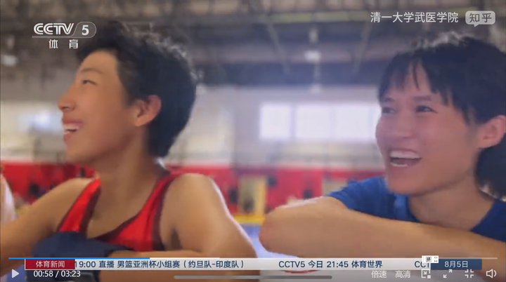
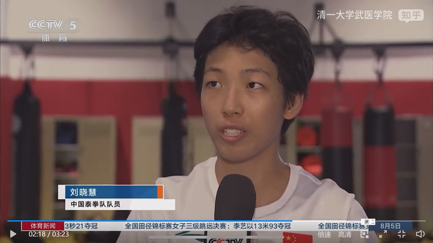

2025年7月27日至8月1日，是全国泰拳青少年锦标赛和巴林亚青会的预选赛时间。 清一武道馆派出了总共16人的战队前往参赛。在核心队员都已经超龄（超过18岁）的情况下，我们本次赛事依然取得了不错的成绩，结果如下！三金 六银 六铜

2025年10月，我们还将派出40名的队员（冠军班和公主班全员），参加全国自由搏击锦标赛，以及全国泰拳成人锦标赛。也有可能会派人参加东亚锦标赛。我们认为今年应该会取得比2025年更多的奖牌和荣誉。

2024年我们已经“制造”出来了15位全国格斗冠军。今年还将有更多的拳手，有机会拿到全国冠军的称号！

目前我们的格斗队伍，培养梯队层次分明，明年，2026年10月，会有超过70名拳手参加全国格斗锦标赛。但最强战队，将在四年后，公主突破班的学生考上冠军班以后才出来比赛。这批孩子，从11岁就开始针对性的练武术基本功，将来会比现在的公主班强悍得多。能够取得更好的全国赛事成绩。

四年后，清一武道馆参与全国赛事的格斗队员，每年都会超过一百名（请注意---现在每年参与全国格斗赛事的拳手，也就两三百名）。显然，我们将成为代表中国格斗最大的一支队伍，对外作战的主力战队。因为清一武道馆诞生的目标，就是击败世界各国的冠军拳手，为国争光，不是在国内争名夺利。

目前，清一战队已经是全国格斗锦标赛事的第一队伍。每次参与赛事的队员最多，每次拿到的奖牌总数也最多，这只突然出现在国内赛场上的格斗队伍，也引起了一些老牌武行人士的关注，也有一些不太好的猜忌和不符合事实的传言。

为了让相关方面了解我们的情况，本次赛事前，我写了一封说明信，给国家体总武管中心的领导，说明和介绍了我们的情况。在赛事第一天，就交给了国家体育总局的领导们，裁判们。

现在赛事已经打完了，我就把这封信公布出来，让各位了解相关的情况。

**国家体总武管中心的领导：**

**您好！**

真的不好意思，我们的队员自从去年参加比赛以来，已经引起了圈内专业人士的一些关注和议论。也有人多有不解！ 一些人凭猜测，会胡乱想象我们的突然出现，会有很多想象的故事，也许会影响到武管中心的领导对我们的判断。

因此我想借本次我们队员参与选拔赛的机会，说明和介绍一些基本的情况，免至误解。我想从5个方面汇报一下清一武道馆的实际情况，希望领导们增进对我们的了解：

1. 清一武道馆拳手的来源；

2. 清一武道馆格斗目标和职业选择；

3. 清一武道馆的资金来源；

4. 清一武道馆拳手吃素的问题；

5. 清一武道馆对传武传承问题的探索。

我是张清一，原来是武汉大学的哲学课教师，现已退休多年，长居清迈养老！全家人都在清迈居住和生活。

我是太极拳和传武的业余爱好者。1980年我上武汉大学之后，才开始接触一点传武作为业余爱好练习。我认为传武很有魅力，也很有潜力。但我也没有时间专业练习，所以一直是个门外汉，缺乏专业的武术学习和从业的背景。

2017年徐晓东出来贬低中华武术，贬低太极拳，一些假大师纷纷曝光，导致全国上下，纷纷认为中华传武是骗子。大众对中国武术也失去了信心！传武的光辉形象，就只能在小说，电影，电视剧里面去表现了，我认为这是一件非常遗憾的事情！

我认为：传武式微，与传武长期脱离实战训练有关，并不是传武就不行了现代格斗就一定比传武先进。

但练传武的套路，也的确解决不了传武的实战问题。可能练了多年套路，还打不赢一个练现代格斗只有一两年的新手！因为脱离了实战格斗背景的套路，也就是体操罢了！只有把传武的格斗思维+格斗哲学+训练模式+和传武的招式动作互相结合，还要研究现代格斗的规则，并针对训练，参与与现代格斗的实战，才能呈现传武的原始风貌！

只要让传武补上实战这一课，中国传武是能够在世界武术界拥有一席地位，甚至是较高地位的。

由于种种原因，多年来，国内的传武人士，一直没有人出来做这个工作。我很期待，也很失望。

如果没人做的话，我这门外汉，就摸索着从头开始，做一些尝试性质的工作！

因此，我在2019年开了一个清一武道馆。试图用传武的训练方式，以及不同于现代格斗的对战思维和逻辑，再加上与号称站立格斗最凶猛的泰拳职业拳手，去做真实的对抗比赛。在无数次的实战中，去提高传武的拳手对于格斗和武术的认识。

目前来看，这个尝试是成功的，**首批队员七名，均来自于一所私立国际学校的学生！过去完全没有武术格斗训练的基础，从零开始训练！**我们在泰国北部，已经打出了很好的名声。提起我们清迈的武馆（SAMURAI MULAN)，泰国的泰拳界都认为是一只强队，到现在，两**三年时间内，我们已经打了四百多场职业赛事，KO了一百多场泰拳各国拳手！**

2024年1月，我们的首批队员，首次回国参加**2023年的全国泰拳锦标赛，取得了3块金牌，**首开记录！

**2024年12月底的时候，我们的队员已经取得了16块全国锦标赛金牌，3块东亚锦标赛金牌！**并帮助中国队在东亚锦标赛上，夺走了东道主香港队的四块金牌，取得了中国队历年参赛的最好成绩。而东亚强队香港队，2023年取得了10块东亚锦标赛金牌。但2024年我们参赛后，就只拿到五块金牌了！2024年香港队来内地参加全国泰拳锦标赛，居然金牌数为零。

说明香港队的地位，已经受到了中国拳手的强烈挑战。其中香港队两名男队员的金牌，就是被我们清一武道馆培养的男拳手拿到了手。其中一名还是我们刚训练不久的新拳手，就击败了香港队连续两届的全港冠军，以上两届东亚锦标赛的冠军和亚军对手最终夺冠！

**2024年，我们也为中国的国家格斗队输送了3名队员。分别参加土耳其的世界锦标赛和成都的世界运动会！**

2025年，我们会有更多的拳手参与武术管理中心举办的全国锦标赛，**今年下半年的参赛人数，大概会有40-50人，**有望会取得比2024年更好的成绩！

由于我们是一只全新的格斗队伍，我们从教练到队员，与国内的武术专业团体，都没有啥关联关系。因此我们这只格斗队的突然出现，引起了一些专业人士的关注，和议论，也有一些不合实际的猜测！

所以我希望借此机会，介绍一下我们的来源，以及说明一下我们的想法和打算！

**第一：清一武道馆拳手来源。**

我们的拳手目前全部都是业余的武术爱好者。将来也并不准备从事国内的武术和体育职业的工作、我们目前的目标，只是回国参与锦标赛，没有其他的职业打算。

我们绝大多数队员，都是未成年人，她们中的大多数人，将在18岁以后，就离开擂台，去海外上大学了。因为他们都是一所国际学校的学生，只是业余来练武强身健体，也为孩子们申请大学做一些业余爱好的补充活动！

**第二：清一武道馆格斗目标和职业选择。**

我们倡导的理念，是提倡【文人格斗】，培养文武合一的业余武者。

有点像奥运队员一样，提倡业余体育活动，而不是靠武术作为职业，来谋取饭碗的体育人。**我们的拳手，基本上都是学霸，都能掌握熟练的三语能力，可以轻松考入顶尖的国际名校，将来去读书上大学，对他们来是才是正业！**

我认为：中国武术格斗，想要职业化生存的难度会很高。由于中国不像泰国这样有职业格斗的生存环境，中国拳手想要靠打拳来维持生计，基本上是不太可能的。

只能靠国家养（拳跆中心模式），或者民间爱心人士来投资养拳手（我馆模式）。想要靠格斗和武术市场来生存，是很不现实的。这也是国内很难培养出优秀拳手的原因，因为格斗队员的后顾之忧无法解决，也导致了大多数拳手无法专心练武，取得优异成绩！

我们的队员，无意走这条职业体育饭碗的路！大多数只是作为业余爱好玩一下格斗，没有终身从事格斗行业的想法。

基于这种认识，我们训练的拳手来源，就不是国内的武术学校一样，主要是一些年轻时候读书读不上去，考大学无望的学生，就只能靠练武，去谋取一条另类生活出路的年轻人。

相反，**我要求我们的拳手，必须是15岁考完美国高考，达到top5%优等成绩的学生，才能来泰国清迈，在我开设的武馆进行正规的格斗训练。**

**在三年后，这些学生，就可以去打全国格斗锦标赛了。在取得成绩后，18岁这些学生就都去上海外的top100大学，成为文武双全的人才，为国家服务！**

大约培养三年后，**会有一两个有格斗天赋的学生，**家庭也愿意和支持的话，**才可以留下来多练三五年！**目标就是参加世界格斗锦标赛，**为国争光！**

最终这些人的出路，可能是留下来当教练。但显然国内的武术界市场并无太多需要，因此其他人，都需要去读大学，自己就业！

**第三：清一武道馆的资金来源。**

来清迈参加训练格斗的拳手，都是拿奖学金的优等学生。由于我们也没有谋取职业道路的打算，因此也没有往商业赛事上靠。而是更像是一个学校一样，只关心如何培养出学生（拳手）来，不关心是否盈利。

目前，我们的武道馆运行和培养的资金，均来自与家长的捐赠。不足部分，主要是我个人来全额承担的！**所有的费用，全都是我们的自有资金，没有任何国外势力的加入。**

对于我个人是否有能力养活上百人武馆的问题，我需要说明一下：我是一个很幸运的人，从34年前（1991年）就开始炒股，我是中国股票市场的常胜将军！目前已经是三家上市公司的十大股东，每年的分红就有上千万元。

我个人也没有其他的不良爱好，因此没有啥花钱的地方。目前我靠股市的分红，就能维持上百人的训练生活和比赛安排。因此我们的武道馆的活动，根本就不需要其他国外势力的资金支持。所有的开支，全都是我们的自有资金。如果实在有不够的部分，我还可以找家长们去化缘来解决！

**第四：清一武道馆拳手吃素的问题**

在我们的队员，参加国家队集训的时候，清一武道馆的拳手均以素食为食，应该也引起了一些人的猜测。传统的武术运动员，都认为肉食才是力量的源泉。**但我们的研究，就是世界范围的研究，也已经证明了肉食的局限很大。**

1. 首先是肉食的激素问题很严重，对运动员的体质会有不良影响，甚至对兴奋剂的检测都有问题！

2. 就是肉食的消化周期很长，非常影响运动员的身体机能恢复。

3. 肉食者的耐力要更差。对于格斗队员来说，这是非常关键点取胜因素！国内的拳手，往往第一局很猛，但第二局，第三局就出现快速的体能衰竭现象，技战术此时很难发挥出来。

因此，为了取得更好的胜率，清一武道馆采用了素食，谷食为主的方式。**六年来看，我们的拳手体能良好，打满五局完全没有问题！**缺点就是我们没有重量级的拳手，因为素食的体重往往偏轻。

4 另外，相比肉食者来说，赛前降重我们的拳手空间就比较小，往往只能打和自己真实体重差不多的量级，短期大幅降重，对我们拳手的身体损害会更严重！

**总之，我们的饮食方式，与宗教信仰完全没有关系，我们没有人去信任何教派。**学生不训练，不打比赛之后，她们回家想吃什么，都是自由的！将来去上大学想吃啥都是自由的！

**第五：清一武道馆对传武传承问题的探索。**

总有极少数学生，是真的热爱武术的人，想要获得更长期的训练，达到顶尖格斗手的水平。

比如用10-20年的周期来培养人才。毕竟太极十年不出门，如果没有10年以上的长期训练，我们是培养不出来真正能够为国争光，为中国去夺取世界冠军的顶尖人才的！只参加国内的锦标赛，其实难度并不大，还不如泰国的职业拳赛。但想要去参加世界锦标赛，我们的拳手只培养三年就是肯定不够了！

因此，我们也有计划，给一些明显有特别天赋，也有愿望好好发展武术格斗的年轻人，留下来长期训练。这种人，在取得全国冠军以上资格后，家长支持，个人也强烈热爱，加上良好的武术悟性，才有机会留下来长期训练。

我们可以给这些留下来长期训练拳手提供良好的生活和发展的条件，供养起来专心训练，并解决这些人的后顾之忧（每月发给工资，解决职业退路，解决谋生问题）。

目前达到这个级别的拳手，我们这里有五六个！未来可能会有七八个人。**这些拳手，都是武术格斗的深度爱好者，我们希望这些人，将来作为传武的资深人员，可以为传武的发展做出一些贡献！**

**如果中国将来，需要他们去击败外国拳手，去为国争光的话，我们非常愿意为国效劳，尽力派出符合国家需要的格斗拳手，争取为中国成为格斗强国而努力。**

当然，如果中国不需要他们去出战的话，我们就会在国外，自己玩自己的武术研究，自己去参加国外的各种职业比赛，一定不给领导增添麻烦的。**我们的拳手热爱传武，也是非常爱国的。在国外生活，比赛，训练，我们都珍惜我们的中国人身份和荣誉，请领导放心！**

谢谢您的关心

张清一

2025年7月25日，于泰国。

明晓谭木兰首次上中央电视台：（国家泰拳队集训采访）

[https://www.zhihu.com/zvideo/1936144538608571261](https://www.zhihu.com/zvideo/1936144538608571261)

*谭木兰明晓在成都：国家泰拳队训练场*

*明晓接受中央电视台的采访*