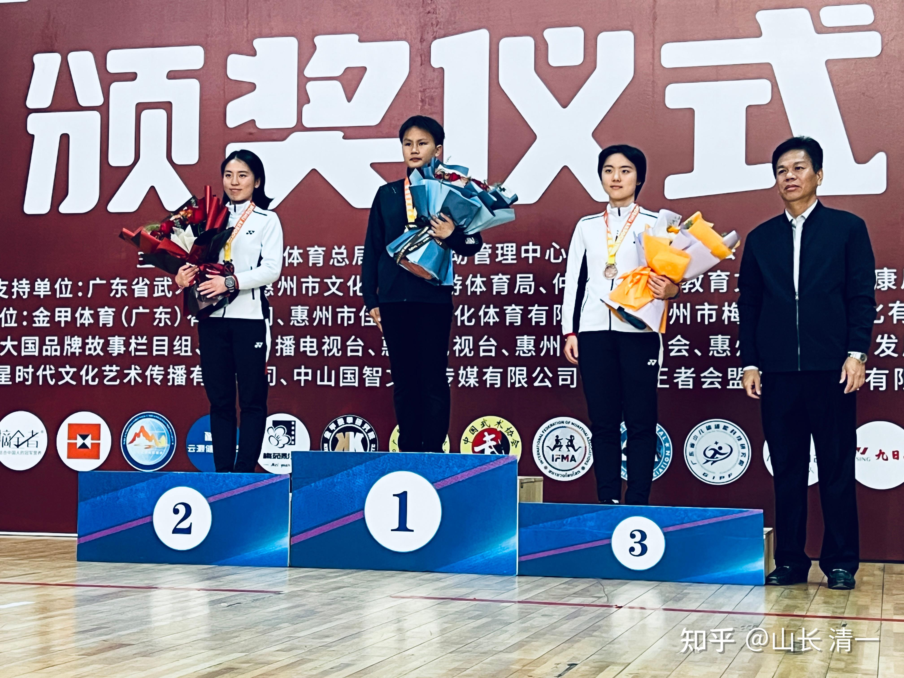

清一新教育 今日学堂 张清一原创文章

原文 清一山长：如何鉴别谁才是真正的新教育师生？

不是顶着党员的名字，就真的是“为人民服务”的共产主义战士！
他们也有可能是无耻的贪官，私下里面正在损害我党的尊严和威信。因此我们的政府才要反腐，才要抓贪官。
同样的，不是进入了新教育混了几年的人，就能“代表新教育”了！
很多人，可能就是跑来投机取巧的，见利忘义的人！

比如WC，H小鸟都想要代言新教育，但显然，此类人是绝对不能代表新教育的人，她们都是新教育的败类！是欺世盗名之徒。

如何才能识别真正的新教育人？
谁才是真正在做新教育服务的人？
谁是假冒伪劣的人，顶着新教育的名字来骗钱，来玩敲诈，搞破坏的人？
维护新教育的人，必须找到我们的真朋友。也必须鉴别混进来的骗子，败坏新教育名誉的混蛋！我们千万不要被他们欺瞒过去了！
**本质上，一切的竞争，归结到最后都是“人品”和“产品”的竞争。**
人品代表了人的价值观，产品则代表了企业的价值观。
因此人类一切的胜利，归根结底都是价值观的胜利。
清黑和清粉，抛弃掉他们的外皮，他们骨子里面的价值观，是很不一样的！因此，要去观察他们的核心信念系统，要去看他们的价值观！
清黑的价值观，和清粉的价值观，肯定是完全相反的！因此必须去观察研究他们的价值观，在一开始就看出来，然后区分开来。不然，结果肯定不好！
另外：家长送孩子来上学，谁是真想学新教育的？谁是假的家长？堂主们更要学会鉴别！不然收了这些只想要垃圾的家长，你费心费力去培养孩子，反而收获的是黑家长！何必呢？让这些孩子跟家长一起烂掉算了。我们不值得为她们费心！
不过，一般人，不是都看不懂核心信念系统吗？
有简单的方法，可以去看出来吗？真的有的！我这里就教大家一个很简单的方法，很容易找出真正的新教育人，还是假的！

昨天，我接到一个堂主的咨询，她都想放弃自己的学堂了！因为作为不知名的外围学堂，她能够招生的对象，基本上都是问题孩子！
因为很多的所谓的新教育家长，都是在发现孩子在体制学校， 已经出了很严重的问题，已经跟不上体制学校的进度了，才来找新教育的。
但这些家长，来找新教育，也是抱着消费者的态度，他们根本不想去真正的理解新教育，践行新教育。反而是希望新教育学堂，用他们家长“喜欢”的方式，来轻轻松松的让他们的孩子成功！
因此，这位堂主就打算放弃继续办学了。现有的10几个孩子，她想让解散，让他们回家去，自生自灭。
我就告诉家长：2016年，清黑事件之后，今日学堂的招生，有啥重大变化？如何选人的？才有现在的成功？
家长有点糊涂！我就告诉她：
当年，我反思这些去做清黑的家长，都有一个共同的特点，她们都是消费者思维模式。他们都喜欢带孩子去搞吃喝玩乐，同时又对孩子有不切实际的期待！因此，她们全都是一群投机取巧的人。不愿意踏实努力！所以，他们的孩子，肯定是教不出来的！
因此，我的选择的方法，就是把这些投机取巧的家长筛选出来，不能随便收他们的孩子入学！
于是当年的重要的招收标准，就是“新教育的三项运动”。

只要是不肯好好运动，三项运动不达标的学生，我们都不录取。这样就避免了内耗！
因此：是否愿意认真锻炼身体，做好体育运动。就是考察这些家长是否真心想要学习新教育的一个重要的标准！
凡是不愿意做运动的学生，就不是新教育学生！
凡是偷懒的学生，就不能录取，不能上学来学习！
同时：凡是不爱运动，不肯每天坚持运动锻炼的新教育教师，也是假货！
**如果说：实践是检验真理的唯一标准！**
**那么：运动就是检验真假新教育的唯一标准！**
如果你们还想更多一点指标，去进一步挑选学生，就加上“吃喝”项目的考察。
凡是喜欢带孩子吃喝玩乐的家长，骨子里面，都是喜欢放纵欲望的家庭！
他们就不可能长期地践行新教育。一般孩子，到了青春期都会出问题！所以教这种家庭的孩子，投资大，效率低。
所以，只要学生15岁，或者18岁，还是不肯运动，不肯过简单朴素生活的人，我们都不能留下来在学堂给长期学习的机会。就必须早点让他们离开学堂，去融入社会工作和学习，去过他们喜欢的“欲望派”日子去！
如果做新教育的人，居然把欲望派的人拉来“强行新教育”，别人不烦你才怪呢！我们就是找错了对象。
所以，做教育，一定要精准地找到自己的顾客群。不要去做自己做不到的事情！
如果家长心疼孩子，舍不得让孩子运动，怕孩子吃苦。孩子也怕苦怕累的，各种毛病。这种家庭，我们根本就不要接受，多聪明都不要！就让家长回家自己养着去！

WC当年，从小就是娇生惯养的，除了学习好，其他就谈不上了！她就是一个不爱运动的人，身体素质极差！虽然来学堂之后，已经改变了很多，但骨子里面的东西并没有改！青春期来到之后，她就越来越懒，各种毛病也越来越多！越来越喜欢投机取巧。
当年学堂，也没有硬性要求运动指标。这种人，其实早期的培养教育再好，最终青春期也会出问题！也没有好结果！
不如大家都省点心，不去费劲培养这些潜在的清黑！
他们怕苦怕累，还把会把所有自己不成器的罪过，都推到教过他们的学堂和老师身上！所以必须远离这个群体！
清黑在骨子里面，都是投机取巧，自高自大，喜欢偷懒的人。但他们的欲望都很大，什么都想要！非常的难以满足！因为他们是消费者思维模式。
所以，远离清黑，就是远离懒鬼，远离不爱运动的人！远离消费者。
**清一大学本科阶段（SAT成绩拿到之后的预科生），为啥坚决不收不练武，不想打冠军的学生？不开其他专业？**
就因为接受了首届高中生的教训，当年没有强调继续强化运动，以为15岁以前的运动已经养成了习惯！就教了他们很多有用的知识。但---懒鬼教啥都都白教的！
后来才发现：15岁以后，青春期有一些学生，就会忘记原来学堂教的价值观。会把原生家庭带来的“贪馋使懒”基因，家庭价值观就启动了。跟我们的新教育教育观格格不入。
这批人，就是不肯好好的踏实学习，更不肯认真的运动，因此也不肯好好去上大学，不肯好好去打工！他们是消费者，永远等靠要！不给就哭，就去黑！
所以，这些人更喜欢去做键盘侠，去指点江山！假装自己是大王！
所以：现在我们只招冠军班，别的班，别的专业，都不收了！

因为我们不要懒鬼！不要消费者，凡是喜欢吃喝玩乐的学生，都是培养不出来的！
目前的冠军班学生，一旦发现偷懒，不好好运动，我就会立马开除，豪不容情！
你给钱都不行！我就是见不得懒鬼，我看到懒鬼，我想到的就是未来的清黑！
我就想早早的把他们赶走！

现在正在放暑假。
真正践行新教育的家长，都在家里折腾孩子，再让孩子坚持运动！每天走40-50公里！
生命在于运动！
另外一些消费者家长， 正在家里宠孩子。跟孩子一起吃喝玩乐！

要想鉴别这两种家庭的孩子，未来的情况有何区别？
我建议两校的教师们。家长们对做个统计。列一个表格！
看看上学期末的排名情况。在未来的一个学期中有啥变化！如果家长在家里宠养的孩子，比另外一群使劲让孩子运动的家长孩子，排名提升更多，就算我今天是白说的！
我还希望两校的教师团队，做好15岁的记录。看是消费者价值观的家长，最终考SAT的成绩更高呢？还是假期坚持运动训练的孩子，未来的成绩更好！
原来我们没有这个记录！
现在，我们的带班教师，一定要做好这个记录！
我们要用具体的指标，来跟踪这些家庭的核心价值观，行为生活习惯！
最终来看到底是家长喜欢培养经营者，还是消费者！谁的孩子将来更有出息！就看运动，就看饮食！
最终到了15岁，就用最终的成绩来检验成色！
这样是最简单的，最有效的方式！
运动是检验真假新教育的唯一标准！
勤奋的人，就算脑子不好用，就算学习不太好！但起码将来不会是废物！
但聪明的人，如果很懒散，不爱运动，肯定是喜欢投机取巧的人。要不将来就是躺平族，要么就是坏种，没事找事！
只有聪明，而且勤奋努力，踏实上进的人，才是未来社会真正需要的人才！