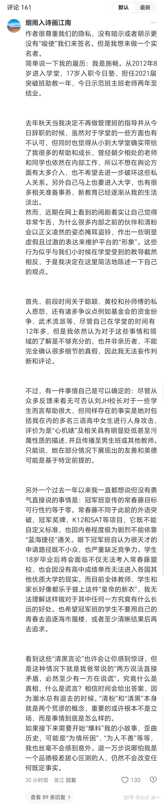

清一新教育 今日学堂 张清一原创文章

**WC已经熄火了，你实名站出来，代替她“主持正义”，我们很理解你的真诚和勇敢。**她不敢正面回应我们的事实和质疑，只是偷偷的去投诉，想要撤掉公开她不良行为的文章。

你比她可强多了---至少这个时候，你还站出来实名公开的挺她，你真的敢于“直面惨淡的人生”。

据说清黑有“求锤”的愿望，似乎觉得出来讨骂很有面子，可以让你们快速的成名！不知道是不是真的。我觉得这个是心病，要去治！WC如果让她回去重新选一遍，我猜她不会跳出来了。她应该聪明到起码应该把自己的后路收拾好之后，再出来攻击他人。

**如果你只是简单的想要成名，我可以帮你推一下流量**，让大家都知道优秀的你，到底有多优秀！

你们想求锤，但我不是锤子。我是教师，我更想给你，以及你有一样有求锤想法的前学生们，现任的黑子们，一点对你们人生发展，前途，更有帮助的良心建议。

毕竟：人都要讲良心的，对吗？我们干啥，都不能昧了良心天理去做事情！

你们想黑，我教你们做高级黑，去黑死今日都可以的！我没意见。

也许，有本事去真黑今日，会摆脱WC这样的低级黑局面更好，对人对己都更好！你们会更光彩，不会一堆人躲在小号里面叽叽喳喳的，最终一地鸡毛，啥贡献都没有！看看2012年，2016年的清黑，现在剩个啥了？

我特别说明：

**一：我们无意去暴你的“丑事”。**黑人不是我们的价值观。就算能够证明你丑，也不能说明我们就漂亮。这两者没有因果关系！

另外，你的确不需要担心你有啥丑闻。说实话，你们都是一些年轻的学生。我们这里也就是一个学校罢了。都是搞教育的人，大家能有多大的“丑事”，值得去到处暴呢？不会真以为自己是皇室成员吧？你们最多也就是一些小年轻人，可能有些朦朦胧胧的情情爱爱，说起来有点小丢人。但感情无对错，只要是真情，就是美丽的。如果你们懂得珍惜这些感情的话！

**二：我想说，我们一直认为你是很优秀的学生。**7年前，我为9岁的小明慧找共读小伙伴的时候，你是第一人选，因此你被邀请来了清迈居住了一段时间。现在的ELLA公主，只是你原来的“替补队员”罢了。当然，最终因为当时的你并不喜欢这种“陪读”的身份。你显然更愿意和你同龄的伙伴在一起成长，而我非常尊重你的想法，不会勉强你去做不喜欢的事情。我就让你依然回校去，和你的同班同学在一起。但因为你是我邀请来清迈的客人，因此你的父母被我通知，从此之后，就免除了你的学费，我来当你的供养人！尽管-----你当年并没有去承担ELLA一样的大姐姐身份和责任！但我一样愿意去支持你和你们家，就因为你优秀呀？如WC所言，我对优秀的人都有点贱。

Ella和你不一样的地方，就是她来清迈，是她当大学老师的父母替她坐的主。她父亲亲自为她申请的另类发展道路，明确说了她就是不想上大学！不学Sat。当然，她自己也很喜欢这个安排。因此13岁的她，才来到清迈与小明慧一起成长至今，她都快20岁了，还傻傻的不知道离开我去闯天下，让她去读大学都不肯去。

**三：即使当年你回国继续去今日上学，你的表现也一样很优秀。最**终，你们班毕业后，你和小司两个人，作为你们班最优秀男生和最优秀女生的代表，分别被今日和无名分别选中，留校做“实习教师”！后来，很快你们都获得了带班的机会。

**四：你带班也一样表现良好**，起码不会像WC一样不负责任。你虽然是个新手，赵刚校长也尽心在指导你，帮助你。你在职期间，也努力去做了一个教师该做的事情！今日能够维持行业第一的成绩，肯定也有你的一份贡献！

**五：前年，WC离开学堂，你们家很受影响。**你们的家长和WC家，有更多的互动联系！显然你的家长更愿意去聆听WC家的教诲，而不是更相信我的判断，你们家庭认为我会耽误你们的前程。因此，你父母提出希望你去读大学，不想继续当教师了。就是怕你像WC一样，将来没有文凭可能会被社会歧视（不过WC办学一年的收入，似乎比她去拿到大学文凭打工的收入要高很多，我都不知道社会在歧视谁了？）。

你当时表示，你喜欢学校，不想离开！不想听家长的安排，不想去上大学！你想留在今日做教师。钱校长和赵校长为了让你的父母放心，还多次做你的思想工作，让你去理解父母，尽量去服从父母的安排。如果你真的喜欢教学，你可以等将来大学毕业之后，再来申请入职。这是我们对你们家庭的高度的尊重。我们允许，甚至会去帮助你们做出与我们不一样的人生选择。因此，你去年10月份，就离开了学堂，去奔赴你父母为你安排的，美好的上大学的前程了！

**六：今年，听说你表现不错**，马上就要去上海外名牌大学了。我们都为你高兴！毕竟我相信你的实力，今日的优等生，要考上名牌大学并不难。当然，考上耶鲁哈佛等名校，我们就不做指望了。现在我们的身份背景，还不够帮你实现这一目标。这种名校，也不仅仅是成绩优秀就可以了，还需要更多的实力来证明自己的素质。

**七：但你显然对我们一年来的飞快进步不太高兴。**与去年10月份，你还依依不舍的离开不一样。你出去也才半年多吧，似乎就慢慢的开始“黑化”了。你不再像原来在今日一样，热爱我们的平台了，你开始对今日有所抱怨，也许WC跟你的互动，让你跟她共振良好！你在网上偶尔用小号说点怪话。我们也知道这些，但不想多说你啥！我们猜测可能是你申请过程中可能不太顺利。也许你的学习成绩好，但你的个性比较孤僻，而你申请美国的知名大学，需要更全面更综合的素质。也许你的书面表现良好，面试这一关可能会被卡住，上不了你心中向往的名校，你心里有怨气，这些都可以理解的，想吐槽一下也正常！

但现在你公开站出来，实名用大号，公开在清黑队伍中说出你对今日的种种不满，就有点过了！起码你的身份，不太适合这样做。你没有尊重你自己过去的求学历史，没有尊重你离开前的状态。你说的有些话，我们认为也并非事实，各种谣传的故事，也许只是某些人为了让你站队编出来的故事，只是你想象的事实罢了！

**八：但我不想对你的发言一一的辩经，无论对错，其实都毫无意义！**因为我的立场，是关心你们的下一步的发展！我不在意跟你们去辩论过去是谁对谁错，谁认同，谁不认同！我只关心我是否走向我的目标！你们爱怎么想，就怎么想。你认为今日就是垃圾场也没关系。你们清醒了，认识了这个结论，就离远一点好了。免得我们这些的垃圾臭到你们的了！这有啥好抱怨的？

我想建议你，跟我一样，也只关心你的美好目标好吗？至少对你是有好处的。

如果你真心想黑我们，我也不反对，我更不会怕你黑！就请你拿出你的实力来，往死里去黑死我们，用实力来让我们跪你都行！

九：**你断言说，【过去一年以来我一直都想说但没有勇气直接说的事情是：冠军班宣传的常春藤目标可行性约等于零】。**我没必要去跟你争论，你的结论是对还是错。尽管我以为你应该知道，你原来的今日塾同事，你们上两届的同学HAR同学，她就是以“在家上学”的身份，自己去申请考上了常春藤，还拿到了美国大学给她的全奖，她去年就去美国上学了。她和她的父亲，去年去上大学前，还一起专程前来清迈见了我，表示过去对她培养多年的感谢。她分享的信息中，认为她能入学和拿全奖的原因，就因为她的经历过于独特！美国校方对学生的独特性非常的感兴趣，他们不喜欢书呆子，喜欢全才。因此她甚至连三语高中的毕业证书都没有去使用，她特别的有骨气！当然。她开朗活拨的个性，很会说话，估计也帮她拿到名校入门证有了很大的帮助！

当然，过去不等于未来。也许现在的美国大学，全改了新政策。我们未来，也许真的如你所言“考上常春藤的可能就是零”。而我吹的牛，就是11个冠军班的学生，将全员考上常春藤（至少同级大学）。我们两人在这里，发生了完全相反的判断。

就像WC推崇太乙真人的教学法，我认为申正道的教学才能出人才。我们观点正好相反！你以今日当学生和教师的身份，出来唱反调，也特别让人吃瓜群众喜欢，因此增加了很多流量，也导致我不得不回复你！换了别人说这些话，我根本就不会理睬的！

你是WC的好朋友，你们家也是WC家的好朋友，你们有一致的立场不奇怪！你正好也继承了WC的反骨，就是想要唱反调！但我不想说你就是错了，也许这一回，真的是我错了呢？

太乙真人谁对谁错，大家还无法判断。**但考不考得上常春藤，应该是可以轻松检验的！**不难，给点时间就够了（HAR的例子，我们就算了，是她自己申请的。我们没帮忙，就不拿来为我们的教育贴金了，不占你便宜）。

不如你我，现在就不多去说这事情了。谁对谁错，让时间来检验吧！我们只要耐心一点点，等过一两年时间，等到了2027年，大家就能看到结果了！由于我们两都很极端，我是认为1500分的全员都能考上常春藤，你说根本就没有可能！

所以，我们很容易分出胜负来的！这种完全对立的观点非常容易检验，对吗？

如果两年后，大家都发现：你才是正确的，我是吹大牛的！那么，你就是第一个勇敢出来实名挑战张清一，并取得完胜的女侠！我相信拥有这些荣耀，会让你很满意的！我20多年积累的名头，就会被你一个小女子抢走了，你真的了不起！

我愿意写这封公开信给你，就是愿意送你名气的！我公开让这种多人知道你！就是在送你未来的流量。毕竟---你只是在清黑这里留言的话，你就算是实名，也没几个人会认识你。

我这里数万人面前给你做背书，你应该很满意了！你如果是对的，两年后，你就是大英雄了，我们都耐心等待！

如果两年后，证明你判断是错的，你现在这些认为“确定无疑”的话，证明就是笑话！但请你放心，我不会要求你跪下来给我认错的，我不会去折辱你！

我不需要你的膝盖，我只珍惜自己的膝盖。

你输了，我只会说：施畅就是个小女孩，年轻气盛，判断力差。特别容易相信"某些高人"的忽悠，容易相信某些中介的“权威判断”，就是不肯相信她原来的老师和伙伴。这也不奇怪！孩子长大了想独立，想挑战老师，想证明自己很正常！我们会原谅你，不去计较你今日的狂言！

你看：你这样是不是很划算？赢了你名满天下，我清一20多年的名声，就被你抢走了！丢人丢到家了！

** 你输了，也没任何损失，**甚至我不会要求你出来道歉！我赢了也得不到什么好处。只是在我原有的成功记录里面，继续添一份成绩的案例罢了。

赢了你这样的小女孩，我真不可能会有啥成就感的！非要逼得我去跟你比的话，输赢我都膈应。

**十：另外，我很好奇和不解。**为何在WC和HXY的不良行为，已经昭然天下的时候。不少人都在远离他们的时候，你居然还见不到他们误人子弟的事实和劣迹！你反而在她们都不敢继续出来面对，还已经转移目标去攻击别人的时候。你这个今日的优等生，今日的原教师，你现却要勇敢的站出来给清黑提供子弹，去挺WC？你出来唱这一出，到底是啥原因和目的呢？

** 如果你就是关心冠军班学生的出路**，怕他们被耽误了！我们非常感谢你的好意。我们会注意你提出的问题，会去认真解决这些隐患的！毕竟---如果冠军班都出不来，这么优秀的学生，就是考不上个好大学的话，今日也真的别办了。我们应该比你更操心着急这事才对！你不需要这样的急于关心冠军班，你只会搅乱他们的心。因为他们原来都信任你。

如果你就是玩青春期逆反，就是你看啥都不顺眼，你看我们不顺眼，你看培养了你多年的母校不高兴，看你的伙伴也不顺眼。

** 你就是不黑不舒服，我认为你也没错，你实名黑。起码你黑得理所当然，黑得有骨气！我们当你的靶子，也认了！**

但我建议：你就别学WC们一样，在网上玩文字游戏，乱编故事去黑了！你要不来点高级的黑？

** 如果你真的想“打倒今日”证明你自己，你就是想去挺WC，**我建议你加盟WC的学堂。WC其实是个宣传高手。你是个踏实做事，教学的人。你其实没啥心机，不善于搞这些虚的玩意。你也不擅长与家长打交道！这些都是WC的特长！

如果你们能够结合在一起合作办学，没准真的能够办出一个“击败今日”的好学堂！如果你真的认为我们的学生考不上常春藤，你们去一起合作（或者你自己独立办也行）做学堂，你们帮助学生考取了常春藤。你们成功去打脸今日，让今日成为二流的学堂。我一定不会妒忌恨你们的，我只会为你们这些学生超越老师感到高兴！我会认为你们真有本事！

也许，我的孙子将来还可以送来你们的学堂，我亲自来恳求你们帮助教我的孙子。但请放心，我愿意出学费。不因为我原来免过你们的学费，就要让我孙子去占你们的便宜。我不要求啥特权，跟别的普通家长一样就行了。您认为这样可好？

击败今日？我认为这是常春藤毕业生都做不到的事情。如果你们能够做到，还去上个啥大学呢？你们自己就是大学！

**十一：如果你并不想去办学，不想去当老师**，你只想活出“精彩自信的你”来！你想证明你的价值！那么，何不你好好去做点什么了不起的事情去？你用个五年，十年的时间，好好的成就你自己！比如当上个啥行业的很高级别的明星员工，拥有很高的社会地位。然后，你就来我们这里晒晒你的成绩，你在社会上取得的创造成果？让你现在DISS的对象，面对你的未来成就而自惭形秽呢？

将来有一天，你如果真有本事，让刘静慧，小司同学，以及ELLA公主等等，这些你认为缺乏独立思考能力的傻乎乎的对象。这些你过去的同伴，同学们，他们傻到只会相信我，只会相信学堂，他们只会继续留在今日里面被“催眠”，当傻瓜。那么，将来你有所成就之后，希望你回来让他们看到你未来的成就和光彩，用结果来让她们对你羡慕嫉妒和不恨（因我教她们不要去恨谁，永远去爱这个世界）。

如果你想拯救冠军班的学生们，就让你的光彩，去发出耀眼的亮色。让他们将来都想投奔到你的旗下，这样好不好？

现在是无法进行信息封锁的时代！如果连我这种老古董，都能看到你昨天的最新发言。**我相信：你未来取得的靓丽成果，也会让我们不会忽略你存在的！你只要发声，我们就能看见。**

如果你的榜样，能让你原来的小替补---ELLA公主，将来也放弃平台的pua。学你们一样去追寻你现在独立自强的脚步，我相信你就是成功的！

**我就怕将来有一天，等ELLA公主当上国礼的时候**（五六年之后就够了，不需要10年。正好是你大学毕业的时间），你都不敢站在她的面前去。因为你正在到处投简历，而ELLA公主打一场高端的比赛，可能就会收入千万美金的出场费。还有不少知名企业的形象代言人会去请她来当，她可以轻轻松松的拿到数千万的赞助费。你在身边超市里面，到处看到的她笑盈盈的照片。其中的一家企业，还是你刚刚申请入职的企业，你看到你没资格说话的大老板，此时在恭恭敬敬的迎接ELLA公主，给她发大笔的支票。而你这时候，会不会偷偷的想---ELLA小公主，当年不过是你的小替补。她今天拥有的这一切，本来都应该都是你的！是你不相信老师，不相信学堂。你只相信WC，你才失去的机会。

*未来国礼的样子会是这样吗？*

**真希望这一天不会发生：**我的意思，不是ELLA当不了国礼！而是你五六年之后，希望你应该有勇气，也有自信地站在优秀的ELLA公主面前，站在其他的公主国礼面前，说：我是你们过去的同学和校友，我为你的今天而自豪。我也为我自己不一样的选择而自豪！因为我也跟你们一样优秀，甚至更优秀。我做出了成就如下。。。。

这才是我最期待看到的局面。省略号里面的内容---应该是你来补上的。因为你这么独立，这么有思考能力，自然不需要我来帮你谋划人生！

ELLA公主很傻，她很没脑子，她不像你们会独立思考。所以我才费心费力的帮她一步一步的谋划她的另类人生！

我也建议所有的清黑们，你们都团结起来，去做一点真正有价值，有创造的事情出来！

** 如果你们都真的认为今日不好，请你们一起合作，去办一个比今日更好的学堂出来，成为世界的榜样**，用来拯救中国的大众！

你们实在没必要天天在网上，非要去“帮助”执迷不悟的今日改进错误。不如把时间用来帮助你们自己进步和提高，你们去击败“不思进取的今日"不就好了？

你们用生命来黑别人，不如用所有的时间精力去成就自己，都用于去真实地去击败今日，击败清一，击败冠军班，击败公主班，这样不更好吗？

我相信：以你们清黑的才华和志气，以及你们表现出来的勇敢无畏精神，你们只要好好的团结起来，弥补你们单打独斗，玩嘴炮的缺点。你们一起来用实力击败今日，这才是你们最应该追求的目标，不是吗？

这就是我对你，和你们的良心建议！真诚的希望你们有成就。

