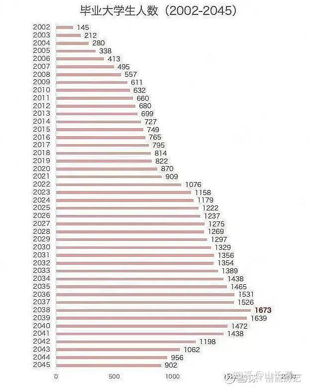

清一新教育，今日学堂，张清一原创文章

人民日报微信公众号《孩子，我宁愿欠你一个快乐的少年，也不愿看到你卑微的成年》。我相信是在提醒家长们未来的走势。

反观富裕起来的中国家长们，做法是完全相反的：【我尽一切力量，给你一个快乐放纵的少年，也接受你拥有一个卑微的成年，过一个凄惨的老年】。

如果关心家长的人，家长们应该好好研究下面这张图表，弄清楚未来的趋势和发展方向。

看懂了图表，你就必须要提前安排出路了，如果家长无法为孩子找到合适的出路。你就必须参与下面的激烈的竞争。

在未来的10年，20年里面，注定是中国被美国和西方围堵，经济下行的同时，会有越来越多的大学毕业竞争者参与就业竞争。

过去中国上升时期带来的发展好处，双击优势，现在变双重的打击。

显然，下图意味着，如果你的孩子，是在未来的18年毕业的大学生（差不多现在4岁以上的孩子），你将面对中国原来越卷的高考，以及更加卷死人的就业竞争！

在这个过程中，男生女生都不容易。但最艰难的是女生！

因为由于女生的天然局限性，用人企业显然会优先考虑男性。

大量的女生，只能被迫依附男人为生，或者被迫边缘化！

女性地位未来20年明显下降！就业和嫁个靠谱男人的难度，门槛都大幅提高了。

泰国的女性地位就很低，原因就是泰国的就业困难，女性就更没有机会，只能从事服务业！

**下面转一份10年前的天涯论坛文章，当年的人间清醒。现在还不清醒的女人，该醒醒了！**

以下是原文内容：
我时刻提醒我的读者，尤其是女性读者，一定要趁早看清楚：这个社会不会因为你是女性，就特别放过你。尤其是现在社会的竞争，其实已经方方面面渗透到了家庭生活的每个角落，生活就是一场没有硝烟的战争。如果你还觉得可以依靠一个男人，相夫教子，安度此生，那我如实告诉你，等到你的只有后半生不断地被打击，直到你开始醒来。

我不是说男人靠不住，而是你判断一个男人靠不靠得住，根本就不是去看他对你的态度，而是看他背后的综合实力。就像那些优质的男性，能够养活一家老小且安居乐业的，我跟你说，基本上就是从他非常年轻的时候，就开始养活很多人了。而那些中途崩塌、矛盾不断的，就是彼此都没什么担当的。你指望一个连自己生活都料理不清楚的男人，怎么撑起来一个家呢？

我常说，看人是要看轨迹的，而不是看他对你的心意。

所有的爱、所有的安稳，一定都是“多余”之后的产物。就像一个男人是一个企业的老板，或者是企业的中高层，他早已习惯了养一大堆员工，习惯了稳定且巨额的支出，那换到小家的时候，他也自然有他的预算，该给家用的时候绝不含糊、绝不吝啬。而那些抠抠搜搜的，你也别怪他们，并不是他们不愿意，而是他们囊中羞涩，也没有真的养成预算的习惯。

所以真正高段位的女人，是听得懂我在说什么的。不管任何一个选择，其实都不可能做到男女平等。真正聪慧的女人一定是理智大于感性，可以从开头就猜到结尾。曾经我也觉得一些女人特别绝情，明明都到了谈婚论嫁的地步了，但突然之间就决定离开了，奔向了另外一个更加殷实稳定的家庭，什么爱情不爱情的都放一边去了。活得尊严、活得体面才更重要一些。

我那时候不太懂，还是我的女朋友提醒我：她说她过得太苦了，虽然看她平常半夜下班还乐哈哈的假装恩爱，但其实内心早已经失去期望了。因为在一段关系里面看不到头，才是真正折磨人的。

我不是一个讲究物质的人，但我依旧觉得，人不应该活得太苦，尤其是对于女人来说。所以如果有选择的话，还是不要掉坑里。如果已经掉坑里了，那就不要再抱怨了。你选了没有面包的爱情，那你自己也得跟着尽一份力。

我依旧善意地提醒，对于婚姻和未来不要抱有玛丽苏般的幻想，因为都无需去看以后，只要看一下双方原生家庭生活的状态，就可以判断你们婚后的生活是否如意了。因为任何上一代没有解决的问题，一定会在下一代放大，而上一代积累下来的会延续给下一代。

对于一个女人来说，一定要趁早明白，婚姻就是一个互相捆绑的东西。只要你选择了这段婚姻，就是绑定了收入水平、生活习惯，以及未来可能发生的一切危机。

如果你还没有步入婚姻，那你可能真的是这个世界上最幸运的女人了。因为对于一个女人来说，可以改命的时间真的就是独自一人没有牵绊的那一会儿。那个时候你可以到处去玩，看最美的风景，吃最爱的美食，好像那风都是甜的，自由自在，犹如青春永远定格一般。

但只要你步入了婚姻，开始有了孩子之后，基本上，你所有的爱好都会消失了。尤其是那些贫穷家境的女子来说，真的就是又要当妈又要做保姆。最可悲的是等她们真的走上这一条路之后，才会真正发现自己并不像自己的母亲那样吃苦耐劳，而她的另一半似乎也不懂得什么叫做省吃俭用。两个没什么担当的年轻人，被一个孩子压得喘不过气来，是常有的事情。

而那些家境优越的，你说对于她们来说有什么影响吗？她们是真的可以去享受这个养育孩子的过程的。不管是她们自身有实力，还是婆家条件优渥，这都能够让人心情愉悦地看着一个小生命慢慢成长，而且真的很多琐事是不需要她们去处理的，会有月嫂、会有保姆，会有一家子人帮着忙前忙后，这个家庭里的新妈妈就是全家人的宝。但贫穷家庭就不是了，因为家庭人手少而且资金不够，所以很多细节处理得捉襟见肘，甚至月子没做好落下一身病的也不在少数。

结婚生子说到底，其实对于女人来说就是一场渡劫，甚至有可能付出生命的代价。

所以我认为一个好命的女人、高段位的女人，一定是懂得如何离开那些有毒的关系，懂得让自己在学业和事业上不断攀登高峰的。因为一个女人会遇见什么样的男人，真的不是把自己打扮得花枝招展就能够吸引好姻缘的。都是自己的事业达到了一定的高度，才有机会遇见那个真正应该遇见的人。

讲真的，那些普普通通但又活得极其压抑的女人，都是圈子太窄了。没有更早出去看一看世界，被限制在了老家里面，能够看到的世界和男性数来数去也就那一些。最后即便做了看似很不错的选择，随着时间也会发现问题很大。但话也说回来了，对于那些没有见过世面的人来说，她们也会觉得正常。毕竟，凄凄惨惨并不相爱却忍受了一生的夫妻并不在少数。

就如同我以前觉得村里的校花特别好看，等我真的去大城市生活了几年，过年回去再见到她的时候，也会发现其实也不过和城里普通女子差不多的姿色。她选择留在了家里，后面的生活平平淡淡，相夫教子，没了音讯，就和我们父母那一辈一样，只在年轻的时候美丽过，后面的一切就被小镇的光阴慢慢给罩住了。

反倒另外一个叛逆的、别人都不喜欢的女孩子，走出去了，据说她后来嫁得特别好，偶然有她的消息，听说当上了富太太。但当年她可是村里家家户户指指点点的对象，就因为她喜欢跳舞，所以那些妇女就说她不检点。而那些看似很乖的女孩，却在未成年的时候就与隔壁村男孩发生了关系，早早生下小孩被困在了村里。

有时候真的是造化弄人，本来都有大好前程的，就因为一个选择万劫不复了，亦或者说这个劫早就从他们出生的那一刻就埋下了。所以我常劝我的读者，只要你家庭对你的打压，那你就一定要趁早离开。因为一个人被打压久了，就会变得越来越颓废，最后就会失去对生活和事业的憧憬。

我去年选择了闭关，另外我也跟我老婆说以后不再接收任何人的送礼了。讲真的，以前我风光的时候，每年几乎都会收到非常多的礼物，但最后发现去还这些人情也发生了很多麻烦。后来，还有人以知道你的地址威胁你要给他办一些事，所以人性真的是难以捉摸。后来为此我搬了一次家。

那些真正高段位的女人，都是懂得如何保护好自己的。她们不会轻易向他人诉苦，也不会允许别人把垃圾情绪倒给她。她会与任何人都保持距离，也停止了解释真实的自己到底是如何想的，因为她会明白这些都是无效的。没有人会在意你过得好不好，他们只关心自己想看到的东西。

我们越长大越会发现一个真理，那就是很多事情在你年轻的时候，是可以靠努力得到的。比如你想工资高一点，就去选择高薪的工作，多加加班；想吃得好一点，就打车去远一点的地方，改善改善伙食，做一个小吃货。但随着你真的长大了就会发现，另一半事业是否如意、孩子是否学业有成，这些都是你左右不了的，甚至走着走着很多女人连自己的爱好和信仰也都丢了。

不管她们要做什么，总有一个巨大的借口横在她们面前，那就是“我是一个妈妈，我是一个女人，我有太多不顺心的东西挡在我面前了。凭什么我要去做那些东西呢？”反正理由和道理是很多的。

但你要明白，其实就是被生活打压得太久了，已经失去了反抗的勇气。因为用这些借口维持现状是成本最低的事情。因为只要不行动、不改变，就可以理直气壮地这样活着，就不用去忍受那个屡屡失败带来的挫败感了。

所以我也能理解，其实很多人就是用社会身份来逃避生活的。有的人不想工作就躲回家里去了，其实她们在内心里面早就已经默认了自己的命运。所以当这些女人私信问我问题的时候，我其实都是不回的，因为是她们自己选择了那一条路。

女人和女人之间的分水岭是如何拉开的？我觉得就是一个傲气的成分。那些真正有傲气、有傲骨的女人，是不妥协于这个社会的分工的。倒不是说她们非要和男人决一死战，而是她们比较聪慧，很早就看清楚了一件事：自己的命运要自己来决定。如果没有掌握命运的资本，那么一生都会活得很被动。

你看那些苦哈哈的女人，基本上都是情绪随时会被撩拨的，今天这个惹她生气了，明天那个让她难堪了。她身边到处都是那些随时随地会拿刀子扎她的人。

女人啊，这一生千万不要让自己活得太被动。一定要趁早去布局自己未来的路，把路上的障碍一个接一个地清除干净，而不是被家庭、婚姻、传统的观念所束缚。那些绑在你身上的东西，你可以不受的。

我一直有一个观念，帮我改变了很多事情，那就是：如果我过得不好，凭什么要照顾他人的感受呢？我们活着，一定是优先让自己好，心有余力之后，再去对他人好。只有这样，你的生活、事业、婚姻才会蒸蒸日上。而不是你什么都没有，还要想着对这个好、对那个好。如果你已经陷入了困境，就赶紧收心吧！但凡来占用你时间且不能带来价值的，立马给他拉黑。不要让太多苍蝇围绕在你身边，要把那些会打断你、骚扰你的人和事清除干净。

女人要发展，一定是要杀伐果断的。这就是高段位大女主和普通女人的差别。前者选择主动厮杀，后者逆来顺受惯了，已经没有了自我。

愿你能够听进去以上那些刺耳的真话，把自己的感受放在第一位。也祝你这一生能够活得精彩，活得没有遗憾。