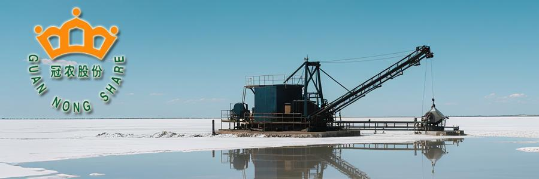
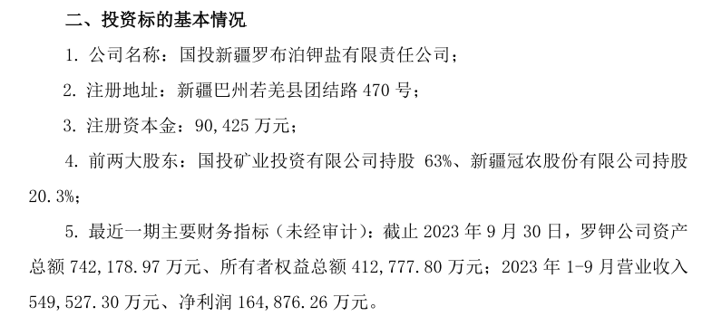
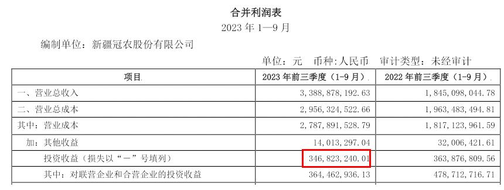
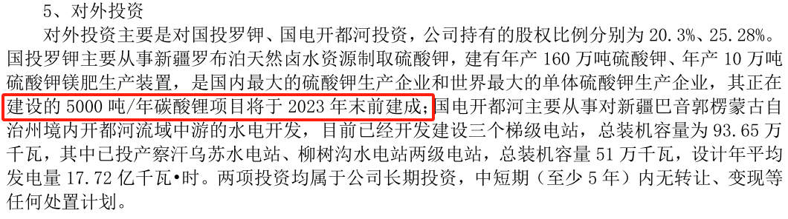
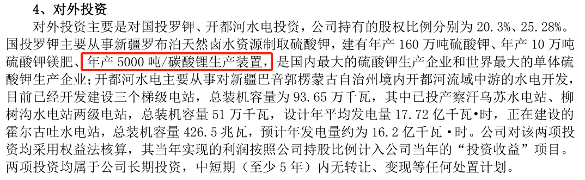

164篇.如果德隆能坚持到今天

清一山长 [2025年7月10日14:45](https://www.zhihu.com/pin/1926653270895597490)

德隆系，是20多年前的大庄家，风云人物。势力在新疆一带，眼光超好，控制了很多的优质资产。

可惜，过于激进，命不好！德隆系是早期中国资本上的大玩家，他们就是大主力。操纵股票，大起，也大落。

最终德隆崩盘了，手上的优质资产，只能骨折价卖出来，抵债。

20年前，德隆以几千万低价卖掉的一家公司，中国唯一（唯二）的钾盐公司。现在这家公司的估值，应该涨了几百倍，甚至一千倍？

光一年的分红，就有三四个亿。

**如果德隆不去操纵股票，只是稳稳地持有资产,现在的资产增值是几百倍、一千倍，比它操纵股票强多了！**

2002年，德隆系成立罗布泊钾盐公司，但因资金链断裂，2004年以8700万元将资产割让给冠农股份。

资料：

风险提示：本文所提到的观点仅代表个人的意见，所涉及标的不作推荐，据此买卖，风险自负。

业绩爆发与碳酸锂布局

2023年前三季度，罗钾营收54.95亿元，净利润16.49亿元，成为冠农核心利润来源（贡献冠农投资收益3.47亿元）。同时，5000吨/年碳酸锂项目于2023年末建成，切入锂电赛道提升估值。

《新疆冠农股份有限公司 关于对国投新疆罗布泊钾盐有限责任公司增资的公告》2023年12月2日

**冠农股份2023年三季报 合并利润表**

**冠农股份2023年半年报**

**冠农股份2024年半年报**

**（标题、图片为编者所加）**
**文章音频**：

[581篇. 如果德隆能坚持到今天](http://link.zhihu.com/?target=https%3A//www.ximalaya.com/sound/892579861)

**参考链接：**

[157篇.“不要股，只要价”看住自己的人品](https://zhuanlan.zhihu.com/p/1917575063177258074)

[158篇.涨了卖，不指望更高。跌了买，不指望更低！](https://zhuanlan.zhihu.com/p/1920256327327942427)

[159篇.差价6毛，惠泉值得拥有，差价3～4元，珠江更划算](https://zhuanlan.zhihu.com/p/1922686829653661294)

[160篇.贬低巴菲特，并不能让自己赚钱！](https://zhuanlan.zhihu.com/p/1925299829367608333)

[161篇.7年10倍利润增长](https://zhuanlan.zhihu.com/p/1927944535373247107)

[162篇.只想拿股息，没想赚快钱](https://zhuanlan.zhihu.com/p/1928066355866861887)

[163篇.比亚迪的对手，应该是丰田](https://zhuanlan.zhihu.com/p/1927780975305266754)

