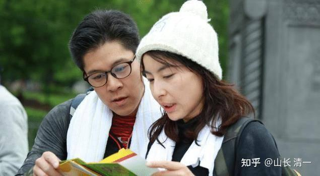
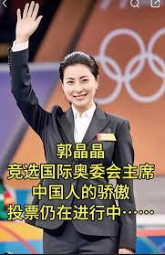
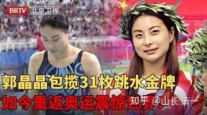

清一新教育，今日学堂，张清一原创文章！

**全世界，敢说要培养“太极杨无敌第二”的人，估计只有我一个。我真的像个大骗子，疯子才敢说这样的话！**

因为武无第二：阿里的老师，也培养不出来第二个阿里！

泰森的传奇，到他也就停止了！

播求的拳馆，也没有送出来第二个播求。

**培养出世界冠军的拳馆，基本上与后续的世界冠军无缘！**

基本上，格斗界就是“冠军轮流做”，明年到我家。

谁都有机会，谁都不敢自己说就一定成功！

我居然敢说，像制造产品一样“定制世界冠军”？这种观点，已经违背了武术格斗行业千年来的“常识”，理论上，是不可相信的！

**实践上，还没有人实现过！至少历史记录上没有。**

只有武侠小说会这样写---“名门弟子，代代相传，出手就是不一样”。

但你们今天，已经看到了事实：2024年，我已经培养出了15个全国冠军，3个东亚冠军。还送队员上了国家队，打了世界冠军。将来我们肯定是中国格斗队的主力，代表中国征战世界，拿到一堆的世界冠军。

我吹的牛，已经实现了！批量制造格斗冠军，已经是当下的事实！

9年前，我在墙上画的大饼，培养冠军的大饼。

九年后，你们都已经在开吃武术的真实大饼了！批量去打锦标赛了。都知道我说话算话了！

*工人家庭的郭晶晶“下嫁”香港四大家族*

**我还说：我要培养郭晶晶第二，培养国礼！这比培养世界冠军更不靠谱，也更像是骗子！**

因为：世界冠军多了，不是每个冠军，都能做郭晶晶的！

没错，我也知道这一点！体育界的人，从小专业学习，除了体育，她们几乎啥都不懂。**这种人里面，要出个豪门，上流社会满意的儿媳妇，比培养世界冠军还难很多！**

没文化，没教养，没水平，没思维？没见识？别说豪门了，就相当于体力工人。再强壮，也没人想要恭恭敬敬的娶回家的。因此大多数体育人，只能在下层混混！很难被上层社会的看中娶回家！

而且：大多数中国的冠军们，出身都相对贫寒，郭晶晶就是工人家庭。但霍家多次公开的申明：郭晶晶是“下嫁”的霍家。本质上，是霍家的政治智慧，也是他们家的教养。当然，也是郭晶晶很异类。她肯定有啥独特之处！

大家别真以为：世界冠军就是比豪门更豪了！

**郭晶晶，几乎就是绝版，就是偶然出现的奇迹。**

但我却有信心定向培养“郭晶晶”，难道我疯了吗？

不是，因为我培养的世界冠军，只是“业余玩家”。她们的正业，是学霸！因此，她们并不从事这个行业，她们参加世界锦标赛，拿到冠军就收手。退役，去读大学，去上常春藤了！

找遍全世界，有多少这样的“世界冠军加学霸”的？谷爱凌的确是，国外真的有一些这样的学霸冠军。美国奥运冠军，有一些就是在校的大学生。

但在中国---目前这种文武双全的体育人的记录，是零记录！谷爱凌不是中国培养的，她是美国培养的。另外---她是钱堆出来的。她玩的项目，就不是普通人能玩的。就像赛马一样，是富人家堆钱来玩的玩意！第三：她是无法复制的产品！

但我为啥敢说我能定向培养郭晶晶第二？

因为我的冠军们，起步的要求就是学霸。不是学霸还没资格跟我学！

我提倡的是“文人格斗”。是知书达理，有情有意，儒雅可爱的文化人。她们不是专业武者，也不是吃武术饭的人，而是拿武术当业余爱好玩的玩家，是一个女教师。偏偏我们学校的武术能力，借助了老祖宗的福荫，我们还能玩出超级的花儿来，可以业余击败专业。可以玩家击败世界冠军。

这样文武双全的女孩子，脑子好，身体好，思维好，文笔好，口才好。你不爱吗？

作总经理助理行不行？

作老板的儿媳行不行？

这就是我敢说“培养郭晶晶第二”的底气！你没看到：现在的公主，就有人想要提前“预定”了呢！

[妙行无住](https://www.zhihu.com/people/fba993224a1b74e101106d62c617341c) 关注我的人 留言评论：

记得2016年冬天，山长带ZL和明仪参加陈家沟太极拳比赛，有一天晚上和他们父母一起吃饭，当时山长问ZL父母：你们同意ZL最晚多大年龄结婚，**ZL妈说：一个人如果能把一件事做到极致，一辈子不结婚都可以。**当时听了让我非常的感动，深感自愧不如，后来问到ZL爸时，爸爸显得很为难，也许是因为ZL当时才十六七岁，做为父母也根本没想过这个问题.

山长就说：你们看25岁让她结婚成家怎么样，25岁之前交给我，我把她培养成太极杨无敌，让她名利双收，再去结婚成家。假如太极冠军她没有拿到，我在文的方面再培养她几年，她就是一个文武双全的老师，在今日教师团队，武的方面也没人能超越她，她依然辗压其他人。

这些话让我听得羡慕死了，这个世界上能有几个老师会这样为学生规划和安排，连我们做父母的自己都做不到。
但即便是山长这样为学生和家长着想，依然会让学生这么的不满和怨恨。不知道ZL不能原谅和愤怒的到㡳是自己，还是山长？！
她现在敢于指名道姓辱骂刘老师，说刘老师搞玄学，就证明她六年来再也不敢进入自己的潜意识，面对自己的真心，所以才用如此强大的头脑武装自己，盛气凌人的骂老师证明自己是对的，自己的选择没有错，遗憾的是懂点心理学的都知道，她的愤怒已经出卖了她，她没有真正长大和成熟，唉！可惜了这些孩子们的才华！

我对这个熟悉这段经历的家长回答：

2016年在陈家沟的是全国精英赛，决名次的，不是等级！zl是冠军，明仪是亚军！我都带她们两人去拜过刘师爷。刘老师都单独指导过她们。

当年比赛完后，去看比赛的家长们一起吃饭，zl父母都去了现场。我当年的确就是这样对她们家说的。你记的情况很清楚，当时好几个家长，都在现场一起的。

我9年前，给zl的这种安排，难道还不贴心？我还不够意思？哪一句是假话？我为她进路，退路全都想好了，还有谁，能为她操这份心？担这个累？

9年之后，回头再看这份历史的记忆，到底是谁丑陋？谁才是骗子？我当初承诺的话，哪一句没有兑现？

**这就是人在做，天在看！**
我自己过去，都没对外人去说这段故事，这个承诺！因为看起来，我当年的形象太美好了，也太假了。有点自吹之嫌。

更重要是：当事人现在很落寞。我们的现在相反很辉煌，一个个冠军批量涌现。我何必去捅人的伤口！因此，我不想多说这些过去的事情。多说无益！

但我知道，我说过的话，做过的事情，是对得起我的良心的。她们家，做的事情，对不对得起我。我也不说。因为我不要求别人，只要求自己！

没想到，当事人就是没事找事，不得不把这些历史的记忆翻出来、对对账，到底是谁对不起谁？我们自己的行为，对不对得起自己的良心？

我吹的牛（当年说她25岁可以无敌，可以当冠军），当初是大大的画饼。现在已经证明是可以实现的现实。因为当时还2016年，我还格斗还没底，只是计划去做。所以我当时给的预期，还比较保守。

明晓这样的孩子，就是16岁才开始练拳的，她在2021年才开始正式的练武，现在已经在中国以及亚洲无敌了。她跟无敌的世界冠军也交过手了，我认为她没有输，当然，现在也没有明显的优势。明晓甚至男生的亚军她都打过了，现在---她才刚满20岁。

你们认为：按照这个进度，正常的发现下去，等她到了25岁，世界冠军被明晓批量的Ko掉，难道会有啥奇怪的吗？（明说：现在每一年，木兰和公主的技术，都有明显的提高，目前尚未看到天花板。不像外家拳的天花板，低低的，我们看得清清楚楚的，拳手再练，也就这样了）

zl如果留下来，她真想练太极格斗，真想要这个冠军机会，难道她会比明晓差吗？

zl的离开，造成了我培养的断代。因为我当年傻到家了。根本没有考虑她的“替补队员”，真以为她会信守诺言。

但她的不守诺言，得易失易，足足耽误了我四五年的时间，也浪费了我当年专心去教她，重点去培养她的所有的精力和关注！

我损失了几年的时间，但她更惨：她几乎却损失了全部我送给她的东西。

她100%失去了成为未来顶流人才的机会，只能做普通人了！她也耽误了她自己的一生的美好前途。她再也当不了风光的云姑娘。

更当不了高山一样仰止的清姑娘。她现在，只能做一个普通的城市小女人。去过她自己选择的，千千万万的城市小妇人平凡的一生。

如果她没有离开，在明晓16岁这年，她正好21岁，已经有了五年的训练，她是武道馆的大师姐，肯定已经是世界冠军了。不至于要等当年的小妹妹，现在才出来打世界冠军。

我对她父母说的时间点，是9年后让她再实现这个目标，相当的保守。明晓现在已经证明了，只需四五年就够了。因此你们说我吹牛，其实我真的很保守的。

zl妈妈当年，倒是还有点眼光，有点追求，愿意为此目标付出不婚不育的代价！但其实不需要这么高的代价，起码证明她有眼光！她知道一个太极冠军，比啥多子多孙不知道珍贵多少倍。zl自己更喜欢后者吧，没有她妈的眼光好。

在她眼里面，男人是“熊掌”，太极冠军是“鱼”！

她的享受生活才是“熊掌”，我们的创造世界纪录是“鱼”！

后来她离开一段时间，还是她妈送她回来的。【真不是她文章中，自我标榜的我去“求”她回来的】。她内心应该不愿意继续练下去，心飞了，再回来心也安不下来了。因为她自己的心没有改，她也没有追求世界冠军的梦想。她心里有啥？只有她自己知道了。

因此，她回来也没好好练，心不在此，肯定练不出来的。回来之后要打百人组手战了，打得还不如明洁。第二天真上场，说脚腕受伤了。当然只能看热闹了，然后要回家养伤、、、、就不来了。

您说：【她现在敢于指名道姓辱骂刘老师】。

这不是刘老师的耻辱，是她自己的耻辱。不说作为一个晚辈不应该，作为一个正常人，她也缺乏基本的尊重！她居然没有最起码的文明和最基本的教养，这肯定不是我们教的！

我听说，心语出来跟她澄清，告诉她，我们平台身边内部的人，问了一圈，全都没听说她跟男人开房的事情。不知道外面为啥传这些东西！表示内心还是把她当朋友的！

我看到贴出来她的回答，恶狠狠的态度，一点也理会不到心语的好意和善意！

其实，就算你真的跟随开了房，也没人真在意你的。你爱开房就开房，爱跟谁就跟谁，别人谁管的着你？

我们忙自己的事情都忙不赢，还去忙关心你去开房的事情，6年多了还到处去传的你开房的事情，我们不是闲得无聊吗？（也许就是有些闲人在传吧？）

我要喜欢开房这种事情，我自己开去，我管你去开不开？我神经吗？

她现在还有啥资源？还有啥可以傲气的资本？让我要去巴结她？关注她？

现在的她，连公主班最差的小公主都打不赢，还以为谁要巴结她？真以为全世界的人都是舔狗吗？

居然还以为别人小伙伴的友情和善意，就一定要追着她当朋友？她要把过去的伙伴的友好，当垃圾丢掉，不是我们的损失，是她自己的！

我想起了卧虎藏龙里面的，玉骄龙对李慕白看她天资好，想收她为徒，她傲气回复的话：武当山是娼寮酒馆，我不稀罕！

可能天底下的人心，就是这样自以为是的吧？给她绝世的武功，给她上流社会的尊重，她还瞧不起，只喜欢在江湖上打野！

可惜我不是李慕白，没这么傻气，居然用自己的生命，去爱一个不爱武当的废才。

她也不是“玉娇龙”，连我最差的小徒弟都打不赢的人，让我当李慕白去“用生命挽救”？你到底拿出点值得我珍惜的宝贝，才好让我傻乎乎的去“捍卫”呀？

你们清黑，要认为我们武当就是“娼寮酒馆”。好吧，随你去说！

你们就是“高山流水”好了！我们各行各路就好。

可你们跑出来，对我们指指点点的碰瓷干啥？你有病吗？

你们想当圣人，干嘛不去磨丁的一个一个的红房子里面，去拯救失足妇女？

难道我们这些公主班和冠军班的学生，还需要你来“拯救”吗？自己先照镜子，看看你们现在的样子配不配？你打赢她们再说话！

我的功夫，也不需要什么绝世聪明人才能学会。去年一年就打出来15个全国冠军，证明不需要啥悟性奇高的玉娇龙才能成事。

2019年，zl离开，我正式成立武道馆之后，我吸取的教训就是：从此之后，广种薄收，不再重点培养“人才”了！谁出来，就算谁，不出来，不想练就走。

实话说，现在的武道馆，我没有原来教zl这么耐心了，我认为她们就不配我一对一交心。不好好练，我不会去多说的，还苦口婆心的关心帮助主导辅导，就是骂一顿，有时候骂都不骂，直接走人。

明晓离开清迈之前去成都集训，也在叽叽歪歪的，说她想不通，练武有啥价值和意义？被我好一顿痛骂！告诉她：练武就是不创造价值，不如农民会会种地。不如工人会制造东西。她不想练了，就滚蛋！想当工人，想当农民自己去当，别在我这里混。别以为是我稀奇你去拿啥世界冠军！想拿自己拿，不想拿就滚蛋。想学WC，就让她去跟着学！

还骂她：你脑子不好，就听话照做。听师父的，还像个正常人。用你自己的脑子，就是猪脑子，净出馊主意。告诉她出去之后混社会，她连WC都赶不上。想当黑子，就去当去，老子不怕你黑，别在我这里装哲学家。你心飞了，想嫁人就嫁去，让她直接滚蛋，别来惹我！

明晓当时大哭一顿，老老实实的去集训了。说她被骂醒了！她不是哲学的脑袋，却想去当哲学家，思考世界的的意义，是她的错！

这就是我的现在！别以为我越来越温柔，我才不温柔。你们就不配我的温柔！练好了，练得认真，我多指导几句。没好好练，我看都不看！一句话都不多说！直接赶人！

这就是我从zl这里吸收的教训，我不要做好人，我不能学李慕白。
也许有人需要多骂几次才能出来的人，现在就无法出来了！我没这耐心了。

公主班已经拿到冠军的人，想走就走，我才不会去做思想工作让她们留下呢。相反，家庭意见有分歧的。我会出来做工作，让他们都尊重要走的一方的愿望，而不是做工作让要走的一方留下。

明晓佳慧，虽然在我身边，就是野生野长的，也没有zl当初的亲手带，亲手教的待遇。有空，多指导几句，没空就不理他们，让他们自己练！

我的教的招式很简单，如果没练出来原来的，再不教新的了！

她们反而很珍惜机会。更尊重老师。

zl的毛病，就是给多了好东西！惯出来的。