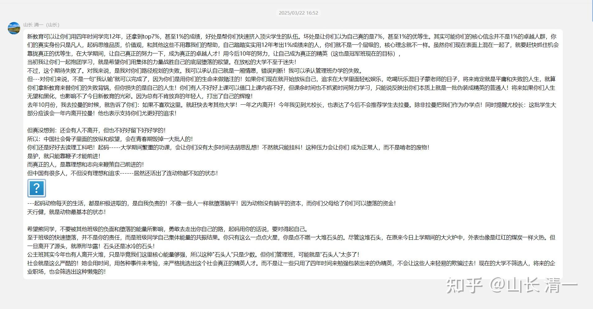

**社会上有七种级别的正常人：奴 徒 工 匠 师 家 圣！**

** 我认为，应该还有不正常的第八种人：可以叫做废物，也可以叫混蛋，垃圾人。**

精英，就是从脱离底层往上走的人。努力超越了平庸，他们就是精英！

**世界上，1%的顶尖人才，就是这个世界上真正的精英。**

社会会用各种方式选出来这些人，其中一种就是高考。考到1%以上成绩的人，一般来说就是这个级别的人。当然，也不排除选错了。社会还有一套筛选机制，来鉴别谁才是真正的精英---从一生的生活和事业来考验！

如果我发现了一套方法，可以让一个本质上很平庸的人，轻松通过高考，装成自己也是1%优等生的样子，其实**我是在帮人作弊！所以，我有违天道，该被骂，该被黑的！**

一个正常的学生，要经过12年的学习历程的磨炼。才能有1%的学生通过严酷的青少年期考验，证明自己是精英学生，值得上最好的大学！

我居然发现了教育的奥秘，今日学堂，等于在帮这群本质上根本就不是精英的臭孩子作弊，让她们装成了1%的精英，可以去外面骗人。

因此，有人骂我大骗子，其实是有道理的！我帮骗子，我当然也是骗子了！

**本质上，新教育的家长们，他们的孩子是什么等级的人呢？**难道是天生的精英吗？是我看错了人吗？我们就来好好的分别一下，到底把孩子送来新教育读书的家长，他们的孩子底色是什么？

**社会上，有七等人：奴 徒 工 匠 师 家 圣！**

做精英，就是要做“后三种人”。前面四种，就是正常人，普通人。

但新教育的家长和学生，是哪一种人呢？是精英？还是普通人？

根据上面七种人，我仔细的梳理了一下：**我发现，很多新教育家长的孩子，家庭的培养目标，教育思路，根本就不是要成为这七种人，他们就是第八种人。**

很多把孩子送来度新教育的人，本质上是怕孩子受体制的苦，不想去体制死卷，也不想好好努力学习去当工人。他们从小就不肯付出，不肯努力，不肯为他人服务！他们只想当混蛋和废物级别的人。

这些人，真的还不如体制学校的踏实学生靠谱。

体制就是专门培养奴和徒的地方！他们不是，因此离开新教育后，这群人也融入不了体制。他们就是飘在社会正常系统外面的病毒。

**我凭啥把最美好的 【师 家 圣】的大礼包，送给这群“混蛋和废物”呢？**

我自己肯定是“家"级别的人，自成一派的专家，教育，金融，武术，都是“家”！我要带的弟子学生，培养目标就是这个方向！

但---你们孩子是啥人？一起来检验一下吧。

**1：最低等的“奴”：你们是不是？**

奴就是服从者，服务者。每个人，多多少少都是奴，仆人，都是服务者。我也一样，我是新教育的仆人。刘老师也离开家，要去磨丁服务各位。还倒贴为你们服务！

我党也提倡【为人民服务】，他们是“人民”的服务者！

你们孩子正在服务谁？愿意服从谁？跟随谁？ WC，ZL，这些清黑学生们，你们是“奴”吗？不是，你们这些孩子，从小就是被家里人当“主子”来养的。导致这些熊孩子根本就没有任何的服务意识，没有要为社会提供价值的基本意识。

你们甚至也没有基本的“交换”的意识，到哪里都以为自己还是需要别人照顾的孩子，到哪里都摆出一副主子的样子。喜欢指手画脚的指责别人。谁认识你，谁就是你指责的对象，谁的别对不起你。

想通过装乖，装傻，装疯，装可怜，装善良，装正义。用一点小心眼，小花招，就轻松取得自己想要的一切。如果得不到就开闹，就跳出来砸锅，就要你死我活！

这不就一群熊孩子吗 **是一群根本没有最基本的带道德和教养。没有基本的人伦和文明精神，缺乏最基本的社会常识的一群混蛋和废材。**

还有检验一下，你们家长送孩子入学今日的教育目标：你们有几个家长，把孩子送来今日，是真心让孩子学会“服务社会，服务世界”的？基本上大多数就是想投机取巧，弯道超车去拿个大学文凭，找个好工作，嫁个好老公，过个好生活的“精致利己主义者”吧？

**哪里符合我们帮你弯道超车，是要多快好省的【服务世界，荣耀中华】的精英之心呢？**

**第2等的“徒”，你们是不是？检验一下？**

徒，就是谦虚恭敬的学习者。这些人，知道自己无知。找到老师就谦虚的跟随学习，掌握基本的技艺，用于去服务世界，服务他人！

你们的孩子，送来新教育，好好学习了我给你们的东西吗？

你们毕业后，去好好使用我教的本事吗？

如果不是，你是个屁的“徒”。你们就是一群欺师灭祖的混蛋！

**第3-4等的“工和匠”！你们是吗？**

工和匠，就是这个世界的建设者，也是贡献者，劳动者！你们是吗？

你们在做真正的服务社会的工作不？你们在为社会提供价值？还是继续的像是吸血虫一样，趴在父母和别人身上吸血？

**体制学校的主要目标，就是培养“工和匠”的。**清一新教育，也是在做好“奴徒”的基础上，帮你们拥有一技之长，成为“工和匠”。

如果想好好的做教师（公主班），就帮你们学会带班，学会帮助孩子成长。

如果不想做教师，就帮你们去读理工科大学，好好去做工和匠！做好了基本的工和匠，将来有机会成为师，家，圣！

**这就是简单，容易行走的---中国传统文化要求的“修齐治平，家国天下”的道路！**

你们居然不去大学里面好好的学习理工科，你们也不去企业里面认真的工作。你们只喜欢在社会上到处打晃晃！在家里混日子，舒舒服服的到处晃悠！

你们不去做工，不去当匠，不去做服务。

**难道你以为自己已经是精英人物---师，家。圣级别了吗？**

这七种人都不是，你说你们是不是第八种人？

一群废物篓子？

怪不得，你们就只会躲在小号后面，你们跑出来叫骂做事的人。攻击比你们高明的人，难道就证明你们就是圣人了？

呸呸呸！一堆垃圾人！

别以为你们上了几年新教育学堂，你们来上过今日学堂，就假装你们是精英，是圣人了。

你们真不配！

在校的时候，装得还像个伪精英的样子！

一回家，一回到社会，你们就回归了本色：一群无可救药的混蛋！

你们只要不肯为社会服务，不肯为社会提供价值，你们就是这个社会的废物！

就算你们上了今日学堂，你也是废物！

我们只能把愿意成长的幼苗，培养成大树！

我们不能把自甘堕落的混蛋，培养成精英。我们承认我们没有这个本事！

你们家长有的话，你们就去把你们的孩子供养起来好了！

下面是我2月份，对管理班的会话！这个班级，原计划是上个水专业。用剩下的时间来学习管理学，将来利用三语能力去企业做管理。

但因为是“伪装的精英”，一离开今日的环境去上大学，就缺乏自律。开始放纵和自由的生活，各种偷懒，也不再抱团认真学习。暴露了他们骨子里面不是精英学生的本性！

**这里公布出来这段对话，让家长们看看吧！你想让孩子成为什么人？不是由我们决定的，而是由你们决定的！**

没人扶着，你们居然就不会走路了！

去年我和ELLA等人，专程去了拉曼大学，见了拉曼的校长，为这群孩子们争取更好的机会，同时告诉他们：如果拉曼他们不满意，就自己作为跳板。跳去自己喜欢的大学去，学个有用的专业！

但他们在干嘛？听了我的交代了吗？少数人听了我的话，去认真走自己的人生道路去了。开始去申请更好的大学，学理工科，认认真真去做社会实践去了。

一些人依然在瞎混日子。也许还一些人因为不满意自己的人生，会不会用小号，和WC一起，黑自己的学校和伙伴们呢？我不知道。

**事实证明，清黑就是一群扶不起的阿斗！**

**我不在乎这些熊孩子黑不黑我，我只是可怜和同情你们：你们现在正在家里烂掉，我们正在崛起！**

**真正的精英，是不可能被一群垃圾就挡住道路的！**

**参考阅读，和附件资料**

[人分三种，人生出路有九九八十一种！您属于哪一种？](https://zhuanlan.zhihu.com/p/702133961)

*回复熊同学反馈一些班级同学快速堕落情况的批评*

我在2025年2月22日管理班的话：

新教育可以让你们用四年时间学完12年，还拿到top7%，甚至1%的成绩，好处是帮你们快速挤入顶尖学生的队伍。坏处是让你们以为自己真的是7%，甚至1%的优等生。其实可能你们的核心信念并不是1%的卓越人群，你们的真实身份只是凡人，起码思维品质，价值观，和其他这些不用靠我们的帮助，自己踏踏实实用12年考出1%成绩来的人，你们就不是一个层级的，核心理念就不一样。虽然你们现在表面上混在一起了，就要赶快抓住机会靠拢真正的优等生，在大学期间，让自己真正的努力一下，成为真正的卓越人才！用今后10年的努力，让自己成为真正的精英（这也是冠军班现在的目标），

当初我让你们一起抱团学习，就是希望你们用集体的力量战胜自己的底层堕落的欲望。在放松的大学不至于迷失！

不过，这个期待失败了。对我来说，是我对你们路径规划的失败。我可以承认自己就是一厢情愿，错误判断！我可以承认管理班办学的失败。

但---对你们来说，不是一句“我认输”就可以完成了，因为你们是用你们的生命来做赌注的！如果你们现在就开始放纵自己，追求在大学里面轻松娱乐，吃喝玩乐混日子蒙老师的日子，将来肯定就是平庸和失败的人生，就算你们拿新教育来替你们的失败背锅，但你损失的是自己的人生！你们有人不好好上课可以借口上课内容不好，但课余时间也不抓紧时间努力学习，只能说反映出你们本质上就是一批伪装成精英的普通人！将来如果你们人生无望和黑化，也影响不了今日新教育的光彩。因为总有不肯放弃的年轻人，打出了自己的辉煌！

去年10月份，我去拉曼的时候，就告诉了你们：如果不喜欢这里。就赶快去考其他大学！一年之内离开！今年我见到尤校长，也表达了今后不会推荐学生去拉曼。除非拉曼把我们作为办学点！同时提醒尤校长：这批学生大部分应该会一年内离开拉曼！他也表示支持你们尤更好的追求！

但真没想到：还会有人不离开，但也不好好留下好好学的！

所以：中国社会骨子里面的放纵和欲望，会在青春期毁掉一大批人的！

你们还是好好去读理工科吧！起码-----大学期间繁重的功课，会让你们没有太多时间去胡思乱想！不然就只能挂科！这种压力会让你们 成为正常人，而不是啃老的废物！

是驴，就只能靠鞭子才能前进！

而真正的人，是靠理想和志向来鞭策自己前进的！

但中国有很多人，不但没有理想和追求------居然还活出了连动物都不如的状态！

---起码动物每天的生活，都是积极进取的，是自我负责的！不像一些人一样就堕落躺平！因为动物没有躺平的资本，而你们父母给了你们可以堕落的资金！

天行健，就是动物最基本的状态！

希望熊同学，不要被其他班级的负面和堕落的能量所影响，勇敢去走出你自己的路，起码用你的话说，要对得起自己。

至于班级的快速堕落，并不是你的责任，而是班级同学自己集体能量的共振结果。你只有这么一点点火星，你是点不燃一大堆石头的。尽管这堆石头，在原来今日上学期间的大火炉中，外表也像是红红的煤炭一样火热。但一旦离开了源头，就原形毕露！石头还是冰冷的石头！

公主班其实今年也有人离开火堆，只是毕竟我们这里核心能量够强，所以这种"石头人”只是少数。但你们管理班，可能就是“石头人”太多了！

社会就是这么严酷的！她会用时间，用各种事件来考验，来严格挑选出这个社会真正的精英人才。而不是让一些只用了四年时间来勉强包装出来的伪精英，不会让这些人来轻易的欺骗过去！现在的大学不筛选人，将来的企业职场，也会筛选出这种懒鬼的！

[你眼中的清一新教育和今日学堂？](https://www.zhihu.com/question/1926326977331191984?share_code=AaApxIaBmi9d&utm_psn=1934216067795910864)

**说明：管理班现在刚刚解散不久，很多同学还正在寻找自己的道路，还没有变黑。有些人还在帮助我们，实名出来澄清黑子的谣言！我写的上文，只是提醒他们，不要把自己当成精英，好好去奋斗去。当时是2月份，也没有清黑事件出来。**

**现在的年轻黑子们，主体并不是管理班的学生，更多来源于更早毕业的高中班级。首届高中部最多，当年为了照顾这些人，本来不符合要求的人，想学东西的就都放进来。这些人总体来说底子更差，离开学校更久，已经失去了美好的梦想，失去了追求和目标，感受到了人生失败和迷茫的人，是看不到前途的人更喜欢出来黑。**

**原来离开的其中一些优秀的人，正在忙着打拼自己的事业。没空来管别人的闲事，没空来黑，当然也没空来粉我们，没空来帮我们。**

**只有这些因为人生失败而闲得无聊的人，天生天养，爹妈也不教导的失败者，才有空在网上看别人的笑话，没笑话就制造笑话。更喜欢借由攻击成功者，来掩盖自己的失败！希望大家了解。**