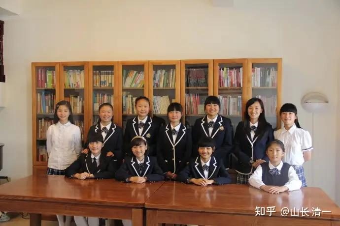
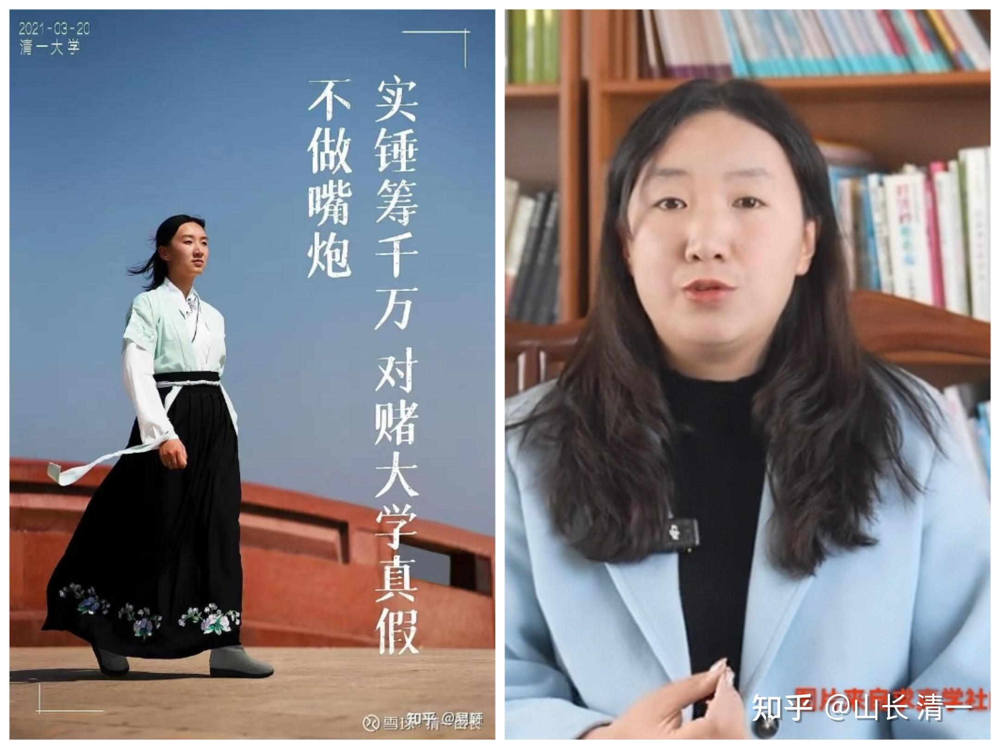
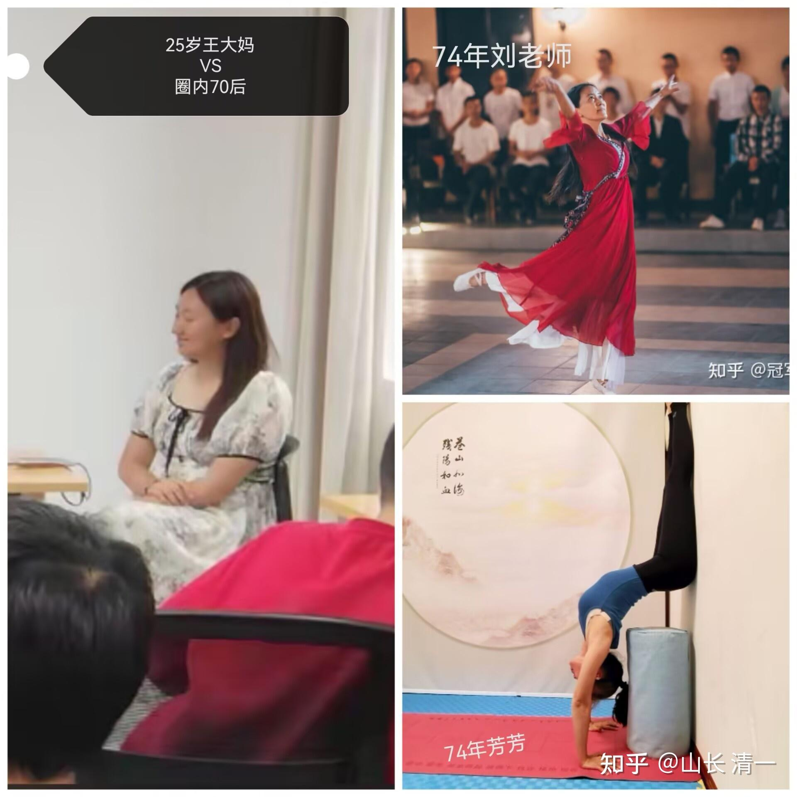

借用明一班，王大葱等人真人出演的真实案例，给大家讲讲老子的人生和社会智慧吧！

**【 出生入死**

**生之徒，十有三；**

**死之徒，十有三；**

**人之生，动之于死地，亦十有三。**

**夫何故？以其生生之厚。】**

**生 **是积极，成长的力量，**死 **是消极，毁灭的力量。

为了帮助大家理解，我的翻译，把**“生”翻译为“事业成功”**。把“死”翻译成“事业失败”！这样大家容易理解一些。

实际上，老子的智慧局限不限制事业，而是根据我们思考和理解的对象不同，想解决的问题目标不一样，你也可以翻译，带入成为别的目标！比如“生”理解为“生活幸福”。“死”理解为“生活失败”，也一样符合这个天道！

如果以为老子讲的就是人的“生命和死亡”的故事，你就太蠢了！书呆子一个！会看到这段文字，傻傻的不知道怎样生，怎样死。看到很多大学教授这样讲，让我哭笑不得。一帮不做事的嘴皮子，书呆子。

这一段：我的翻译如下：

**离开了生（成功）的道路，就进入了死（失败）的道路。（所以要随时让自己留在“生”道上，不能进入“死”道去求生。世人往往做反掉）**

确定能够走向事业成功的道路，大致只有三成的比率！

可以确定注定走向失败的道路，也确定有的三成比例！

看去上初始的目的是想要走向成功，结果却加速走向失败的道路，也有三成的比例！

为啥追求成功，却最终走向了失败? 就是**因为这种人过于急功近利，太渴望成功了，就违反了天道**，想走捷径，导致把本来可以拥有的成功可能都葬送了！

以上就是原文基本愿意的翻译！

还可以用在两人的恋爱关系上去判断两人走到一起的可性能

两人想要走在一起，恋爱成功，走上婚姻结果

就要小心：

离**开了成功的道路，就会走入分手的死路**

**恋爱约会的方式，有30%的途径可以导致最终的成功。**

**另外恋爱约会的方式，有30%的方式，会让恋爱失败。**

**还有追求者，过于在乎结果了，过于想要追求对象成功，弄得方法太过火了，让人无法接受。反而让本来可能成功的恋爱关系，最终导致彻底的失败。**

**这种情况。也有30%。**

**上面就是两种结合现实的翻译理解方式。**

学了老子的智慧以后，我马上就明白了：我一直想不通的明一班，并不是真正的“失败班级”。而是“正常班级”，她完美地符合了老子讲出来的天道。

如果我想要明一班，或者现在的公主班都成功，都能做新教育的合格老师，她们当初也假装是“热爱教育”的人。我这样想，就是违反天道的。当然会遭到“天谴”，就是示范给我看，我违反天道会遭到反噬的！让我知道人为的努力不起作用，必须尊重因果，天意。

WC的反噬，欺师灭祖。就是天意如此，是我活该！

如果我秉持天道的原则来看这批孩子，不给WC和ZL额外的机会和资源，让她们自然成长的话，她们现在想黑，也黑不起来！她们黑我的力量，其实是我赋予她们的！所以是我自找的！

其他几个我过去基本上不给她们能量加持的学生，她们现在就算是想黑，也没几个人理她们的。因此她们就依附在WC身边，借用她的号召力来黑。这就是证据！

*明一班毕业照*

这是明一班当年的毕业照。里面的学生总共有11个！如果用老子的话。来理解这张照片的话。就可以这样来理解老子为啥是人生指南书了！

老子人生之道翻译：【**按照天道的正常安排，这张照片里面这11个中，会有三个人（不超过4个人）将来是认真做新教育的“成功者”。**

**有三个人，会是不会认真做教育的【失败者】。**

**还有三个人，本来自己的条件蛮好，是可以成功做教育的。但她们就一定要去主动的找死，导致最终的人生失败。**

**其中一成的人（1-2个），是无关的路人】**

**的确。这样翻译出来，与现实对照，就发现老子判断得真准：**

**明一班这批人，来今日当老师，因为教学出现严重问题，被开除的学生正好是三个。**

**“自动离职”的学生，也正好是三四个。**

**现在还在认真做新教育，维护新教育的，积极上进的人，也只剩三四个。**

**剩下的一成人（一两个）就是路人。**

**这不跟老子讲的天道运行的结果，非常的接近吗？**

**当然，这是站在新教育的角度来讲的。如果站在更客观的解读来看，结果也差不多！我再翻译一下：**

**事业成功版：**【**按照天道的正常安排，照片里面这11个中，会有三个人（不超过4个人）能够获得事业的**成功。也有三个人，会是天生的“失败者”。她们的基本素质，决定了她们的人生道路，就是做啥都不会成功的人。另外还有三个人，自己的成功条件，素质是满足要求的。本来很容易获得事业成功的！她们也特别渴望获得成功，就会急功近利的去做一些过头的事情，反而让她们事业快速的失败。其中也有一成的人（1-2个），会是不成功，也不失败的普通人。】

**家庭幸福版：**【按照天道的正常安排，照片里面这11个女孩中，会有三个人（不超过4个人）能够获得美满的家庭和婚姻。也有三个人，会是天生的“不幸福者”。她们的基本格局，个性品质，决定了她们无论嫁给谁都不会幸福！另外还有三个人，自己的婚姻恋爱条件还是很好的，本来很容易获得婚姻家庭的幸福成功的！她们也特别渴望获得幸福家庭，但她们会过于的急于婚配，过早介入两性关系，反而破坏了她们本来可以获得的美好婚姻和家庭，成为家庭婚姻的失败者】

其中也有一成的人（1-2个），会是不成功，也不失败的普通人。

所以---天意如此、我们想要她们全部人都成功，是违背天意的！所以会被违背因果法则而受惩罚。最好的做法，就是不介入因果（无为）。只去帮助要成功的人成功，也不去拯救要失败的人。让他们自己沉沦

[2015年5月明德女塾武汉游学_哔哩哔哩_bilibili](http://link.zhihu.com/?target=https%3A//www.bilibili.com/video/BV19U4y1t7Js/%3Fspm_id_from%3D333.337.search-card.all.click%26vd_source%3D4cbc89574f9d1d5fdaaf7ba0be8d9083)

什么叫有为? 就是当年这几个我特别多给机会，多给支持，让她们得到比其他同学更多的三个人，现在都是最积极出来活动的黑子！

当年我不太关注，自然成长的三个人，今天都是积极成长的好学生。

其他三个表现，就是没有目标的跟随者。虽然给了留校当老师的机会，但因为乱做事被开除。只是今日一般不去宣扬这些人的不好，按道理去外围教学，或者去做事，不影响的。但她们是天生的失败者，因此就去找到“生生之厚而寻死的WCY。喜欢“作死”的三人，一起去走“失败之路”是必然的。这三个学生大概就是所谓的天生失败者，怎么弄人生都是失败的！没法帮忙的。

要说起来，天意注定：这个班，有6成的就是失败者。是我们再有能力，也改变不了的现实。这就是老子的天道规律！

我必须接受这个事实！

事实上，我也必须接受公主班将来也会这样。

只有三分之一的人会是成功者，三分之一的注定会是失败者，三分之一的人要去找死！

我多希望不会是这样的！

怪不得；西方的名校，都只在18岁以后，只考虑给奖学金。提前给，真的看不出来。等到了18岁以上，基本上成熟了，才应该支持，不然，去支持失败者，反而败坏了自己的名声！

我现在也学乖了
考上冠军班我才支持，没考上?证明你肯定不是30%，我就不管你了，除非你证明自己是30%。

现在头疼的是：冠军班，50%的人都超过1500分?这明显超过30%的警戒线呀？

我该咋办？

不过，现在的班级，跟明一班不一样了！

WCY自己当年就说过：要按照突破班的模式来选学生的话，她肯定不能被选中的！

她刚来学堂就因为想家。会哭很久。而且身体巨差。因为家里她是被娇养的。但当年仅仅是因为她的课业学习好，我们还不是太重视体育运动吃苦训练，居然让她混进来了。

公主班全员要求打拳，运动。受不了的人，不愿意吃苦的人，肯定都逃走了！

所以，也许未来会好一点了！

希望如此！

另外，如果用天道的原则来看：黑子们一只攻击今日的淘汰制其实是符合天道的。我们还没有淘汰这么狠呢

强调【一个也不能丢下】的爱与自由，其实才是完全违反天道的幻想！

太乙真人的模式，就是扯淡！

**出生入死的典范实例。大家珍惜这些亲自用生命来呈现的真理：**

**生命的状态：离开了生命绽放的“生地”，进入了死地的WC。**

还有看不见的能量场：事业，婚姻，家庭，未来的一切发展空间！

哪里是生地？哪里是死地？这样的对比，还不明显吗？

*WCY的“生地”和“死地”，对比强烈*

*谁是25岁？谁51岁？猜？*

25岁的生机何在，51岁的老骥伏枥？

生死就在眼下