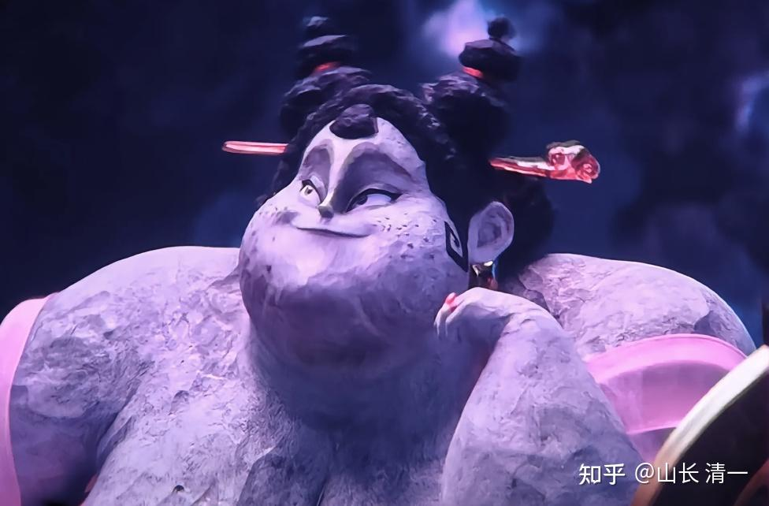
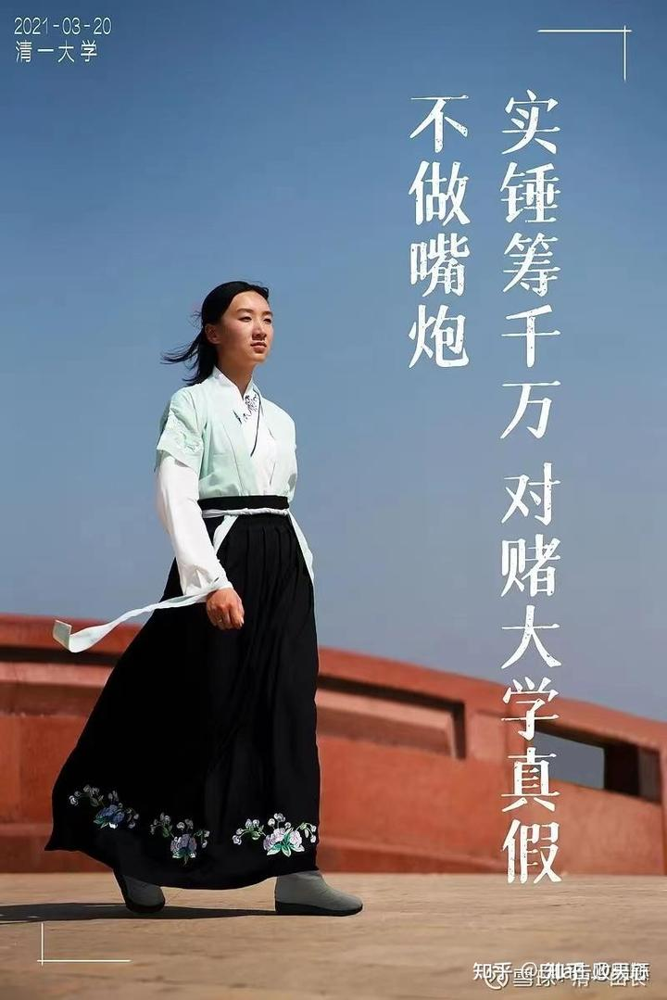
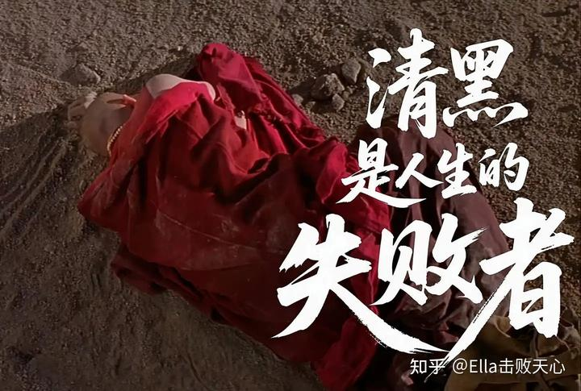

感谢李华丽的存档和收集整理
文人格斗第一人 清一大学创办人 山长 清一 2025年8月2日01:32 泰国

这个胖妇人，唠唠叨叨地在全网控诉，说她两年前离开的，这个培养了她十几年的母校，一直供养她的老师，把她折磨得患上了抑郁症。
她的过去，真的好可怜。我们想，她肯定最喜欢现在胖胖的样子，看她的指甲还做了美甲，这位胖妇人是热爱生活的小妇人，看样子她很幸福。

**大家瞧瞧：这是生活满足幸福的胖妇人，她很喜欢自己的样子，认为自己是最美的。**

*这张图可以代替胖妇人吧？像不像有福之人？反正肯定不像我*

** 下面这张照片，就是某人在离开学堂的前两年，当小道姑生活在苦难黑暗中的历史照片。 **

（申明：下面照片的版权属于今日学堂所有，只是小道姑当年的职业行为，不属于她个人私产。我有权使用，而且是**帮人们回忆美好的，不是骂人的，代表我们珍惜过去的美好时光）**

*受苦受难的小道姑照片*

**一个是她离开学堂两年前的照片，**

** 一个是她离开学堂两年后的照片！**

** 相隔仅仅四年的时间，就造成两个我们都不敢相信是同一个人的照片。**

后面这张照片，就是WC说她自己生活在水深火热中，她在今日学堂被奴役，被折磨的样子，她想要自杀的样子！

看了上面的照片就知道，她这个时候，真的好可怜！

我们的确发现了：她太瘦了。肯定她生活的地方，是个集中营，没啥好东西给她吃。这才把她饿得如此可怜。

我也很觉得对不起她，明明知道她是武汉人，武汉特产就是鸭脖子。我怎么就没有多买几箱鸭脖子给她呢？让她都想要自杀了！也许，吃到家乡的鸭子，她就不会抑郁了。

**在学堂苦恼得要自杀的WC，正是这两张照片的对比，让我发现了我的罪过。 **

我罪大恶极：居然把想要过上面这个胖妇人幸福生活的WC，培养成了下面这个小道姑。 我真的很对不起她！

她从来就没有给我支付任何减肥费用，我居然贴钱把她弄成下面这身材，肯定是对不起她这一身肥肉的，是她好不容易才积累出来的贵妇人的福气。

据说她老公，就是喜欢唐朝的胖女人杨玉环。我该死，却把她培养成了赵飞燕，当然对不起他们两口子了。

怪不得导致这两口子过上“娘娘”的幸福日子之后，都要来反攻倒算，要来黑我们一家了！老老小小都受害，

她还想要把原来培养她长大的学堂彻底地铲除掉！ 我就是咎由自取，活该！我有眼无珠。

下面的达世，经过三年的闭关考验，成为备受尊重的顶尖圣人。但他不听师父的告诫，想要离开修行的道场去过俗人的生活。可他去了俗世才发现：他还不如一个一个的普通人！

他比普通俗人更贪婪，也比俗人更无知，还比普通人更自大。甚至他理解不了正常人的正常行为！

他当了老板，拥有了芭玛还不满足，还要跟下面工人偷情。做事情偷偷摸摸的，一点都不坦然。

最后他发现俗世的生活好艰难，他完全不能适应。他居然不告而别，一点也不负责地偷偷离开自己的家人和孩子。

这个达世，修行的时候，不好好地做和尚；还俗之后，也不肯好好地做俗人。

我也想问WC一句话：

你在新教育做老师，却不肯好好地当老师。

你请假离开，去休假养身体，你也不肯好好地保养身体，而是胡吃海喝，一年就当上了胖妇人！

你要当堂主，也不肯好好地对待信任你的家长。

看你内部教师公布出来的你当堂主干的好事：

[《“求假学社”管理失控实录》](https://zhuanlan.zhihu.com/p/1935277802543886610?share_code=qgPnO8tHVMLj&utm_psn=1935287098589570349)

**你嘴巴上说，要回到教育的初心，但直到现在，你还在用小号来到处造谣搞破坏。**

你到底要怎么样，才会满意呢？能说说吗？

编辑于 2025-08-02 09:35泰国

网友评论回复：

龙永明新疆

这么一比较，确实跟达世的作为挺像？一念迷，迷魂颠倒，千年难醒，转念是人世间最难又最易的事情，分享我自己的一段亲身经历：在7年前我一次去闭黑关，出来的时候，一帮女同学在围着老师请教问题，问的什么呢？问已婚妇女喜欢另外的男人可不可以跟他上床？可不可以吃肉？可不可以不用管父母孩子？过自己想要的生活？……无论她们问什么，老师都说你们可以去体验，因为人生本来就是用来体验的，不要被道德绑架，但是不要执着，体验完了要放下，你不需要对谁负责，没有你父母孩子该怎样生活还是怎样生活……我在旁边一听，当时就觉得这老师讲的太有道理了，人生本来就是用来体验的，干嘛要为难自己呢？但是内在又隐隐的觉得这套看似完美的理论，有哪里不对劲？但是到底是哪里不对劲，又说不出来，只是模模糊糊觉得如果人生就是用来体验的，什么都可以体验，如果吃喝玩乐就能够成为圣贤，那为什么很多经典里都要求弟子持戒呢？戒色呢？没有答案！因为课程没有结束，当天晚上我们在酒店里面吃饭，桌上的鸡鸭鱼肉，一直在我面前转动，那一刻，我觉得那个牛肉怎么那么好吃，嘴里面的哈喇子不断的往外冒，这是从来没有过的现象，多年不吃肉的我，从来没有觉得肉好吃过，但在那一刻，就是觉得那个肉怎么那么好吃，就想尝一尝那个味道，但是我的潜意识一直还在找答案，最终我还是忍住没有吃一口肉，那个过程真的很艰难，那个晚上睡到凌晨4点，突然醒过来，大脑里面赫然印着两个字：欲望。那一刻我明白了，早上同学们问老师的都是欲望小我，老师也是在用欲望来回答她们的问题：不就是欲望吗？同时我产生了一种非常切身的感受就是我在跋山涉水奔赴目的地，历尽千辛万苦，就想放弃，因为觉得太难了、太苦了，目的地都看不到，最终……我到达了目的地，只有我一个人到达目的地，其他人都放弃了，那一刻我觉得自己太牛逼了，太伟大了，我好骄傲，非常兴奋……就在我兴奋莫名的时候，猛的回头一看，心里愕然：哪里有什么千山万水，哪里有什么千辛万苦？不就是欲望吗？不就是一层窗户纸吗？一捅就破，轻而易举呀。对，就是这种感受！从那以后，以前看到漂亮的女人还会心动，心思花花的乱想一通，从此就不会乱想了。这么多年过去，有时候我还会想：如果那天晚上我真的吃了肉，我还能窥破这个“天机”吗？我知道WC、ZL、SC门，清黑们，也在欲望小我的控制下造作，要醒来的确不容易，无论怎样，还是祝福她们早日醒来。醒来，是肯定的，是必然的，就是不知道什么时候了，今年、明年？今生、来世？……

山长 清一2025-08-02 09:18泰国

对，达世就是走了欲望之路，满足一千个欲望，与戒除一个欲望，哪一个更容易？

郑婉芳广东

她已经后悔了，已经下架了胖胖的视频，头像换了减肥后照片，说明她的灵魂谴责她的小我。

英子同学江西

你怎么知道是真的减肥还是p的，除非她马上录制一段视频，证明。视频才骗不了人

山长 清一泰国回复郑婉芳

你挺善良的，真是好人

，总把人往好处想。福往者福来。现在减肥的效果这么好了，可以两个月大妈就成为仙女吗？我好奇

郑婉芳2025-08-02 10:01广东

谢谢山长又帮我看清事物的本质！

从她下架自己胖胖的视频的行为，可以看出她开始意识到自己“丑”了，撤回她“被讨厌的勇气” ，是否能转化成减肥的勇气，学习贾玲用一年时间从209斤见到109斤，减掉100斤左右。从大妈变仙女，拭目以待……

山长 清一2025-08-02 09:28泰国回复锺文

我也不看她的一切信息，但总有人回传到群里面

。第一次看到，真把我惊讶到了。怪不得会这么痛苦，都开咬原主人了。估计失心疯了。

梓钰贵州

昨天有幸请教了公主班的家长们怎么样持续的去跟随新教育，不断的提升自己，很重要的一点一定要很真实的面对自己。面对自己的欲望，面对自己内心真实的想法，然后去觉知，有的人就是因为压抑内心。在这个群体里面的时候，想表现的很出色，就压抑自己去学习，但到时候被压抑的那个欲望反弹起来更加严重。而且会有很重的那种委屈感，觉得自己为了学新教育忍受了那么多。当自己不能再压抑的时候可能就会爆起，可能就黑了。

乐容湖北

如果“我”是一个小灵魂，我多想住在那个“小道姑”的躯体里，而非那个“贵妃娘娘”庙里。为什么？明眼可见的端庄大气活力自信、如此美得不可方物！人间的胖妇人常有，而霸气自信的小道姑难得。常人要修炼多少世，付出多少汗水、积累多少功德？才可能拥有如此美好大气的自己呀！或许没有对比就没有伤害！灵魂或许会因痛失美好而痛苦到想要打碎那个照见真实自己的镜子！可即便是碎了镜子，真实的丑陋会消失吗？或许，小道姑的美好灵魂,漂移到了Ella家，到了更多的清一公主家……。因为灵魂不灭，高贵而美丽的灵魂，只愿住在纯净而美好的生命里！祝福你！回头是岸，顿悟道法自然！

姜广智江苏

相由心生，心在哪里，可能连她自己都不知道；迷失的孩子，很叛逆。

易轩云南

她真的是现实版的达世，为我们上演了一堂精彩的课：面对青春期的性能量，她不愿意战胜欲望，而是跟随享乐，去满足自己的欲望。面对山长的谆谆教诲，她充耳不闻，坚持自己是对的，觉得外面的世界更精彩，觉得追随欲望很容易，不愿意踏踏实实训练自己，舍弃国礼和师门责任，去追随吃喝玩乐的享受。但真正到了外面的世界，她才逐渐发现俗世生活真的好难好难，她还不如一个普通人，她们更无知、欲望更重、更自大、更不懂得承担责任、更失败！她表面上扮演捍卫真教育的正义之师，实际却不肯好好教学、不肯认真对待信任自己的学生、家长和助教；她表面上说要回归初心，实际是满足自己的欲望之心；她表面上说要捍卫师门荣耀，实际背弃了师门的责任和荣誉，成为了攻击师门的枪子；她表面上说不做嘴炮，实际上是只做嘴炮，不敢应战、躲在小号后面到处造谣破坏！现在我们想问你：追随欲望的人生，真的轻松吗？背弃师门的责任，真的喜悦吗？只做嘴炮、不敢应战的行为，你的灵魂不痛吗？

喜舍执一2025-08-02 08:20老挝

这还只是看照片，大家就有如此多的感慨。如果见到其人真人前后的变化，那是会惊掉下巴的。去年在昆明见到她，一开始愣是没认出来--和我印象中还在学堂那个判若两人。当时就想：是什么让一个人在短时间内变化如此之大？后开见到其和其母亲一同出现，才恍然大悟：这不就是一个模子吗？原来原生家庭的影响真的是非常大的--最终她活成了她妈的样子

山长 清一2025-08-02 09:32泰国回复喜舍执一

对，与母亲一个样。当年我让她隔离她母亲的价值观，追随圣人的价值观，却变成了她拿来作为我“挑拨离间”他们家的证据。现在我啥都不敢说了，只敢把肥妈的孩子悄悄拉黑。

喜舍执一2025-08-02 10:23老挝回复山长 清一

记得山长在多年前写的两性关系的相关文章中提到（大意是）：选择伴侣有一个重要的考察要素，就是其母亲。现在看来，不光是选择伴侣，在选择学生时这一点也是要考虑的。肥妈们该警醒了

冯敬东河北

人终将活成你本该成为的样子

锺文云南

山长好幽默，哈哈

“我也很觉得对不起她。明明知道她是武汉人，武汉特产就是鸭脖子。我怎么就没有多买几箱鸭脖子给她呢？让她都想要自杀了！也许，吃到家乡的鸭子，她就不会抑郁了。”神奇的新药- 鸭脖 治 抑郁 ， 这广告打得杠杠的，武汉鸭脖又要名声大噪了，清黑WC 真厉害，从抑郁的苗条淑女，短短4年就被武汉鸭脖投喂得 珠圆玉润 的 唐朝WC贵妃，按说，2 年才喂成这样，战线太长了， 养猪专业户可等不了这么久，起码饲料3个月催肥 拉出去杀了卖个好价钱。那咱给WC 清黑 半年时间，达到的圆润效果，几箱哪够啊，成百上千箱 武汉鸭脖 走起， 保你 快速 珠圆玉润。谢谢WC 清黑们 为武汉鸭脖 商贩快速发展做出的贡献。哈哈哈

山长 清一2025-08-02 09:35泰国

短短4年——你是从2021开始算的。她是2023离开学堂的，2024年拍的视频，短短一年！

锺文2025-08-02 10:04云南回复山长 清一

哈哈哈，感谢山长更正，短短一年，嗯，不得不说“武汉鸭脖”的神奇功效。强烈建议“武汉鸭脖”找WC 代言，一定会让商家们赚得盆满钵满

哈哈哈

李海峰福建

因为聪颖是我上心理行为课的指导老师，对她比较熟悉，印象不错。那时候WC的事情还没爆发出来的时候，看到聪颖研学社的她这张照片和视频，我就认为不对了，真正的践行清一新教育的人没有胖子的，听过山长几次课，不管是佛家还是道家的有道高人都是瘦精精的。没想到相由心生，欲望的驱使下，WC做出各种没有基本道德底线，甚至大逆不道的事情出来。达世的下场就是她下场的预告。做了美甲，真是学到狗身上去了（我不是对狗有意见），美甲都是重金属和胶水甲醛，这种正常人的都不会做的，她也做了。可见正常的思维判断已经被颠倒，被利益集团重新控制了。经过这次的清黑事件的洗礼，我看到的清一新教育更加纯粹凝炼，清黑事件反而能够帮助清一新教育把不坚定的人筛选出来，这也是一件礼物！我自己就从这次清黑事件中，认清了自己，必须用行动来表明自己新教育人的身份，为新教育发声，这是我内心最应该做的事。

山长 清一泰国回复李海峰

“达世的下场就是她下场的预告……”达世从来没有去黑自己过去的伙伴和师父，好吧？他只是离开，去过自己的生活，没有想过要去摧毁自己过去成长的地方。因此，他不用承担WC一样的因果。WC会如何，我也不知道。只知道她肯定会比达世更艰难！更难面对自己的因果。

李海峰2025-08-02 14:00福建山长 清一

收到，感谢山长指出我的漏洞

香香广东

这前后的变化，我想等到她再经历一些世事，估计肠子都悔青了吧，她真的是太不会惜缘了。

吕晓全广东

在WC看来，山长又在PUA她了，她又要抑郁了，她美好的心灵受到了严重的打击！我的理解，山长指出达世追求欲望是不归路，追求欲望的达世，既做不了和尚，又做不了凡人，完全是迷失了自己，不知道如何对自己的人生负责！这是一份礼物，是劝人看清真相的真知灼见，虽然包装的有一些丑陋，不知道“聪颖”或“WC”拆这份礼物的时候，看到的会是什么？

山长 清一2025-08-02 09:34泰国

我在反省自己

李永才2025-08-02重庆

相由心生，变化真大，完全不是一个人了，或许是不是灵魂换人了

我很好奇会有男的喜欢她现在的样子吗？

山长 清一2025-08-02 09:34泰国

有呀？丁大少不就是，人家是上海的“上流社会”。

木棉花仙广东

山长您在这件事上确实犯了大错！错把顽石当美玉！所以被骂应该虚心接受，以后再也不犯这样的错误，不再花这种冤枉钱了。

山长 清一2025-08-02 09:19泰国

是的。真的是我错了，正在反省，我违反了天道。

书钰山东

所以说不能看说什么，只看做什么即可，这孩子在干净的环境长出来的就是干净的样子，在世俗的环境就长成现在这样了。两个时期的样子真是判若两人啊，有多少社会人想去掉这身臃肿都要花费天大的毅力和决心才能蜕变，这孩子居然去拥抱这身臃肿。可见思想导致行为，行为导致结果。结果代表着思想出毛病了，也许体验痛苦之后，突然醒悟要肠子悔青，那就让她去折腾吧。这世界很多人只听南老师的，不碰的头破血流不会回头。

和悦河北

我喜欢小道姑时潇洒的聪颖，如果灵魂可以去感受，山长的刺痛都是满满的爱

播种施肥河南

判若两人！一切真是在一念之间！警醒警惕！善护念

滴水-李海2025-08-02 09:45陕西

相由心生，一年变成这样了，离开平台“脱胎换骨”了这是

乔安娜的平行世界安徽

照片对比太明显了

我赶紧先去运动一会～

冯敬东河北

越不想看的东西越是得看

大妈刚跳出来的时候，就去看了视频，朋友还发来了当年小道姑的照片。当时就被恶心到了，赶紧叫大妈平复一下心情。这是一个人吗？不是在她的公众号看介绍看视频，我绝不会认，是的。这这这，可是我当年最喜欢、仰望的仙女级女孩

我的天！

冯敬东2025-08-02 09:32河北回复山长 清一

我们终将活成我本该成为的样子。

山长 清一2025-08-02 10:10泰国

我花了12年想把她变成真正的仙女。她妈用一年就让她变大妈。愿力敌不过业力。我真的太有为了

，活该被她怼。

冯敬东2025-08-02 09:15河北

再涨一百斤每天几个人抬着出屋才满意吗

Sophia尤山东

希望她能转念，重新选择自己真心喜欢的身份

琴琴久久云南

苦海无边，回头是岸。！

狮子王2025-08-02 09:33江西

看了这篇文章，有些伤感，作为在中国的非体制的教育，能做出这么多的成绩，有这么大的影响力，已相当不易，还要为唧唧歪歪的事情烦心，真心觉的很不容易。当然这本身也不是一般人能做的事情。（以前读个非体制的幼儿园还要被举报搬家，更何况是大些的孩子）。感恩山长！

sonia2025-08-02 09:58山西

记得山长讲道德经时说过，即使修行二三十年的人，堕落只需要一天

散户甲山西

WCY怎么变成这个样子了……

井底那之蛙湖北

她是天生的“金皮彩挂 蜂麻燕雀”胚子；只是可惜阴差阳错拜了鬼谷子

筑梦华2025-08-02 09:42湖北

精气神相差太大了，下面的明显要比上面的强得多得多。光看图片都不敢相信这是同一个人。仅仅一年就把自己作成了这样，真是天道好轮回。

褚海云泰国

无法理解清黑的脑回路

修心践道-马浙江

奉劝WC回头是岸。

王梦2025-08-02 10:00北京

自作孽不可活

李睿2025-08-02 09:10老挝

“相由心生”。两种照片一对比，WC们可清醒点吧！做不了和尚，也当不了俗人，那是什么人？你们的父母如果看懂了，该心碎了！

美丽腰肌2025-08-02 08:16广东

WC已经到了崩溃边缘，赶紧好自为之回头是岸吧

清一投资号2025-08-02 14:29四川

我们一般人没有什么大智大慧，即便是善良的人也不一定能做事。好心仁慈的人，但学问不够，才能不够，流弊就是愚蠢，加上愚而好自用便更坏了。所谓“慈悲生祸害，方便出下流”。比如对自己的孩子的教育就不能过分仁慈、过分方便。有时候帮助一个人，如果基本上出于仁慈的心理，结果很多事情，反而害了被帮助的人。“得天下英才而教之”当然很好，但山长当年创设新教育时，哪里真有英才让他来教？还不是碰到什么人都教，而且都给各种各样的机会。所以每个学习新教育的人未来的结局千差万别，只能说“各有因缘莫羡人”。