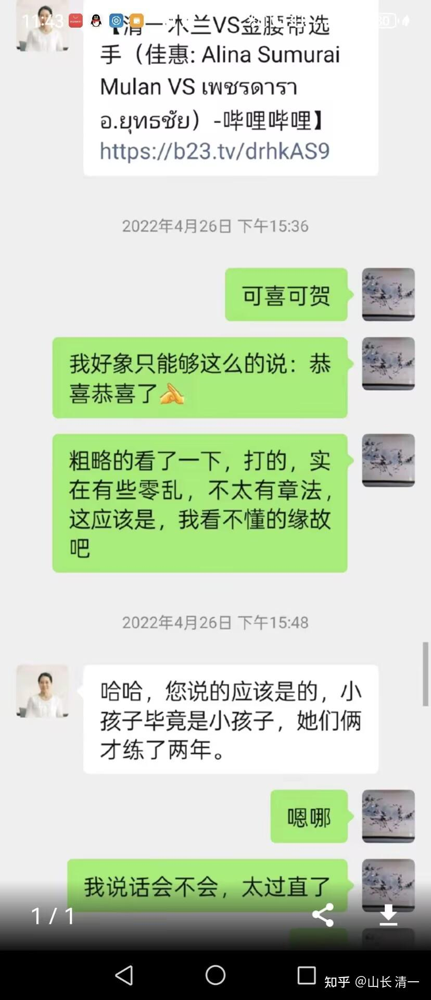
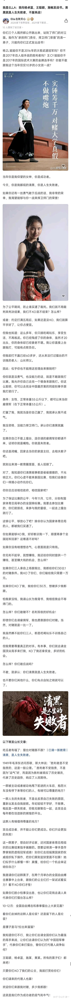

文章后面是一个视频，我2013年教静慧，聪颖和卓蓝三人的视频，当时没有想留影的。被学员自己拍了传到网上去的！无意中我才发现的视频记录。

[2013年云南会泽 清一教学员练武 明一班代表人出场](http://link.zhihu.com/?target=https%3A//www.bilibili.com/video/BV1Tq4y1r7ZD%3Fspm_id_from%3D333.788.recommend_more_video.9%26vd_source%3D4cbc89574f9d1d5fdaaf7ba0be8d9083)

到现在，我还是这样打人的，只要一出手对方就莫名其妙的中招，就得倒下。KO人只需几秒钟---这就是太极风摆杨柳的威力。

但木兰们现在还没有学会这招，因为太难了。大约需要10年才能真正的学会。摆动作容易，练出来真实战能力就很难！一旦真的掌握之后，连现在的世界冠军都不是对手。

就现在的清一冠军们，跟我交手的话，我还是用这招，就基本全躺下了，完全无法抵抗！

我相信一般人，练过没练过，根本就无法抵挡这一招。最近12年来，我的动作外形没有特别明显的变化。现在的公主木兰们，看到这些视频的动作，应该觉得“特别亲切”。但我的力量更大了，速度更快了，一转眼就能把人放倒。往往当事人还没反应过来，刚一出手攻击，人就倒地下了，莫名其妙的样子。

12年前，我的速度还不如现在，力量也不如现在。证明了内家拳，功力会不断的增加。而不是外家拳，年龄越大越动不来！

这个视频的出现，证明了有人多不要脸。非要说我们木兰的擂台拿冠军的功夫，是他教的。人不要脸，就真无敌了！他的功夫他别人偷学一点就能拿冠军，他自己不成堆的拿冠军？连一个像样的徒弟都没有，还有脸出来装大爷！不如五华山拉屎去才是正选！

下面而我们讲讲拳理！

**武术对话：传武大师为何看不懂现代格斗？**

这个时点，是佳慧明晓刚刚出山的时候。但是佳慧的功夫，比明晓还要更正一点。她是心态差一点。两孩子，第二战就跟泰国的金腰带拳手对战，勇气可嘉。由于佳慧第一个打，明明赢了，但没有KO对手，就判她输了，后来她都气哭了，认为不公平。明晓后来上场，就想不Ko就判负，就使劲的打，很快就Ko了对方，拿到了金腰带！她们两人，都只是人生第二战，成绩分别都是一KO，一打满五局！

这个战绩，大大出乎我的意外，因为我认为泰拳五百年不败，怎么这么轻易的就被我的小徒弟击败了？证明我们老祖宗教的东西很有用。我也高高兴兴的跟当时还是朋友的孙大S汇报情况（我没有微信，平时联系都是用刘老师的账号）。他当时回复，就是上面他自己贴出来的语言，意思，就是我胡闹的！根本就不是啥功夫！根本就瞧不起。

后来他说了：他问过搞专业格斗的朋友了，也把比赛视频给专业队的人看了。朋友说，在泰国打比赛，是可以花钱买的，几千块就可以买一场比赛！我这么有钱，花钱去买点比赛，拿几个金腰带，肯定不是啥问题。

我忍住气，说：我花钱买比赛有啥目的？用这个买来的战绩，来国内开武馆，混饭吃吗？我开武馆赔钱。然后再去打比赛还赔钱买。我脑子有病吗？

孙S的回复就更气人了：你们有钱人，就是土豪。钱多了你们啥都买，还可以不练功就买武术界的名气。富人都喜欢装B耍阔，他很理解！

我说我在国内的名气已经很大了，我不缺武术界的名。我又不混武术圈。

但他就是坚持我就是瞎搞的，就是骗人买比赛的，我就是没功夫，连我弟子都打不赢的。我能赢，是孩子们是我出钱养的，不敢得罪我，故意让我的！

这个论调，一直坚持到2024年一月份，我2019年出国后，5年后的第一次回国。

我见他的时候，孙S还是继续说这个调调！还是在抱怨骂许骥不尊重他，还在在骂我工夫差，没本事，是林妹妹，还是骂我花钱买比赛！反正我土豪，我有钱！

还给我女儿示范，我教的功夫狗屁不如，我误人子弟！让女儿不相信我的技术。我说啥技术都打不赢孙师的，拳不打功，但泰国人不会，不会担心！

当时我们已经打了快200场比赛了。还打了全国锦标赛，还坚持说是假的？我说我买个几场比赛可以理解，我连续买几百场？我有毛病？他开始算钱：说几千块一场，花个几十万就能买几百场，你又不是买不起！

全国锦标赛，也是能买的。别以为他不知道圈子里面的黑幕（的确，好像我们成都就遇到了这是潜规则，ELLA怎么打也打不赢对方）。

这事我懒得和他计较，没过几天就出现了他居然诬陷小明慧偷拍他武功的事情，我真的生气了。他不服气我的功夫，不理解我的目标，甚至羞辱打击我，我都算了！小明慧一个小女孩，非要说用手机去偷拍他的功夫？这人我明白了这人不是犯糊涂，不是想不通。他就是一个无赖汉，就不是啥好人。

当场我就翻脸了，我就开骂他：说我要打世界冠军，还用不着学他孙门的高功夫！我的功夫已经足够让我的弟子打世界冠军了！让他留着他的宝贝功夫，去地下去见他的老祖宗去，我就离开了。

但因为此人是我的老同学介绍认识的，我们断交，也要告诉中间人。这是我的习惯：善始善终。凡是关系的结束，都需要有个交代！将来重新见面，至少不会是我没脸见人。而是别人没脸见我。

当年写绝交信，其实我想的是：他是嫉妒我，认为我这文人，怎么可能吃武术饭！所以拼命的否定我的功夫，就想证明他才是正宗的！

但上个月他被黄拉著跳出来，就变脸了：现在就不再说我们的功夫不好了。而是说是偷了他的功夫！到处追着我的弟子们要认徒子徒孙！

他心中应该有数：知道我们的武功是玩真的了。因为我的弟子已经去了国家队，已经跟世界冠军打过了。国内同级别几乎无敌，视频也出来了。他知道：国内，他找不到能够打我们的对手了。但他依然不认输，不承认错误。反而变本加厉的攻击我。估计他心中，就只剩满腔的悲愤了：凭什么他就没弟子？我这文人的武弟子一批一批的拿全国冠军？

但他脑子还是不好，还继续了原来的惯性。继续喷我功夫有多差等等！包括转发这微信记录，都是贬低我们的！瞧不起我们功夫的！

他不知道这是自相矛盾的吗？功夫不好，你教个正宗的功夫来打掉不就得了？踏平清一武道馆，只会在嘴巴上说吗？

**现在我就解析一下：为啥这些自己有功夫的传武拳师，就是教不出能够去上擂台实战的学生弟子？**一生功夫练出来全都白费了？孙S练了一生的武功，这一辈子就是一点用处都没有，不能为国争光，不能为民服务，不能用来工作谋取职位。甚至他连骗钱都没有骗到。不像雷雷等人，还骗了不少钱。他的武功，就只有在五华广场跟大妈们一起秀养身健身功了！

我们清粉群内的对话：

安旭昌天津：孙师傅看不懂山长教的太极拳。孙师傅打人全靠蛮力。所谓拳靠少壮，所谓打的赢全靠年轻和力气大。孙师傅连跟了自己一辈子的徒弟都教不好，说明真的是靠蛮力王八拳赢的，连上点档次的格斗比赛都不敢上。说明就是拿蛮力下三路招数赢人，根本就是武术之耻。

孙师傅那形象，5秒真男人把鸡儿鸡儿的事天天挂在嘴上，明摆着招数就是猴子偷桃，黑狗蹿裆这种招数。真的武师都是有大家风范言辞行事都有宗师作风哪有天天嘴里脏口的？就是个鹦鹉，学了脏口就一文不值。孙师傅力气再大，口说功夫再厉害，脏口挂嘴上一看这人嘴里都是下三流，这人身上什么宝贝都一文不值了。孙师傅这样的人出来打着武术旗号却天天下三流招摇，简直就是给师门蒙羞。

上海叶琳琳：这个孙师傅一看就是四肢发达头脑简单！都被小鸟利用了，还一天天能不够[表情]

山长刘老师谦虚，给他面子和荣誉！结果他自己把一切毁了！所以说德行天下，德不配位都白搭！

现在又被小鸟挑唆，傻不拉几地！网上这样发言，脸都丢尽了！真心鄙视这种人[表情]

群里黑粉卧底你们这些缩头乌龟，别傻愣着，转达一下我这个以前还不认识孙师傅，现在网上见到孙师傅形象对孙师傅评价吧。既然自称掌门，对自己形象的要求和教徒弟的态度就得要按照宗师的要求去做。不会上上点档次的国家国际比赛争荣誉，天天跟人耍脏口，靠嘴去赢，这样的门派绝后是必然的。我虽然对武术非常好奇但是我绝不会让我的后人跟这样的师傅学。他的武术还是跟他将来烂在棺材里吧。

**清一回复：@0190安旭昌天津 公平说，孙S掌门的拳，不是你说的这样的。**他的大师兄个子大，力气大，但也打不赢他，以及他身边的人跟他动过手的人，倒是一直在说他的拳是“傻人笨拳”，说他也没啥技巧，就是力气大，所以打不赢。他自己说他是功力拳，吃功夫，所以没人练出来。

**我自己实际跟他交手体验的结果，我认为他的拳倒也不笨，只是看上去笨。**他的拳不能碰，不能去接他的手，一碰就翻，内力很强。另外：他一身的筋肉，打他没用的，基本伤不着他。但他打人很厉害，一拳就可以打断普通人的骨头。说他几秒钟杀个人我是相信的，不用偷袭的，不是靠偷档挖眼这种小偷小摸的技术。

其实真练了传武功夫，真打要命的实战搏斗的话，武道馆这些冠军们的手跟我碰在一起之后的五秒钟，我也一样可以杀掉他们的（空手就行，不用器械）。这是我们内部都检验过的，弟子们知道我们的功夫练出来很恐怖！传武一旦练出功力来之后，极其的霸道。

但我的拳像是跳舞，使用身体的移动，旋转来发力。孙可以原地随时发力，功力太强，所以我不是对手。毕竟他从小练的，底子真厚。只是要论招数和技术，其实我的招数会更加的变化多端，看起来防不胜防，速度很快，木兰们都知道的，跟我动手就眼晕。

孙某，看起来简单朴实，但没法跟他打，像是遇到了坦克车！但他的技术没法用在擂台上，我都不知道他的技术咋用于擂台，他也不知道。他都不敢去跟徐晓东打。但是场下无规则过招，无护具手套打生死战的话，我认为徐晓东不是孙的对手。

场上规则作战的话，有保护，有护具，有场上裁判的干预，有规则的限制，孙的杀人技应该使不出来。结果如何，还真的不好说！孙自己其实也没自信，因此他不敢去找徐晓东挑战。他特别怕输，怕掉面子。

**安旭昌 @山长 清一 孙师傅形象清黑也晒出来了，**这个面相怎么说呢，从我的角度看，孙师傅以前是工地扛沙袋出身。语言层次体系就是扛沙袋出身的槽帮那样的语言体系。应该是有那么一阵懂得感恩，那时候能入得了他师傅的眼。现在孙师傅这样的形象出现什么正经的台面都上不去。我小时候对武术感兴趣，家里有人想让我练武给我找了个师傅，跟孙师傅一样不教真东西，天天脏口，结果毁了我一辈子对武术的好奇。 这样的孙师傅，我是不会让家里孩子跟他这样的人有任何交集的。眼神碰撞都不许有。

**清一回复：现代格斗，基本上是一种体育运动，不是杀人的战场，格斗擂台，**真的不像你们想象的这样恐怖的，跟篮球排球也差不多的。训练过的人，很难KO的。看上去打中了，实际上他们消掉了力量。公主班这次出去8个人，四个人都TKO了对手，但在裁判的保护下，其实就一个对手受伤了，就算她受伤，当时场上也没看出来。其他人被TKO的人也都没事。因此赛场其实很安全。

你们也看到，两年多，我们打了四百场职业拳赛，我们的拳手也没有听说受过啥严重的伤。。。你猜都能猜到：如果泰拳比赛动不动受重伤，这个项这么玩下去？这些拳手都是靠比赛吃饭的，一场比赛就几百元。受伤了收入就断掉了。所以，规则，裁判，运动保护等等，加在一起，这项运动其实不比其他的运动项目更容易伤人，只是中国长期宣传武术杀人技，因此都弄得神秘兮兮的！

**孙大S 这种人，根本不研究现代体育，不去研究格斗规则，就拿打打杀杀说话，**其实就是传武人的固步自封，所以中国武术一直都出不来。不学习，不研究现代体育，玩什么玩？玩电影特技去了！

中国站立格斗四大项目（拳击，散打，泰拳，自由搏击），虽然都是打，但隔行如隔山。**由于规则不一样，他们的训练方法都不一样，全是针对性的训练，都有弱点。**比如散打的去打自由搏击， 跟我们打就老犯规，因为散打喜欢抄腿，我就要求队员打自由搏击就打高腿，攻击胸部头部，他们接腿三次就罚分。

打泰拳就要低腿，不要打高腿。拳击当然就不能踢腿。

散打打泰拳，又怕泰拳的膝和肘，内围战也不适应，因此国内的格斗手，就不太愿意来打泰拳。因此各位就知道了：格斗界互相之间，是壁垒深严的，互相不搭界。各练各的，不跨界。。拳击更是自己专练。

拳击的的人，来打泰拳，原来天天练的摇闪技术，遇到泰拳的扫腿就直接送头上门。而且他们不防守腰部以下，来打泰拳会被狂虐的。

练泰拳的人去打拳击会怎样呢？也是很吃亏的！就会被人偷袭腹部，击腹拳，抱肝拳，都会让他们防不胜防，因为是他们想不到的技术和攻击方式！

因此，现代格斗，是规则决定了胜负，你去玩别人的规则，功夫再高也没用！我们要打现代格斗，都要去花时间认真研究规则，找到有效的进攻方式，针对训练，才有结果的！

**为了研究泰拳，我2022年，用了两个多月的时间，每天都去泡在一家拥有多个全国冠军和明星拳手的泰拳馆里面，天天看他们的训练方式，研究他们的弱点，然后回来，再认真指导四个小公主针对性的训练，才取得了现在的成绩！**

仅仅站立格斗，就有这么多的门道，S大师们根本不去研究这些东西，天天拿自己的一点东西跟广场大妈炫耀，怎么可能去锦标赛打出成绩来？只能自嗨了。都是一群嘴炮！

**昌昌 @山长 清一 真论防身技术，找不到好师傅我宁愿去跟陈鹤皋练无限制格斗疯狗拳。**最起码陈鹤皋是中国建国后唯一有现实击杀案例还能全身而退的门派。而且人家也真的是在学习刑法。算入门的文人拳，比孙师傅之流的下三路强太多，实用太多，目的就是为了维护社会公益护家人。而且人家承认自己功夫上就是真小人，目的就是自保维护社会公义，不会滥用自己的功夫。孙师傅这样的，就让他烂掉吧。反正我不想学。跟孙师傅学纯属浪费时间。

**清一回复：我们也一样：我要求我们的队员，千万不要拿了全国冠军，就以为去外面打架无敌了，**私下场合，一定不能跟人过招。普通人当然随便打。但街头混混，经常打架的人，会有各种怪招和手法，完全不按照规则来打的。也不会一对一的老实的打。他们只管打赢，不管啥规则的，什么你想不到的手段都会用上。因此千万不要私下跟人约战。

我的队员们都是老实人，去打混混会吃亏的。要打就去正规的擂台才能打。谁都不怕，世界冠军来我们都敢接招。。。但是私下打架，跟混混打。我们还是认怂算了！我们不跟猪摔跤！

【当然，如果私下里面被逼无奈，躲也躲不过去，认怂也不行，混混非要打，我就说：一旦动手，就必须往死里打，出手就不收手。直到把人打倒在地之后之后，就马上脱离，赶快走掉。别傻乎乎的等“裁判”jc来裁决胜负，谁对错。此时就必须干净利落的出手，总比被混混弄死好！[表情]。另外，尽量不要去一些渣子人去的地方，酒吧，夜场等地。远离负能量！

