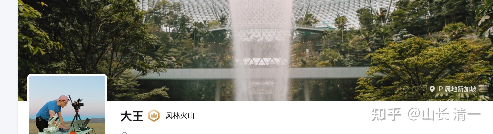

2025的清黑事件，是得到了境外势力支持下的一次系统的攻击。WC不过是这些境外势力操纵下的一个棋子而已。

新加坡是反华国家，特别的西化，特别崇拜西方。甚至以说华语为耻，和马来西亚完全相反！马来人认为华人当然要说华语。新加坡人认为说华语的中国人就是低等人，高华要说英语。

这批针对我们，背后在操纵指挥帮助WC们闹事的人，就是“恨国党”，高华。他们当年跑出去，就是认为“中国就要崩溃”。当年的中国的确贫穷落后，他们出去后，就自己认为高人一等，是高级华人。处处模仿西方的行为模式和生活方式。

教育上，也很崇拜西方的“爱与自由”。其实是放纵！我们为啥考SAT，50%的学生可以达到美国1%的水准？为啥3年就能学完12年？就因为美国的这种教育实在是太烂了，水平实在太差了。

崇尚自由的学生，每天就是傻玩，结果美国大多数人的学习能力很差。而且12岁的学生，老师就会给学生发避孕套，让他们很早就开启性自由。长大后这群人对性的追求变成了变态，搞LGBT，有无数个性别！

这就是美国爱与自由的结果，美国本质上是靠外国精英移民来维持竞争力的。靠用美元掠夺其他国家来获得美好生活的！但现在这种模式，遇到了勤奋和聪明的中国人最大的挑战，美国人一直想要卷的美国人无法对付的中国人，失去国际竞争力。

改革开放以来，是50后，60后，70后这批小时候吃够了苦的人，顶起了中国崛起的脊梁！

但美国怕这批人，打不赢这批人。因此就一直在鼓动一批高华，用“高级文化”，享受文化来腐蚀中国的下一代。想让中国的下一代失去竞争力！

这些高华拿的都是“非政府组织”的资金来做这件事情的，中国政府一直对这种人非常的警惕！他们善于用文化活动的名义。悄悄的潜入我们的内部，搞破坏。比如毒教材事件，就是他们的杰作，花了20年时间来改造我们的中小学课本！让我们的下一代慢慢的变色。

这批高华，都是当年的精英，学习成绩特别好！年龄大概在50多岁。好多人还是拿国家奖学金出国留学的，我的大学同学就是！

但她们出国后，错过了中国的发展，在国外也就是普通打工仔，过着不死不活的生活！现在回国与原来的老同学相比，发现自己无论在社会地位和财富上，都远远的不如国内发展的老同学，特别是这些成功的老同学，原来还不如她们！

**高华，润人们，就是错过了中国崛起发展机会的人生失败者！她们真的不甘心。**

但她们不会反思自己当年，拿着国家奖学金，毕业后却拒绝回国参加祖国的建设。虽然当年的钱会少一些。但祖国会给他们这些回国效力的高材生很高的待遇。如果一直坚持下来，现在肯定都成为中国最最高端的一群人了（比如我的国内同学，就有省部级的高级干部，也有多位亿万富翁老板）。

而当年这些出国的同学，迷恋当年西方的繁华和高工资，混了几十年之后，现在也就是普通白领罢了。特别跟国内的老同学相比。无论是财富还是社会地位，都远远的比不上。因此她们特别的失落！

有一些心怀不满的高华，就加入了海外势力搞的各种NGO。这些组织，就是有海外资金支持的，专门来贬低，搞乱中国民心的！表面上从事的是文化和教育方面的推广普及工作，其实本质就是汉奸间谍！几年前的香港搞乱，就是这群高华，配合中情局的人来搞的，妄图让中国陷入混乱，他们从中谋取利益！

根据我们的了解，在清黑事发前，WC带她的学生专程去了新加坡，见了操控清黑出来闹事的幕后人士，获得了这些高华她们的指导，支持和鼓励！她们宣称有高端资源，都会支持她们的行动的。这群小蠢货居然相信了，为了攀上高枝，就开启了5月底的大肆的清黑活动！

我是第一次知道，原来民间的非正规的小众教育，居然也会被这些海外势力渗透关注，实在是无孔不入。

另外，这些高华，特别是高华女人，还特别的搞笑。她们在崇尚美国西方物质文化的同时。还特别崇尚中国的迷信，比如喜欢去拜西藏的密宗大师之类的为师。 会在这些大师的门下搞一些封建迷信活动！

据我们所知：清黑们去专程拜访的某高人，号称拥有玄学的预测能力，甚至能够操控阴性的能量。

清黑崇拜的一些“高人”，据说还会用看不见的力量来影响人，攻击人。甚至制造车祸等！

**有一个通灵的高人对清黑们说：她们是新教育的新纪元开创者！她们会开创一个更好的新教育时代！这大大的刺激了她们的野心。**

所以这群被边缘化的前毕业生们，当然非常的兴奋了。她们是得到了海外华人，得到了高端资源加持，还有高灵支撑的“使命在身”的高级人才，因此这群黑子，才义无反顾的投身这场清黑战争！

现在他们的认知，被忽悠出来的概念，就是以为必须灭掉我们清一新教育，他们才能出头成为新教育的“新纪元”。

**是我这个开创者，是今日学堂的存在，障碍了他们这批人成为新教育的未来之王！**

他们要踩在我们的尸体上，爬上去当“新纪元”。所以她们特别的疯狂！针对对象就是我的家人。

这个背后支撑的新加坡人是个女人。她自己也参战了，用小号来污蔑造谣抹黑。她的小号是“大王”。IP就是新加坡！针对的对象主要是我们一家！因为他们认为我是“元老”，是新纪元要克服的对象。她的发言就是指示清黑攻击方向的。

*这就是WC背后的高华黑手，新加坡号。是个聪明，贪婪，却一生一事无成的混子女人，但顶个男人样子。*

我想说：新教育的新纪元，的确要到来了。因为我老了，该退休了。新力量要成长起来。

新纪元的确应在新教育的学生上---2.0，3.0们，她们会成为未来的领袖人物。她们是站在新教育巨人肩膀上的新一代人！

我这一代创始人，肯定会慢慢的褪色的，会成为她们的背景！

她们会在未来的社会，拥有非常高的社会地位！会很受尊重。

她们会是李小龙，我大概是叶问的身份。

她们会成为太阳，我是因为她们的光彩，而被她们反光的“月亮老头”！、

*这是成长中，文武合一的新力量*

**但黑茶们就洗洗睡吧，真没你们的事儿！**

你们离开新教育的这一天开始，就不再是啥“新教育的新纪元”了！**你们是被历史抛弃的垃圾，甚至连放到博物馆展览的机会都没有！**

1921年创立的中国共产党，一路上多少人退？反？掉队？

这群掉队的人，离开的人，甚至反党的人，在我们党终于建国，成功后，这批投机分子，居然能成为我党的“新纪元”吗？笑话！

只有一直跟随的红二代，红三代才有机会成为“新纪元”吧？

你们就是清黑一代，黑二代。

还指望新教育的新纪元个啥？别做梦了！

**新教育的理想，不是你们几个只会玩文字，不做实事。只喜欢吃喝玩乐的胖婆娘能实现的！**

新纪元属于文武双全的清二代，清三代。

**2026年：今日学堂将推出与精英教育齐头并进的普及教育方案，不淘汰学生的方案！**

这个方案的出台，就是弥补我们过于注重精英教育，没有给普通人安排后路，导致很多家长不敢加入新教育的困扰而做的安排！

原来的计划，是我们做精英教育，让外围学堂做普及教育！

但外围学堂的名声，已经被你WC求真学社败坏了，家长们已经对你们的外围办学失去信心了！

我们会补上这一缺环的！

这就是新教育的新纪元！新时代，已经来了，你们就别想了！

我们会奉行真正的爱与自由的新教育，不放弃任何学生的新教育！

每一次清黑的疯狂，都会让我们大大的上一级台阶！

这一次的升级改版，精英教育和普及教育并行，补上短板，这就是你们清黑带的礼物！

清黑们：感谢有你的推动！

作为回馈，可以让你跟随学习正宗版本的“真爱与真自由”的清一新教育。