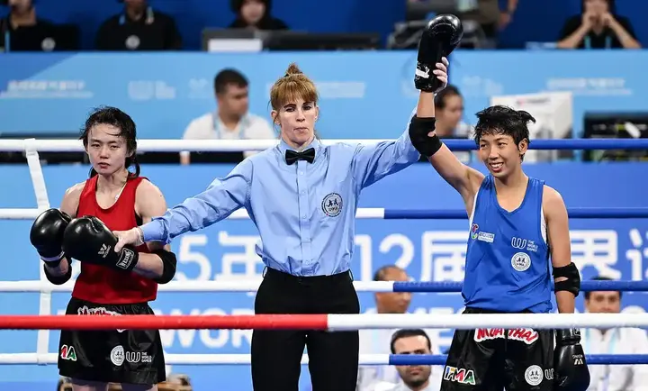
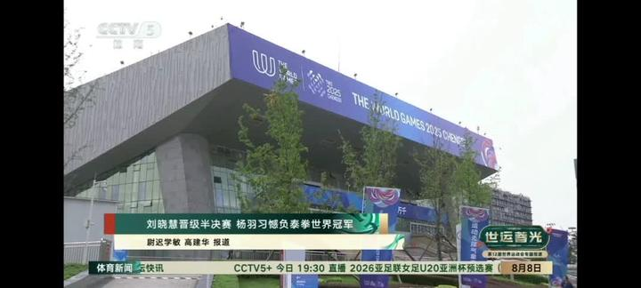
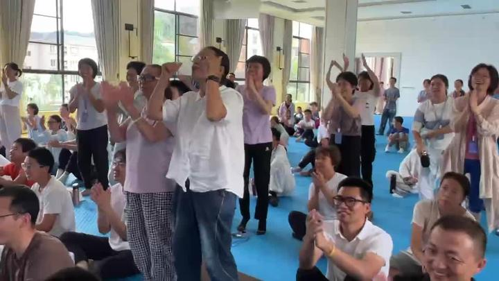
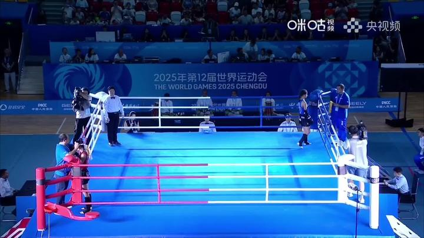

今天下午的比赛结果！

*瞧红衣者，满脸的不甘心！*

红衣服的就是2023年的世界泰拳锦标赛的银牌得主。瞧她的脸色多难看呀。

她来参赛的目的，就是夺金。但她怎么也想不到，今天居然在用外卡参赛的中国队一个无名小卒这里，吃了大亏。首战就被淘汰了。她前两局被打的完全没有章法，只好跟随明晓木兰乱打一气！第三局明晓体力严重下降，又被乱指挥不让她打，她有些糊涂了，才扳回一局。但大势已去。只能抱憾回家了！她应该是新加坡唯一的参赛拳手，是新加坡的明星代表。新加坡人今天会很难过的。泰拳弱国中国队，居然击败了他们强大的明星拳手！世界第二的强手！

算了，转发今日塾写好的文章，里面附录了今天比赛的详细视频！

[清一新教育 | 明晓闯入世运会半决赛，创造中国泰拳队史上最佳战绩【完整比赛视频发布】](https://zhuanlan.zhihu.com/p/1937221089940968861)

**虽然说胜利者不接受指责**

但我今天还是批评了谭木兰和明晓，没有把我的战略指导真正的用出来。导致今天打得非常纠缠。看了一遍视频，明晓有很多次，跟原来的打法一样，是主动出击的。对于这个级别的对手，而且是体重比她重很多的对手，这就是最差的打法！导致赛事中纠缠很严重，不是我教的【同归】打法。明晓可能以为我教的同归，就是拼命去打。结果把自己累死了。正好明晓的身体还不舒服，消化系统紊乱。因为这个月练得太透支了。（训练过度）

我的【同归法】，是你不动，我也不动。你敢打我，我就死命打你。你不打我，我等你。逼你出手，我才不主动攻击你，我愿意用挨一下的代价，来交换最佳的打你的机会！这样是最不消耗体力的。

除非时机太好了，对方给空挡，我不打都不好意思！

这种状态用出来之后，在场上会对对手造成巨大的心理压力！

明晓今天的攻击非常急躁，不是我教的意图！我骂了她们两一顿。**说人笨了，不理解，就多问几句。不懂就问。不懂装懂，把自己累死，以为这是同归。回来还要被我骂人！**

**当然，今天新加坡的对手也被明晓累死了。打得也很拼命，外围打不过就内围拼命用力。**

当然，最关键是明天的赛事！

谭木兰问：师父好，明晓今天第三局打得比较保守，因为感觉肌肉后面太酸和软了，手腿都有点抬不起来（我猜可能赛前训练太猛了还没缓过来，以及前两局缠抱太多了），教练们怕被KO所以让她以防守为主。刚刚她拉伸了一下稍微好一点，现在已经坐车回酒店休息了。

今天这个对手是相对比较弱的，明天要打的会更强一些：菲律宾拳手，就是第一场把对手打出血的蓝方，比较聪明和有力，喜欢打外围。对于明天的比赛明晓感觉有点没信心，请问她该怎么应对呢？（菲律宾拳手的视频稍后会发上来）

**我的回答和分析： **你看看有啥要讨论的？

**第一：这个对手，应该不会比今天的对手更难打。**今天的对手，她的优势是外围的重拳重腿，加上内围战的缠斗力量大，其实并不好打。但她外围攻击技术，被明晓控制距离和中线之后，就完全施展不开了，就使劲来玩内围。明天也一样，继续用今天的打法，拼死换拳，取中线的技术，就可以让对方的外围攻击技术落空。内围战，我认为明晓更强。肘膝技术会让她吃不消的！

**第二：明天的对手，是一个很不老实的人。**今天她碰拳的时候，就会同时用后手偷袭，借此激怒对方，然后她很冷静的用灵活的步法，控制距离，消耗对方体力，然后用冷手打击对手后就快速的撤离战场，让对手打空。今天的乌克兰人，就是被她的“东方智慧”和小伎俩，给折磨的气急败坏的，导致被她冷手偷袭，最后输掉比赛。其实乌克兰的实力很强的。

**所以，明晓要特别小心她的这种策略，随时做好攻击准备**，一旦她出手攻击，马上还以颜色！最好的方式，必须用手护住自己的头面部，在对手袭击自己的同时，用腿去打击对手腹部，最好用连续腿法，跟进打击！因为对手会突然冲进来打一拳，再快速离开。因此，明天更抱“同归”的打法去打才行。真的要跟对方换拳，不是投机，偷空打！更不是拼命消耗自己去打！

**第三：我怀疑，她是原来练拳击出身的拳手，她的**拳法很强，步法也很好！但她的腿法和肘，膝，内围战，我看都没有啥优势。明晓如果要去跟她拼灵活，拼步法，就会输掉比赛！因此必须用“傻人笨拳”的死拼方式，用“同归”的方式，贴进去打她，才能抵消自己的弱势！

**第四：这人是右架拳手，其实利好明晓的右架攻击路线，她反而更加不好出手。**明晓用前腿正蹬，可以封杀她的正面攻击路线，她就无计可施了！她退开的时候，可以用双腿连续攻击，也可以保持体能，不动如山，等她进攻的时候再“同归”！她善于中线攻击，与我们的拳有点相似。但我们的侧身站位，会让她非常不习惯的，她的站架中线暴露较多，这就是明晓要锁定的攻击点！

**第五：总结：明天作战的核心，就是步步为营，逼近对手，不能退，也不能站原地！** 比灵活，比久经战阵的经验，你赶不上她。就修【不动如山】的心。一动就要人命的狠心！其他什么都不想。输赢都不想要，就想怎样一招一式的打垮她，摧毁她的意志。。。这样打就行了！

**第六：今天的第三局，明晓的表现很失败，被乱指挥了。**前两局领先。第三局的策略的确是“不被KO就可以赢了”，因此冒险进攻的确不必要！**但此时，更要使用我教的“同归法”打。**因为对手此时很急躁，特别想要拼命KO我们扳回来。因此我们更要稳住阵脚，打反击，甚至我们会反过来KO对手。因为对手急躁了。

今天明晓就违背了这个格斗原则，听了场上教练的“指导”，拉开距离，结果被对方趁机攻击，明晓还远远的进攻，又浪费体力，还被对方反攻击，结果导致落败。因为我们的太极原则是打死不后退，后退反而更容易被打死，怎么能够听“退下来，拉开距离”的指导呢？这一退，明晓就不知道怎么打了，就完全是胡闹！