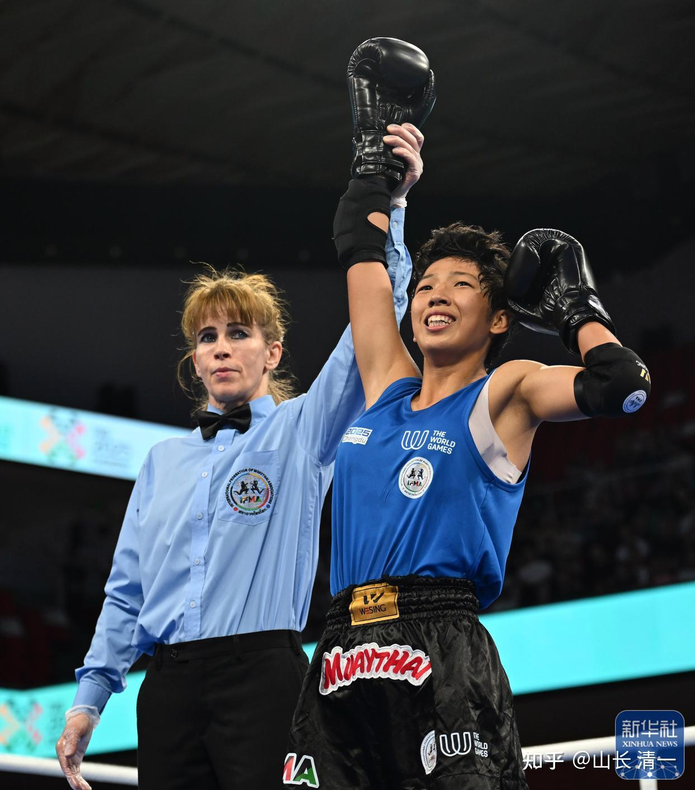

8月10日：应该是世界顶尖赛事中，中泰女子拳手的第一次巅峰对决！
向来看不起中国拳手，特别是看不起中国女拳手的泰国人，将是历史上第一次在顶尖赛事冠亚军擂台上，面对中国女子的挑战！
以下是中泰双方在今天的半决赛中的表现，他们都战胜了对手，进入决赛！

[新华社报道今天的世运会泰拳半决赛](http://link.zhihu.com/?target=https%3A//baijiahao.baidu.com/s%3Fid%3D1839993839080222936%26wfr%3Dspider%26for%3Dpc)

相比之下，中国木兰是以第二局KO的战绩，提前锁定胜局。而泰国拳手是打满三局获胜的！
中国拳手应该略胜一筹！
8月9日，第12届世界运动会继续在成都进行。在泰拳女子48公斤级比赛中，中国选手刘晓慧以10:9击败了菲律宾选手阿布巴卡尔·鲁兹马，将在8月10日进行的决赛中迎战泰国选手奥诺克·库拉纳特，有望为世运会中国代表团再入一枚金牌。

今天是世界运动会唯一进入决赛的泰国种子选手。

如果泰国胜了，勉强保住泰拳的泰国面子！

如果泰国输了？而且是输给中国？

这是过去的历史上从来没有发生过的事情，泰国人应该无法接受！

中国呢?赛前中国体育总局的领导，根本就没有指望拿到奖牌。更没指望拿到金牌！毕竟：原来参加世界锦标赛，都是第一战就全部输掉了！

现在：居然有了争夺金牌的机会？已经大大超出了领导们的期望值！

如果赢了：就是翻天了。泰国顶尖高手都被木兰干掉了，中国人的恐泰症，可以改变了！

如果输了：那么一切正常！反正中国的女子拳手，从来没有在顶尖赛事中，赢过泰国拳手！这不过是中泰对抗历史的延续！

当年泰国的女子拳手要来中国打中泰对抗赛。但中国居然连一个女子拳手都找不出来，敢跟泰国人打的。

今天：历史因为木兰而改变！

取胜胜利的关键视频（被下掉了）

明晓半决赛：TKO菲律宾拳手的完整版视频
经过昨天重新指导今天的场上应对方案之后，谭木兰今天也跟明晓复习，帮助明晓掌握了“同归法门”，今晚明晓打出了精彩的一场比赛，TKO对手获胜！

[张清一原创：木兰明晓世运会打入半决赛](https://zhuanlan.zhihu.com/p/1937283697968677597)

文章
赛后明晓给我的总结反省：
明晓: 08-09 19:41:32
师父好，今天打的比昨天冷静了一些，而且就像师父说的，只要把师父和老祖宗的技术打出来就行，其他的什么都不用想。虽然还是有很多地方可以做的更好。
我明天是打泰国人，这个泰国人比我高一点，老拳师刚刚嘱咐我一定要离的近一些，因为远了这个泰国人会扫腿。还说这个泰国人减重来打，所以第一回合可能会打的差不多，但到后面两个回合肯定会没劲。
我回酒店之后打算再好好看一看对手的视频，请问师父对我明天的比赛有什么指导吗？
山长 清一: 08-09 19:47:04
你只要真的用了我教的办法，就会赢得很漂亮。你抱“同归”的心法去打，真心相信这种打法，死的是她。不是你！但你要抱舍弃自己的心态去打！
你玩聪明，死的就是你。你用处出来我教的东西，天下没有谁是你的敌手。甚至男生也不是你的敌手，你要相信这一点！。。。老拳师说得对---关键就是要拉近距离。晚一点我发方案给你，你先按照昨天教你的方案去应对视频，去模拟作战。看你有啥想不通的，有问题，再找我。
明晓: 08-09 19:48:04
好的，感恩师父，相信师父和老祖宗的技术，按照师父教的同归于尽的打法去打。[抱拳]
山长 清一: 08-09 19:52:21
今天打赢了，你也不要狂妄。你要感恩老祖宗，感恩祖师们的加持！要诚心诚意的感恩他们。你这几天的恶心，身体状态不好，是你内心不自信，是你紧张，焦虑带来的负面结果表现。你自己吸引来的不行的借口和理由。
你只要相信老祖宗，相信老师，你就会赢的。你要按照你自己的本性去胡乱思想，你就会输掉比赛，甚至会伤，会病！因此，你要诚心的尊重祖师爷，这是最重要的，不要自恋！因为你是代师门去打比赛，不是你自己！
所以你只要不自以为是，一心使用老祖宗的智慧去打，你就会赢！
山长 清一: 08-09 19:59:19
另外：电视台采访你的时候，你要说：我们三语学校，有很多像你一样的师弟师妹，都在泰国训练和比赛。水平跟我差不多的拳手，就有四五个。我们都想击败外国人，为国争光。强调你的学霸身份，文人格斗，可以说你会四国语言，加上老挝语！

明晓: 08-09 19:59:49
收到，谨记师父说的。确实是因为老祖宗和先辈们以及师父师娘，不是因为我。一定正心诚意的感恩老祖宗以及师父。
明晓: 08-09 19:59:49
收到，谨记师父说的。确实是因为老祖宗和先辈们以及师父师娘，不是因为我。一定正心诚意的感恩老祖宗以及师父。

山长 清一: 08-09 20:00:09
再说，就可以告诉他们，我们这些人，都是15岁才开始格斗训练的，三四年就可以上战场了！
明晓: 08-09 20:57:28
师父，这是泰国人打半决赛的视频。
红方第一局打了很多无效的攻击，蓝方就是往后退闪开对方第一下的攻击之后立马反击。另外觉得她们两个人都是互换攻击比较多，你打一下我躲开，然后我再打你一下。
我应该继续用师父教的同归于尽的打法，在对方打的一瞬间同时往前打对方，而不能站原地或者从很远的距离瞎进攻。
不过发现有一个问题，就是从第二回合开始泰国人会像坦克车一样提膝慢慢往前压近，之后出扫腿或正蹬，这时红方会有点慌乱的退开或者随便攻击一下。我这时是不是应该也同时往前逼近，卡到一个0.8甚至更近的位置，对方一动就打她？正蹬就要踢高一点，太近了就直接出拳。
山长 清一: 08-09 21:02:03
【泰国人会像坦克车一样提膝慢慢往前压近，之后出扫腿或正蹬】。。。【我这时是不是应该也同时往前逼近，卡到一个0.8甚至更近的位置】。。。对，她很善于打反击。你就也提膝防守，往前靠近，就是等她出手，然后踢她，落地马上用拳打她。【因为她是让你躲的时候发力攻击的。你就不能躲。迎上去。
山长 清一: 08-09 21:02:21
好的，你先去睡，打法我明天给你！
明晓: 08-09 21:02:30
好的，谢谢师父
明天对战泰国拳手的技战术解说， 我就明天再发上来。
今天先去休息
下面先放泰拳手今天的半决赛实战视频，大家看看明晓有无能力战胜这个对手。

视频被删除了。。。。

刚才复盘的时候，我看到视频上，居然明晓父母都出现了，都在观众席上。明晓母亲在泰国，都不敢去现场看女儿的比赛。因为怕女儿受伤，也不忍心看女儿狂殴对手，觉得对手也好可怜。因此过于善良的母亲，明晓也不想让她去看比赛。现在两口子专门从泰国回国去看女儿比赛，不知道告诉女儿没有。没想到被中央电视台的镜头捕捉到了。今天，因为女儿的缘故，两个父母也上电视台了！看到全场的观众都在为自己的女儿明晓加油欢呼，作为父母，他们今天一定很自豪！这就是儿女最大的孝顺：让自己的勤奋努力来荣耀父母，荣耀家族！

---

8月10日更新分割线

昨晚研究视频，明晓昨天的，以及泰国人昨天的视频，看了好几遍；一直到了一点过没才睡

今早五点，起来写今天的决赛方案如下

决赛日的中泰大战，对于明晓来说，是相对比较有利的一天，我对明晓的战略和战术指导，对手分析如下：
第一：泰拳手是非常正宗的泰拳风格。主要攻击武器是左右扫腿，拳的能力还不如菲律宾人。但这个拳手的左右扫腿都很厉害，算是比较全面型的泰拳手，因此摩洛哥人才吃了大亏输掉比赛。但也正因为她经常练习左右扫腿，她的正面暴露空间很大，腹部暴露的打击点，比半决赛的菲律宾人更容易打到正面。因此她虽然是世界冠军的身份，排名更高，其实也并不比昨天的对手更难打，最多相当于第一天的世界第二名的样子。只要明晓坚持她已经学会的“同归法”，非常冷静的等她出腿的时候，同时进攻其胸腹部，不要急躁和抢攻，她的武器就被克制住了！不会比前面两位更难对付。
第二：仔细看昨日的泰拳手半决赛，摩洛哥人很不咋的正蹬，都击中对手数次，证明她防正蹬的能力不行，没有对付清一木兰的经验。还不如清迈的泰国拳手更懂得对付木兰。她是靠扫腿击中摩洛哥人，得到更多的有效击中，才击败扫腿技术不如她的对手。因此，今天明晓决赛，依然采用正蹬开路，接拳的技术路线，加上“同归法”的时机掌握，会有发挥攻击的空间！对手的外围攻击武器将失去作用。
第三：内围技术，对手虽然是泰拳手，理论上内围比较厉害。但昨天观察的结果，没有发现她的肘膝攻击有啥优势。进入内围后，她的办法主要还是使劲抱住对手不动，等裁判分开！这样很费力气的。明晓可以继续发挥内围优势，一旦进入内围战，就像昨天一样拼命的攻击，肘膝拳齐出的乱打，依然有可能KO对手。
第四：现在已经打到决赛了。基本上，这种顶尖赛事的最后一天，没有不受伤的拳手，因为彼此的技术都差不多，都是交换伤害的。但明晓却没有受伤，甚至体力还比第一天的状态更好。因此这一天是明晓的，应该可以拿下对手！
第五：体能状态比较，对手是降重来打的。打第一局没问题，但第二局，第三局，就会有问题！明晓今天是真正意义的最后一场了，更没有储存体能的必要，继续拼完全程就够了，从第一局就跟她玩拼死作战，跟昨天一样。
第六：今天是决赛，也是明晓该发挥主场优势的时候了。只要双方打的差不多，理论上应该是会判给明晓的。不过不要寄希望主场优势判分，由于我们的技术不一样，裁判是看不懂的。交换攻击，可能判我们输。如果一个扫腿，交换一个正蹬，我们认为是对手吃亏，但裁判可能以为是我们吃亏。因此：明晓依然要以尽量KO对手作为目标！
我的判断，第三局明晓会有KO对手的机会。如果前面两局，明晓的攻击打垮了对手的格斗意志和体能，第三局就会出现明晓KO对手的机会。明晓可以利用自己的体能优势，以及技术优势，对泰国对手第一局开始，就狂轰滥炸。打乱对手的节奏，就完全有可能KO对手，最少打平。这样取胜的概率才大！

记住几个要点：

第1：如果自己累了，要知道对手跟自己一样累，甚至更累！谁能挺住谁就是赢家！反正最后一天，就全力去拼了。

第2：记住像是半决赛一样，稳住，不要急躁，不要抢攻。尽量的逼近对方，逼迫对方攻击，享受“同归”的快乐。对手就算是像昨天一样就是不出手，也耐心等著她进攻，逼到围栏上，也要继续逼迫进去，等对方出手的同时再攻击，避免像是第一天一样浪费体能！就不会导致第三局没有KO对手的体力了。除非发现对手虚脱避战。才可以主动进攻！

前两局，都要记住---打迎击，才是“同归法”的要义！

第3：第三局之后，明晓就放开打，就不受“同归法”的约束，可以趁对方体能下降的时候，主动的进攻，狂轰滥炸了！即使前面两局都判给我们了，如果体能储备足够，也可以继续的主动进攻。但如果体能不太够的情况，就尽量的采用“同归法”！最高限度的节约体能。前面两局也一样，一轮进攻完毕之后，体能不够，就暂缓逼迫对方出手，放缓进攻节奏。体能够，就继续逼近对手，再次逼迫对手“同归”。

第4：明晓跳拳舞的时候，这是拜师舞。要内心真正的升起拜列位祖师，宗师的心，去与历代祖师的能量进行对接，消除自己的小我，消除自己的自以为是，才能取得胜利！用心去打出我们的传武宗师，太极祖师的威风来。

以上是今天的打法技术。清黑们赶快去通报给泰国人，我们等著你当汉奸！我玩阳谋，不玩阴谋！