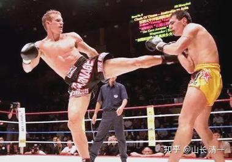

刚才，又看了一遍明晓今晚决赛对手的视频，想总结一下IFMA的泰拳比赛，和泰国的职业比赛的差异！

**IFMA组织的目标，是想让这个运动进入奥运会，**目前来看，比散打的成功几率更大。因为一种重要指标，是每年参与IFMA赛事的运动员人数要够多！目前世界赛的参赛人数，是散打的15-20倍。基本上，散打国际赛事上是没啥人来玩的，我们国家的拳手就是赔钱来玩的一种自我感动的游戏。也许以后中国强大之后，就有人玩了？

我们也不去玩的原因，主要是国内自己打内战，我们认为没啥意思！我们的目标是星辰大海，是要打外国洋人，对内战真的没啥兴趣！

技术上，职业泰拳和业余泰拳，两者的要求是差不多的。但由于IFMA特别强调安全性，因此加上了一些措施，比如护具的使用，这样就会造成很多的技术上的不同！

比如今天的明晓对手，是非常典型的泰拳职业拳手。她的技术，完全是按照职业泰拳的打法来塑造的。她在场上精准的中低扫腿，把摩洛哥拳手扫倒在地下，就是泰拳职业的杀招！

泰扫之所以被迷恋推崇畏惧，就是泰扫的本质，并不是想要一招制敌。当然，高扫上头，是可以一招制敌的。但实际上，对于大多数拳手来说，高扫并不是一个好选择，很容易被反杀！因此泰扫的主要使用场景，就是中低扫腿，来攻击对方的肋骨，以及大腿侧面。如果缺乏训练的话，反复的打击，就会让对手失去移动灵活性，最终败北！

由于低扫腿的隐蔽性好，出腿的时候往往冷不防，因此积累下来的攻击，还是会造成严重问题的。有些外国拳手，就是被泰国拳手连续的扫腿，结果第三局以后支撑不住，导致败北，被KO。

也因此：泰扫成为了泰拳的招牌经典战术!要去泰国打职业拳赛，就必须承受泰扫的残酷打击！

但是，在IFMA赛事上，这种泰扫的威力很难发挥攻击力，因为加上了护胫，就算被打上去，其实也很难造成什么真实伤害！因此，这个技术熟练的拳手，就没啥杀伤力了，没啥可怕的地方。

也许，这就是导致泰国正宗的职业拳手，其实在IFMA赛事上表现并不突出的原因。IFMA赛事上，很多运动员表现出了泰国职业拳手不会采用的很多怪招，看起来有点乱打。因为规则内，只要有效就会采用，具有拳击优势的摩洛哥拳手，菲律宾拳手，都可以在IFMA赛事上取得较好的成绩。反而让特别崇拜泰扫技术的泰国正宗职业泰拳手，他们的技术优势难以发挥。本次世界运动会，泰拳的母国泰国，只派出了两名拳手，只有一名拳手打到了决赛！而且泰国的一个男拳手都没有，证明不太重视拳击技术，重视扫腿，稳扎稳打的泰拳职业选手，其实并不适应IFMA的赛事要求！

比如刚才的扫腿优势，其实在IFMA上，就很难造成对手的受伤害！

能够在IFMA赛事上，利用它的规则，对清一拳手是最有利的！

因为泰扫的威力被大大限制了，但泰拳手没有保护的腹部，成为了我们的重点攻击对象。对手刚开始，挨过几次打之后，基于护痛的本能，就不敢用肆无忌惮的用扫腿来进攻我们了！特别我提醒明晓使用“同归与尽”法来打比赛的话！我们挨一腿，是无伤要害的。被护胫保护的泰式扫腿打击力有限。如果泰拳手被狠狠的交换一腿对方不被保护的胸腹部正蹬，怎么算我们都合算。

如果这样多交换几次，对方铁定KO。因此，昨天的菲律宾拳手，第一局吃了几个正蹬之后，就不肯再用扫腿直接进攻了。但也不敢像前一天这样，冲上来用拳袭击脸部后逃走，因为迎接她的是一腿！远处她用手也够不着，只能尽量的躲着明晓，不断退步。另外拼着挨一下的危险，闪过正蹬之后，冲上去抱上来打内围。

这就是大家看到清一木兰的赛事，双方常常会抱在一起的原因，很不好看。因为打远距离的攻防战，泰方交换下来就太吃亏了！往往扫腿还没有到，就先被正蹬击中了！只能换内围技术，或者干脆跑跑跑，打打反击了事！昨天的菲律宾拳手，显然不甘心只是躲避，最终进入内围战，吃了大亏，鼻梁都被打断了！

我认为今晚泰拳手，最终也会这样做，也许今天的看点就是双方的内围战了！泰式扫腿发不出来，我方正蹬泰国人也要躲，最终就是双方一起选择内围决战！

现在清一木兰们练习的腿接拳技术，两拳一腿，就更完善了。让对方在躲过正蹬腿之后，抱上来时就要先重重的挨上一拳，就更吃亏了。

因此对于专门练习外家拳的泰拳手们来说，清一拳手就是他们基本无解的对手。我们不需要像他们一样千锤百炼，就能击败他们多年的职业苦熬，成为全国冠军，甚至世界冠军！

最终我们的传统对手，到了场上，就一副不知所措的样子，让别人怀疑：怎么不用他们日常的泰扫，不用正常的技术，光挨打了？看我们的技术也没啥了不起的，就是打不赢，所以泰国拳手，越来越不愿意和我们打比赛了！

中国的全国泰拳锦标赛，采用的标准也是IFMA标准，不过是更保守的标准！成都运动会是泰拳精英赛的标准，中国锦标赛是U23的标准，不仅仅要带护头，护胫，还要带护身。

对我们来说，其实没有精英赛事更有竞争力，谁也打不疼谁，就只能拼消耗了。我们打退对方，就算我们赢了！

不过国内的锦标赛，对于拳手的保护更多一些。如果双方实力差距大一些，一方输出的时候，另外一方没有防守，就会及时的终止比赛！昨天菲律宾拳手最终被打惨的事情，如果是中国锦标赛，可能早就终止比赛了！就不会有后面的受伤了！

只是国外的裁判，也许认为明晓是小猫乱抓，没啥威胁的，其实明晓已经会用身体发力了，双方除了鼻子受伤，我认为背上的受伤也不轻！第一天的新家坡拳手，膝击的部位也不轻松，我怀疑受伤了！

现在ELLA她们的练习发力，已经不亚于木兰们了，今年晚些时候，她们会在场上发挥出威力来的！会有肉眼可见的进步！公主班几个优秀拳手，将在2026年成为主力拳手。