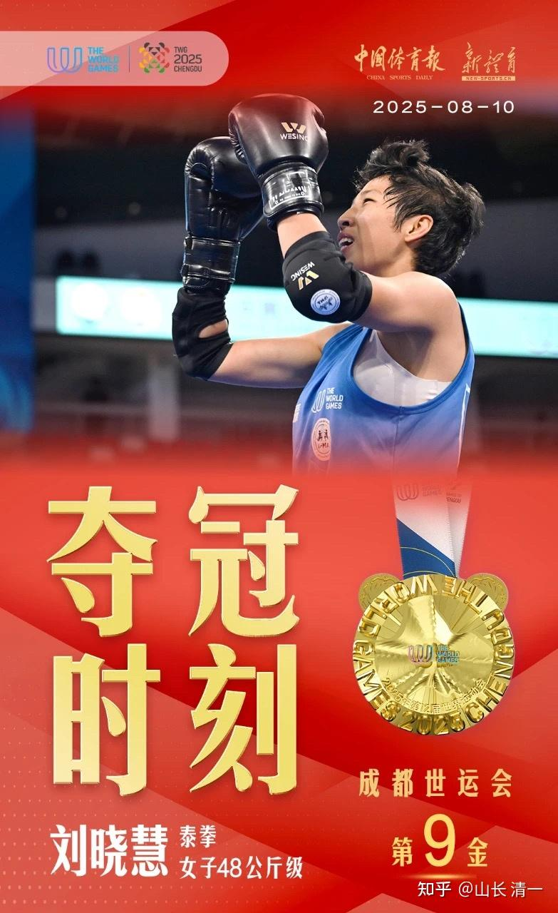
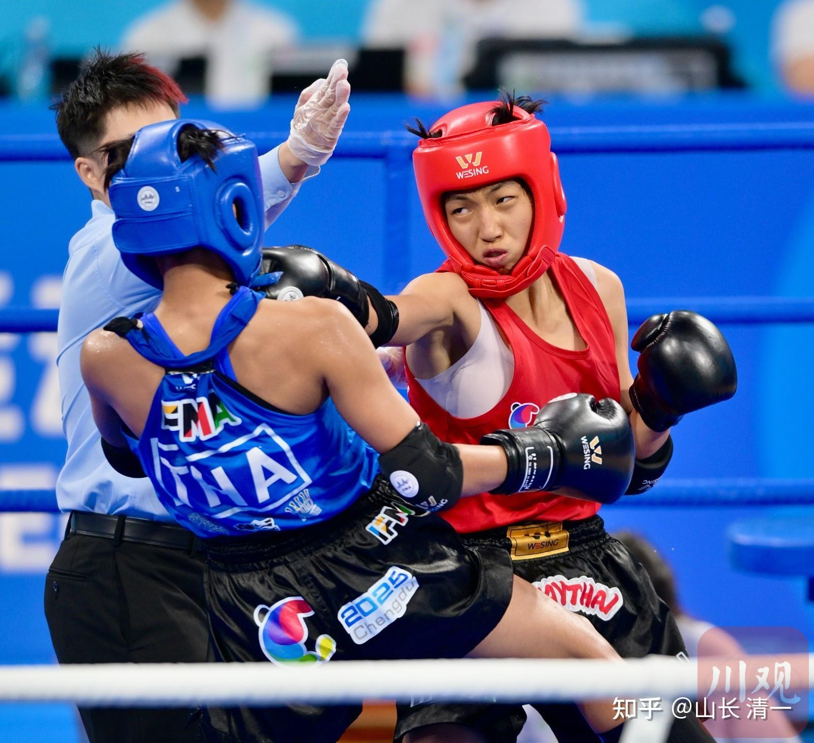
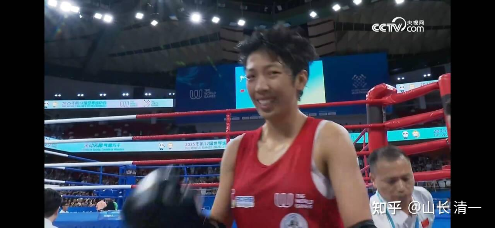
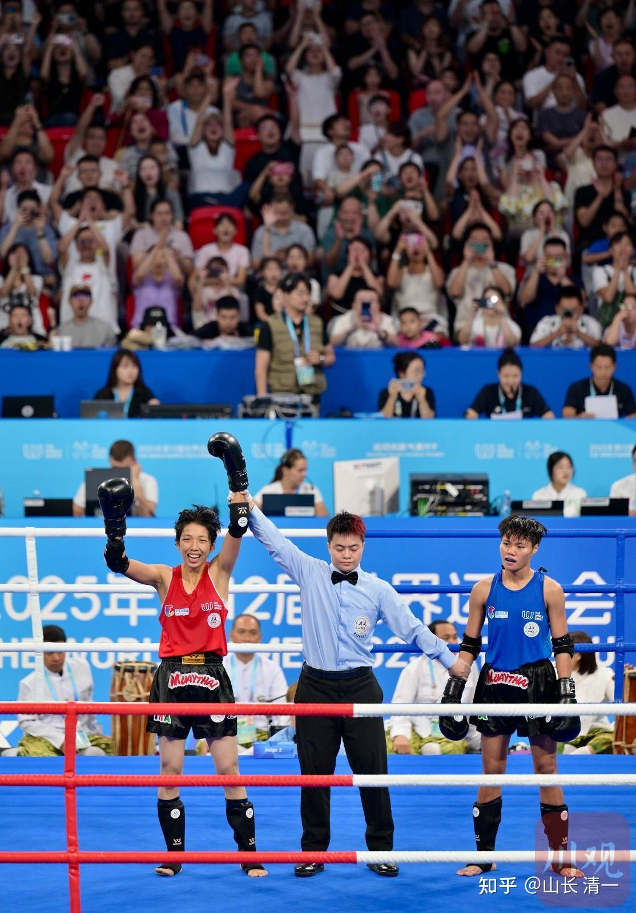
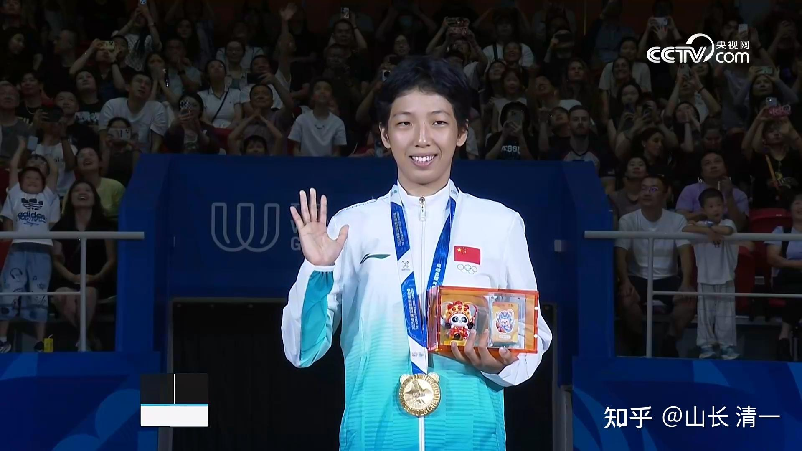
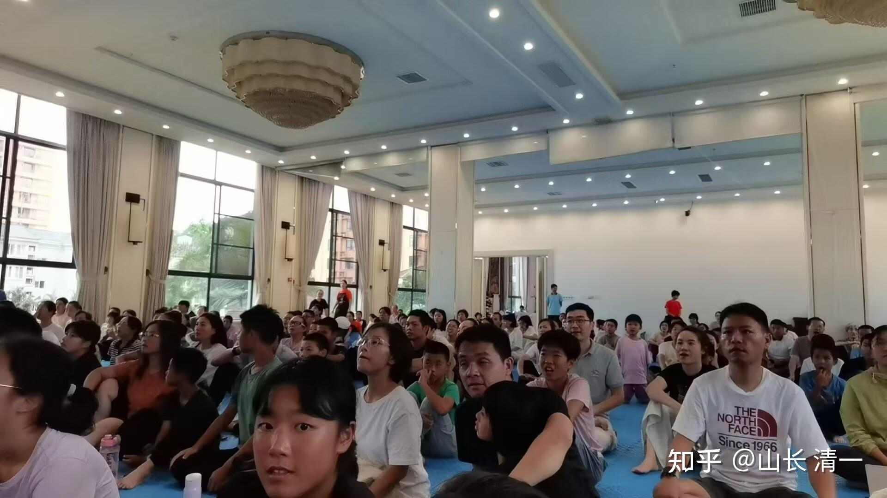
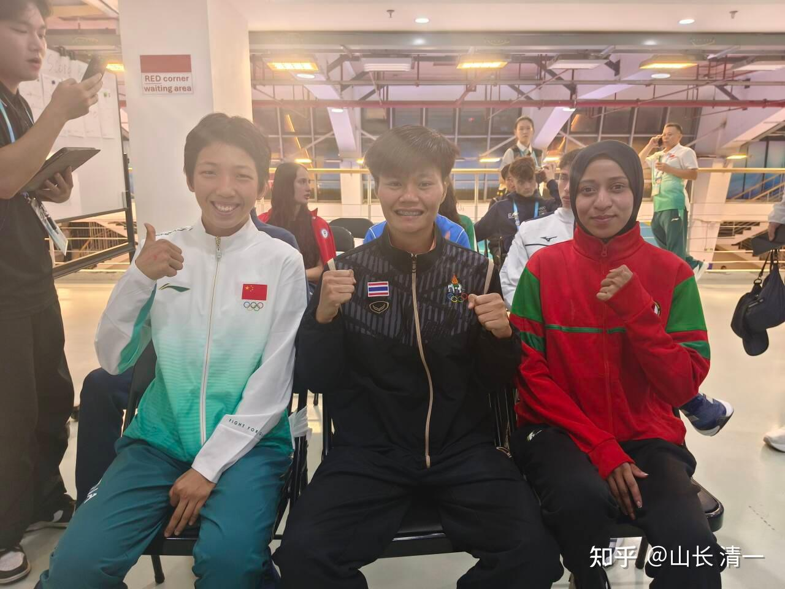
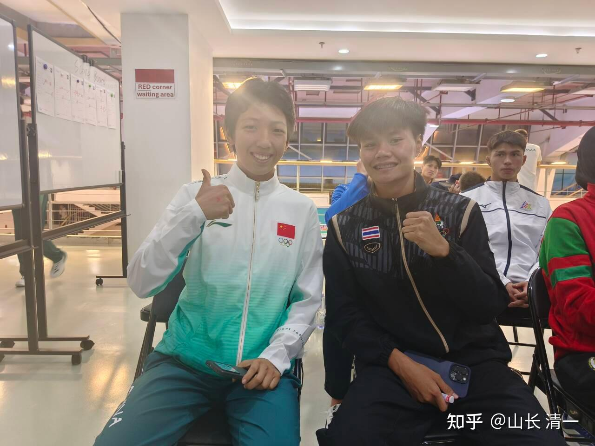

**她是中国第一个女子泰拳世界冠军**。同时，她还是

**全球第一个文人格斗世界冠军，四语学霸！**

[成都世运会泰拳女子48公斤级 中国队刘晓慧夺金](http://link.zhihu.com/?target=https%3A//sports.cctv.com/2025/08/10/ARTIwvg7jB5hbzYL5pmXpgCB250810.shtml)

她是中国历史上**第一个用中国实战太极传武技术获得世界冠军的人！**

**她应该也是中国第一个从小素食的世界冠军（**国外至少有10%的世界冠军是素食者，中国应该还没有这样的素食冠军）

**她也是中国第一个在打完世界比赛后，可以和各国拳手用多语种无障碍自由交流的格斗拳手**，而且有内容，有思想深度，会获得世界性尊重的有文化修养的格斗拳手！

**她应该也是中国第一个拿到世界冠军后，却根本不想“吃格斗饭”的人！**因此，她是中国第一个用自己的业余爱好，去打专业赛事，去打职业拳手，去拿世界冠军的人。这符合奥运精神，但不符合“一般常识”。

**她是全世界第一个完全由业余爱好者教出来的人，**却能击败**专业世界冠军**的**业余世界冠军**。她的授业师父，以及从始至终的技术指导，场上对战的战略和战术指导，全部是一个根本没有武术背景经历，也没有上过擂台，没有武术相关从业背景，也没打过比赛的文人书生。

**她是中国第一个出生在双博士家庭的武术格斗世界冠军。**她的父母都是大学教授，属于中产阶层。她从小跟随学习以及练武的师父，也是985大学的文课老师。她拥有中国学历最高的父母及师父。

全世界的格斗行业，往往都是底层的穷人孩子，大多数都是读书成绩不行的人，才去练武找一条谋生出路，拼命用流血流汗，去打格斗比赛。目的是打出来一条生存之路。但她是极少数的例外，当业余爱好来玩武术，而不是谋求职业道路！这跟她的家庭文化层次较高很有关系。

**她还是一个从来不知道被KO是啥滋味的格斗世界冠军。**据说，只有被KO过的拳手才算是优秀的拳手。但明晓出道以来，就只知道KO别人，不知道被别人KO。甚至她从来没有在比赛的时候受过伤。她脸上很少中拳，因此一直很完美。中华传武太极的技术，有效地保护了她，让她柔弱胜刚强。

**她是中国格斗界最年轻的世界冠军，很可能也是IFMAl历史上最年轻的世界冠军**， 至少她肯定是世界运动会上最年轻的格斗世界冠军（目前只是猜测，我缺乏完整的数据支持），因为她今年刚满20岁，这个年龄能够拿到格斗世界冠军？走传统道路几乎不可能。

**她也应该是正式参与格斗训练时间最短的世界冠军**（她正式练武也就刚满4年多一点），这个应该没有疑问。

**她是一个真女人的世界冠军，不是假小子。**相比其他格斗世界的女拳手们，往往睾丸酮含量超高，个性行为都偏于男性化（这次世界赛的对手，各位看到都显得相当的男性化），相比她保留了女性柔美和温和的个性。

**她还是清一大学的第一个武术博士生！**清一大学武术学士的入学标准是SAT1500分，武术零基础进入。清一大学武术硕士研究生的入学资格是全国冠军，有较高门槛。清一大学武术博士的入门标准是世界冠军。全世界还有第二所大学，对学生的入学要求有这么高的吗？如果没有的话，清一大学当然就“是”世界顶尖名校。如果只是比学生的培养质量，不比数量的话！我相信未来培养出最多世界冠军的学校， 就是清一大学（比较范围是全世界）。

明晓不到三年，就拿到清一硕士资格（全国冠军）。再过一年多，就硕士毕业，拿到清一武道博士入读资格。这个进度，属于超级快速。

**她有很多的另类身份，非常的不正常。**她的出现，意味着清一新教育培养的新一代格斗手，是完全刷新中国，甚至世界武术格斗三观的，全新的世界武术文化新理念。

这就是**文人格斗与现代格斗的差别，也是文人格斗的魅力所在。**

她的名字是刘**晓慧（清一木兰明晓）**。

她只是第一个幸运地率先拿到世界冠军的清一木兰。她只是开端，不是结束。

2026年，将有更多的文人格斗拳手，新的清一木兰世界冠军出现，与她在同一水平线的木兰，至少是四五个。

[C视频·世运快报丨精通四国语言，“05后”学霸刘晓慧拿到世运会冠军 - 川观新闻](http://link.zhihu.com/?target=https%3A//cbgc.scol.com.cn/news/6617173%3Fqq_aio_chat_type%3D3%26timestamp%3D1754832481310)

*成为中国的国礼*

明晓今天的对手是泰国拳手，是2024年的世界锦标赛冠军奥诺克。她的IFMA世界积分排名第二，明晓的排名，大概根本就排不上号去！拿外卡进入的比赛。

明晓今天打得不错，虽然有一点急躁，但三局压制获得三比零的全胜成绩。泰国人下场后就哭了，泰国教练的脸色非常的难看。中泰对抗，泰国这次来世运会居然输得很惨，一金未得。而中国队获六金中的两金，远远超出赛前预期，为泰拳项目获奖金牌最多的国家。

**2017年：被专业格斗队淘汰的二流格斗拳手徐某东，跳出来打假传武，宣称太极就是大骗子。他击垮了一大堆传武大师的面子和里子，摧毁了中国人的传武梦。**

**2019年，张清一成立武道馆，独自承担一切，出钱出力捍卫传武的最后底线，计划用事实来回应徐某东对于中华传统武术的污蔑挑战。**

**2021年，16岁的明晓向父母要求，要跟随清一学习中华武术，走上擂台为国争光。**

**2025年，木兰明晓20岁站到了世界冠军的领奖台上，一路击败了曾经的世界冠军们。让各国的现代格斗手们领略到了中华传武的格斗酸爽和魅力。**

**太极哲拳，是支撑文人格斗挑战世界格斗的骨气。**

**感谢徐某东，也感谢国内传武大师们的不作为。让我一个业余文人，来做了全国武术界专业人员该做，而没有做的事情**

**------用击败现代格斗的方式，击败洋人，来弘扬中华传武！**

*同归法---你打我也打，看谁狠！*

*赢了。原来世界冠军不过如此，也不是中华武术的对手*

*泰国的前世界冠军在想：我今天是怎么输的？怎么会是这样？*

*清一木兰明晓 创造多项世界第一的文人格斗拳手*

*磨丁清粉家园，大家一起看直播*

*三个人有趣：正好排成一个败给一个的阵型*

*明晓泰语相当于母语水平，等待授奖期间，正好跟泰国拳手聊天*