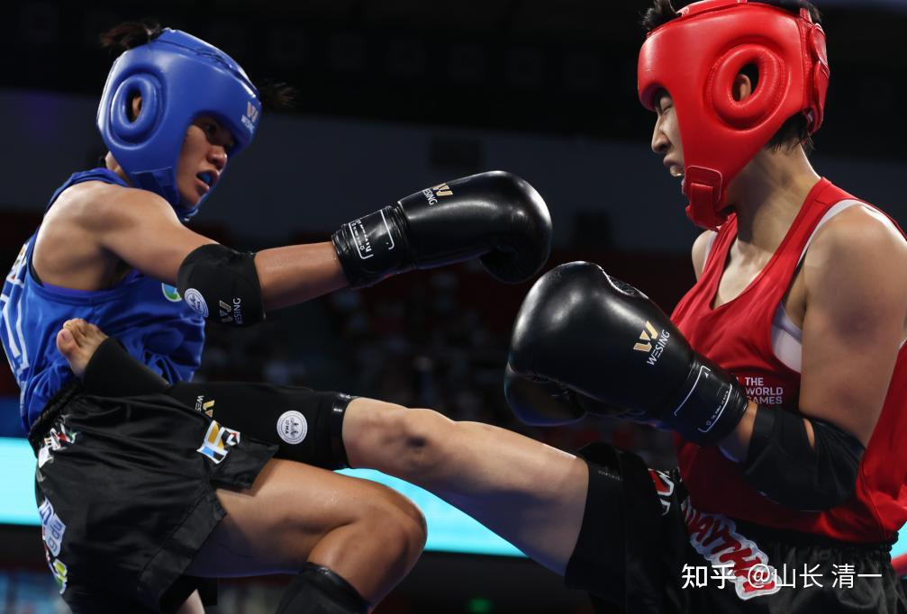
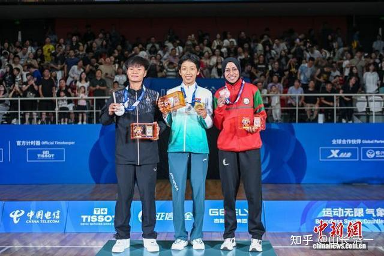
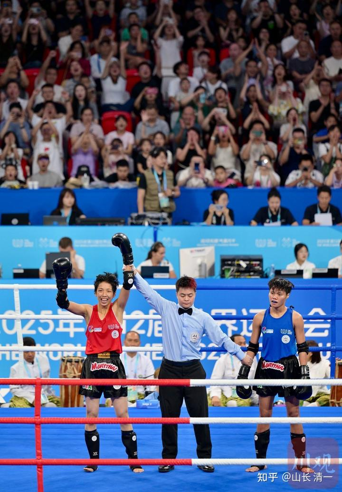
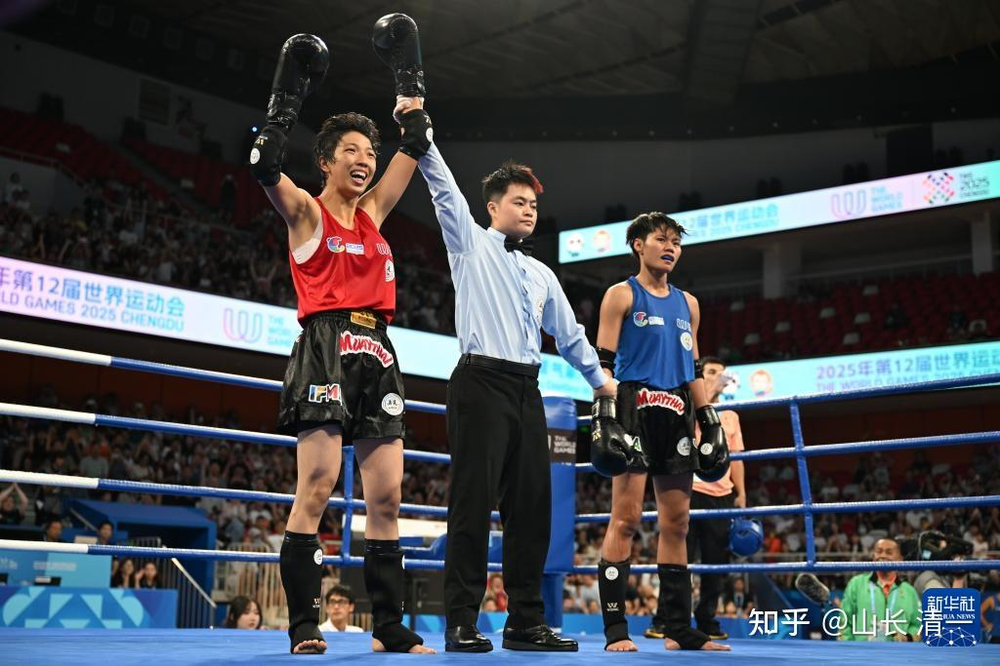
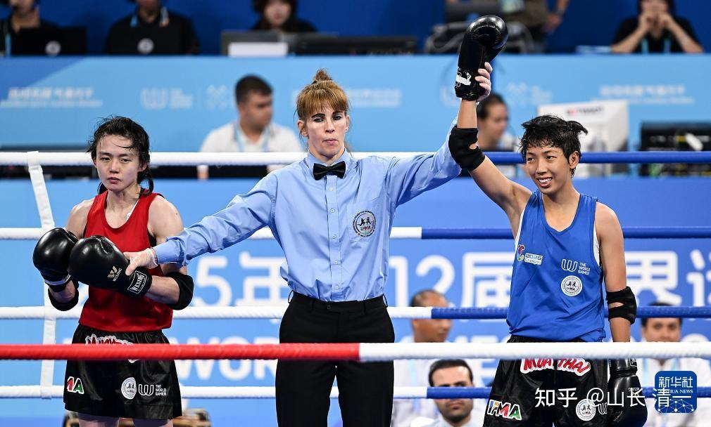

打破泰拳500年不败神话的中国女孩：清一木兰

8月10日，是中国拳手恐泰症的结束日。也是泰国拳手恐中症的开启之日！

*武当丁腿，中式正蹬让泰式扫腿毫无机会。*

荣誉属于中华！

属于一切尊重老祖宗，尊重传武，尊重太极的中国人。

*今后清一木兰就是国际赛事的C位，外国人只能做为陪客*

未来，将有更多的中华儿女，会跟随明晓示范出来的成功道路去打垮全世界的对手。这个以“泰国拳”为名的，世界性的体育运动赛事，未来将成为“中国人最擅长的运动”。

就像是当年英国人发明的乒乓球，现在成为全世界认同的中国“国球”一样。明晓，就像是60年前的容国团（中国第一个乒乓球世界冠军）一样，会永远是中国人的荣耀，是中国人永远的泰拳冠军。

当年的容国团，还是英国人教出来的乒乓技术，他自己，是出身在香港的殖民地孩子。

今天的木兰明晓，虽然生活和训练在泰国（是不是有点像容国团当年海外训练和成长？）。但她是我们中国人做的师父，用的是中国的传武技术，中国制造的泰拳世界冠军。

她不像是张伟丽，本质上是泰国人用泰国技术教出来的“中国格斗冠军”。

这是一个新格斗时代的开启，是中国武术走向世界的一个起点和标志。但很多人要过很多年之后，才会明白过来这个道理。

就像容国团自己很多年之后，才知道自己打球的爱好，无意中开启了一个时代---中国的“国球”时代。让原始创造发明这个活动的英国人特别没有面子，成为了这项赛事的陪衬。也让现在的中国人，误以为乒乓球就是中国人的国球。全世界都在输入中国拳手来帮他们练球，打球。

未来，当中国拳手狂夺泰拳世界冠军的时候，泰国人会不会也有一样的失落感呢？会不会泰拳会成为“中国拳”的代称呢？西方人会认为泰拳就是中国拳的一部分吧？不然为啥中国人玩得最好？

三五年后，世界锦标赛就将出现中国拳手拿到世界冠军的人数，超过泰国拳手的“世界记录”了。中国会成为世界各国中夺奖最多的团队，这些拳手，会是清一文人格斗的拳手。

我相信不超过10年，泰国人会谦虚地找木兰们学习“中国泰拳技术”，以求保留泰国人在国际赛事上的最后体面。

[中央电视台视频全程：成都世运会泰拳女子48公斤级 中国队刘晓慧夺金](http://link.zhihu.com/?target=https%3A//sports.cctv.com/2025/08/10/ARTIwvg7jB5hbzYL5pmXpgCB250810.shtml)

这么荣誉，崇高的身份地位，这个注定写入历史的光荣时刻，这个承载着中华民族百年梦想的时刻。这个用中华武术击败现代格斗的代表任务。在武林中的地位，就相当于当年的杨露禅，霍元甲一样，甚至会更高，将是中国人永久纪念的民族英雄。

这些东西，我知道。甚至我以为意义将更加的重大！**因为中华木兰，是中国送给全世界的礼物，不仅仅局限于中国大地。**

但我在赛前，是不敢说出来这些东西的。我怕我说了，会吓着未经世事的小女孩！

她真担不起这样的贵重身份，肯定会崩溃掉！你让20岁的她，想想自己是未来的女霍元甲，是女版的叶问？是中国泰拳突破世界的代表人物？你都要吓死她了！

其实，这是历史给她的机遇。是其他不信师的傻女孩，自私自利不思进取的笨蛋，白白地留给她的机会！她只是运气好，正好遇到了而已！

**这份极其贵重的礼物，也可能给她带来不幸！所谓的【天予不取，反受其殃】。**

看看这份宇宙送给明晓的礼单有多大？多贵重？你们能想象吗？

一个简简单单的世界冠军，居然有这么多的潜在的含金量，实在是不可思议。

**明晓现在的任务，就是要赶快的修德，修善，要配得上宇宙送给她的礼物。**否则现在就忙着去吃火锅，玩乐享受生活，消耗自己的福报和名誉。这些伟大的宇宙礼物送到她的手里，最终会害了她的！

如果她学会了珍惜，学会去把这些荣誉，回馈给中国，回馈给世界，她就能走上更荣耀，更光彩的地位。她会成为更伟大的中华女性代表，而不是仅仅是一个只会打拳的“格斗拳手”。

**这是对明晓的重大人生考验。毕竟---世界运动会冠军的含金量，超过了任何赛事。**她再也没必要去打其他赛事了，档次都不够了。唯一能够有点挑战她极限的赛事，就是去击败男拳手了！

因此，今后明晓要不再“作为拳手”去思考问题，而要以“国家礼物”的身份去思考和行动。这就是明晓未来要面对的问题了。她已经开始走入文化上层了。

这是被她击败的泰国拳手，永远也不用去期待的地位。因为泰国的拳手，就算是赢了，也得不到这个国礼地位的。因为她不是中国人，没有中国人的福报。

其实韩鑫，也得不到这一切，虽然一样她是世界运动会的冠军！

但明晓，却能够得到这一切，不是因为她是冠军，而是因为支持她获胜的内涵，是中华武术。她身上寄托的，是中国人的传武梦！是中华文化走向世界的标志，这才是她最宝贵的资粮。

这才是她未来能够走上中国，乃至世界文化上层的文化底蕴。如果她只是把自己当成一个比赛的拳手？就是拿着金饭碗去讨饭吃了！天底下最蠢的事情。

她应该去做中华文化大使---去全世界推广中华武术和文化的大使。推广她认同的生活方式，**以她世界冠军的身份去向全世界推广中华传统文化，她才最有价值，最有说服力！**

[张清一：全球第一个文人格斗世界冠军诞生！](https://zhuanlan.zhihu.com/p/1937993109582643381)

**这份礼物，来之不易。下面我揭秘赛前对明晓的心理分析和辅导**

有人说：【但如果这个时候老张不厉声骂她，她真的认为去拿奖，奖杯的确没意思，没有创造社会价值，
她一泄气，她就完了，以后再也起不来了，这样去打比赛肯定会失败。】

山长 清一: 08-12 09:19:56
其实心理学解释：这时候，她骨子里面，面对即将到来的巨大的荣誉和成就，一个世界性的突破（她成为文人格斗的代表，成为全世界最年轻的世界冠军，成为中国世运会历史上的泰拳首金，成为中国的女子泰拳之王，首个世界格斗冠军等等记录）。她此时不是正常的期待和兴奋，而是不安，不信，是紧张，是逃避，是怕失败，想要转身离开的冲动。（古代，会把这个东西叫做魔考，熬不过去的人，就开启下堕之路）。

如果要用宇宙法则来说。就是她此时，表达出来的真实身份是“我不想当世界冠军”。因为我认为世界冠军“没有价值，不创造价值”，你想：明晓以这种心态去成都，会有啥好结果呢？

**她所谓的理由---格斗没有创造价值。**并不是她真的在思考人生，思考未来，思考重要的“哲学问题"。而是她的小我，在给自己的逃避行为找个漂亮理由，在找自己逃避的合理性。

她想逃避这种压力，想要去维护自己过去创造的“不败明晓”的面子，她害怕去面对一众世界级的高手。也是害怕战胜之后带来的巨大荣誉。

**她这时候的行为，就很像达世当时要离开师父，寺院，去找巴玛要去过“俗世生活”一样。**面对师父达世说一堆振振有词的理由，什么佛陀也是有过家庭，有过女人的。怎么能说佛陀的成就，不是他经过俗世的生活才能成佛的吗？他为什么就不能去体验？

师父如果当时不去迎合他，而是狠狠的骂他一顿，甚至去抽他一顿。把他以犯戒的理由，关起来闭关自省，想不通就不许出来，让他加强运动，干活搬砖。其实过两三年，他也就过去了。这点思春之心，只是他成就路上的一个小波澜罢了。
**就像现在的女孩，思春逃走，离开国礼之路，去走世俗之路。将来回过头来，肯定会觉得特别不值的！**

一个有机会成为国礼的女人，真不值为一个男人，围着两个熊孩子，付出自己一生的梦想。她永远会和根本就没有机会成为国礼的人，拥有不一样的失落和对照。

但达世的师父，并没有去做这个"坏事"。而是对当时面临魔考，已经鬼迷心窍的达世无语，他不想多说什么。而是选择尊重达世自己的选择，看他走向俗世的一条堕落业力之路！

*达世走向世俗：水代表欲望*

这张照片的背影，代表了他与原来选择的终身修行的目标，成圣成佛之路，走向了相反的道路！堕入红尘，重新成为芸芸众生！

看到达世放弃了修行，换下了僧袍，甚至连寺庙养的狗，都不再愿意理他，转身就跑回寺庙去了。意味着达世的背叛，导致他原来的修行团队伙伴也抛弃了他！大家各走各路了。

**这样，因为没有得到师父金刚韦陀力（棒喝）加持的达世，后来就如电影中一样，就只能走上后来的平庸之人，和失败者之路。**。这一生再也达不到他当年的修行高峰（他闭关三年三个月又三天的功夫，是他师父也没有达到的，极为难得的高僧的境界，比世界冠军要难很多倍）。

他这一离去，就是将来很多世，都走不回来了。。。。“一念千年”就这意思！达世的将来，一千年都回不了原点！提升很难，堕落很容易。

** 我知道明晓说练武打冠军没有价值的时候，很像达世。**一旦她找理由，逃避去成都集训。这时候我让她退下来了，她未来的灵魂和自我谴责，就会非常的强烈。就会让她今后的人生状态越来越差，她就会慢慢的走上杨某蓝，王某葱的老路！

**去走一条无法接受现状，拼命去否认自己的过去，去拒绝自己的身份，去黑自己的老师，去攻击自己过去伙伴的道路！**

因为这是一条灵魂下堕的道路，是拒绝和否认的道路，绝不是成功，喜悦，满足，祥和宁静的道路，下堕之路，注定充满了强大的负能量！

她必须为自己的人生失败找一个出口和理由。否则这种自我否定的能量，会导致她自杀的。因此她们都需要把压力引向外面，用“愤怒”的情绪，用无底线的攻击行为，去替换掉更低的，能量层级接近于自杀的“懊悔自责”的情绪。显然看起来，攻击会是她们的一种看起来不错的解决方式！但攻击完结之后，她们一样会陷入强烈的自我否定和失落的情绪。就是时间不一样。而攻击的行为，会把她们原来留下的一点点回头的缘分，都会败坏光的。

其实正常的，理性的，有道德的解决方式，是“忏悔”。是放下对自己的审判，谦虚地承认自己的错误，在踏实地从零做起就好了！是尊重老师，寻求师父帮助指导，才能解决问题。毕竟孩子们都还很年轻，还有犯错改错的机会。但其实很难。。因为魔“入心”了。

所以，当天看明晓这种状态，我知道这时候她很危险。退一步，就不复有木兰明晓。她20岁之前的所有的努力，会因为她的自我逃避，马上就毁于一旦！

因此，我只能用掉最后的办法：就是严厉的大骂她一顿。。。。只有彻底打掉她的面子观念，扫除她的小我，让她完全建立对师父的信赖和服从，以后让师父的心，代替她的小我之心，她才有可能过这一关。不然她马上就垮了！

另外，我也不给她一定要拿冠军的要求和负担，她才会恢复正常一点。因为她的压力感觉太强了，没事找事，不再单纯。其实她只要正常发挥，就能拿冠军。我是知道结果的！

后来虽然幸亏有谭木兰的陪伴（当时是谭木兰一起陪她来挨骂的），谭木兰的关心体贴，让她能够专心的投入训练，但骨子里面，还是有这种“畏惧逃避”的心。只是她被骂之后，小我已经不太大了。没有造成明显的损害！

但她在赛前几天，就生病不适，发烧，想要呕吐等现象，也一样是明晓心理上的逃避行为带来的身体反应。她原来去集训前，想要当哲学家，想要“夺取道德制高点”，用她的歪理哲学“新的理想”来逃避。这是一个狂妄自大的小我。

现在，明晓的“小我”想要装可怜，装弱，借用身体的疾病，来逃避马上就要到来的世界冠军的荣誉。

因此，只要她的“小我启动”，她就完蛋了。一泻千里！

所以，明晓比赛的这段时间，我最重要的焦点，就是去帮助她的心念恢复正常，尽量去与历代祖师的能量对接，让她的心，能够去维持高我的能量链接，不能让她的小我泛滥起来。

因此我在比赛期间，每天对她的私人辅导，说话，各种要求，都在让她往这个方向去聚焦！

目的虽然和上次骂她一样，但我不能继续骂她了！这只会给她带来更大的负担。

因为上次她是狂妄自大，是不敬师尊，想要故意挑战师尊的权威和要求，自己放弃去拿冠军的目标。因此是不敬师长只过，所以必须骂她才行！

后来她的生病，是她装弱。我也不能跟她共振，不能去哄她，照顾她。这样她的小我就开始长大了！

她现在是不相信自己能赢，不是不相信老师。她这时候还是非常信任我的，想要寻求我的帮助。因此我就能帮她！

我此时的做法，就是让她与祖师的能量去对接，让她放弃自己的小我。完全把命运和结果交给祖师去安排，无论成败，都接受老天的安排，只要做到训练中的水平就无憾了！

她在这种心理维持下，才取得一场比一场好的结果！越打越精彩。

如果她用第一天的状态去继续打比赛，第二天，遇到更灵活的对手，她就会失败的！其实赛前她就有些害怕，认为对手很强大，我告诉她：不用担心，不会比第一天的对手更强。分析了对手的弱点，让她专门攻击她弱点就够了。告诉她对手比第一天的更好对付！

连续两天，她都要去找刘老师给她做心理辅导。她需要刘老师的疏导。

半决赛这一天，她完全的相信我给她安排的方案，状态良好，以TKO拿下了比赛，她才开始真的对自己有信心了。

决赛之前的这天晚上，我让明晓去思考应对决赛的方案，让她把思考的对策告诉我。然后我会在第二天，给她临场应对泰国拳手的细节方案。晚上一点多，我还在反复看半决赛的视频。

第二天一早，5点我就起来，开始写应对方案，上午就发给了明晓！

**我让她回到她开始打拳时候的心态：无染之心，不在乎结果，只想捞到比赛打就开心，**甚至想打当时泰国最强的拳手，帕亚虹。我还找人联系过，准备花钱请她来跟明晓打。

我让她想象：自己就是这一个渴望比赛的小女孩，现在泰国的世界冠军，不要钱送上门来给她打。干嘛不快快乐乐的跟她好好的打一场？

结果我让明晓不要去考虑，你只管用出来我教的技术。用出来老祖宗的技术，输赢结果，都交给老天去判定。去享受“同归法”的奇妙就行了。

**我的辅导见效了。开赛前一小时，刘老师找我说：明晓今天没有找她**。有啥问题不？她也不能主动去问她。

我说应该她已经消化了我给的心法方案，开始去享受比赛的过程了，因此我们都不用担心了。

我感觉：这块世界冠军应该能够拿到手。因此不想前两天这样紧张了。生怕她冲不进决赛。

决赛这天，跳拜师舞的时候，你们会看到：明晓时间较长的趴在地上不动，非常认真。别人不知道她在干啥，我知道她在认真的拜谢祖师，去与祖师的能量对接。我看她这样，也就放心了。

只要明晓把我的交代放在心上，认真执行，她就稳了。果然决赛她直下三局，打的一点悬念都没有！泰国拳手完全没有机会突破她的防守，也躲不过她的攻击。顺利拿下来这枚宝贵的金牌。

她第三天的决赛对手，心理素质比其他两个拳手更好。明晓这一天，如果不去稳住身心，就更难对付的。特别第三局，泰拳手并未出现老拳师判断的体能下降情况。相反进攻还是比较积极凶猛，一直在积极的抢攻。但明晓心态比第一天稳很多，这些强攻，没有造成她的危险。反而给了她反击的机会，第三局泰拳手依然是吃亏的！

其实，我看场上的决赛表现，明晓还是有一点小我起来了，没有半决赛的这一天更谨慎。她应该是有一点想拿到金牌的想法，因此打法上就有点急躁，比她的第二天，就差一些状态。

场上观察，就是她有明显的抢攻，会发动攻击的距离过远，节奏也过快，消耗体能更大的问题，浪费宝贵的攻击资源。不然这一场，明晓，是有可能KO泰国拳手的。该重击的时候没有重击。

因为泰国拳手有本届赛事有保住金牌的任务，她也是2024年的世界锦标赛冠军，综合实力过人，本来是有自信的。如果打输了与中国人的比赛，她是不甘心的。因此她场上拼抢很厉害，特别是第一局失去之后，她不断冒着被迎击的危险，不断强行进攻想要搬回来。第二局其实她最吃亏，被明晓多次击中，也遭遇一些重击。但她真的特别抗打。

如果明晓此时心态更宁静一些，稳住自己，完全执行我教的同归方法，真的可能把泰国人KO的。这个拳手偏男性，争强好胜的心很强，不服气中国拳手的心也很重。这是可以利用的地方。

从宣布胜利的时候，她的头看得出来，就是歪着头，一副不服气的样子，像个假小子。

*满脸想不通，不服气的泰国拳手（世界锦标赛冠军）*

*台上失落的泰拳拳手，和台下比她更震惊更迷惑的--泰国国家队总教练*

对比之下，新加坡的女孩，输掉比赛的时候，是满脸的委屈和微的外扭身子的姿态，是小女人的表现！这女孩的确更情绪化一些。她的第三局不顾危险的死命攻击，给应对错误的明晓造成了一点麻烦！幸亏不影响最终的结果。

*对照：满脸委屈的新加坡女孩（世界锦标赛亚军）*

虽然明晓放过了KO泰国对手的机会，但一直能够维持稳定情绪和有节奏的输出，第三局也没有出现体能明显不行的状态。明晓冷静的采用了不急不躁的保守打法，没有像第一天一样急躁。这就是我让明晓赛前修心想要达到的目标。只要明晓不急躁，对手就不会有办法下手！最终对手拼尽全力也无法翻转战事，对手三局下来，都快拼垮了，最终明晓三比零稳定的发挥，拿下来金牌！

这样的结果其实更好，比中途KO，更能说明清一木兰的格斗实力和耐力。场上的KO，会让人以为她的运气好，对手运气差！比如第二场半决赛取胜后，就是泰国教练都不相信的结果。他们知道实力很强的菲律宾拳手，排名也很高的人，不可能输给拿外卡的中国人。泰国教练和拳手，都认为是明晓的运气好，乱打，意外打伤人赢的比赛。

我估计，泰国人回去看了这一场的比赛视频，他也会得出一样的结论。看起来明晓就没啥技术。没有良好的训练，就是乱打一气的。所以第二天，第一场的时候，泰国人还没有意识到明晓的实力过人，采取的打法其实有点偏于强硬，这是自讨苦吃的，不过这个泰拳手真耐打！素质过硬！

明晓与世界冠军死拼三局下来，无惊无险的穿越了重腿重拳的泰国拳手的攻击，这更难。需要她平时的训练更到位，实力体能全方位的压制的展现。

因此赛后，她赛场上的表现良好，才成为中国的媒体的报道中心。韩鑫虽然也赢了金牌，但过程不太好看，有点偶然性，没有做到全程压制性打击！

我的正常策略，为了绝对保险的话，就是“想偷懒”，有机会几下KO干掉对手就行了。避免意外。

只要拉近了打，就会这样的结果！所以昨天冯敬东想象四年后，明晓再去打世界锦标赛，会是啥样的结果？会不会三局都KO对手？我的回答是的！

四年后，明晓真的能做到这一点！也许，四年后，三个中国拳手，都是我们的木兰。我们可以用56公斤的木兰去打60公斤的对手！不怕升重了。

现在明晓的结果，总算还是圆满的！但也有一种可能。。。。

如果明晓当初我严厉的骂她的时候，她真的生气，愤怒，要赌气离开，不干了，去黒我怎么办？我也必须接受这种可能性。

其实这时候她被骂，她父母的家族能量是否会加持的正能量，就很重要了。她的父母一直给她示范了信任和无条件尊重老师的身份，一直认为为平台服务。因此明晓如果被我骂，她的父母不会跟她共振，只会说她不懂事。会要求她去理解师父是为她好！

但是，如果遇到王茶这样愚蠢无知的父母，就一定会去跟她的小我共振，共情。明晓就会让她的生气，委屈，愤怒的小我之心强化和长大，这样，她就成为王大妈第二了！

因此。。。。如果明晓的父母，对我的态度，是比较冷淡的，是不够尊敬和信任我的。

在他们的女儿出现这种问题，我肯定也不会去骂人的。我就会像达世的师傅一样，静静的一声不说。看她自己走向业力之路，平庸之路！我无非再等一年，让别的木兰去拿冠军。虽然有点遗憾！

**这段时间，有不少明明有机会拿到国礼的公主离开，这些公主的个人条件，其实有人比明晓更好，更聪明，学我的拳的也更好！更能理解到位。**

但这些小公主找我告辞，要离开去奔赴美好生活的时候，我都是好言好语的送他们走的，没有去骂她们！

关键就是这些公主的父母，肯定对我的尊重和信任是不够的！也没有像是明晓的父母一样真正的亲近老师。也不愿意为平台多付出!，她们来平台，只是捞取她们要的好处的。得到了，或者觉得没得到，都会走的！

我知道她们正在放弃的，是一个非常辉煌的未来。即使要去俗世中闯荡，拿个世界冠军，不比你常春藤大学的文凭更硬吗？去企业工作的话，比如明晓这种人，四种语言的学霸，会写文章，会带队伍，会当保镖，带出来特别有面子。一个学霸世界冠军做助理。企业的老总，都会马上拿过来做总经理助理的。你还需要苦巴巴的从基层慢慢打爬上去吗？

干吗非要傻乎乎的去怕天梯：不怕累死？

但我不会去骂这些要去爬天梯的孩子！甚至不会去劝说她们。不会去分析，解说，让他们明白未来的选择到底是什么！不相信我就算了！

我选择尊重！尊重她们自己的命运。

我真的没有必要，把这么尊贵的荣耀，把国礼，把改变家族命运，提升社会地位的宝贵机会，白白送人。我更加犯不着跪下去，求着要给这些不尊重我，不信任我的人吧？