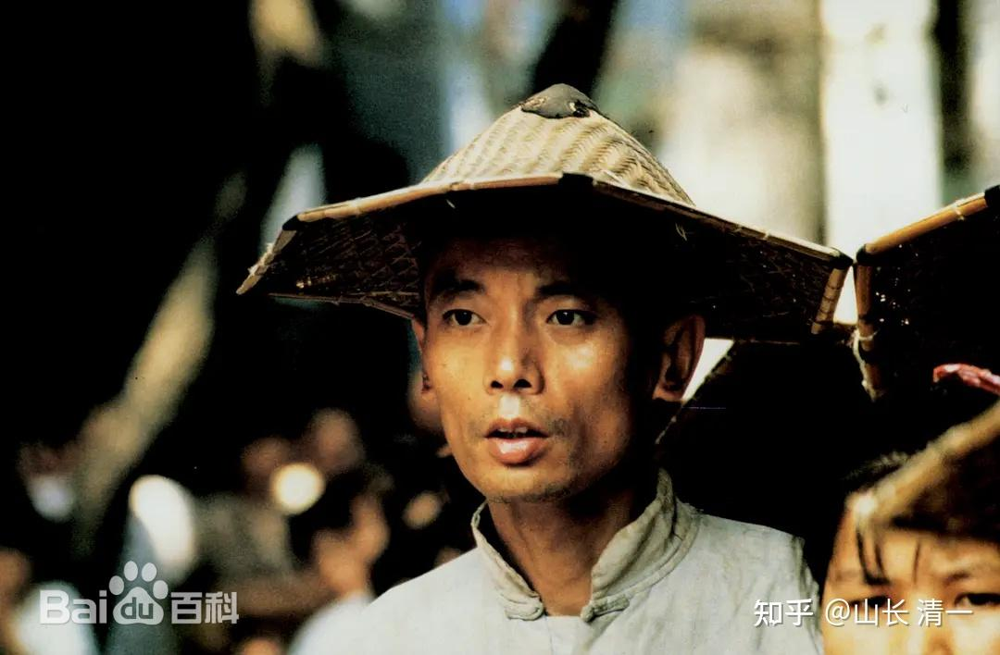

鹰粉一期的课程，使用的电影课版本是【教父】。

鹰粉二期的课程，将使用电影【活著】与【傲慢与偏见】作为课程内容。希望大家会喜欢。

请希望解决自己家族未来走向的人，认真思考下列传承的问题：

活著的男主角徐福贵，是富三代。他爷爷是创业者，是大地主。拥有大量的田产，房屋，还有城里面的商行（米行）等资产。但福贵的父亲这个富二代，就是吃喝玩乐败家子。在他手上，就败掉了相当部分的财产。但还有收敛，起码维持一家的生活还是有余地的。但福贵这个富三代，败家就完全没有顾忌了，嫖赌无度。完美呈现了中国古话中的“富不过三代”的惨景。

*福贵剧照*

问题一：如果你是福贵爷爷，创一代。你怎样才能让自己的儿孙不至于把你的家败光？

问题二：你怎样才能防止儿孙走上“吃喝玩乐嫖赌”的道路？请拿出你的具体解决方案？如何实施？

问题三：与“富不过三代”相比，古人有“耕读传家”的优良传统，你认为“耕读传家”在现代社会应该如何去实践？才能实现你“子孙后代不败家”的百年家族传承？

请拿出切实可执行的家庭教育方案，避免自己的孩子成为福贵父子这样的人！

问题四：福贵的吃喝玩乐，是旧社会的版本。当代福贵的消费场景，是怎样体现的？请找出现代社会中，当代福贵们是怎样生活的？以及你从小是怎样带小福贵去体验这种生活的？

问题五：为福贵设局的赌场。与他赌博的对手，某商人，这种人在当代会以何种形象出现在我们身边？你的孩子如何才能防止被这种人靠拢后，被设局骗光家族财产？

问题六：历代的运动，革命，政权颠覆，把所有人都洗刷成一样的人---穷人。在中国，30年河东，40年河西。你怎样才能保障自己的创富家族，不被社会的无序变动洗刷一空？你怎样才能让自己的家族获得一个稳定生活的环境。

问题七：也许你的孩子是个某方面的天才，你怎样才能让他有充分的机会，去获得创造和发挥自己天赋的机会？

问题八：也许你的孩子很平庸，你怎样让他不被欺负？至少能够平安过一生？

问题八：也许你的孩子就是一个骨子里面的消费者，你怎样防止这个孩子不会给家族其他成员带来毁灭性的影响？就像福贵一样，吃喝嫖赌把一家人都带到沟里面去了？你如何才能设置防火墙？

【傲慢与偏见】中，为何班纳特家五个女儿无法继承父亲的庄园？只能把庄园和产业都交给侄儿？这种制度有何优点？

问题一：英国的贵族家族传承，为何能够继续下去？电影中的家族都是数百年的历史。而中国就不能？

问题二：你怎样才能拥有一份可以交给子孙后代的资产---比如创建自己的“庄园”？让子孙后代在社会地位上，在婚姻竞争力上，都超过一般人？请找到自己创建当代庄园的方式？

问题三：你认为你如果有这样的一个达西和宾利的庄园，你怎样才能保证这个庄园，不被子孙后代吃喝嫖赌而败光？

问题四：中国是散沙国家，每个人都是利益集团的一根菜，周围大批价值观低劣的人都在影响你的孩子。你怎样才能让子孙后代不受周围坏朋友的影响？怎样才能让孩子从小拥有一批优秀卓越的伙伴？不被骗子们带歪节奏？

问题五：你观察周围的人群，他们有无措施去抵御身边的不良文化影响？你是否拥有这个手段去抵御这些影响？

问题六：你有多个孩子，你怎样对后代分配你的遗产，才是对家族最好的保证？不至于成为散沙？