昨天在山西开完研讨会了。这是一个国际学术交流会

[第四届“实学·气学·心学”国际学术研讨会在山西高平召开](http://link.zhihu.com/?target=https%3A//mp.weixin.qq.com/s/IqU7sr-Qgcq36t1v5flWUQ)

[第四届实学，心学讨论会](http://link.zhihu.com/?target=https%3A//mp.weixin.qq.com/s/IqU7sr-Qgcq36t1v5flWUQ)

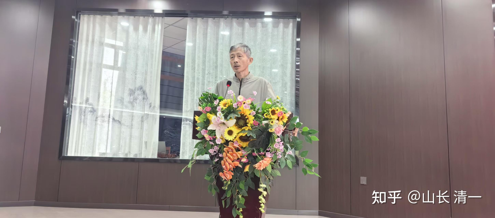

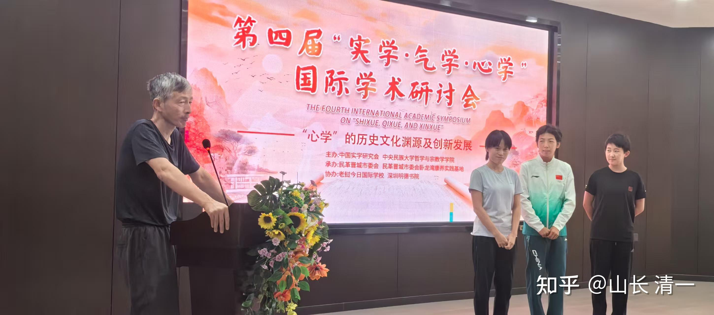

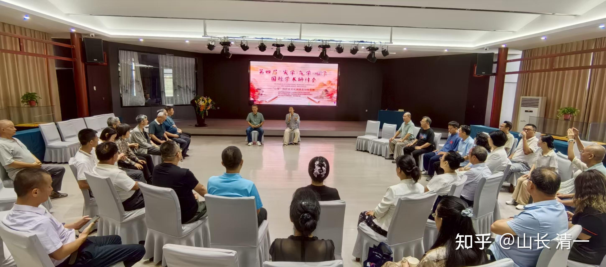

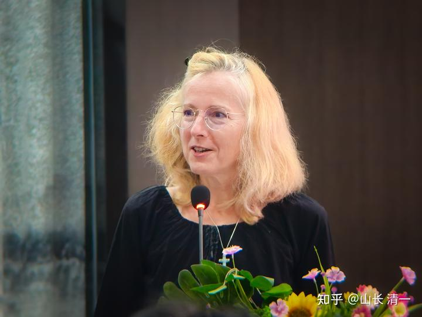

*美国人参与了会议分享。学习实行中国文化的体验收获*

会后有包饺子的内容、几个小公主和这些洋人聊得很开心

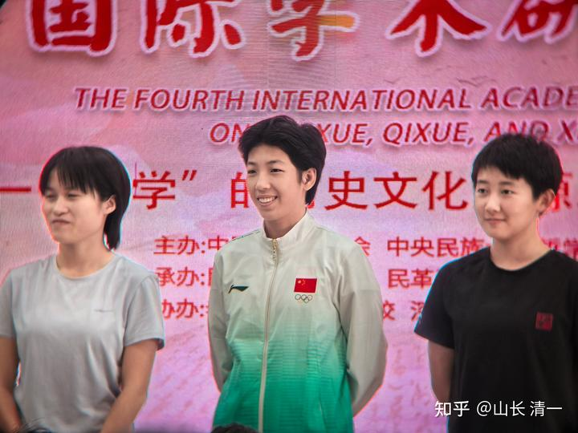

*三个小公主是在最年轻的参会者*

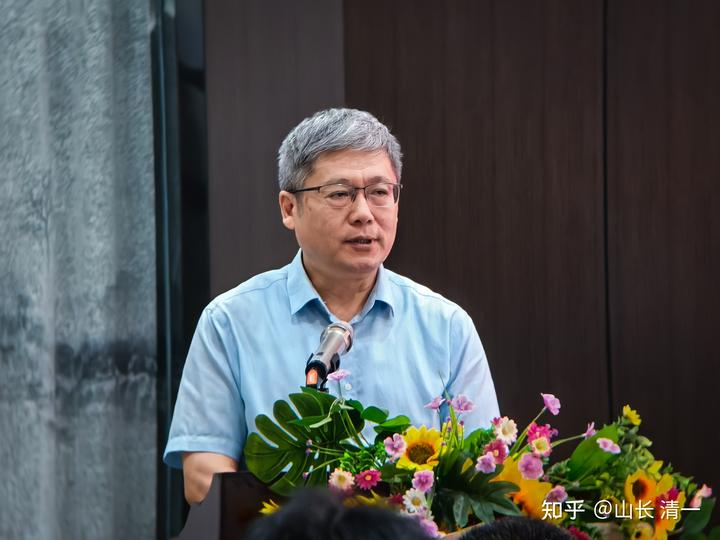

*中国实学会的会长，知名教授王杰*

王杰教授是中央电视台一个传统文化栏目的讲座人，已经开始做第四季了。他把中国的传统文化和现实的日常生活实践结合起来，与目前的文化需求推广配合，是国内属于文化上层的顶尖学者。虽然他已经超过60岁的年龄了，但风采不减年轻时候的才华。文章，写作，诗词歌赋，张口就来。古代的典籍，年代，都更熟悉。各种古代文章等等，一提名字，就可以整篇的朗诵出来。其他的学者们只能拿手机来搜索对比，一字不差。几个木兰冠军们都佩服不己，知道了体制内的学霸是啥风采。

我老实的给他们承认：我跟这些体制内的学霸比，我就是学渣了。当年读书的时候，见过这种国内的才华之士太多，比聪明我真是比不赢的！我只能慢慢的专心去一个事情，钻研几十年，耐心去做到极致。

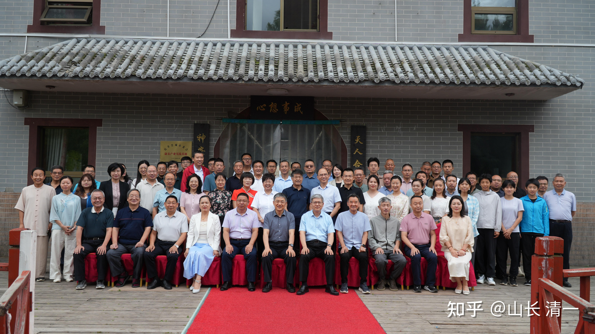

山西的会开完之后，河南的朋友就直接派车来山西，接我们一行人去河南“皈依师门”了。居然派了两辆车来。一辆车是B标记的豪华商务车，我以为是宾利。别人才告诉我是奔驰商务车，车的价格是150万左右。另外一辆轿车，居然是专门派来给我们“拉行李”的。让我们体会到了高级人士出行的光彩，就是有点太浪费汽油了。

下面是我们去焦作：中国太极之乡的记录。据说：举办原来的焦作举办【太极节】期间，这里会有10万人从全国甚至世界各地而来，实在是神奇！世界范围内，对太极的认可度还是很高的，但主要是养生的目标。如果把实战格斗加进去，一定会有更大的影响力。

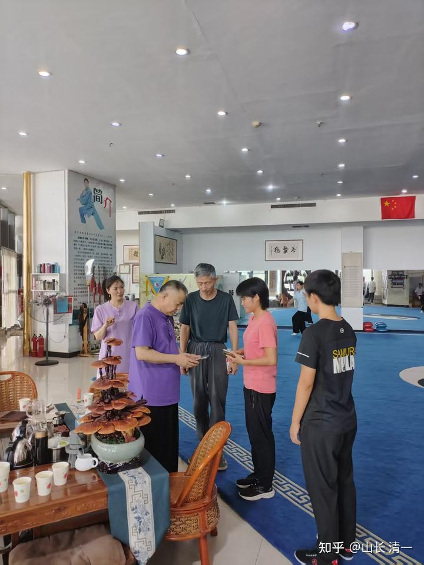

*当地领导带我们去参观知名太极拳馆的大师训练*

带几个弟子去见师奶，80多岁了。很健康的老人家。

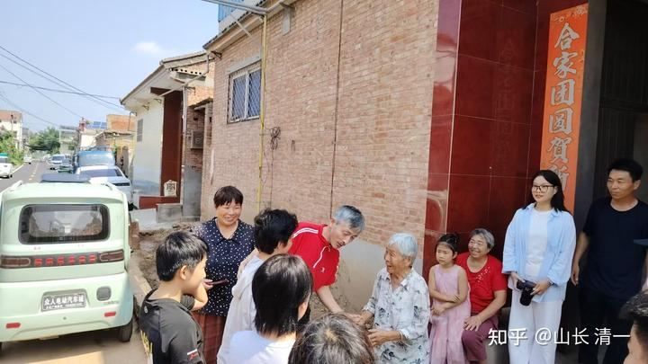

地方领导一行人，等在师父家里面等我们。

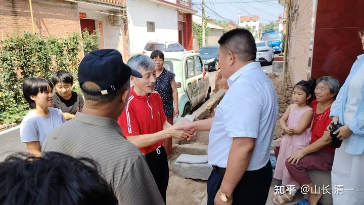

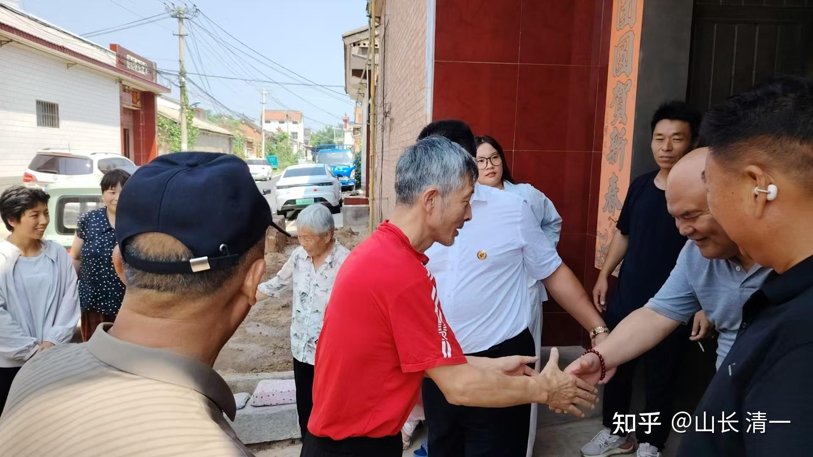

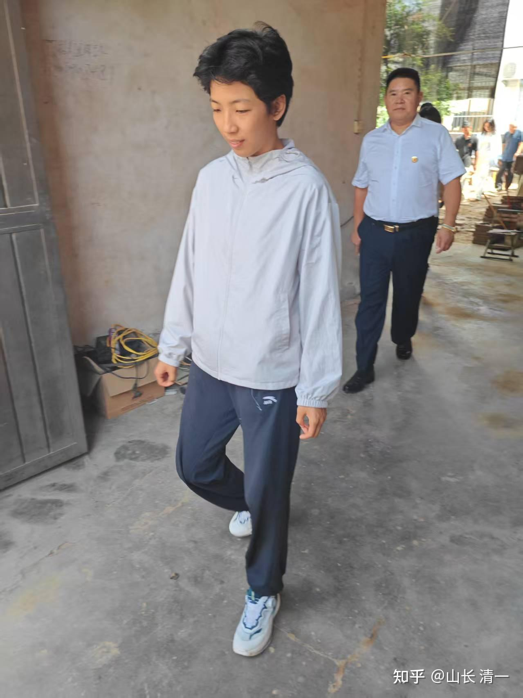

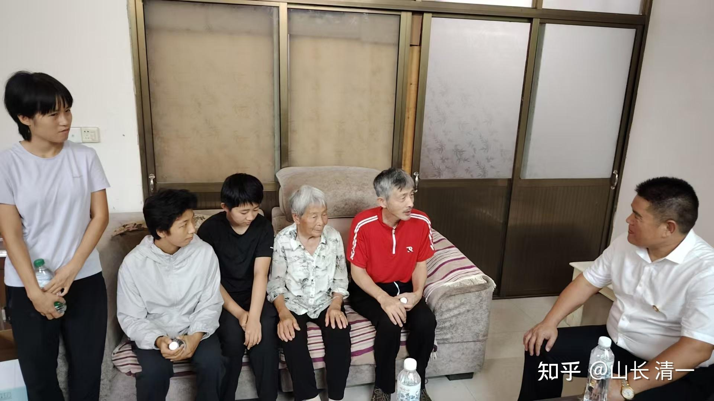

大家一起去墓地拜望师父（冠军们的师爷）

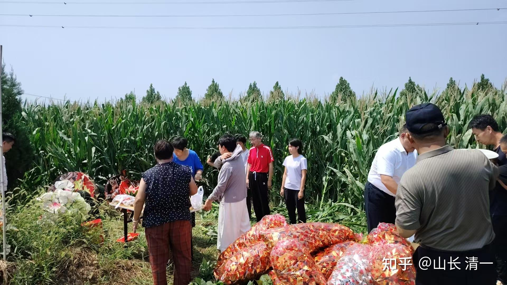

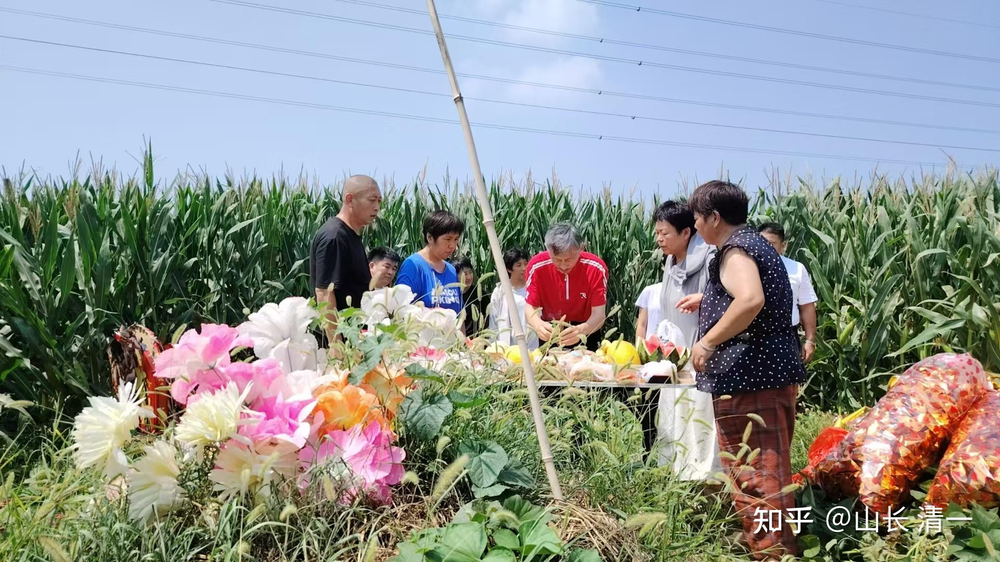

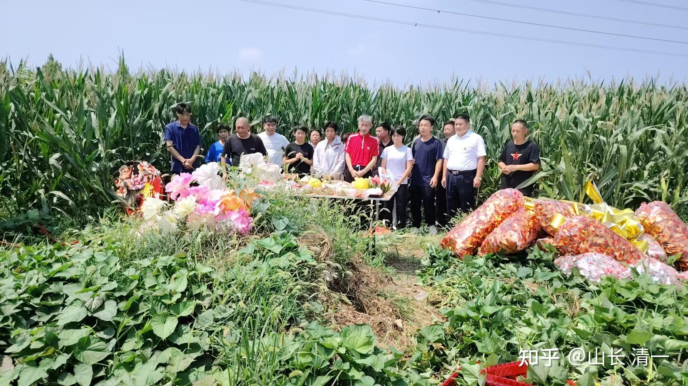

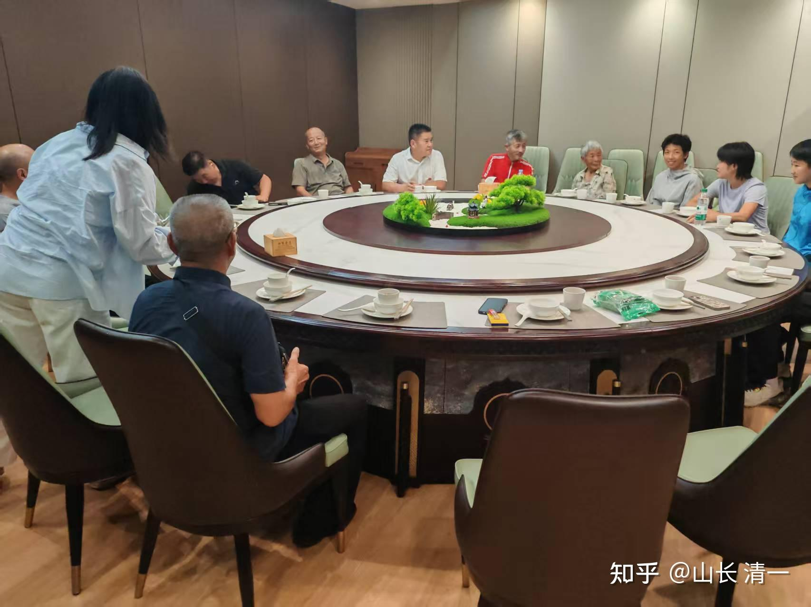

*设宴款待：没想到当地的饭店规格好高*

[!\[image\](images/img_018.jpg)

https://www.zhihu.com/video/1941119413995668315](http://link.zhihu.com/?target=https%3A//www.zhihu.com/video/1941119413995668315)

核心：我们是新一代的太极实战人。正在为这个古老的中华传武注入新的活力。我们的目标，就是【为往圣继绝学】，不去争名，争利。只想为国争光。为中国的文化事业做贡献！