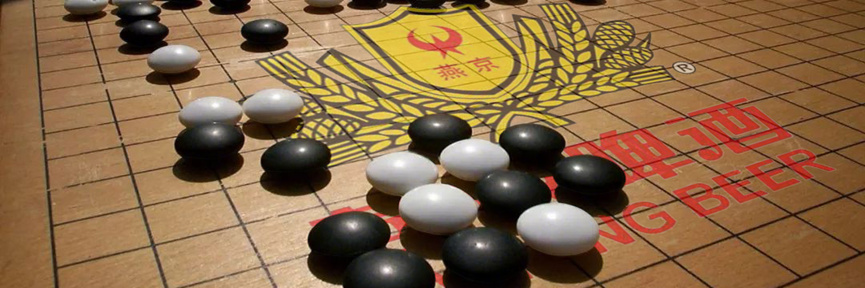
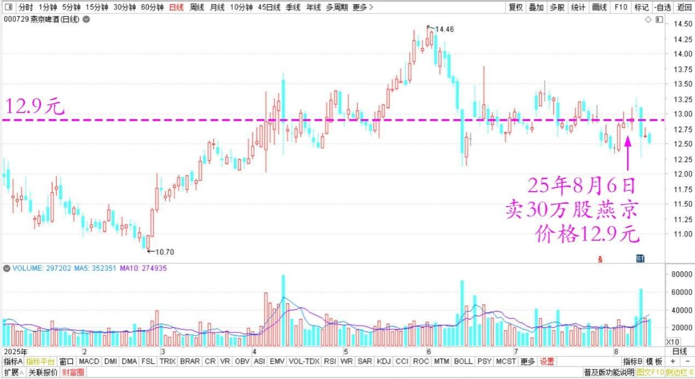
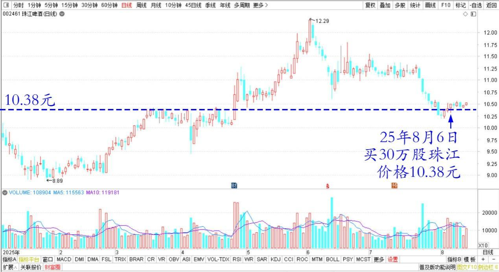
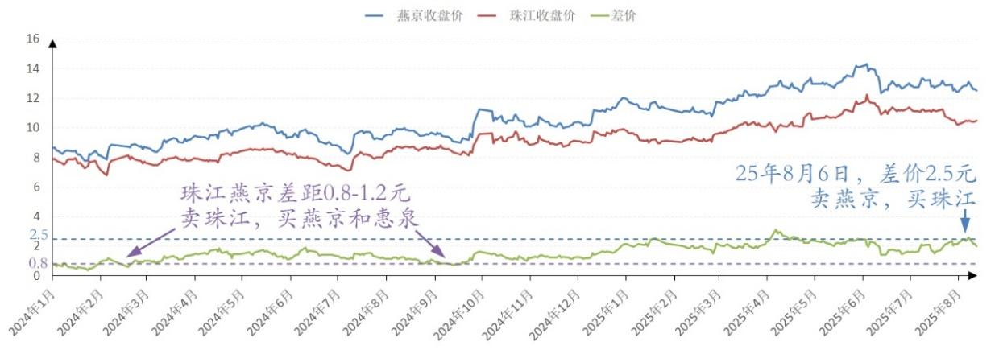
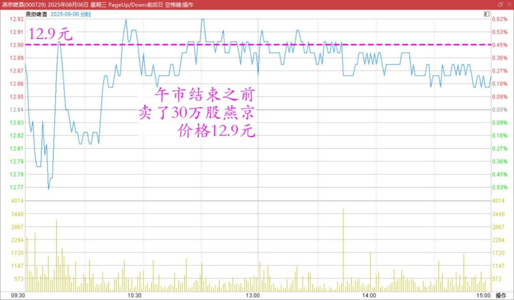
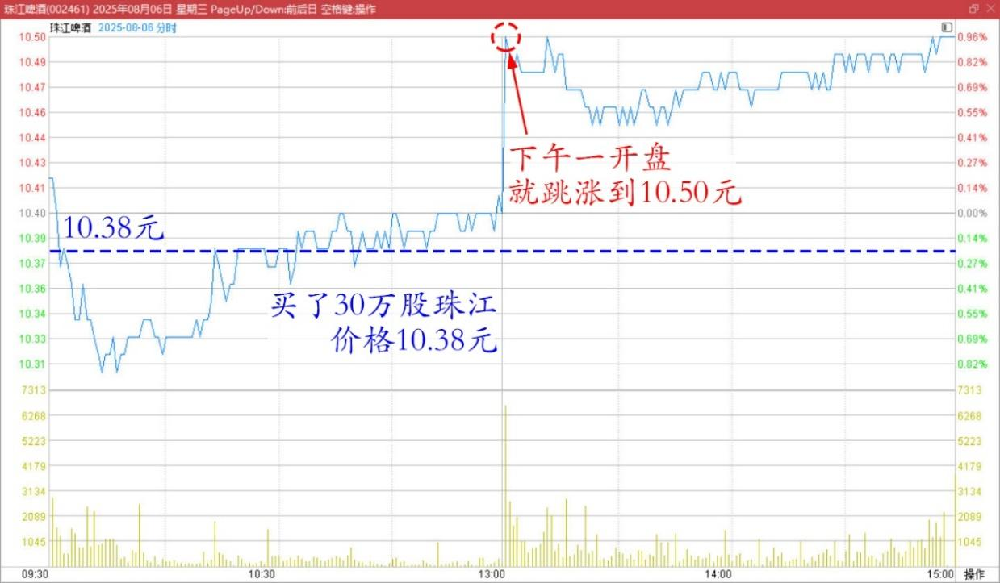

[清一山长](file:///%5C%5Cwww.zhihu.com%5Cpin%5C1936446119082202607)[2025年8月6日15:18](https://www.zhihu.com/pin/1936446119082202607)

今天上午挺好笑的，午市结束之前，**我卖了30万股燕京，价格12.90元。**但我还不想下车啤酒股，就**买了30万股珠江，价格10.38元。**做做差价。

**燕京啤酒2025年日线图**

**珠江啤酒2025年日线图**

各位应该记得：我在珠江、燕京差距0.80～1.20元的时候，是拼命卖掉珠江，买燕京，买惠泉的。所以我珠江的份额最近一段时间一直在减少。燕京、惠泉一直在增加（两年前上一轮燕京冲14，其实我走掉了70%）。

现在两股的差距，又拉大了。**今天已经有2.50元了。所以我开始反向操作，卖出燕京，买入珠江，锁定这个差价带来的利润。**

没想到，下午一开盘，珠江就跳涨到10.50元。哈哈，原来有人不乐意呀？看样子，我是把有人压盘的筹码买走了，所以下午他急于补回仓位去。证明我做的没错。

**燕京啤酒2025年8月6日分时图**

**珠江啤酒2025年8月6日分时图**

我认为燕京没有涨的主要责任是我，怪我一直赖在里面，主力不愿意拉升让我坐轿子！如果我走了，估计就要涨了。所以我现在很自觉地卖，今天卖了30万股，**主账户首次跌破千万股。继续涨，我继续卖**。反正账户成本燕京差不多归零了。我就不学“[唐牛](http://link.zhihu.com/?target=http%3A//m.tetegu.com/gudong/124711-000729.html)”（[唐建华](http://link.zhihu.com/?target=http%3A//m.tetegu.com/gudong/124711-000729.html)）了，他太稳了！学不来！

**评论回复：**

**一年呀2025-08-06四川**

山长，请教一下，上次 14 元离开是因为您觉得短期见顶了，于山顶离开后海底捞月之后再创新高。本次离开燕京是因为有更好的标的或者换了更具差价的珠江惠泉，燕京却不是山顶，[害羞]可以这样理解吗？

**山长** **清一2025-08-06泰国**

我啥时候离开燕京了？咋我都不知道，你却知道？[捂脸]

**（标题、图片为编者所加）** **文章音频**：

[589篇. 主账户燕京首次跌破千万股](http://link.zhihu.com/?target=https%3A//www.ximalaya.com/sound/903139815)

**参考链接：**

[167篇.一年20倍，是怎样做到的？](https://zhuanlan.zhihu.com/p/1936417228665881673)

[168篇.卖出10万股燕京还融资](https://zhuanlan.zhihu.com/p/1937126670973776622)

[169篇.金钼股份涨停卖出](https://zhuanlan.zhihu.com/p/1937910581056213786)

[170篇.金钼股份继续涨，但我看多不做多](https://zhuanlan.zhihu.com/p/1940509051663385324)

[171篇.慢牛行情，长期持股才是制胜之道](https://zhuanlan.zhihu.com/p/1940513233216725976)

[链接汇总（截止2025年8月1日）](https://zhuanlan.zhihu.com/p/621215591)

