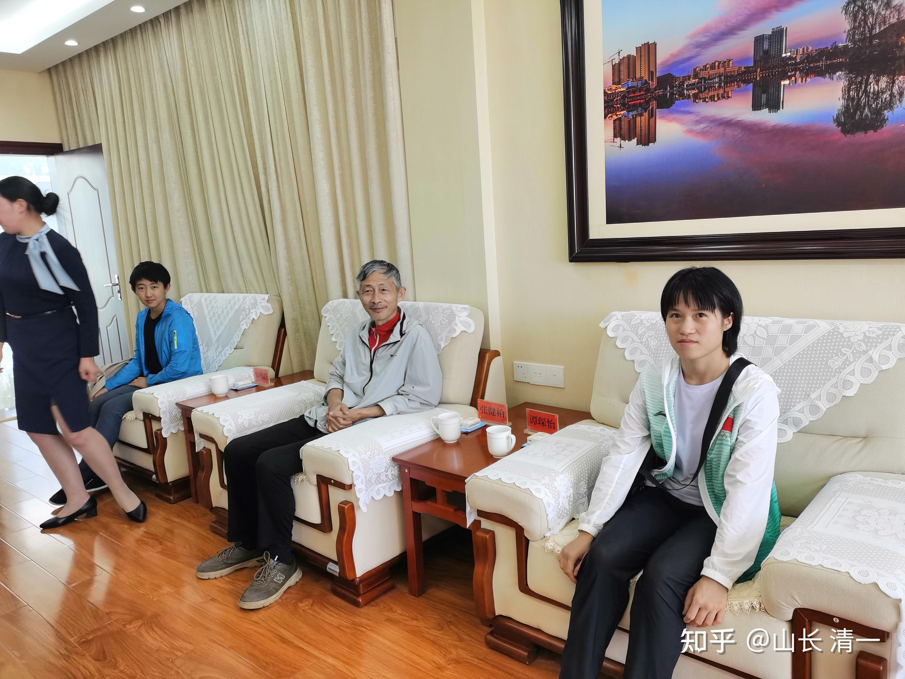
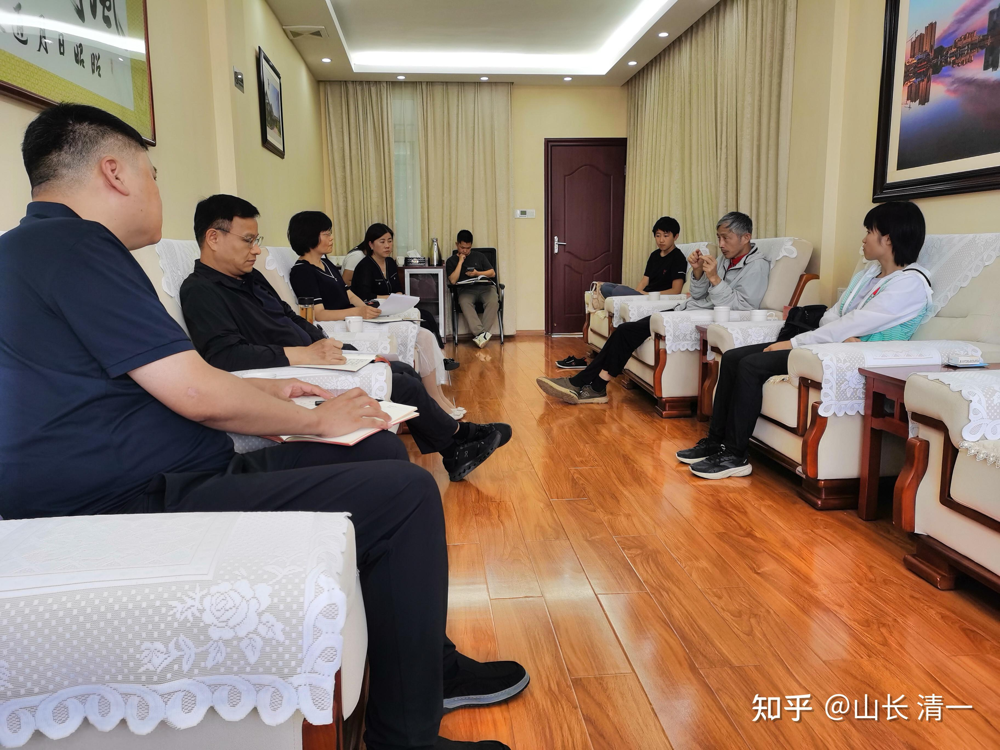
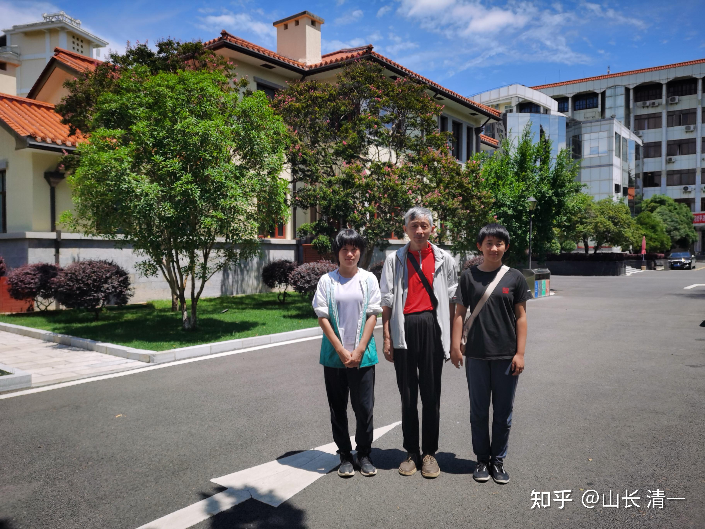
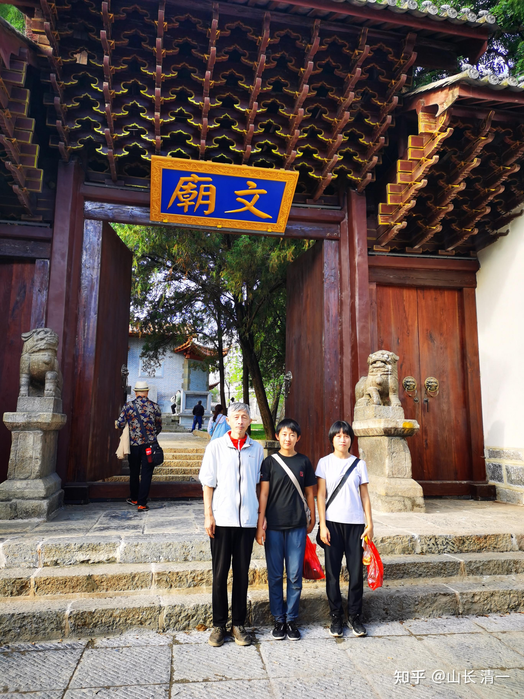
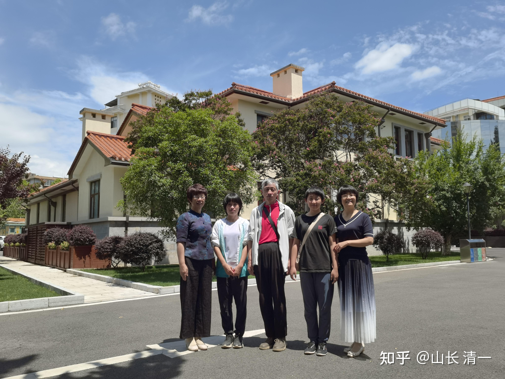

**很少有人知道：即使要进入体制，清一新教育也提供给学生最好的成功机会。**

如果你在清一新教育里面不成功，你以为你去体制就能成功。我只能说：你做梦去吧！很可能你会更失败。因为你要用体制的方法去卷体制，难度更高，累死你还做不到。这就是清黑离开平台后非常失落的核心原因，他们发现自己完全玩不转体制，一生注定平庸！。因此才有巨大的失落感，对平台的新一代优秀人物的崛起充满了忌恨！

要在体制内成功，要求是【有本事没脾气+有眼色]。会搞关系！

清一圈成功，要求是有本事即可！有点脾气大家不在意。

如果你又没本事，还有脾气。你在哪里都是失败者。你只能去当请黑了！

但你用清一新教育的方式去进入体制的话，更容易让你在自己还很年轻的时候，就站在很高的平台上起步，远远超过一群笨蛋在慢慢互相跟随爬行的体制大军！

比如你思考一下：

如果你想要进体制，你想在体制内成为“超级成功者”。那么-----你该用什么样的姿势来进入呢？

大众的方式就是：尽量考上最好的大学，然后去考公，进入体制获得编制，然后慢慢取得领导的青睐，得到提升的机会，慢慢的爬上去！用一生来达到顶峰。

**这条路，不是不行。而是太难了，99%的人都会在中途失败。**各种原因都会导致你失败！

假如是另外一条道路呢？

比如：下面这位，看看她的百度介绍吧，是不是体制内的超级成功者？你上个北大，有个顶尖的文凭，你就能超过她吗？

**邓亚萍，1**973年2月6日生于[河南省](http://link.zhihu.com/?target=https%3A//baike.baidu.com/item/%25E6%25B2%25B3%25E5%258D%2597%25E7%259C%2581/59474%3FfromModule%3Dlemma_inlink)[郑州市](http://link.zhihu.com/?target=https%3A//baike.baidu.com/item/%25E9%2583%2591%25E5%25B7%259E%25E5%25B8%2582/2439317%3FfromModule%3Dlemma_inlink)，祖籍湖南省邵阳市[新宁县](http://link.zhihu.com/?target=https%3A//baike.baidu.com/item/%25E6%2596%25B0%25E5%25AE%2581%25E5%258E%25BF/75171%3FfromModule%3Dlemma_inlink)[1]，原[中国女子乒乓球队](http://link.zhihu.com/?target=https%3A//baike.baidu.com/item/%25E4%25B8%25AD%25E5%259B%25BD%25E5%25A5%25B3%25E5%25AD%2590%25E4%25B9%2592%25E4%25B9%2593%25E7%2590%2583%25E9%2598%259F/3107481%3FfromModule%3Dlemma_inlink)运动员、世界冠军、[奥运冠军](http://link.zhihu.com/?target=https%3A//baike.baidu.com/item/%25E5%25A5%25A5%25E8%25BF%2590%25E5%2586%25A0%25E5%2586%259B/83130%3FfromModule%3Dlemma_inlink)，乒乓球大满贯得主。河南[邓亚萍体育产业投资基金](http://link.zhihu.com/?target=https%3A//baike.baidu.com/item/%25E9%2582%2593%25E4%25BA%259A%25E8%2590%258D%25E4%25BD%2593%25E8%2582%25B2%25E4%25BA%25A7%25E4%25B8%259A%25E6%258A%2595%25E8%25B5%2584%25E5%259F%25BA%25E9%2587%2591/20174237%3FfromModule%3Dlemma_inlink)创始人。第八届、十届、十一届全国政协委员，第九届全国人大代表。1997年，任国际奥委会运动员委员会委员。2000年，任国际奥委会体育与环境委员会委员。2007年，任第二十九届奥运会组织委员会奥运村部副部长。 2009年4月，任共青团北京市委副书记。2010年9月，任人民日报社副秘书长、即刻搜索总经理。 2016年6月，辞去人民日报社副秘书长职务，并与俞敏洪联手打造国内第一家体育产业创新创业平台。 同年10月，成立“河南邓亚萍体育产业投资基金”。 2018年，当选河南省妇联第十三届执行委员会常务委员。2024年1月，当选河南省妇女联合会第十四届执行委员会常务委员。 1996年，被国家体委授予体育运动荣誉奖章。2001年，获评“环球二十位最具影响世纪女性”。 2011年，获“中国十佳劳伦斯冠军奖特别成就奖”。

还有很多很多的人，比如一位我在大学时代就非常熟悉的名字：

**孙晋芳，1955年4月6日出生于上海**，祖籍安徽宿州，毕业于南京体育学院，曾是中国女子排球运动员，后任任江苏省体委副主任、江苏省体育局副局长、江苏省国际文化交流中心副理事长、江苏人民对外友好协会副会长、江苏省青年联合会副主席、中国排球协会副主席，国家体育总局网球运动管理中心主任。

这些人的一个共同点，就是她们当年，都是为国争光的人！她们的名字，经常出现在媒体上。成为大众热情追捧的明星。她们让国歌在世界各地奏响。

也因为她们的这些努力，国家也给了她们崇高的荣誉和社会地位。她们成为了文化上层！

请注意：他们的项目是英国人发明的球类运动，中国人去玩，拿到世界冠军。中国人就给了她们如此崇高的荣誉。

各位认为：**在中国人的心中，这些外国球类运动的地位，有没有中华武术高？**

如果有人能够用中华武术，去击败全世界的拳手，去夺取一个一个的世界冠军，她会不会成为全中国人的骄傲？她会不会成为国宝?会不会成为政府从上到下的宠儿？

现在国家媒体不重视格斗，是因为中国是格斗弱国，总不能天天去报道：中国

如果你能够为你的国家，在世界上获取崇高的地位，你就是这个国家的国宝，国礼！所有的领导，都会给你开绿灯！你的人生就一路开挂。绝对比你去跟每年一千万大学生去拼抢赛道更快速，更高效，更容易升到顶尖！

我不是说你拿到世界冠军，就能成为文化上层，就能升到顶尖。不少世界冠军，可能就是脑子笨到除了运动啥都不会！不会做人，不会做事，也不懂感恩。 只会运动拿冠军。

这种人无论在体制内外，都不可能成功的！

我说的是：**如果你真的具备升到我们国家顶尖，上层的素质和能力的话，你用去拿世界冠军的方式走这条路，要比你拿到清北文凭去走这条路，要快速有效得多！**

如果一个人，居然放弃世界冠军的荣誉，要去考什么北京大学。以为自己走的这条路，就是让自己成为文化上层的路？

我只能说你蠢得像一头猪！

就算是你北大毕业了，很可能毕业出来后，连大一点的领导的秘书都见不到。你就是一个最初级的打工仔，只能从基层慢慢的去证明自己。

而你拥有的世界冠军的身份，会让各级的领导都与你同台，同席。领导会主动给你很多的机会，只要你有本事接得住这些礼物！

这段时间，我带着冠军们，在山西，在河南，在云南，都得到了各级领导的接见。这些年轻的小女孩，名字都写在台子上，正常情况下，只有各界的资深人士，才有资格参与的会议和接见！小女孩哪里有资格去见到这些人。

今天就是这样的。这是上周六就安排好了的接待：某地级市的市长，接见我们一行人。我和明慧，是以为国做贡献的华侨身份，被领导安排接见的。谭木兰当然是以东亚冠军，未来的世界冠军的身份安排接待的！

*进入接见的小会议室，小明慧和谭木兰，惊讶地发现自己名字写在座位旁*

*市长和两位主席等人，接见我们一行。希望找到双方的合作机会*

今天是在侨联主席提前几天就约好的安排，去见了市长。明慧和谭木兰都有自己的座位和姓名牌。让他们体会到了领导接待的细致。领导认真地了解了解了我们在国外办学的情况，特别是取得世界冠军的背景，以及后续的团队。当知道我们有70多人正在勤奋练习，未来将成为中国最强战队的情况，领导非常的有兴趣。这是一个从北京调任来当地的领导。因此眼光与普通的地方官员还不一样，具有全国性的思维。他们想借助我们的拳手代表当地出战，帮助当地打响名声，成为一个靓丽的地方名片！

今天交流的非常愉快。领导很开心，问了很多的问题。甚至领导还为了我们，推迟了下一场接待，交流具体内容就不提了。

**如果我们的拳手，代表国家去拿到世界冠军，为国争光，我们就是国家的国礼！**

如果我们代表某个省市，去参加全国锦标赛，参加全运会，去拿到全国冠军，**我们就是这个省市的省礼，市礼！**备受尊重。

我作为愿意送出这些礼物给他们的使者，我作为冠军们的师父，我显然就是这些领导们的贵客！备受尊重。

而我能够送出来的国礼，省礼，市礼，有很多。不是一个两个！而是一批，又一批！

您认为：这些各省，市的领导，将来对我会是什么样的态度？

如果我是中国或者各省市领导们的贵客，您认为：还有什么臭流氓，还敢来碰瓷我？不是自讨苦吃吗？

今天的中午和晚餐，都在市委机关食堂吃饭。两位领导（侨联主席和社科联副主席），饭后亲自陪同我和两个孩子游览当地的古城，当导游介绍，很开眼界。明慧和谭木兰，都从和领导打交道的过程中，学到了很多的东西，核心点就是：要把自己作为礼物送给对方。市长还亲自要求加谭木兰的微信，我在猜想：一个小女孩，就算你是清北毕业，你能随便见到市长吗？更别说市长亲自找一个小女孩主动加微信了。。。。。

这就是你去做省礼，市礼，国礼的价值，这就是冠军的价值（虽然我介绍谭木兰是现役的东亚冠军，但她应该是明年的世界冠军）。。。。你直接就是领导的座上客。而不是工厂里面的打工仔。

市长领导还安排侨办的主席，会后要安排宴席好好的招待我们，我们主动说---更喜欢吃食堂，体验一下领导们的食堂更有价值，不想去酒店吃饭。

领导也很照顾，就安排两个主席接待我们去“参观旅游”了。我们推都退不掉。主席说：陪同爱国华侨去游览当地风光，就是她们的工作任务！。。。

下一步领导的计划，是希望和我们团队一起合作，推出更多为国争光的冠军。领导还表示，他要把自己的孩子，也送到我们的学校来。。。。**这就是国礼计划，已经开始启动了。**

我还告诉两个小公主，不需要受宠若惊。

------未来出来接待我们的领导，会是省部级的，甚至国家级的。因为我们是国礼。。。。。。

我相信这是你们去读大学，拿文凭，读不来的待遇！

如果真要融入体制，用冠军身份去进入体制，进入大学，比你们考分数去拿个傻文凭，更容易融入体制的上层。因为我们知道政府领导需要什么---领导要为当地带来影响力！而冠军比学霸更容易引起人的关注和关心！

下面是两位侨联侨办的主席，带我们参观当地的古迹。拍照片的就是领导，全程导游兼拍照。我们非常的荣幸。

*原云南省主席卢汉的公馆*

*万世师表的故居：当地的文化中心*

*两位陪同的主席合影。这次是办公室主任拍照*

**我设想的ELLA未来进入体制，去当国礼的发展路径图**

她在2026--2028年拿到世界冠军，以太极之名，进入了国家体育总局领导的视野，开始受到关注！

她以中华传武传人的身份，打下了泰拳，自由搏击，拳击，综合格斗的世界冠军大满贯，成为中国第一个跨越所有格斗拳种的传奇人物，成为全国，甚至是全世界级的超级明星拳手，远远超过张伟丽现在的热度！

她以五语学霸的名声，以流畅优雅的文笔，温柔可爱的笑脸，获得了各级领导的欣赏，也成为媒体的宠儿，不断出现在媒体上！

她拿到冠军后，在清一山长和国家武管中心的领导安排下，成为某国家级非遗传武门派的入门弟子，传人。她成为让该门派重新振兴的，新一代的宗师来培养成长，将来用该门派的技术去世界格斗场上打遍全世界！

此后，她连续三五年垄断了她所在级别的世界冠军，用漂亮的传武技术和招式，纷纷击败外国对手。这些各国拳手们，在世界锦标赛上，一旦抽签见到ELLA就大叫倒霉。因为根本没有办法赢过她！

最后，ELLA赢比赛已经都没有悬念了，师妹们也都起来了。她就把世界冠军的地位让给师妹去打。她自己宣布退役，不再打比赛！表示自己要投入在全世界弘扬中华武术的伟大事业，利用自己的五语优势，让世界人民喜欢中国，并改变中国人“东亚病夫”的文弱印象！

国家体育总局，武管中心的最高领导，多年来一直关注这个文武双全的学霸冠军。在她退役后，就第一时间，领导特别安排ELLA去北大读中文系，哲学系镀金（或者去中国外交学院，外语学院等等）。帮助她成为海外拓展中华武术的代表人物，加以特别的培养。

ELLA毕业后，世界武术联合会的主席，直接招收ELLA作为重要助手，负责在全世界开展中华武术的推展工作。由于ELLA的语言优势，写作优势，沟通能力都非常的突出，社交形象也非常好，她成为了中国武术的形象代言人！经常出现在各种媒体和产品上。

如果ELLA不去做官，自己想要发财也容易：中国唯一没有外资介入的燕京啤酒，可能会聘请ELLA作为代言人，每一灌啤酒上都能看到ELLA的笑脸照片。。。还有其他突出中国形象的产品！

多年之后，做官的ELLA成为国际武术联合会的主席，妥妥的文化上层。全世界拥有武术最高地位的明星人物！同时还有很多国家文化体育部门的多种兼职。

不做官，ELLA当掌门人的武馆。培养成多位世界冠军，她成为各国想要拿世界冠军的领导们争相高价聘请的传武高手，去其他国家当教头。就像郎平一样：2000万一年的执教费。

60岁，ELLA再次走上擂台，与25岁的世界冠军比赛，最终用太极技术，轻松击败对手。现场三万人的体育场，充满了对神奇女子ELLA的欢呼！

您认为：这条道路，不是比你们自己去考大学，自己安排自己，更容易成功吗？让有资源的大领导帮你安排上大学不好吗？

难道你认为你考上清北，就能成为文化上层了？每年这么多的上层吧？

还远着呢！