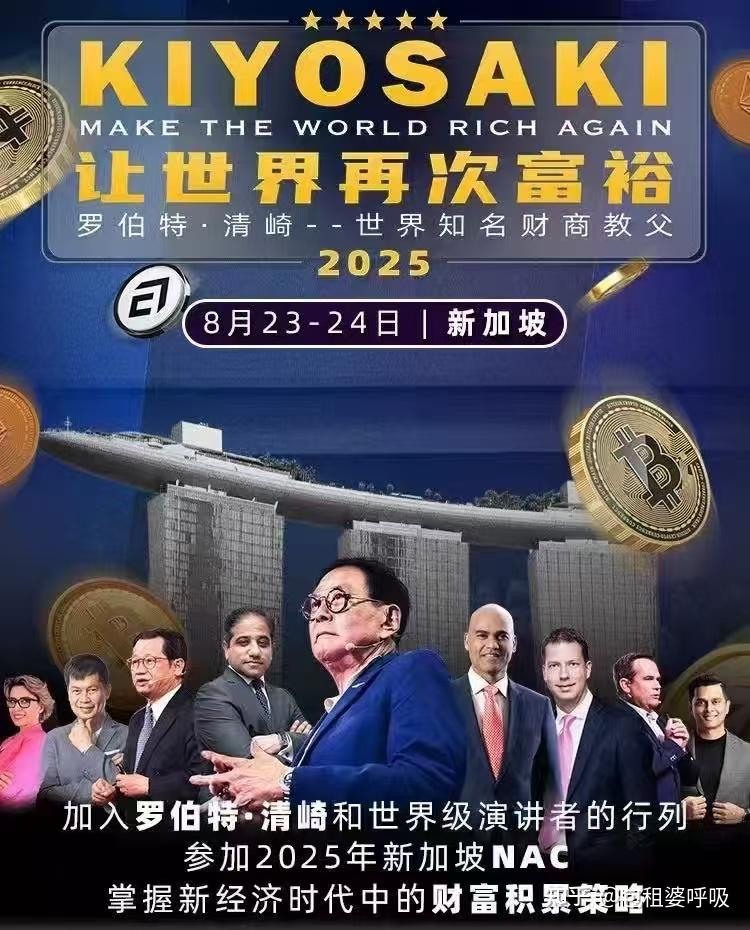

10月1日我将回国在蕙兰酒店参与首届鹰粉节，这是我送给鹰粉们的一份礼物。我会给大家分享一周的电影课，以及财商课。

为了方便，我计划财商课部分，就用罗伯特清畸的最新演讲为内容来进行讲解。要求清粉们提前思考下列他讲话的要点。并针对每一题，写出自己的思考和提问，审视，以及应对的方案！

这个日本美国人，也是30多年前我的财富思维的启蒙人之一。他写的【穷爸爸富爸爸】书籍，是我认真看过好几遍的书籍，我相信他的财务逻辑，真的是对我有帮助的！

就像《穷爸爸富爸爸》里说的“老鼠赛道”——“起床，上班，付账，再起床，再上班，再付账……他们的生活从此被这两种感觉所控制：恐惧和贪婪。给他们更多的钱，他们就会以更高的开支重复这种循环。"，很多人正在重复这种轮回，我有幸逃开了。

下面是子安老师整理的小灶笔记，分享给你。
1、相信比特币，不相信其他货币，其他货币是假的货币，不相信政F。 **（为什么？你要相信啥才对？）**

2、关于理财的知识，不相信学校老师，不相信理财专家。要自己去研究。 **（为什么不能相信学校的老师？为什么你不能相信理财专家？你自己难道就可以相信吗？）**

3、财富自由以后要做什么？很简短的回答，教导。** （你定义的财富自由是什么？为啥要做这些事情？）**

4、要去帮助普通人，而不是非常有钱的人，是让大家都有公平的机会。不一定要收更高的价钱，而是以非常便宜的价钱，大量的，广泛的甚至免费的教导大多数人。**（为啥要教普通人？不教精英？这样做对自己有啥好处？）**

5、龚产主义是给公平的结果，而不是给公平的机会；资本主义是给公平的机会，而不是给公平的结果，他们会创造完全不一样的世界。 **（不一样在何处？你认为哪一种原则更好？你在家里会用啥原则？）**

6、让自己成为一个资本家，成为一个投资者，成为真实资产的拥有人。 **（什么才是真实资产？虚假资产是怎样的样子？）**

**（以下主题，请自己提问，自己思考和回答）**

7、要持续的买入白银黄金，因为这是真实的货币。 **【 这样做的逻辑是什么？你怎样才能买入黄金和白银？你怎样卖出去？】**

8、美国政府有三十七亿兆的货币，加上那些国债七七八八的。其他债务加起来有100多兆，永远还不起，每天一亿美元，来还利息，都不够。政府迟早会破产，他已经经历很多次了，帝国的兴和衰还是早晚的事情，但是我们要保护好自己的钱。 **【怎样才能在国家和政府衰落的情况下，保住自己的资产？怎样让自己的家族资产和家族成员，不至于跟着所在的国家一起衰落？】**

9、白银要买白银，因为白银会被工业不断的消耗，会被导弹里面一颗就有四磅的白银，白银会大量的消耗，但是不可再生。它是真实的货币，几千年来一直都是。现在有了比特币。你可以不相信比特币，但他是新的货币，真实的样子。主要是为了对抗政府的通货膨胀和印钞机。 **【白银和比特币，有何共同之处？有何不同之处？你怎样投资白银？】**

10、世界一定会崩溃，而且一定会发生，要提前做好准备，他的钱在很多个不同的国家。

**【你怎样面对世界的崩溃？你该做什么？要教你的孩子什么样的能力来应对？你怎样让自己的家族在面临世界崩溃的时候，安然无恙的传承下去？】**

11、他自己说现在一天就能赚十几万的美元。 **【如果你毫无资本，只能用工作来开启财富之路。凭借工资，怎样实现这样的结果？】**

12、他经历过津巴布韦的这个通货恶性通过膨胀那个时候他在打猎，而且通过膨胀以后人们失去了心，希望到处都是烧杀，黑人拿着枪指着他，脑袋要他交出钱，那是这样的事情会再次发生在我们所在的国家。 **【你推断这样的事情发生在你生活国家的时候，你怎么办？如果周围的人都活不下去了，你怎样才能安全？】**

13、语言会形成你的血肉之躯，你说自己是什么你就会成为什么，所以还要非常谨慎的说话，而且很谨慎的把自己描绘成什么样子，也会成为你所描绘的样子。不能说自己穷，不能说自己做不到，不能说自己买不起。** 【为啥不能说自己穷？你怎样才能面对你明明买不起的东西？比如一架私人飞机？游艇？如何面对很多你想要的东西？】**

14、你要真的想要成为一个创业家，不惧任何困难，坚持不懈，尽量去付出，尽量去多给予，然后你早晚会得到回报。 **【创业的真经，你如何理解？你如何去做才能实现最大的价值？】**

15、硬币总有三面，有正面有反面，还有中间那一面。如果学习的课程你就知道至少有多面，然后可以选择用哪一面来应对生活。 **【请你用身边的案例和故事来阐明这个观点？」**

16、如何应对aI？ Ai会取代e和s象限的几乎所有人，所以我们要成为企业家，投资人，我们要去看到ai我需要的是大量的能源，所以我们应该是购买能源。最终的能源也会完全免费。但他需要很长的时间。 **【AI取代了几乎所有的劳动力和普通的技术工作，大量人失业。那么，难道人类社会只需要企业家和投资人吗？还有其他创业的空间吗？未来如果你需要工作，会是什么样的工作才最受欢迎？】**

17、如果政府通过各种方式要抢走你的钱，伤害到你的家人，你应该勇敢的捍卫自己权利，用聪明的方式。 **【政府不创造价值，他们只是分配价值。抢钱就是他们的本性。请解析出他们是如何抢钱的？你怎样才能尽量避免自己和家人被抢钱？请列出至少五种聪明的方法】**

18、要去读书，要去学习，用玩现金的游戏，然后亲自掌握这个规则，不可以假手他人，只有自己可以判断哪一些是真正的钱，并且做出投资，不要听理财经理的，不要听那些假专家，要听真的老师，要真的去实践，真的去落地，要反复去练习，要训练自己的头脑和训练自己的身体，还要训练自己的情绪，要训练自己的灵性，情绪是指情绪控制能力灵性，灵性是精神层面的使命，愿景，价值观要有高尚的目标。** 【 真正的钱是什么？真正的老师是谁？你怎样才能找到真的钱？真的老师？你怎样才能识别出假的投资专家？假的老师？】**

19、讲到关于子弹的经历，你会很害怕，恐惧，那你还是要勇敢还是要往前走还是往前冲，这是你现实生活，所要面临的一切。自己的过往，做飞行员的时候，一直感觉到子弹从耳边秀秀的经过，但是他还是要持续的把飞机往前开，因为他要完成他的使命。**【你怎样才能训练自己面对危险。还依然坚持往前冲的能力和素质？如果缺乏这种素质，会遭遇什么样的结果？】**

清崎78岁了，或许这是他在亚洲的最后一场演讲了，他依然在讲台上告诉全世界，
**别依赖正府，别迷信专家，别囤假货币。**
真正的安全感，来自资产、现金流和使命感。
这是一个老人用自己半生的伤疤、债务、坠机和财富换来的经验。
愿我们都能听懂，并趁早行动。

**罗伯特·清崎2025年新加坡演讲（中文版）**

非常感谢你们！

首先感谢你们的时间，时间是最宝贵的

其次感谢你们对活动的支持。

最重要的，是感谢你们的信任。

1996 年，我第一次来到新加坡。那已经快 30 年前了。那时我第一次公开谈论《富爸爸》和《穷爸爸》，谈论财商教育。若不是那次开始，之后的一切都不会发生。

从那以后，我的书和课程被翻译成 50 多种语言，传遍世界各地。所以今天站在这里，我非常感恩。

⸻

穷爸爸与学校教育

我的穷爸爸很聪明，他相信教育、学校、学历。他告诉我：努力学习，拿好成绩，找好工作，努力工作，存钱，还清债务，买房子，靠养老金退休。

但问题是：学校从来不教金钱。学校培养你成为雇员，而不是拥有者。他们让你为钱工作，而不是让钱为你工作。

所以在我十五岁时，我问老师：为什么我们不学钱的知识？为什么读了那么多年书，却没人告诉我们钱是怎么运作的？老师们没有答案。

⸻

战争与使命觉醒

1965 年，我在纽约上学。1966 年，我作为海军陆战队飞行员去了越南

在越南，我见过死亡，见过战友被击落。我自己也坠机三次，但活了下来。

所以我开始问：我的使命是什么？我为什么活着？

使命不是关于钱，使命是上天赋予你的任务。

对我而言，战后我明白了：我的使命就是教人们关于金钱。没有财商教育，人们是钱的奴隶；有了财商教育，人们才自由。这成了我一生的使命。

⸻

财商教育的核心

我看到很多高学历的人依然在为钱挣扎。他们努力工作，存钱，买房。但最终依然贫穷。

为什么？因为他们分不清资产和负债。

所以我教大家：钱流出你口袋的，是负债；钱流进你口袋的，才是资产。

最重要的一课：不是你赚了多少钱，而是你留住了多少钱，让钱为你工作多久，以及能传几代。

这就是我创造《现金流游戏》的原因。你不是靠读书学会财商，而是靠实践。当你玩游戏时，你会看到真相：老鼠赛跑是真的，只有当被动收入超过支出，你才自由。

主要的四类资产：

1. 企业——创业建立公司。

2. 房地产——能产生现金流的物业。

3. 纸资产——股票、债券、基金。

4. 商品——黄金、白银、石油等。

富人专注于资产，穷人和中产却专注于负债，并且以为那是资产。

⸻

危机、健康与财富的类比

崩盘不是坏事，崩盘是机会。2008 年，数百万人失去一切，但我更富有，因为我准备好了。

在医学上，药不能治愈你，改变生活方式才能治愈。在财富上，工作不会让你变富，财商教育才会。

1970 年代，我看到经济下滑。2008 年，我又看到经济崩溃。今天，我们正走向另一次危机。

历史总是重演。大众总是在高点买进，在低点恐慌出逃。这就是为什么大多数人亏钱。

但对受过训练的投资者而言，崩盘是最好的时机。崩盘就是资产打折。

2008 年，我借了 3000 万美元买房地产。人们说：“你疯了，世界要完了！” 但那次危机让我更富有。

所以，不要害怕崩盘。不要听那些制造恐惧的新闻。相反，你要准备好，教育自己，建立现金流。这样你才能在每一次周期里变得更强。

⸻

AI 与未来

今天人们害怕 AI，害怕量子计算。但不要让恐惧支配你。

就像农业革命、工业革命、互联网一样，AI 只是又一次转变。问题是：你会准备，还是会被抛下？

保持开放心态，学习，适应，你就能在未来蓬勃发展。

⸻

房地产与债务的智慧

在 2008 年崩盘时，我借了 3000 万美元买房地产。人们以为我疯了，说：“世界都要崩了，你为什么还要借这么多钱？”

但这就是富人与穷人的区别。穷人害怕债务，富人利用债务。债务，如果运用得当，就是钱。

我不存钱，我借钱。因为债务投资到能产生现金流的资产，会让我更富。而存钱会让你更穷，因为政府每天都在印更多的钱。

所以每一次危机，我都会问自己：我如何把崩盘变成机会？这就是为什么我热爱房地产。房地产加上现金流，就是我对抗崩盘的护城河。

⸻

现金流游戏的教育力量

很多人问我：“我要如何开始学习财商教育？” 我的回答是：玩《现金流游戏》。

因为当你玩的时候，你会亲身体验到真相：更努力工作不能让你自由，更高的工资不能让你自由，存钱也不能让你自由。

只有当你逃离老鼠赛跑——当你的被动收入超过支出时，你才真正自由。

这就是我走遍世界用这个游戏教学的原因。因为这个游戏教会了学校拒绝教的东西：资产与负债的区别，以及现金流的力量。

⸻

收尾与行动号召

所以，朋友们，这是我要传达的：

不要害怕未来，不要害怕崩盘，不要害怕 AI。

要准备好，要教育自己，要建立资产，要增加现金流。最重要的是，要找到你的使命。

钱不是目标，使命才是目标。钱只是工具。有了财商教育，你能让钱服务于使命；没有教育，你就会被钱奴役。

所以，我邀请你们：玩游戏，学习财商教育，并和我一起教世界钱的真正规则。

谢谢你们，新加坡！

⸻

以下是纯英文版本演讲稿👇：

**Robert Kiyosaki – 2025 Singapore Talk **

⸻

Opening: Gratitude and First Visit to Singapore

“Thank you very much. Thank you, thank you so much!

First of all, thank you for your time. Time is the most precious thing you can give me.

Second, thank you for your money, for supporting this event.

But most importantly, thank you for your trust and your support.

In 1996, I came to Singapore. That was almost 30 years ago. That was the very first time I talked publicly about my Rich Dad and my Poor Dad, and about financial education. Without that beginning, none of what followed would have happened.

Since then, my books and lessons have been translated into more than 50 languages, carried all over the world. So I stand here very grateful.”

⸻

Part 1: Poor Dad, School, and the Missing Education

“My poor dad was a very smart man. He believed in education, in school, in degrees. He told me: study hard, get good grades, find a good job, work hard, save money, pay off debt, buy a house, retire with a pension.

But the problem is: schools never teach about money. They teach you to be an employee, not an owner. They prepare you to work for money, not to make money work for you.

So when I was fifteen, I asked my teachers: why don’t we learn about money? Why do we spend years in school, but no one explains how money really works? And the teachers had no answer.”

⸻

Part 2: War, Death, and Mission

“In 1965 I was in school in New York. In 1966 I went to Vietnam as a Marine pilot.

In Vietnam, I saw death. I saw friends shot down. I myself crashed three times and survived.

So I began to ask: what is my mission? Why am I here?

Your mission is not about money. Your mission is what God gave you to do.

And for me, after the war, I knew: my mission is to teach people about money. Because without financial education, people are slaves. With financial education, people can be free. That became my life’s mission.”

⸻

Part 3: Core of Financial Education

“I saw many highly educated people who still struggled financially. They worked hard, saved money, bought houses. But they ended up broke.

Why? Because they don’t know the difference between an asset and a liability.

That’s why I teach: if money goes out of your pocket, it’s a liability. If money comes into your pocket, it’s an asset.

The most important lesson: it is not how much money you make, it is how much you keep, how hard it works for you, and how many generations you keep it for.

That is why I created the Cashflow Game. You don’t learn by reading; you learn by doing. When you play Cashflow, you see the truth: the rat race is real, and only when your passive income exceeds your expenses are you free.

There are four primary asset classes:

1. Business – Entrepreneurs who build companies.

2. Real estate – Properties that generate cashflow.

3. Paper assets – Stocks, bonds, mutual funds.

4. Commodities – Gold, silver, oil, things that are real.

The rich focus on assets. The poor and middle class focus on liabilities they think are assets.”

⸻

Part 4: Crashes, Health, and AI

“Crashes are not bad. Crashes are opportunities. In 2008, millions lost everything, but I became richer because I was prepared.

In medicine, pills don’t heal you. Changing your lifestyle heals you. In money, jobs don’t make you rich. Financial education makes you rich.

History always repeats. The masses always buy at the top and panic at the bottom. That is why most people lose money.

But for the trained investor, crashes are the best times. Crashes are when assets go on sale.

In 2008, I borrowed 30 million dollars to buy real estate. People said, ‘You are crazy, the world is ending!’ But that crisis made me richer.

Today people are afraid of AI, of quantum computing. But don’t let fear control you. Just like the agricultural revolution, the industrial revolution, the internet – AI is just another shift. The question is: will you prepare, or will you be left behind?

Keep an open mind. Learn. Adapt. And you will thrive.”

⸻

Part 5: Real Estate, Debt, and Final Call

“In 2008, I borrowed 30 million dollars to buy real estate. People thought I was crazy. But that crisis made me richer.

The poor avoid debt. The rich use debt. Debt, invested in cashflow-producing assets, makes you rich. Saving money makes you poor, because governments print money every day.

So, my friends, here is my message:

Do not be afraid of the future. Do not be afraid of crashes. Do not be afraid of AI.

Prepare. Educate yourself. Build assets. Increase your cashflow. Most of all, find your mission.

Money is not the goal. Mission is the goal. Money is the tool. With financial education, you use money to serve your mission. Without it, money will use you.

So I invite you: play the game, learn financial education, and join me in teaching the world how money really works.

Thank you very much, Singapore!”