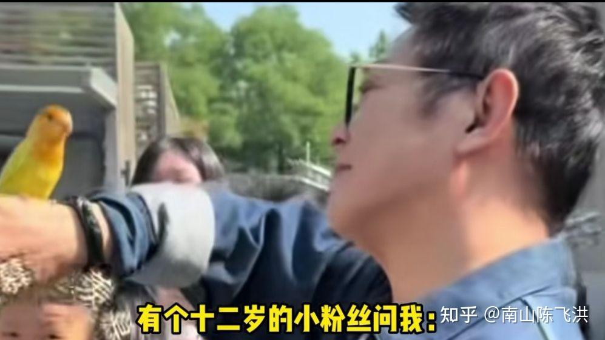
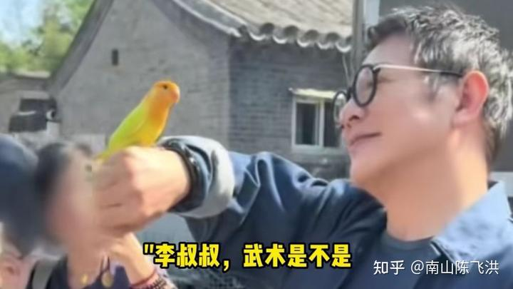
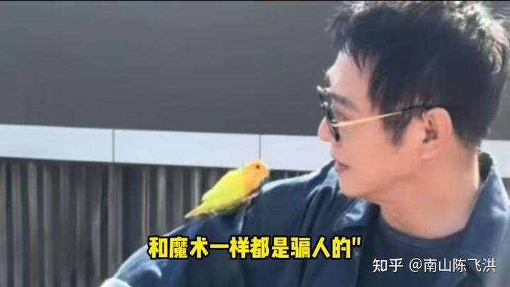
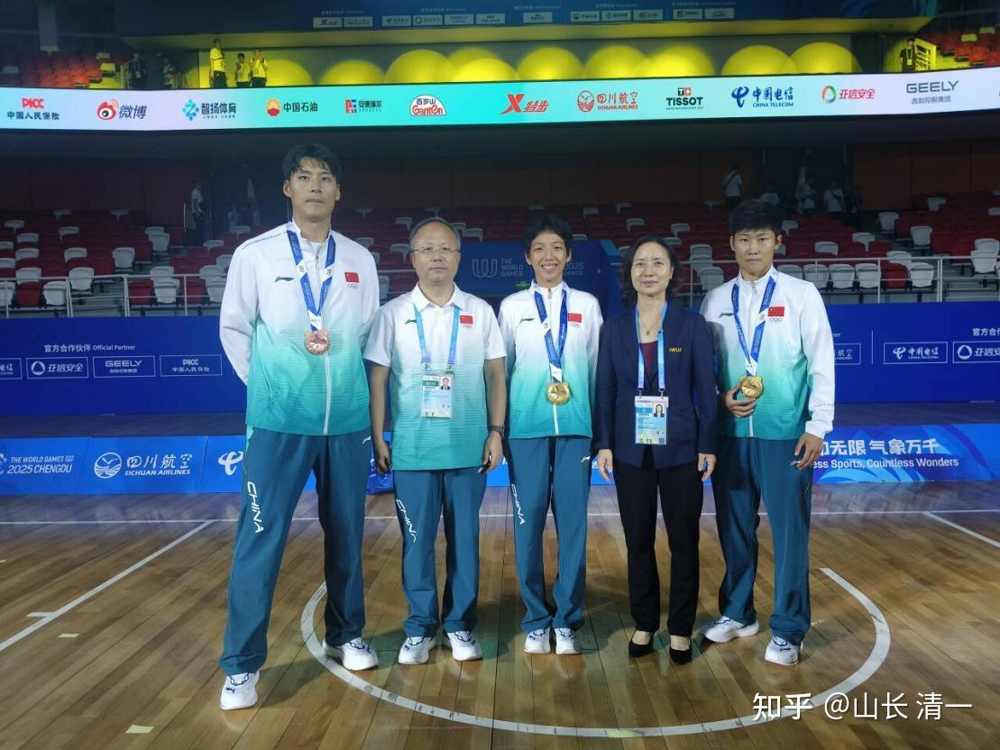
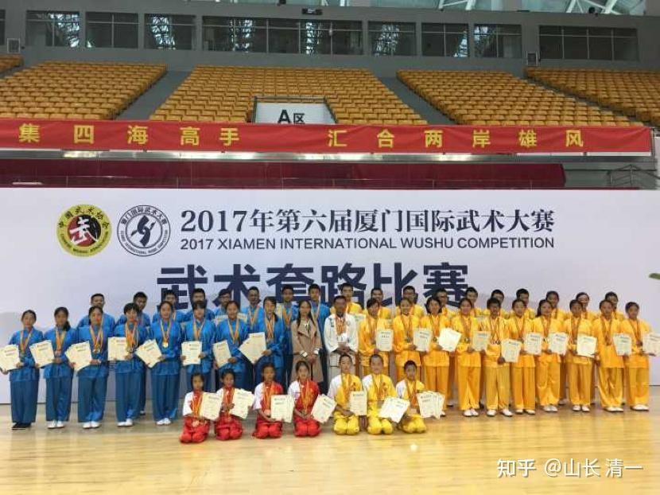
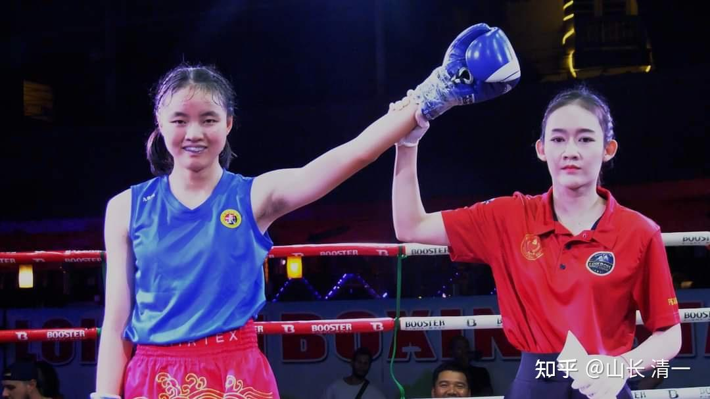
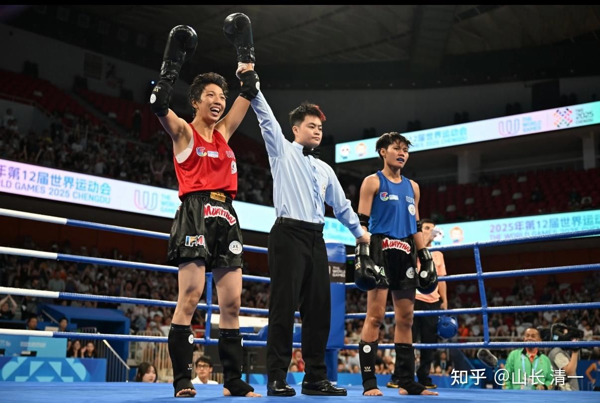

上个月在网上，看到12岁少年在公开场合追问李连杰“武术是否如魔术表演一样，都是骗人的？”。

李连杰作为一个终身献给武术的人，看到我们热爱的中华武术，在下一代眼里居然成了这样，会不会特别的痛心？难过？

当年的李连杰，以【少林寺】爆火。以他漂亮的武术动作，为中华武术赢得了声誉。因此长期以来，他是中华武术的形象代表！可以说，他就是国礼！只是很多人都在猜想：李连杰到底有没有真功夫？离开电影他会不会打？

记得一次采访中，李连杰说武术就是表演，不能打的时候，观众很受打击。他们向往的中华武术，原来只是体操！

看到这个镜头，我非常的触动。我能感受到李连杰的无奈和痛心！

但我们可以积极一点去想想：如果李连杰，同时拥有格斗的世界冠军身份，去扮演这种角色。他会不会自豪地告诉小朋友：不 ，中国武术是全世界最厉害的武术。我们可以用中华武术击败全世界的格斗手，获取世界冠军。我们的武术，又好看，又好用！

**这样的超级李连杰，不仅仅会武术表演，还会真正的格斗，还会多国语言，还文武双全。**他会不会成为全中国，甚至世界级的超级大网红？为中国武术迎来最大的荣誉？

这就是我要送给中国的“国礼”，一份为往圣继绝学的大礼！

我相信：每一个热爱祖国的中国人，都在期待这份大礼。每一个中国的领导，都会期待这份宝贵的礼物，这就是我毕生努力的对象！

当你无私无欲的去努力实现这个目标的时候，你就慢慢达成了自己的人生目标。当你满足了这个国家对你期待的时候，你就成为了这个国家最宝贵的礼物！当然，你送出的礼物，也会得到回报，我们的国家，也一定会慷慨的回报你，你一生注定像李连杰一样，不仅仅荣誉加身，而且财富也丰足有余。这是宇宙给你的回报！

对于“我要模式”的人来说，求取之心，就是想要得到一切美好的东西。比如有人成为这个国家让人敬仰的对象！就会拼命的往上爬，也努力的上进。这些人就是精致利己主义者，特想会算计，特别会捞便宜。有一些人最终也会好运气，取得高位！但绝大多数心机婊们，都会在爬山的过程中不小心就滚下来，成为人生的失败者。

因为这种求取之心，贪欲之心，违背了宇宙的法则，很容易引来反噬，让自己声名俱毁。很多贪官，就是这样失败的！所以，我以为是算计自私和刻薄，是最不划算的成功方式。

**真正有效的模式，就是“我付出”的模式。**去满足别人最大的愿望，然后也就顺便实现了自己最大的理想，得到了最大的尊重！

我如果想要当冠军，不是去想自己取得冠军后的各种荣誉和好处以及享受，而是我想为这个国家和民族取得冠军，代表中华武术去击败现代格斗！这样以把自己送给中华武术的心态去努力，最终自己就会成为这个国家最尊贵的“国礼”。

最近，刘晓慧表示想要去读大学，我们对她的建议就是:

**第一：明确自己读大学的目的！明白读大学要实现自己的什么样的人生目标？而不是跟随他人盲动。**

**第二：读大学，最好有一个原则，就是你为谁而读。**如果你为了国家的需要而读，你就是国礼的预备军。你为了家庭的需要而读，你就是家礼。你为了个人的欲望而读---自然你就是一个自私的人！因此最好找一个引路人。

我们建议她：不妨去问问关心她的国家武术界的最高领导：让领导来安排她的职业之路，如果要读大学，最好让领导来安排指导。因为拿到世界冠军，很多大学的门，都是为她打开的！想上大学很简单，很容易。但自己去选择，不如请高人帮自己策划！

我把这个原则也教给了冠军班和公主班的学生，让她们写一封给领导的信。获得领导的支持，这样来安排自己的人生道路！无我，才能成就最大的我。

于是，就有了下面这封ELLA的信，大家参考一下！我认为：这种思维方式和做事的方式，适合用在你的任何人生重大决策方向中。让比你聪明的人来帮助你做出决定。不就是比你用自己的破脑子来胡乱安排更靠谱吗？

转发ELLA信件：

致国家体育总局物武管中心的**××**领导：

\##领导您好！

冒昧给您写这封信。因为我看到了下面这张您和我的师姐刘晓慧的合影，非常的感动和尊重您。

我的老师看到这张照片后，就批评师姐刘晓慧很不懂事，跟领导在一起合影，怎么能自己跑去C位站着？后来师姐解释说，是您坚持让她站C位的。您是拿过38个全国和世界冠军，还是武术全能冠军。她只是一个年轻的冠军，还远远赶不上您年轻时候的成就。其他冠军也没有这个荣誉，为何您把这份至高的荣誉，专门给了我的师姐呢？

我理解不仅仅因为师姐刘晓慧是中国第一个泰拳女子世界冠军，打破了我们国家过去的历史记录。同时还因为她是用中国功夫去击败泰拳的。

我理解在您的心中，**中华传武才是永远的中心，弘扬传武才是您最高的理想。**多年来，您一直在全国，全世界，去推举传武的年轻一代走向世界，去为国争光。您的工作一直是弘扬中华传武。从这个照片上，您不经意的一个小小的行为，我看懂了您的宏伟心愿，看到了您体现出来的无我，无私的境界。您自己是中国武术界的巨人，但您一直以您的肩膀，来推举热爱中华传武的年轻人站上去，走向更高的巅峰。让她们有机会走向更广阔的世界。

我看到几十年来，您一直在做这样的事情，为中华传武奉献您的一生，让我非常的感动。所以特别想写信给您，表达我对您的敬意。

我是冯月茹，今年19岁。世界冠军师姐刘晓慧是我的师姐，我和师姐在8年前就见过您。2017年我11岁，师姐12岁。我们都参加了第六届厦门国际武术比赛。您当时是宣布开赛的领导。我们只是刚接触传统武术一年的小孩， 我参加了三个项目的比赛，取得了一金一银一铜的成绩。当然我明白这更多是主办方对我们这些练传武小孩的特别鼓励，并不是证明我们有多好的功夫。但这一天，也确实是我对传统武术热爱的开始。

*第一排左3，4，是师姐刘晓慧和我*

下面照片是现在的我：

*在泰国拳场打职业拳赛，首战ko了泰国拳手*

师姐刘晓慧比我早一年开始在清一武道馆正式练习传武格斗技术。这是一家专门研究用中华传武技术来击败现代格斗的武馆，是我的老师全额资助学生的，我们连生活费都不用出，只需专心的学习和训练。

因为我的老师，与您有一样的心愿，就是让中华传武获得全世界的尊重，打破西方武术和格斗技术的垄断。因此他希望培养我们这一群年轻人，用传武技术去征战世界格斗赛场，用真实的擂台实战，来为中国传武扬名！

照片：**师姐刘晓慧在世运会，用中华武术打败泰国拳手，**

*师姐刘晓慧在世运会，用中华武术打败泰国拳手 *

我和伙伴和家长，都一样有为中华传武扬名世界的心愿，因此才选择加入清一武道馆，学习传武技术，去击败现代格斗。

我希望我20岁的时候，也能像师姐一样站到世界锦标赛的领奖台上，为国争光。不过我的擂台表现目前还不如师姐，现在我只拿到全国泰拳，自由搏击锦标赛的双亚军，两岸四地锦标赛的#军，但我相信三年内，我一定能够站到世界冠军领奖台的。

我的目标，是想要终身投入中华文化和传武的事业，为中华文化，中国武术传播全世界而努力奋斗。但我太年轻了，有一些方向上的选择，还不能确定是否正确，因此我希望有机会能够得到您的指点，明确我未来奋斗的方向。

**一：中华传武应该用“为主”还是“为客”的方式，才能更好地对全世界弘扬中华武术？**

为了让外国人来学习我们的中华文化和中国武术，是采用我们的规则和方式来设立项目，进行比赛。以我们为“主”，来大力推动和弘扬中华武术更好吗？比如我们尽量努力去推动让中华武术赛事成为奥运会的比赛项目？ 这个努力方向容易吗？会成功吗？

还是我们采用老子**“**不敢为主而为客”的方式，我们集中一批人，采用中华传武的技术核心原则，用完全不同于现代格斗的训练方式和格斗逻辑，去主动的参与世界上已经非常成熟完善的武术赛事活动，比如泰拳，自由搏击，拳击等运动。一旦我们的拳手，能够用中华传武技术，彻底击败现代格斗之后，这些批量生产的世界冠军，会不会更能够吸引全世界的武术爱好者？让武术人真正的崇拜和追随中华武术？主动来中国学习中华武术？

而不是现代很多国外的专业武术人员其实不太理解中华武术，以为就是一种好看的体操？很多人只是作为一种业余爱好来玩的？

**主动加入各种现代格斗赛事，取得良好的成绩，来打响中华武术的名声。这样做，会不会是一条弘扬中华传武更简单有效的道路？**

我的老师倾向于用后者—-“为客”而不“为主”！他认为“为主”方式去弘扬传武，需要耗费动用的资源太大，推广人也太累，他完全没有能力去做。他个人就只能采用为客的方式去做这件事。用个人的微薄之力来从最基础的地方，从擂台上弘扬传武！

您认为他这样的想法，是否会有效推广中华武术呢？

**二：提倡“学霸练武，文人格斗”，是否有助于中华传武在全世界的推广？**

我的老师不愿意教成绩不好的学生去练武，他说太极和传武是哲拳，和现代格斗不一样。不读书，不动脑子的人是学不会的。因此他提倡“文人格斗”，只愿意收成绩优秀的学生去练武。他说中国古代唐朝以前都是“文武合一”的，要先学文，再学武，就可以避免文武分离。如果从小先学武，错过了最佳的学习期，12岁之后才开始学文化的话，就不容易提高了，很难成为最优等的学生。因此我的老师，现在都只是从15岁国际学校的优等生中，选择喜欢练武的学生来培养拳手。他认为这样做，也有助与在全世界树立中华传武的良好文化形象，培养出与现代格斗不一样的武术人才。现在的泰拳和自由搏击，拳击等世界冠军，常常是贫民窟的穷人不一样的格斗拳手。他希望将来中国一批知书达理的文人，能够成为世界冠军，为国争光！

这是一条全世界的格斗界完全不一样的道路。您认为现在的武术世界，能够接受这种完全不同的思路和格斗方向吗？这样做能够成功吗？

毕竟提倡中产家庭和文人去练武，打高水平的世界级格斗比赛，以业余爱好去挑战职业拳手的极限，是一条从来没有人走过的道路。能有发展的前途吗？

**三：拿到世界冠军后，是否应该去上世界名校？名校毕业的身份，是否更有利于去全世界推广中华传武？**

这个问题非常现实，我和师姐刘晓慧对这个问题的想法是相反的！师姐刘晓慧现在已经拿到了世界冠军，她认为：泰拳世运会冠军的身份，是她再也无法超过的记录。世锦赛和其他赛事的世界冠军，含金量都没有世运会冠军的高。她将来也不想去打武术的职业赛，不想吃武术饭，也不想把打拳作为自己的终身职业。她只是想借助自己的世界冠军身份，去弘扬中华武术，让中华文化推向全世界，让中国人获得全世界的尊重！

因此她的想法，是要去读一个世界名校，然后用文武双全的世界冠军身份，去大学和其他国家推广中华武术！

师姐刘晓慧认为：现在全世界的顶尖名校里面，虽然有奥运冠军，但至今还没有一个格斗世界冠军，入读世界名校的案例。如果她去上世界名校，就是一个新的文武双全的世界纪录。这个身份，会对她去做世界上中华武术的推广，有很大的帮助。比仅仅去打拳，当格斗世界冠军，会更有利于让全世界的人民接受中华武术！

她和我一样，都是熟练掌握了四种语言的优等生。因此我们两人，要进入排名世界前50名的世界名校是不难的！只要认真准备一年，去考试通过就可以了。

但我的想法，与师姐刘晓慧很不一样。我认为：就算是拿到了格斗的世界冠军，也仅仅是中华传武万里长征中的第一步，离中华武术的深度还很远。我从师父这里看到的，是传武和中华太极，具有无尽奥秘和深度，以及魅力。

师父现在已经60多岁了，他还可以比我们更快，更有力量，可以几秒钟就把我们这些冠军们击倒。我们现在掌握的一点技术，就算是用来击败了国外的对手，拿到了世界冠军，也仅仅是传武的一点点皮毛罢了！用古拳经来说，我们也只是“得其一二足以胜少林”的入门者，离传武的博大精深还很远。

因此拿了世界冠军之后，我认为我最应该做的事情，并不是忙着去读世界名校，不是去国外去宣传介绍中华传武。而是要更加认真的学习传武，掌握更深度的技术，更用心的跟随师父，研习中华传武的精髓。还要学习其他门派的武术，扩大自己的眼界，才能成为真正的中华武术新一代。

所以，忘记自己拥有的荣誉，去继续踏实认真的用心传武，去掌握更多，更高的传武技术，让自己学到传武“五六层”的功夫，这样的传武人，才有资格去全世界“弘扬真正的中华传武”吧？

现在这样子，我们的水平，都只是刚刚入门而已。就放弃传武的深造机会去拿文凭证书。虽然出去后，可能别人也会尊重我们。但我们对传武浅尝辄止，有不是有点不实在？因为我们离古人的造诣要求，真的还很远呢。

因此，我认为：就算我拿到了世界冠军，也应该继续留在师父身边，继续学习10年以上太极，才有资格说自己掌握了初步的传武技术。都说太极十年不出门，现在学了三四年就“出门”了，不就前功尽弃了吗？

过去百年，太极和传武的技术失传，不就是太极传人们过于急功近利，自己没学会真本事，就到处去教拳，传拳，当师父，弘扬中华武术，才导致现在我们的传武瑰宝，太极拳被一些人攻击为中国的“第九套广播体操”的吗？

所以我认为，师姐刘晓慧应该继续练习传武，10年之后再去读大学。

甚至我认为：我也许将来并不需要去读任何大学。我不需要用世界名校的头衔，来为自己增加分量，我只需要把中华传武的真功夫学好，尽量去理解中国古代哲人的思想，去读各种古代书籍，这些够我用一生了。

我只要尽量去学好中华古代传武文化，在生活中用好一点。这些够用一辈子用了，不需要去读啥大学！我掌握的中华传武的真功夫，真文化，就是我的中华传武人的名片。我不需要拿世界名校的大学文凭，来装点我的人生。

因此，师姐刘晓慧和我，虽然最终的人生目标都是为了弘扬传武，为国争光。但对实现的方式，我们两人的意见很不一致。

** 我师父说，我们想怎么做都可以，让我们自己选择自己喜欢的道路，他尊重我们做的任何选择。**

现在我们都有“选择困难症”，现在跟我们在一起练武的学霸们，总共有70多人。他们将在三年内出现在各级擂台上。我相信我和师姐刘晓慧现在的困惑，也是他们将来要遇到的困惑。我认为找一个最有权威的武术界高人，帮我们解答疑惑，而不是我们自己胡思乱想乱决定，才是最明智的选择。

我认为主任您，一直是中华传武的代言人。您身处高位，一定更知道我们现在该怎样做选择，才是最合理的。才能更加帮助我们实现自己追求的目标：怎样才能更好地去传播中华传武文化，怎样才能让中华武术，获得全世界的尊重和信任。

希望您有空的时候，可以给我们一点指导。谢谢您的帮助。

冯月茹 今日三语学校 清一武道馆学徒 敬上